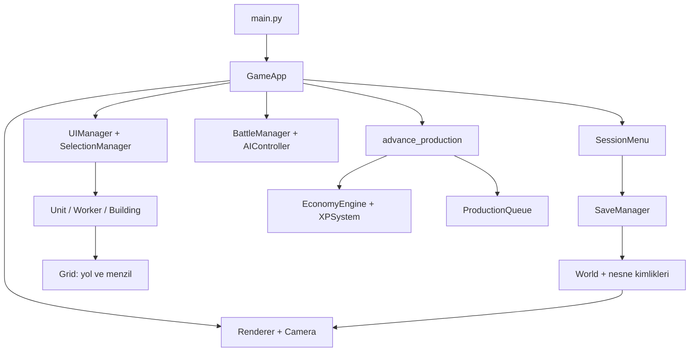

# CloneEmpires — Türkçe proje ve kod rehberi

Bu rehber 21 Eylül 2026 tarihindeki K1–K5 / T1–T10 uygulamasını anlatır. İlk incelemedeki davranışlar ve karar gerekçeleri [UYGULAMA_PLANI.md](UYGULAMA_PLANI.md) içinde korunur. Burada anlatılan davranış son koda aittir. Kısa kurulum için [README.md](README.md) kullanılabilir.

## 1. Önce oyunu tanı

CloneEmpires tek oyunculu bir üs geliştirme prototipidir. Python, kuralları ifade eden programlama dilidir. Pygame, Python'un pencere açmasını, fare/klavye olaylarını almasını ve resim çizmesini sağlayan kütüphanedir. Örneğin “köylüyü seçtim” bir fare olayı; “köylü yürüdü” oyun verisindeki konum değişikliği; “yeni konumu gördüm” çizim işlemidir. Bu üç adım farklı dosyalarda yürütülür.

Gerçek zamanlı stratejide sıra beklenmez. Oyuncu düşünürken açık dünyadaki savaş ve hareket sürer. Harita 48 × 48 hücreden oluşur; `World` bu hücreleri ve üstlerindeki nesneleri tutar. Ortadaki güvenli bölgeye bina yapılır. `max(abs(x-24), abs(y-24)) <= 10` güvenli koşuludur; merkez dahil hücre sayımı nedeniyle her eksende 21 merkez vardır. Daha dışarıda nötr, en dışta tehlikeli bölge bulunur. Mavi renk fiziksel su engeli anlamına gelmez; doluluk kuralları ayrıca hesaplanır.

İzometrik görünüm, iki boyutlu kareli haritanın ekranda elmas biçiminde gösterilmesidir. `(24, 24)` bir dünya hücresi; `(640, 360)` bir ekran pikseli olabilir. Piksel, ekrandaki küçük renk noktasıdır. Aralarında dönüşüm yapan kod `isometric.py` ve `camera.py` içindedir. Ekranda büyük görünen bir bina, kurallar açısından hâlâ tek hücre kaplar.

Yeni dünyada Town Hall, iki mızrakçı, iki köylü, kaynak kümeleri ve üç düşman troll vardır. Beş kaynak türünün her biri 10.000 ile başlar; kaynak başına kapasite 50.000'dir. Bu değerler korundu; dengeli bir son oyun ekonomisi olarak doğrulanmadı. Açık bir görev, kazanma veya kaybetme ekranı yoktur.

### Öğrenme sırası

1. Kurulumu yapıp bir dünya oluştur; kaydet ve Devam et ile tekrar aç.
2. Bir köylüyle odun topla; sonra oduncu binasına ata. Sahada toplama ile bina üretiminin farkını gözle.
3. Bir barakaya iki sipariş ver; seviye gereksinimi sağlandığında geliştirme sırasında kuyruğun beklemesini incele.
4. Aşağıdaki veri akışını oku. İlgilendiğin dosyanın fonksiyon tablosuna geç; gerekiyorsa altındaki gerçek kaynak bloğunu aç.
5. Testleri çalıştır; bir beklenen davranışın nasıl küçük bir senaryoyla kanıtlandığını izle.

## 2. Kurulum, bağımlılıklar ve ilk çalıştırma

Bir bağımlılık, projenin kendi yazmadığı fakat kullandığı pakettir. Sanal ortam, bu projenin paketlerini sistemdeki diğer Python işlerinden ayıran klasördür. Aşağıdaki komutlar repo kökünde çalıştırılır:

```bash
python3 -m venv .venv
source .venv/bin/activate
python -m pip install -r requirements.txt
python main.py
```

`python3 -m venv` sanal ortamı kurar; `source` mevcut terminalde onu etkinleştirir. `python -m pip` etkin Python'a paket kurar. `-r` paket listesini dosyadan okur. Oyunun çalışma bağımlılığı Pygame'dir. Python'un `json`, `pathlib`, `math`, `time`, `tempfile`, `uuid`, `dataclasses`, `collections` modülleri standart kütüphanededir; ayrı yüklenmezler.

Python 3.10+ hedeflenir; bu teslim Python 3.12.3 / Linux üzerinde çalıştırıldı. Windows PowerShell karşılığı `py -m venv .venv`, ardından `.venv\Scripts\Activate.ps1` olur. Windows/macOS komutları bu makinede çalıştırılmış kanıt değildir.

Depodaki 85 PNG görsel doğrudan kullanılabilir. PNG şeffaflık içerebilen bir resim biçimidir. Bir *sprite*, sahnede nesneyi temsil eden küçük resimdir. Örneğin `worker_walk_0.png`, yürüyen köylünün bir animasyon karesidir. Oyun Pillow'u import etmez; Pillow yalnız görsel üreticisinin kullandığı resim çizim kütüphanesidir.

```bash
python -m pip install -r requirements-dev.txt
python -m pytest tests -q
```

Geliştirme listesi çalışma bağımlılığını da içerir; pytest testleri, Pillow isteğe bağlı PNG üretimini sağlar. `pytest.ini`, sistemden gelebilen ROS test eklentilerinden ikisini devre dışı bırakır. Ortamın diğer otomatik eklentilerini de ayırmak için Linux'ta:

```bash
env PYTHONDONTWRITEBYTECODE=1 PYTEST_DISABLE_PLUGIN_AUTOLOAD=1 \
  SDL_VIDEODRIVER=dummy SDL_AUDIODRIVER=dummy \
  python -B -m pytest tests -q -p no:cacheprovider
```

`dummy`, Pygame'in gerçek pencere/ses cihazı yerine test yüzeyi kullanmasıdır; bu komutun geçmesi fiziksel fare hissini veya ses kartını doğrulamaz. `-B` Python önbellek dosyalarının, `-p no:cacheprovider` pytest önbelleğinin yazılmasını önler. `conftest.py` her testte kayıt yolunu geçici klasöre taşır.

### Görselleri isteğe bağlı üretmek

`python tools/generate_sprites.py` mevcut `assets/` PNG'lerini yeniden yazar. Yalnız görselleri yenilemek istediğinde kullan. Kaynak resimleri koruyan deneme yolu aşağıdadır; geliştirici bağımlılıkları gerekir:

```bash
python - <<'PY'
import tempfile
from tools import generate_sprites

generate_sprites.ASSETS_DIR = tempfile.mkdtemp(prefix='cloneempires-assets-')
generate_sprites.main()
print(generate_sprites.ASSETS_DIR)
PY
```

Burada modülün çıktı dizini yalnız bu Python sürecinde değiştirilir. Kaynak dosya düzenlenmez; üretilen resimler geçici klasöre gider. Görselleri güncellerken eski ve yeni PNG'leri karşılaştır, sonra oyunda farklı yakınlaştırmalarda incele. Dosyanın üretilebilmesi, görselin kullanışlı olduğunun tek başına kanıtı değildir.

## 3. Kullanıcı akışları

### Dünya oluşturma, devam etme ve çıkış

Başlangıç ana menüsünde Yeni oyun ve Devam et vardır. Henüz dünya seçilmediğinde otomatik kayıt çalışmaz. İsim alanı en fazla 40 karakterdir; boş bırakılınca kullanılmayan `Dünya N` adı bulunur. Aynı görünen adla ayrı dünyalar oluşturmak mümkündür; dosya kimliği ad değildir.

Her dünya `uuid4().hex` ile üretilen 32 karakterlik rastgele bir kimlik taşır. Kimlik kalıcı nesneyi ayırt eder: örneğin iki dünya da “Çiftlik” adını taşısa dosyaları farklıdır. Devam et listesi dünya adı, seviye ve yerel saatte son kaydı gösterir; sayfada dört dünya, en son kayıt üsttedir.

F5 veya Kaydet manuel kaydı; F10 veya Menü kaydedip ana menüye dönüşü başlatır. Normal pencere kapatmada da kayıt alınır. Oyunda Esc seçimi/marketi/inşaat modunu temizler; oyunu kapatmaz. Kayıt başarısızken çıkış istenirse dünya bellekte kalır ve üç seçenek sunulur: Tekrar dene, Oyuna dön, Kaydetmeden çık. Hata ekranındaki süre de üretime eklenir; hareket/savaş orada ilerlemez.

Kayıt klasörü oluşturulamasa bile menü açılır. Yeni dünya bellekte oynanabilir; ilk yazma başarısızlığı mesaj olarak gösterilir. Yazma sorunu giderilmeden kaydetmeden çıkılırsa o oturumun kaydedilemeyen ilerlemesi korunamaz.

### İnşaat ve üretim

Market kartındaki Satın Al henüz kaynak kesmez; inşaat modunu seçer. Haritaya sol tıklanınca tür, oyuncu seviyesi, kaynak, sınır, güvenli bölge ve doluluk tekrar kontrol edilir. Önizleme uygunsa yeşil, değilse kırmızıdır; yerleştirme reddi kısa mesaj verir. Başarılı işlem önce ödeme yapar, ardından hücre merkezinde inşaat nesnesini dünyaya ekler.

İnşaatın varsayılan süresi beş saniyedir. XP, yerleştirmede değil tamamlanınca verilir. Köylüyle inşa katkısı veren dahili yol da aynı tamamlanma mekanizmasına bağlanır; arayüzden ayrıca köylüyle inşa emri verilmez. Bu ayrım, kodda metodun bulunmasının erişilebilir kullanıcı özelliği olduğu anlamına gelmediğini gösterir.

Town Hall köylü; mızrakçı, kılıçlı ve okçu barakaları kendi askerlerini üretir. Kuyruk, önce gelen siparişin önce çıktığı bir listedir. Kod `deque` kullanır; sol baştan çıkarma için uygundur. Aktif sipariş dahil en fazla beş sipariş tutulur. Ücret sipariş anında kesilir; sipariş kendi maliyetini ve seviyesini saklar.

Baraka geliştirilirken kuyruk ilerlemez. Örneğin L1 mızrakçının dört saniyelik işinin bir saniyesi bittiyse geliştirme boyunca bir saniyede kalır; geliştirme bitince kalan üç saniye çalışır. Önce verilmiş diğer L1 siparişler de L1 kalır. Sonraki yeni sipariş L2 olur. Birim üretimi bittiğinde dünya genelinde en yakın boş hücre aranır; hiç yer yoksa ödeme ve tamamlanmış sipariş tutulur. Bu geniş arama sonucunda dolu bir üste birim uzakta doğabilir; kapalı bir binadan fiziksel çıkış yolu simüle edilmez.

### Köylü ve üç farklı kaynak yolu

| Yol | Başlatma | Süre / sonuç | Kapalı dünyada |
| --- | --- | --- | --- |
| Sahada toplama | Köylüyü seç, doğal kaynağa sağ tıkla | Komşu hücreye gider; yaklaşık iki saniyede en çok 10 kaynak alır | Donar |
| Pasif bina üretimi | Kaynak binasında Pasif: Başlat | Oturumun toplam süresine bağlı gelir | Depo sınırına kadar ilerler |
| Süreli köylü işi | Köylüyü kaynak binasına ata, mod seç, Köylü: Başlat | Mücevher peşin kesilir, süre sonunda bir defa kaynak ve mücevher ödülü | Önceden başlamış iş bir defa biter |

Binaya sağ tıklanan köylü anında içeri alınır, sahnede görünmez ve yer kaplayan birim olarak sayılmaz. En fazla dört köylü atanabilir. Mod başladıktan sonra yeni köylü eklenmez; köylü çıkarmak mümkündür. Son köylüyü aktif işten çıkarırken onay kutusu gösterilir; iptal edilen işe kısmi ödül veya mücevher iadesi verilmez. Diğer köylülerin çıkması, tamamlanma anındaki kişi sayısını ve dolayısıyla ödülü değiştirebilir. İş doğal olarak bitince köylüler çıkarılır; aynı iş kendiliğinden tekrarlanmaz.

| Mod | Dakika | Peşin mücevher | Tek köylü kaynak ödülü |
| --- | ---: | ---: | ---: |
| Hızlı | 2 | 20 | 10 |
| Normal | 5 | 50 | 30 |
| Uzun | 10 | 100 | 75 |
| Maraton | 30 | 300 | 250 |

İki/üç/dört köylü çarpanları 1,25 / 1,5 / 2'dir. Kaynak ödülü yukarı yuvarlanır; mücevher ödülü `ceil(kaynak / 5)` olur. `ceil`, kesirli sonucu bir üst tam sayıya tamamlamaktır: 12,5 kaynak 13 olur. Pasif üretim ve köylü işi iki ayrı sayaçtır; biri durdurulunca diğeri durmaz.

## 4. Veriler ve mimari

Sınıf, aynı tür nesnelerin hangi verileri tutacağını ve hangi işlemleri yapabileceğini tanımlar. `Worker` sınıfından oluşturulmuş iki köylü aynı metotları paylaşır fakat konumları ve görevleri ayrıdır. Metot, bir sınıfa bağlı fonksiyondur; `worker.move_to(25, 24)` bu köylünün durumunu değiştirir. `self` bu çağrının nesnesidir. `Worker(Unit)` kalıtımdır: köylü, birimin hareket/saldırı davranışını kullanır ve görev davranışı ekler.

`Position`, `UnitStats`, `BuildingStats`, `EntityState` birer `dataclass`tır: alanları yazınca Python başlangıç atama gibi sıradan işlemleri üretir. `EntityState.position` için `default_factory=Position` her nesneye ayrı konum verir; aksi hâlde iki nesnenin aynı değiştirilebilir konumu paylaşması riski doğardı. `state.selected` geçici arayüz verisidir; dünya açılırken seçim temizlenir.



`GameApp` alt sistemleri bağlar. `World` nesneleri taşır; `EconomyEngine` kaynakların tek sahibidir. `UIManager` bu ekonomiyi gösterir, ayrı bakiye tutmaz. `XPSystem` seviye/XP'yi sahiplenir ve `_sync_ui` ile arayüzü günceller. `ProductionQueue` bağlı binayı ve aynı ekonomi nesnesini kullanır. `world.add_entity` her nesneye geriye doğru `entity.world` bağı ekler; böylece birim yol ararken haritaya ulaşır.

### Ana döngü ve zaman

`GameApp.run` pencere açıkken tekrar eder. `clock.tick(60)` iki kare arasında geçen milisaniyeyi verir; 1000'e bölünce `dt` saniye olur. Olaylar işlenir; oyun modunda `_update(dt)`, `_render()` ve `_autosave(dt)` çağrılır. Menü modunda dünya çalıştırılmaz. `_update` sırası: birim/köylü → üst üste oturan birimleri çözme → savaş → AI → üretim → inşaat listesini temizleme → ölüm/XP → seçim ve mesaj yenileme.

Çizim oyun kurallarını ilerletmez. `Renderer` yalnız konum/can/sayaç okuyup renk ve PNG üretir. Animasyon, Pygame'in geçen milisaniyesinden resim karesi seçer; kayda animasyon karesi yazılmaz. Savaş/hareket büyük `dt` ile tam olarak küçük adımlara eşdeğer değildir. Onaylanan adım bağımsızlığı ortak üretim hesabı içindir; buradan tüm motorun deterministik olduğu sonucu çıkarılmaz. Deterministik, aynı girdide aynı sonucu üretmek demektir; AI ayrıca rastgele devriye kullanır.

### Üretim hesabı: kesirler neden kaybolmuyor?

Pasif oturumun toplam hakkı `R(t) = taban_hız × t^1.05 × (1 + (bina_seviyesi - 1) × 0.2)` olarak hesaplanır. Burada `t`, son Başlat'tan beri toplam saniyedir. Her karede yalnız `floor(R(t)) - production_processed` ödenir. `floor`, aşağı yuvarlamadır; pozitif sayıda `int` dönüşümü bu işlevi görür. `1e-9`, kayan nokta yuvarlama sınırında birkaç milyarda birlik hatayı tolere eder.

Örneğin ilk adımda toplam hak 0,4 ise ödeme 0'dır. Sonraki adımda toplam hak 1,1 olduğunda ödeme 1 olur. Kesir ayrı bir para alanında tutulmaz; toplam süre korununca sonraki toplam hesap içinde yaşamaya devam eder. Başlat zaten açık üretimi sıfırlamaz; Durdur ve ardından Başlat yeni oturum açar.

Depo doluyken `production_processed` yine ilerler. Böylece kapasiteyi daha sonra açınca geçmiş taşma tekrar verilmez. `add_resources` her kaynağı kapasiteye kırpar. Seviye atlamak otomatik depo geliştirme değildir; `upgrade_storage()` dahili API olarak vardır, mevcut kullanıcı arayüzüne bağlanmamıştır.

### Çevrimdışı olay sırası

Bir dünya yeniden açılınca `max(0, şimdi - processed_at)` hesaplanır. `advance_production` bu süreyi karelere değil tamamlanma olaylarına böler. Beş saniyelik geliştirme ve üç saniyesi kalmış sipariş varsa, sekiz saniyelik kapalı sürede önce geliştirme tamamlanır; sipariş ancak sonraki üç saniyeyi alır. İnşaat süresi aynı binanın üretimine tekrar verilmez.

`_next_boundary` aktif inşaat, köylü işi ve sıradaki sipariş sürelerinden en küçüğünü bulur. `_segment` o aralığı işler. Başlangıçtaki sıfır süreli geçiş, zaten tamamlanmış sipariş için yer açılıp açılmadığını ve %100 inşaatın tamamlanma olayını çözer. Doğal kaynak kendi yenilenme evresini toplam `dt` ile bulabildiği için ayrıca her saniye olay üretilmez. Biten iş yeni ücretli iş başlatmaz; olay sayısı eldeki işlerle sınırlıdır. Bu yöntem uzun kapalı süreyi 60 FPS ile tek tek yürütmez.

Hareket, saldırı bekleme süreleri, mermiler ve sahada toplama bu fonksiyonda çağrılmaz. Kaydın çalışan hedef/path durumu korunur; oyuna dönünce aynı durumdan normal güncelleme başlar. Yerel saat ileri alınırsa kapalı süre büyür; bir saat sunucusu veya hile önleme eklenmedi. Saat geri alınırsa kayıt zamanı geriye gitmez ve aynı aralık tekrar ödenmez.

## 5. Güvenli kayıt nasıl çalışıyor?

JSON, sözlük/liste/sayı/metni dosyada okunabilir biçimde saklayan veri formatıdır. Python nesne adresleri başka çalıştırmada anlamlı olmaz. Bu nedenle köylünün hedef binası nesne adresiyle değil `entity_id` ile saklanır. `serialize` bütün ilgili nesneleri toplar ve derin kopya döndürür. Derin kopya, örneğin oyunda odun harcanınca hazırlanmış kaydın sözlüğünün kendiliğinden değişmesini engeller.

Kayıt `version=1` taşır. Dünya kimliği/adı, oluşturma/işlenmiş zaman, oyuncu adı, kaynaklar/depo seviyesi, XP durumu, kamera ve nesneler yazılır. Her nesnede ortak kimlik/ad/konum/canlılık vardır; alt türe göre istatistik, görev, yol, üretim ve bağlar eklenir. Mermi dahil savaş nesneleri ve devre dışı kule korunur. Harita ölçüsü/bölgeler mevcut sabitlerden yeniden üretilir; bu sürüm değiştirilebilir harita editörü içermez. Seçim, açık market, tıklama sayacı, inşaat önizlemesi, resim önbelleği ve animasyon karesi kaydedilmez; bunlar oturum arayüzüdür. AI rastgele sayı üretecinin durumu kaydedilmez.

Yükleme iki aşamalıdır. İlk geçişte bütün nesneler doğru sınıflarıyla oluşturulur ve kimlik sözlüğüne konur. İkinci geçişte hedefler ve köylü/bina bağları bu sözlükten bağlanır. Bu, kayıt sırasında binadan önce yazılmış köylünün de hedefini bulmasını sağlar. Sonrasında çift yönlü atamalar kontrol edilir: bina köylüyü listeliyorsa köylünün de o binanın içinde olması gerekir.

Doğrulayıcı alanların türünü, sonlu sayıları, sürümü, kimlikleri, harita konumlarını, yol hücrelerini, kaynak türlerini, XP tutarlılığını, canı, sayaçları ve ilişkileri kontrol eder. `SaveError` bu biçim hatalarını kullanıcıya taşır. Sürümsüz dosya `LegacySaveError` verir; eski `autosave.json` korunur ve tahmini veriyle dönüştürülmez. Bu bir şifreleme/imza sistemi değildir; elle düzenlenmiş her ekonomik değerin özgünlüğünü kanıtlamaz.

`GameApp.load_game` geçici dünyayı kurar, kapalı süreyi uygular, sonucu diske yazar; ancak hepsi başarılıysa aktif `world/economy/ui/xp` referanslarını değiştirir. Böylece bozuk dosya veya yazma hatası canlı dünyayı yarım yüklenmiş hâlde bırakmaz. İşlenmiş zaman ve ödül aynı kayıt içinde kalıcılaştırılır; dünyayı tekrar açmak aynı kapalı süreyi tekrar ödemez.

### Atomik yazma ve yedek

Atomik değiştirme, okuyanın tamamlanmamış yarım dosyayı görmemesi için hazır dosyanın tek dosya sistemi işlemiyle asıl dosyanın yerini almasıdır. `_atomic_write`, aynı klasörde geçici dosyaya yazar; `flush()` Python tamponunu, `os.fsync()` dosya verisini işletim sistemine iletir; `os.replace()` asıl adı değiştirir. Geçici dosya `finally` ile temizlenir; hata olsa da bu blok çalışır.

Ana dosya varsa önce okunup doğrulanır. Sağlamsa önceki içerik `.json.bak` dosyasına aynı yöntemle yazılır. Bozuk ana dosya sağlam yedeği ezmez. Yeni veri de yazılmadan doğrulanır. Dosya değişimi hata testleriyle denendi; fiziksel güç kesintisi testi yapılmadı. Dizin girdisinin güç kesintisindeki kalıcılığı ve işletim sistemi/donanım davranışı için sıfır veri kaybı garantisi verilmez.

Ana dosya bozukken listede sağlam yedek için Yedekten aç görünür. Yedekteki eski zaman esas alınıp üretim hesaplanır ve yeni sağlam ana kayıt yazılır. Kullanıcı yedeği seçtiği için, yedekten sonraki fakat ana dosyada kaybolmuş canlı hareket/savaş ilerlemesi geri getirilemez. Yeni oyun mevcut dosyaları silmez; kayıtlar `.gitignore` nedeniyle Git'e eklenmez.

## 6. Hareket, seçim ve savaşın iç mantığı

A*, başlangıçtan hedefe düşük maliyetli bir hücre dizisi arayan algoritmadır. `g`, o hücreye kadar bilinen maliyet; hedefe Öklid mesafesi tahmini kalan maliyettir. `heapq`, en küçük toplam tahmine sahip adayı önce çıkarır. `came` sözlüğü hücreye nereden gelindiğini tutar; hedef bulununca geriye yürüyüp yolu ters çevirir. Sekiz yön vardır; düz adım 1, çapraz adım √2 maliyetlidir. Mevcut çapraz kural iki yan hücre de doluysa geçişi engeller; tek yan doluyken çapraz geçişe izin verir. Yol bulunamazsa `[]` döner; bu “duvarı görmezden gel ve düz git” anlamına gelmez.

`World.make_blocked` sınır dışı ve dolu hücreleri sınayan bir fonksiyon döndürür. Fonksiyonun çevresindeki `occ`, `w`, `h` verilerini hatırlamasına kapanım denir. Planlama anındaki doluluk ile hareket anındaki doluluk farklı olabilir; birim bir sonraki hücreye geçmeden yeniden kontrol eder. Engel çıkarsa bekler ve normal yürüme emrinde yarım saniye arayla yeni yol arar. Köylü yaklaşması ve saldırı kovalaması da yol aramayı yarım saniye arayla tekrar dener; her karede pahalı yeni arama başlatılmaz.

`StateMachine`, geçerli durum geçişlerini açık bir tabloyla sınırlar: IDLE bekleme, MOVE yürüme, ATTACK saldırı, DEAD ölüm. Ölü birim geri yürüme durumuna geçemez. Konum adımlar arasında kesirli olabilir; bir adım hücre merkezinde sonlanır. Menzil, merkezler arası Öklid uzaklığının yuvarlanmasıdır; köşegen komşu √2 ≈ 1,41 olduğundan 1 menzil içinde sayılır.

`SelectionManager.selected` ekranda bilgi gösterilecek nesneleri taşır. Emir alabilenler ayrıca `get_selected_units` ile süzülür: canlı, oyuncunun ve bina dışında olmalı. Dolayısıyla düşman seçmek, ona hareket emri verebilmek değildir. `Renderer.pick_entity_at`, çizimde kullanılan dikdörtgeni kullanır; gizli/ölü nesneleri atlar ve öndeki nesneyi seçer. Saydam PNG piksellerine göre hassas maske değil, resim dikdörtgeni kullanılır.

Kamera yakınlaşmadan önce imleç altındaki dünya koordinatını alır; yakınlaşma sonrası aynı koordinatı aynı pikselde tutacak kamera kaymasını hesaplar. Alt panel butonları panelin yerel koordinatlarında çizilir; olay konumundan panelin `y=610` ofseti çıkarılır. `event.pos`, tıklamanın gerçekleştiği yerdir; olay daha sonra işlenirken farenin yeni yeri kullanılmaz.

Hasar hesabında fiziksel saldırıdan zırh, büyü saldırısından büyü direnci çıkarılır; sonuç sıfırın altına düşmez. `BattleManager` hedef/menzil/saldırı bekleme süresini kontrol eder, hasarı uygular ve bekleme süresini yeniden kurar. Kuleler hedefe yönelen `Projectile` üretir. Normal okçu dahil birim hasarı doğrudan hesaplanır; her menzilli birimde uçan mermi yoktur. Canı sıfıra inen kule haritadan silinmez; ateş etmeyi bırakır ve yangın çizilir. Kule tamiri ve geliştirme butonu bu kapsamda yoktur.

## 7. Üç uçtan uca kod yürüyüşü

### A. Oduncu binası kurup kapalıyken üretmek

1. Market tıklaması `UIManager.handle_market_event` içinde kartın dikdörtgeniyle eşleşir; `on_buy` üzerinden `GameApp._enter_build_mode('woodcutter')` çağrılır.
2. Haritaya sol tık `Camera.screen_to_world` ile dünyaya çevrilir. `ConstructionManager.place_building` tüm koşulları doğrular ve maliyeti keser.
3. `Building.create_construction_site` henüz tamamlanmamış bir nesne üretir. `World.add_entity` hem listeye ekler hem `world` bağını kurar.
4. `advance_production` beş saniye dolunca tamamlanmayı ve XP'yi bir defa işler. Seçili binanın butonları yenilenir.
5. Pasif: Başlat geri çağırımı `Building.start_production` ile oturum süresini başlatır. Geri çağırım, buton nesnesinin daha sonra çalıştırmak için sakladığı fonksiyondur.
6. F10, `save_game` üzerinden anlık durumu yazıp menüye döner. Başka dünya oynanabilir.
7. İlk dünya açılınca `load_game` geçici durumu kurar; kapalı süreyi `advance_production` ile işler, yeni veri/zamanı yazar, sonra sahneyi açar.

### B. Kuyruk varken barakayı geliştirmek

1. Asker butonu, döngü içindeki `lambda u=ut` ile doğru birim türünü saklar. Varsayılan argüman, butonun son döngü değerine yanlış bağlanmasını önler.
2. `enqueue` izin verilen türü, tamamlanmış binayı, kapasiteyi ve maliyeti sınar. Siparişe o anki bina seviyesi eklenir.
3. Geliştir butonunun içindeki `do_upgrade`, kullanıcı seviyesi/maliyet uygunsa `Building.upgrade` çağırır. Kuyruk silinmez.
4. Ortak üretim saati bina tamamlanana kadar kuyruk güncellemez. Bittiği olayda geliştirme XP'si verilir.
5. Kalan aralıkta sipariş ilerler. `_spawn_unit` siparişte saklanan seviyeyi kullanır; binanın sonradan değişmiş seviyesini eski siparişe uygulamaz.
6. Her gerçek doğum `last_spawned` listesine girer. Simülasyon buradan eğitim XP'sini bir defa verir; yer bekleyen sipariş bu listeye girmez.

### C. Disk yazımı başarısızken çıkış

1. F10 `request_exit('home')` çağırır. `save_game` anlık veri üretip `save_world` ile yazmayı dener.
2. İşletim sistemi `OSError` verirse `save_game` False döner; dünya bellekte kalır ve mesaj gösterilir.
3. `request_exit` bekleyen hedefi `pending_exit` içinde tutup `save_error` ekranına geçer. Oyun döngüsü burada yalnız bekleme süresini biriktirir.
4. Tekrar dene, geçen üretim süresini bir kez uygular ve yeniden kaydeder. Hata sürerse yine aynı oturum korunur; uygulanmış süre tekrar eklenmez.
5. Oyuna dön aynı üretim süresini işleyip oyunu sürdürür. Kaydetmeden çık ise kullanıcının açık seçimiyle oturumu bırakır.

## 8. Testler, kanıtlar ve hata ayıklama

Test bir senaryonun sonucunu `assert` ile beklenen değerle karşılaştırır. Örneğin başlangıç odunu 10.000 iken `odun > 0` kontrolü toplama yapıldığını kanıtlamaz. Bu nedenle toplama testleri başlangıç bakiyesinden artışı veya kaynak düğümündeki azalmayı kontrol eder. Regresyon testi, düzeltilmiş bir hatanın geri gelmesini yakalamak için kalıcı olarak tutulan senaryodur.

`tmp_path` pytest'in her test için oluşturduğu geçici klasördür. `monkeypatch`, test bitince geri alınan geçici değişiklikler yapar. `isolated_saves` bunu kayıt klasörünü ayırmak için kullanır. `unittest.mock.patch` ile yazma adımına yapay `OSError` verilir; bu, gerçek diski bozmak veya kullanıcı kaydını değiştirmek değildir. Sahte saatle zaman ileri/geri taşınır; işletim sistemi saati değiştirilmez.

21 Eylül 2026'da yapılan kontroller:

| Kontrol | Gerçek sonuç | Kanıtın sınırı |
| --- | --- | --- |
| İlk inceleme tabanı | 85 test geçti | Eski hataları kapsamayan testler de vardı; plan bölüm 3 tarihsel kayıttır |
| Uygulama ara kontrolü, sistem paketlerini gören geçici ortam | 128 test geçti; 2 bağımlılık uyarısı | Python 3.12.3 / Pygame 2.6.1 / pytest 7.4.4; temiz kurulum sayılmaz |
| Son kod, sistem paketlerini görmeyen temiz sanal ortam | 130 test geçti, uyarı yok | Pygame 2.6.1 / pytest 9.1.1; SDL dummy, uzun oyun performansı ölçülmedi |
| Yalnız requirements.txt kurulumu | Açılış, çizim, kayıt, normal kapanış geçti; pytest/Pillow kurulu değildi | Hazır görsellerle bağımlılık ayrımı kanıtı |
| Gerçek X11 penceresi | Yeni oyun, Türkçe isim, iki dünya, market satın alma, köylü ataması, ayrı üretim butonları, zoom, düşman seçimi/emir sınırı, kontrollü savaş/hasar, manuel kayıt, Menü, Devam et, yazma hatası/Oyuna dön, normal kapanış geçti | SDL olayları programatik gönderildi; elle uzun oynanış yapılmadı |
| X11 görüntüleri | Oyun, kayıt listesi ve hata ekranı açılıp incelendi | Fiziksel monitör/fare gecikmesi/FPS ölçümü değil |
| İsteğe bağlı görsel üretimi | Pillow 12.3.0 ile 85 PNG geçici klasörde üretildi ve doğrulandı; dosya adları kaynak varlıklarla eşleşti | Depodaki PNG'lerin içerik özeti önce/sonra aynı; asıllar değiştirilmedi |

Test komutları yukarıdadır. Kurulum ve pencere kontrollerinin geçici çıktıları `/tmp` altında tutuldu; bunlar kalıcı proje girdisi değildir. Yeniden kontrol etmek için temiz sanal ortam kur, testleri çalıştır ve aşağıdaki kısa pencere akışını uygula. Kaynak-doküman kapsamı ve kod alıntıları ayrıca son dosyalarla karşılaştırılır.

Elle kontrol sırası: yeni dünya oluştur → bir kaynak binası yerleştir → pasif üretimi aç → köylü ata ve mod başlat → Town Hall'da sipariş ver → F5 → F10 → ikinci dünya oluştur → ilk dünyayı listeden aç → sayaç/XP/kaynak ve seçimleri kontrol et. Kamerayı farklı noktalarda 0,5× ve 3× yap; butonların kenarlarına tıkla, trolleri seçip oyuncu komutu almadıklarını kontrol et. Test amaçlı kayıtlar için `GameApp(save_dir=...)` kullan; gerçek `saves/` içeriğini bozma.

### Sorun ararken

- Pygame import edilemiyorsa `python -m pip show pygame` ve etkin Python yolunu kontrol et. Pip'in başka Python'a kurması yaygın bir ortam hatasıdır.
- `x11 not available` görülürse ekran oturumu/erişim yetkisini kontrol et. Dummy testin geçmesi bu sorunu çözmüş sayılmaz.
- Kayıt açılamıyorsa mesajı oku: sürüm, kimlik, sayı veya bağ doğrulaması olabilir. Sağlam yedeği arayüzden aç; eski dosyayı silerek “düzeltme” yapma.
- Kaynak artmıyorsa pasif üretim bayrağına, toplam süreye, `production_processed` ve depo kapasitesine bak. Dolu depo taşması beklenen davranıştır.
- Birim yürümüyorsa `path`, `move_goal`, `movement_error` ve `World.cell_blocked` sonucunu izle. Yolun boş olması her zaman varış demek değildir.
- Kuyruk ilerlemiyorsa inşaat/geliştirme durumu ile boş doğum hücresini kontrol et. Ücretli siparişi yeniden ekleyerek hatayı gizleme.
- XP iki kez geliyorsa ödül çağrısını arat; inşaat ödülünün sahibi `_segment`, doğum ödülünün girdisi `last_spawned` olmalıdır.

Bilinen sınırlar: yerel saat, aynı kayıt dizinine iki oyun sürecinin eşzamanlı yazımı için kilit bulunmaması, fiziksel güç kesintisinde son kayıttan sonraki ilerleme, büyük zaman adımlarında savaş/hareket farkları, uzun süreli denge ve performansın ölçülmemiş olması. Atlı/Mage üretimi, nüfus/depo arayüzü, kule tamiri/geliştirme arayüzü, kazanma/kaybetme, ses, çok oyunculu ve yeni görseller eklenmedi. `World.update(dt)` eski yardımcı akıştır; ekonomi isteyen binalar için ana oyun döngüsünün yerine kullanılmaz. Gerçek oyun `GameApp._update` ve ortak üretim saatini kullanır.

## 9. Dosya ve kod referansını nasıl okumalı?

Aşağıda projeye ait bütün dosyalar haritalanır. Python dosyalarında sınıf/fonksiyon imzaları, görevleri ve gerçek kaynak ayrı gösterilir. İmza, fonksiyon adı ile kabul ettiği argümanlardır. `-> bool` True/False sonucu; `None` sonuç veya hedef bulunmamasını ifade eder. Değeri döndürmeyen güncelleme metotları nesnenin kendi alanlarını değiştirir. `_` ile başlayan adlar iç yardımcı kullanım niyetini gösterir; Python'da otomatik erişim yasağı değildir.

Sözlük tabloları ve importlar da kodun parçasıdır. Import, başka dosyadaki tanımı kullanıma alır; dosya ilk import edildiğinde üst düzey atamalar ve döngüler çalışır. Fonksiyon gövdeleri ise çağrılana kadar çalışmaz. Her dosyanın açılır kaynak bloğu bu üst düzey blokları ve iç fonksiyonları da birebir içerir; böylece açıklama ile gerçek satırları yan yana takip edebilirsin.

### 9.1 Yapılandırma, doküman ve çalışma klasörleri

| Dosya | Neden var / ilişki / güncelleme |
| --- | --- |
| [.gitignore](.gitignore) | Python/sanal ortam/IDE/cache/derleme ve saves içeriklerini Git dışında tutar; saves/.gitkeep istisnadır. Dosyayı yok etmez, Git takibini belirler. |
| [AGENTS.md](AGENTS.md) | Bu reponun çalışma/ortak karar ve ayrıntılı dokümantasyon kuralları. Oyun tarafından okunmaz; geliştiren kişinin ilk başvurusudur. |
| [LICENSE](LICENSE) | MIT lisansının izin, telif bildirimi ve garanti sınırları metnidir; yazılım çalıştırmaz. |
| [README.md](README.md) | Kısa ürün tanıtımı, gerçek kurulum/oynama kontrolleri, kayıt kuralları ve bu rehbere giriş. Yeni özellik veya kontrol değiştiğinde burayı güncelle. |
| [UYGULAMA_PLANI.md](UYGULAMA_PLANI.md) | İlk inceleme kanıtları, K1–K5 ve T1–T10 kararları, uygulama kapsamı ve son doğrulama kaydı. Tarihsel hata anlatımlarını güncel davranışla karıştırma. |
| [pytest.ini](pytest.ini) | Pytest testpaths=tests ve ROS launch_testing/launch_ros eklenti kapatmalarını tanımlar. Test dosyası taraması ve dış eklenti etkisini yönetir. |
| [requirements-dev.txt](requirements-dev.txt) | -r requirements.txt ile normal çalışma paketlerini de içerir; pytest>=7.0.0 testler, Pillow>=9.0.0 görsel üretimi içindir. Üst sürümler sabitlenmiş değildir; doğrulanan sürümler bölüm 8dedir. |
| [requirements.txt](requirements.txt) | Normal çalıştırma paket listesi: pygame>=2.5.0. Hazır PNG kullanımıyla test/görsel üreticisi yüklenmesi gerekmez. |
| [saves/.gitkeep](saves/.gitkeep) | Boş saves klasörünün depoda korunması için sıfır içerikli işaret dosyası; oyun kaydı değildir. |
| [tutorial.md](tutorial.md) | Bu kapsamlı öğretici rehber. Kod veya dosya eklenince fonksiyon/dosya haritası, alıntılar, akışlar ve doğrulama sınırları birlikte güncellenmelidir. |

`.git/` Git geçmişi ve dizinidir; oyun kaynağı değildir, elle değiştirilmez. `.venv/` dış paketler için kullanıcı tarafından üretilir; `__pycache__/` ve `.pytest_cache/` yeniden üretilebilir önbellektir. `saves/<id>.json`, `.json.bak` ve yazım sırasında `.save-*` çalışma çıktılarıdır; nasıl üretildiği bölüm 5te açıklanır. Projede ayrı CI/dağıtım otomasyonu veya paketlenmiş çalıştırılabilir dosya yoktur.

### 9.2 PNG dosyaları

Her satır depodaki gerçek bir dosyadır. Tamamı `tools/generate_sprites.py` ile üretilir; varsayılan çalıştırmada asıllar değişebilir, güvenli deneme komutu bölüm 2dedir. Renderer dosya adlarını tür/eylem/evreden oluşturur; market bina ikonlarını aynı PNGlerden alır.

| Dosya | İçeriği ve kullanan yer |
| --- | --- |
| [assets/buildings/arrow_tower_1.png](assets/buildings/arrow_tower_1.png) | arrow_tower_1 binasının hazır resmi; Renderer._entity_sprite ve katalogda varsa UIManager._market_icon kullanır. |
| [assets/buildings/arrow_tower_2.png](assets/buildings/arrow_tower_2.png) | arrow_tower_2 binasının hazır resmi; Renderer._entity_sprite ve katalogda varsa UIManager._market_icon kullanır. |
| [assets/buildings/barracks_archer.png](assets/buildings/barracks_archer.png) | barracks_archer eski tür adı için uyumluluk resmi; mevcut market _1/_2 katalog yollarını kullanır. Renderer dosya adı eşler. |
| [assets/buildings/barracks_archer_1.png](assets/buildings/barracks_archer_1.png) | barracks_archer_1 binasının hazır resmi; Renderer._entity_sprite ve katalogda varsa UIManager._market_icon kullanır. |
| [assets/buildings/barracks_archer_2.png](assets/buildings/barracks_archer_2.png) | barracks_archer_2 binasının hazır resmi; Renderer._entity_sprite ve katalogda varsa UIManager._market_icon kullanır. |
| [assets/buildings/barracks_rider.png](assets/buildings/barracks_rider.png) | barracks_rider eski tür adı için uyumluluk resmi; mevcut market _1/_2 katalog yollarını kullanır. Renderer dosya adı eşler. |
| [assets/buildings/barracks_spear.png](assets/buildings/barracks_spear.png) | barracks_spear eski tür adı için uyumluluk resmi; mevcut market _1/_2 katalog yollarını kullanır. Renderer dosya adı eşler. |
| [assets/buildings/barracks_spear_1.png](assets/buildings/barracks_spear_1.png) | barracks_spear_1 binasının hazır resmi; Renderer._entity_sprite ve katalogda varsa UIManager._market_icon kullanır. |
| [assets/buildings/barracks_spear_2.png](assets/buildings/barracks_spear_2.png) | barracks_spear_2 binasının hazır resmi; Renderer._entity_sprite ve katalogda varsa UIManager._market_icon kullanır. |
| [assets/buildings/barracks_sword.png](assets/buildings/barracks_sword.png) | barracks_sword eski tür adı için uyumluluk resmi; mevcut market _1/_2 katalog yollarını kullanır. Renderer dosya adı eşler. |
| [assets/buildings/barracks_sword_1.png](assets/buildings/barracks_sword_1.png) | barracks_sword_1 binasının hazır resmi; Renderer._entity_sprite ve katalogda varsa UIManager._market_icon kullanır. |
| [assets/buildings/barracks_sword_2.png](assets/buildings/barracks_sword_2.png) | barracks_sword_2 binasının hazır resmi; Renderer._entity_sprite ve katalogda varsa UIManager._market_icon kullanır. |
| [assets/buildings/construction.png](assets/buildings/construction.png) | İnşaat/geliştirme sürerken bütün binaların gösterdiği iskele; Renderer._entity_sprite. |
| [assets/buildings/farm.png](assets/buildings/farm.png) | farm binasının hazır resmi; Renderer._entity_sprite ve katalogda varsa UIManager._market_icon kullanır. |
| [assets/buildings/gold_mine.png](assets/buildings/gold_mine.png) | gold_mine binasının hazır resmi; Renderer._entity_sprite ve katalogda varsa UIManager._market_icon kullanır. |
| [assets/buildings/house.png](assets/buildings/house.png) | house binasının hazır resmi; Renderer._entity_sprite ve katalogda varsa UIManager._market_icon kullanır. |
| [assets/buildings/quarry.png](assets/buildings/quarry.png) | quarry binasının hazır resmi; Renderer._entity_sprite ve katalogda varsa UIManager._market_icon kullanır. |
| [assets/buildings/townhall.png](assets/buildings/townhall.png) | townhall binasının hazır resmi; Renderer._entity_sprite ve katalogda varsa UIManager._market_icon kullanır. |
| [assets/buildings/woodcutter.png](assets/buildings/woodcutter.png) | woodcutter binasının hazır resmi; Renderer._entity_sprite ve katalogda varsa UIManager._market_icon kullanır. |
| [assets/effects/fire_0.png](assets/effects/fire_0.png) | Devre dışı kulenin yangın animasyonu, fire_0 karesi; Renderer._draw_fire. |
| [assets/effects/fire_1.png](assets/effects/fire_1.png) | Devre dışı kulenin yangın animasyonu, fire_1 karesi; Renderer._draw_fire. |
| [assets/effects/fire_2.png](assets/effects/fire_2.png) | Devre dışı kulenin yangın animasyonu, fire_2 karesi; Renderer._draw_fire. |
| [assets/terrain/dirt.png](assets/terrain/dirt.png) | Üretilen zemin elması; mevcut Renderer.draw_map zemin için poligon çizdiğinden bu PNGyi ana çizimde yüklemez. Uyumluluk/görsel üretim çıktısı olarak korunur. |
| [assets/terrain/food_node.png](assets/terrain/food_node.png) | Bu tür doğal kaynağın tam büyümüş (evre 2) resmi; Renderer._entity_sprite. |
| [assets/terrain/food_node_sapling.png](assets/terrain/food_node_sapling.png) | Doğal kaynağın yenilenen (evre 1) resmi; Renderer._entity_sprite tür/evreye göre seçer. |
| [assets/terrain/food_node_stump.png](assets/terrain/food_node_stump.png) | Doğal kaynağın tükenmiş (evre 0) resmi; Renderer._entity_sprite tür/evreye göre seçer. |
| [assets/terrain/gem_node.png](assets/terrain/gem_node.png) | Bu tür doğal kaynağın tam büyümüş (evre 2) resmi; Renderer._entity_sprite. |
| [assets/terrain/gem_node_sapling.png](assets/terrain/gem_node_sapling.png) | Doğal kaynağın yenilenen (evre 1) resmi; Renderer._entity_sprite tür/evreye göre seçer. |
| [assets/terrain/gem_node_stump.png](assets/terrain/gem_node_stump.png) | Doğal kaynağın tükenmiş (evre 0) resmi; Renderer._entity_sprite tür/evreye göre seçer. |
| [assets/terrain/gold_node.png](assets/terrain/gold_node.png) | Bu tür doğal kaynağın tam büyümüş (evre 2) resmi; Renderer._entity_sprite. |
| [assets/terrain/gold_node_sapling.png](assets/terrain/gold_node_sapling.png) | Doğal kaynağın yenilenen (evre 1) resmi; Renderer._entity_sprite tür/evreye göre seçer. |
| [assets/terrain/gold_node_stump.png](assets/terrain/gold_node_stump.png) | Doğal kaynağın tükenmiş (evre 0) resmi; Renderer._entity_sprite tür/evreye göre seçer. |
| [assets/terrain/grass.png](assets/terrain/grass.png) | Üretilen zemin elması; mevcut Renderer.draw_map zemin için poligon çizdiğinden bu PNGyi ana çizimde yüklemez. Uyumluluk/görsel üretim çıktısı olarak korunur. |
| [assets/terrain/stone_node.png](assets/terrain/stone_node.png) | Bu tür doğal kaynağın tam büyümüş (evre 2) resmi; Renderer._entity_sprite. |
| [assets/terrain/stone_node_sapling.png](assets/terrain/stone_node_sapling.png) | Doğal kaynağın yenilenen (evre 1) resmi; Renderer._entity_sprite tür/evreye göre seçer. |
| [assets/terrain/stone_node_stump.png](assets/terrain/stone_node_stump.png) | Doğal kaynağın tükenmiş (evre 0) resmi; Renderer._entity_sprite tür/evreye göre seçer. |
| [assets/terrain/water.png](assets/terrain/water.png) | Üretilen zemin elması; mevcut Renderer.draw_map zemin için poligon çizdiğinden bu PNGyi ana çizimde yüklemez. Uyumluluk/görsel üretim çıktısı olarak korunur. |
| [assets/terrain/wood_node.png](assets/terrain/wood_node.png) | Bu tür doğal kaynağın tam büyümüş (evre 2) resmi; Renderer._entity_sprite. |
| [assets/terrain/wood_node_sapling.png](assets/terrain/wood_node_sapling.png) | Doğal kaynağın yenilenen (evre 1) resmi; Renderer._entity_sprite tür/evreye göre seçer. |
| [assets/terrain/wood_node_stump.png](assets/terrain/wood_node_stump.png) | Doğal kaynağın tükenmiş (evre 0) resmi; Renderer._entity_sprite tür/evreye göre seçer. |
| [assets/units/archer.png](assets/units/archer.png) | archer temel duruş resmi; seçim alanı ve animasyon yoksa yedek görünüm. Renderer kullanır. |
| [assets/units/archer_attack_0.png](assets/units/archer_attack_0.png) | archer saldırı/çalışma animasyonunun 0 indeksli karesi; Renderer._animated_sprite seçer. |
| [assets/units/archer_attack_1.png](assets/units/archer_attack_1.png) | archer saldırı/çalışma animasyonunun 1 indeksli karesi; Renderer._animated_sprite seçer. |
| [assets/units/archer_walk_0.png](assets/units/archer_walk_0.png) | archer yürüyüş animasyonunun 0 indeksli karesi; Renderer._animated_sprite seçer. |
| [assets/units/archer_walk_1.png](assets/units/archer_walk_1.png) | archer yürüyüş animasyonunun 1 indeksli karesi; Renderer._animated_sprite seçer. |
| [assets/units/mage.png](assets/units/mage.png) | mage temel duruş resmi; seçim alanı ve animasyon yoksa yedek görünüm. Renderer kullanır. |
| [assets/units/mage_attack_0.png](assets/units/mage_attack_0.png) | mage saldırı/çalışma animasyonunun 0 indeksli karesi; Renderer._animated_sprite seçer. |
| [assets/units/mage_attack_1.png](assets/units/mage_attack_1.png) | mage saldırı/çalışma animasyonunun 1 indeksli karesi; Renderer._animated_sprite seçer. |
| [assets/units/mage_walk_0.png](assets/units/mage_walk_0.png) | mage yürüyüş animasyonunun 0 indeksli karesi; Renderer._animated_sprite seçer. |
| [assets/units/mage_walk_1.png](assets/units/mage_walk_1.png) | mage yürüyüş animasyonunun 1 indeksli karesi; Renderer._animated_sprite seçer. |
| [assets/units/rider.png](assets/units/rider.png) | rider temel duruş resmi; seçim alanı ve animasyon yoksa yedek görünüm. Renderer kullanır. |
| [assets/units/rider_attack_0.png](assets/units/rider_attack_0.png) | rider saldırı/çalışma animasyonunun 0 indeksli karesi; Renderer._animated_sprite seçer. |
| [assets/units/rider_attack_1.png](assets/units/rider_attack_1.png) | rider saldırı/çalışma animasyonunun 1 indeksli karesi; Renderer._animated_sprite seçer. |
| [assets/units/rider_walk_0.png](assets/units/rider_walk_0.png) | rider yürüyüş animasyonunun 0 indeksli karesi; Renderer._animated_sprite seçer. |
| [assets/units/rider_walk_1.png](assets/units/rider_walk_1.png) | rider yürüyüş animasyonunun 1 indeksli karesi; Renderer._animated_sprite seçer. |
| [assets/units/spearman.png](assets/units/spearman.png) | spearman temel duruş resmi; seçim alanı ve animasyon yoksa yedek görünüm. Renderer kullanır. |
| [assets/units/spearman_attack_0.png](assets/units/spearman_attack_0.png) | spearman saldırı/çalışma animasyonunun 0 indeksli karesi; Renderer._animated_sprite seçer. |
| [assets/units/spearman_attack_1.png](assets/units/spearman_attack_1.png) | spearman saldırı/çalışma animasyonunun 1 indeksli karesi; Renderer._animated_sprite seçer. |
| [assets/units/spearman_walk_0.png](assets/units/spearman_walk_0.png) | spearman yürüyüş animasyonunun 0 indeksli karesi; Renderer._animated_sprite seçer. |
| [assets/units/spearman_walk_1.png](assets/units/spearman_walk_1.png) | spearman yürüyüş animasyonunun 1 indeksli karesi; Renderer._animated_sprite seçer. |
| [assets/units/swordsman.png](assets/units/swordsman.png) | swordsman temel duruş resmi; seçim alanı ve animasyon yoksa yedek görünüm. Renderer kullanır. |
| [assets/units/swordsman_attack_0.png](assets/units/swordsman_attack_0.png) | swordsman saldırı/çalışma animasyonunun 0 indeksli karesi; Renderer._animated_sprite seçer. |
| [assets/units/swordsman_attack_1.png](assets/units/swordsman_attack_1.png) | swordsman saldırı/çalışma animasyonunun 1 indeksli karesi; Renderer._animated_sprite seçer. |
| [assets/units/swordsman_walk_0.png](assets/units/swordsman_walk_0.png) | swordsman yürüyüş animasyonunun 0 indeksli karesi; Renderer._animated_sprite seçer. |
| [assets/units/swordsman_walk_1.png](assets/units/swordsman_walk_1.png) | swordsman yürüyüş animasyonunun 1 indeksli karesi; Renderer._animated_sprite seçer. |
| [assets/units/troll_archer.png](assets/units/troll_archer.png) | troll_archer temel duruş resmi; seçim alanı ve animasyon yoksa yedek görünüm. Renderer kullanır. |
| [assets/units/troll_archer_attack_0.png](assets/units/troll_archer_attack_0.png) | troll_archer saldırı/çalışma animasyonunun 0 indeksli karesi; Renderer._animated_sprite seçer. |
| [assets/units/troll_archer_attack_1.png](assets/units/troll_archer_attack_1.png) | troll_archer saldırı/çalışma animasyonunun 1 indeksli karesi; Renderer._animated_sprite seçer. |
| [assets/units/troll_archer_walk_0.png](assets/units/troll_archer_walk_0.png) | troll_archer yürüyüş animasyonunun 0 indeksli karesi; Renderer._animated_sprite seçer. |
| [assets/units/troll_archer_walk_1.png](assets/units/troll_archer_walk_1.png) | troll_archer yürüyüş animasyonunun 1 indeksli karesi; Renderer._animated_sprite seçer. |
| [assets/units/troll_club.png](assets/units/troll_club.png) | troll_club temel duruş resmi; seçim alanı ve animasyon yoksa yedek görünüm. Renderer kullanır. |
| [assets/units/troll_club_attack_0.png](assets/units/troll_club_attack_0.png) | troll_club saldırı/çalışma animasyonunun 0 indeksli karesi; Renderer._animated_sprite seçer. |
| [assets/units/troll_club_attack_1.png](assets/units/troll_club_attack_1.png) | troll_club saldırı/çalışma animasyonunun 1 indeksli karesi; Renderer._animated_sprite seçer. |
| [assets/units/troll_club_walk_0.png](assets/units/troll_club_walk_0.png) | troll_club yürüyüş animasyonunun 0 indeksli karesi; Renderer._animated_sprite seçer. |
| [assets/units/troll_club_walk_1.png](assets/units/troll_club_walk_1.png) | troll_club yürüyüş animasyonunun 1 indeksli karesi; Renderer._animated_sprite seçer. |
| [assets/units/troll_knife.png](assets/units/troll_knife.png) | troll_knife temel duruş resmi; seçim alanı ve animasyon yoksa yedek görünüm. Renderer kullanır. |
| [assets/units/troll_knife_attack_0.png](assets/units/troll_knife_attack_0.png) | troll_knife saldırı/çalışma animasyonunun 0 indeksli karesi; Renderer._animated_sprite seçer. |
| [assets/units/troll_knife_attack_1.png](assets/units/troll_knife_attack_1.png) | troll_knife saldırı/çalışma animasyonunun 1 indeksli karesi; Renderer._animated_sprite seçer. |
| [assets/units/troll_knife_walk_0.png](assets/units/troll_knife_walk_0.png) | troll_knife yürüyüş animasyonunun 0 indeksli karesi; Renderer._animated_sprite seçer. |
| [assets/units/troll_knife_walk_1.png](assets/units/troll_knife_walk_1.png) | troll_knife yürüyüş animasyonunun 1 indeksli karesi; Renderer._animated_sprite seçer. |
| [assets/units/worker.png](assets/units/worker.png) | worker temel duruş resmi; seçim alanı ve animasyon yoksa yedek görünüm. Renderer kullanır. |
| [assets/units/worker_attack_0.png](assets/units/worker_attack_0.png) | worker saldırı/çalışma animasyonunun 0 indeksli karesi; Renderer._animated_sprite seçer. |
| [assets/units/worker_attack_1.png](assets/units/worker_attack_1.png) | worker saldırı/çalışma animasyonunun 1 indeksli karesi; Renderer._animated_sprite seçer. |
| [assets/units/worker_walk_0.png](assets/units/worker_walk_0.png) | worker yürüyüş animasyonunun 0 indeksli karesi; Renderer._animated_sprite seçer. |
| [assets/units/worker_walk_1.png](assets/units/worker_walk_1.png) | worker yürüyüş animasyonunun 1 indeksli karesi; Renderer._animated_sprite seçer. |

### 9.3 Python dosyalarının tamamı

Tablolarda soldaki imza girdiyi, sağdaki açıklama işlemi/çıktıyı ve durum değişimini anlatır. Bir metot sonuç döndürmüyorsa etkisi ilgili nesne alanındadır. Sınıf altındaki alanlar dataclass tarafından üretilen başlangıç parametreleridir. Açılır kaynaklar dosyaların tamamıdır; yorumlar, dekoratörler, üst düzey tablolar ve iç yardımcılar da dahildir.

#### [main.py](main.py)

Çalıştırma girişidir. GameApp import edilir; yalnız dosya doğrudan çalıştırıldığında __main__ bloğu uygulamayı oluşturur ve run döngüsüne girer. Başka modülün import etmesi oyun başlatmaz.

Bu dosyada elle tanımlanmış fonksiyon yoktur; üst düzey yapı yukarıda açıklanmıştır.

<details>
<summary>main.py — gerçek kaynak, baştan sona</summary>

<!-- source-file: main.py -->
```python
from game.app import GameApp

if __name__ == "__main__":
    app = GameApp()
    app.run()
```

</details>

#### [game/__init__.py](game/__init__.py)

Boş paket işaretidir; game.* import yolunu tanımlar. Çalıştırılan oyun mantığı veya başlangıç yan etkisi içermez.

Bu dosyada elle tanımlanmış fonksiyon yoktur; üst düzey yapı yukarıda açıklanmıştır.

<details>
<summary>game/__init__.py — gerçek kaynak, baştan sona</summary>

<!-- source-file: game/__init__.py -->
```python

```

</details>

#### [game/ai_controller.py](game/ai_controller.py)

AIController düşman kararlarını yönetir; Unit hareket/saldırıyı, BattleManager hasarı yürütür. random devriye için, grid menzil için kullanılır. Üst düzey importlar dışında otomatik iş yoktur. patrol_centers saklanır fakat mevcut devriye seçiminde kullanılmaz; kayda geçmemesi dünyayı başka noktaya taşımaz.

**`AIController`** — Bu dosyanın yukarıda açıklanan sorumluluğunu nesne hâlinde taşır; başlangıç alanları ve davranışları aşağıdaki metotlarda gösterilir. Tabanı: `doğrudan Python nesnesi`.

| Fonksiyon / girdi imzası | İşleyiş, çıktı ve durum / hata yolu |
| --- | --- |
| `AIController.__init__(self, world: World)` | Dünyayı saklar, boş devriye merkezleri ve 8 hücre saldırganlık yarıçapı kurar; dünya verisini kopyalamaz. |
| `AIController.register_patrol(self, x: float, y: float)` | Verilen konumu devriye merkezleri listesine ekler. Mevcut _patrol bu listeyi okumaz; başlangıç kaydı davranışın karar kaynağı değildir. |
| `AIController.update(self, dt: float)` | Canlı düşmanları, oyuncu birimlerini ve sağlam kuleleri toplar; en yakın uygun hedefe saldırı emri verir, yoksa devriye dener. dt burada karar olasılığını ölçeklemez. |
| `AIController._find_target(self, enemy: Unit, players: List) -> Optional[Unit]` | Düşman konumu ile adayların yuvarlanmış hücre mesafesini karşılaştırır; agro_radius içindeki en yakını veya None döndürür. |
| `AIController._patrol(self, unit: Unit)` | Zaten yürüyen birime dokunmaz; kare başına yüzde 1 olasılıkla mevcut konum çevresinde ±3 hücrelik rastgele yürüyüş emri verir. Geçersiz hedefi Unit yolu reddeder. |

<details>
<summary>game/ai_controller.py — gerçek kaynak, baştan sona</summary>

<!-- source-file: game/ai_controller.py -->
```python
import random
from typing import List, Optional
from game.entities.unit import Unit
from game.entities.building import Building
from game.world import World
from game.grid import cell_of, cell_distance


class AIController:
    def __init__(self, world: World):
        self.world = world
        self.patrol_centers = []
        self.agro_radius = 8  # hücre cinsinden

    def register_patrol(self, x: float, y: float):
        self.patrol_centers.append((x, y))

    def update(self, dt: float):
        enemies = [e for e in self.world.entities
                   if isinstance(e, Unit) and not getattr(e, 'is_player', False) and e.is_alive()]
        players = [e for e in self.world.entities
                   if isinstance(e, Unit) and getattr(e, 'is_player', True) and e.is_alive()]
        # Düşmanlar oyuncu kulelerine de saldırabilir (yıkık olmayanlara)
        towers = [e for e in self.world.entities
                  if isinstance(e, Building) and e.is_alive() and e.is_constructed
                  and e.is_tower() and not e.tower_disabled]
        players = players + towers

        for enemy in enemies:
            if enemy.state_machine.current == "DEAD":
                continue
            target = self._find_target(enemy, players)
            if target:
                # Hedefleme + kovalama/saldırı Unit.update ızgara mantığında yürür
                enemy.attack_target(target)
            else:
                if enemy.state_machine.current == "ATTACK":
                    enemy.target = None
                    enemy.state_machine.transition("IDLE")
                self._patrol(enemy)

    def _find_target(self, enemy: Unit, players: List) -> Optional[Unit]:
        ecell = cell_of(enemy.x, enemy.y)
        closest = None
        min_dist = None
        for p in players:
            d = cell_distance(ecell, cell_of(p.x, p.y))
            if d <= self.agro_radius and (min_dist is None or d < min_dist):
                min_dist = d
                closest = p
        return closest

    def _patrol(self, unit: Unit):
        if unit.state_machine.current == "MOVE":
            return
        if random.random() < 0.01:
            cx, cy = cell_of(unit.x, unit.y)
            unit.move_to(cx + random.randint(-3, 3), cy + random.randint(-3, 3))
```

</details>

#### [game/app.py](game/app.py)

GameApp oturumun ve ana döngünün bağlayıcısıdır; kayıt, menü, dünya, ekonomi, seçim, savaş, AI, üretim ve çizim buradan kullanılır. Üst düzeyde yalnız importlar bulunur; pencere __init__ çağrısında açılır. İç geri çağırımlar eğitim türünü, binayı veya çalışma modunu yakalar. Oyun verisini kalıcılaştıran yol save_game/load_game; yalnız metin/çizim yapan yol _notify/_render ayrıdır.

**`GameApp`** — Bu dosyanın yukarıda açıklanan sorumluluğunu nesne hâlinde taşır; başlangıç alanları ve davranışları aşağıdaki metotlarda gösterilir. Tabanı: `doğrudan Python nesnesi`.

| Fonksiyon / girdi imzası | İşleyiş, çıktı ve durum / hata yolu |
| --- | --- |
| `GameApp.__init__(self, save_dir=None, time_source=None)` | Pygame penceresi, kamera, dünya, ekonomi, UI, kayıt/menü ve oyun yöneticilerini oluşturur. save_dir ve time_source testte dosya/saat izolasyonu sağlar; ana menü aktif, oyun oturumu pasiftir. _setup_world başlangıç nesnelerini hazırlar fakat menü bunları ilerletmez/kaydetmez. |
| `GameApp._setup_world(self)` | Mevcut dünyaya Town Hall ve köylü kuyruğu, iki mızrakçı, iki köylü, kaynaklar ve üç troll ekler. Kamera üs merkezine alınır; troll is_player bayrağı False yapılır. |
| `GameApp._setup_resources(self, cx, cy)` | Üs merkezine göre sabit kaynak kümelerini ve tehlikeli bölgedeki üç mücevher düğümünü oluşturup dünyaya ekler. Koordinatlar ve başlangıç miktarları döngülerde açıktır. |
| `GameApp._snapshot(self, world=None, economy=None, xp=None, camera=None, king_name=None)` | Aktif veya verilen world/economy/xp/camera ile SaveManager.serialize çağırır. XP'nin dört alanını ve test edilebilir saati geçirip bağımsız sözlük döndürür; diske yazmaz. |
| `GameApp._notify(self, text)` | Mesajı ve beş saniyelik görünürlük sayacını değiştirir; durum geçişi yapmaz. |
| `GameApp.save_game(self)` | Oturum yoksa başarılı sayılır. Anlık veriyi doğrulatıp dünya dosyasına yazar; başarıda processed_at güncellenir. Dosya/biçim/sayı hatasında mesaj verip False döner; dünya bellekte kalır. |
| `GameApp.new_game(self, name='')` | Seçimi temizler, ayrı Dünya N veya kullanıcı adıyla yeni dünya/ekonomi/UI/XP/yöneticiler kurar. Yeni kimlik, kamera, sayaçlar ve başlangıç nesneleriyle oyun moduna geçer; ilk kaydı dener. Eski dünya dosyalarını değiştirmez. |
| `GameApp.load_game(self, filename, backup=False)` | Ana veya yedek dosyayı doğrular, geçici dünya/XP/UI kurar, kapalı süreyi uygular ve yeni kaydı yazar. Bu işlemler başarılıysa aktif referansları/kamerayı değiştirip True döner; hata varsa önceki oturumu korur ve False döner. |
| `GameApp._finish_exit(self, destination)` | Başarılı kayıt veya açık kaydetmeden çık seçiminden sonra oturumu pasif yapar; quit için döngüyü bitirir, diğer hedefte kayıt listesiyle ana menüyü açar. Bekleyen çıkışı temizler. |
| `GameApp.request_exit(self, destination)` | Hata ekranında birikmiş üretim süresini önce bir defa işler. save_game başarılıysa hedefe çıkar; başarısızsa pending_exit ile hedefi tutar ve save_error ekranına geçer. |
| `GameApp._menu_action(self, action)` | SessionMenu'nün eylem anahtarını uygular: yeni/ad/giriş, kayıt veya yedek açma, sayfa değiştirme, tekrar dene/dön/çık. resume birikmiş üretimi işler; create Türkçe metin girişini bitirir. |
| `GameApp.run(self)` | Clock'tan dt alıp olayları işler. Oyun modunda güncelle/çiz/otomatik kaydet; diğer modlarda menüyü çiz ve hata ekranının üretim süresini biriktir. Döngü çıkışında pygame.quit çağırır. |
| `GameApp._handle_events(self)` | SDL olay kuyruğunu tüketir. QUIT, oturum menüsü, F5/F10 ve üst butonlar, köylü çıkış onayı, market/alt butonlar, klavye inşaat kısayolları, seçim/emir, zoom ve sürüklemeyi bu öncelikle dağıtır. Tüketilen olay continue ile sahaya tekrar gitmez. |
| `GameApp._enter_build_mode(self, building_type: str)` | İnşaat yöneticisinin oyuncu seviyesini XP ile eşler; tür/seviye/bakiye uygunsa inşaat türünü saklar, değilse modu temizleyip nedeni gösterir. Henüz ücret kesmez. |
| `GameApp._handle_left_click(self, pos)` | Ekranı dünyaya çevirir; 0,3 saniye/10 piksel sınırında çift tıklamayı tanır. İnşaat modunda yerleştirmeyi dener; normalde çizicinin bulduğu nesneyi tek veya aynı tür grup olarak seçer, boşlukta seçimi temizler. |
| `GameApp._build_ui_buttons(self, entity)` | Önce eski butonları kaldırır. Tamamlanmış binanın katalog türüne göre eğitim/geliştirme veya ayrı pasif/köylü kontrolleri kurar. Mod ve köylü çıkış geri çağırımları doğru nesneyi varsayılan argümanla tutar. |
| `GameApp._build_ui_buttons.do_upgrade(b=entity, ut=upgrade_type)` | Seçilen baraka ve hedef tür kapanımda tutulur. İnşaat/seviye/bakiye kontrolünden sonra bedeli keser, bina tipini geliştirir ve butonları yeniler; aktif/bekleyen kuyruğu silmez. |
| `GameApp._build_ui_buttons.toggle_passive()` | Bağlı binanın is_producing durumuna göre pasif oturumu başlatır/durdurur ve buton metnini yeniler; köylü işine dokunmaz. |
| `GameApp._build_ui_buttons.toggle_workers()` | Aktif işi iptal eder veya seçilmiş modu yeterli köylü/mücevherle başlatır. Başarılı başlangıçta pending_worker_mode temizlenir; eksik koşulda kısa mesaj gösterilir. |
| `GameApp._build_ui_buttons.select_mode(b=entity, mm=m)` | Aktif iş yokken tıklanan mod anahtarını bekleyen seçim yapar, butonları yeniler. Varsayılan mm argümanı döngüdeki ilgili modu korur; mücevher burada kesilmez. |
| `GameApp._on_remove_worker(self, building, worker)` | Aktif işte son köylü çıkacaksa pending_confirm oluşturur; diğer durumda köylüyü çıkarıp butonları yeniler. |
| `GameApp._handle_right_click(self, pos)` | Yalnız seçili kullanılabilir oyuncu birimlerine emir verir. Hedefe göre köylüyü kaynak binasına anında atar, doğal kaynağa toplama görevi veya düşmana saldırı verir; boş yerde yürütür. Normal asker düşmana saldırır, diğer yerde yürür. |
| `GameApp._update(self, dt: float)` | Canlı oyun sistemlerini sırayla çağırır: köylü/birim, çakışma, savaş, AI, ortak üretim, inşaat takibi, düşman ölüm XP'si ve ölüleri kaldırma. Seçili bina butonlarını ve hareket hatası mesajını yeniler; kapalı süre için kullanılmaz. |
| `GameApp._render(self)` | Zemini, nesneleri, can/toplama/bina göstergelerini ve inşaat önizlemesini çizer; UI, üst kayıt/menü, mesaj ve gerekiyorsa onay katmanını ekleyip flip ile ekrana sunar. Gizli köylünün can çubuğu çizilmez. |
| `GameApp._draw_confirm_dialog(self)` | Ekranı yarı saydam örter, son köylü çıkarılınca işin iptal olacağını ve Evet/Hayır alanlarını çizer. Kararı _handle_events uygular. |
| `GameApp._autosave(self, dt: float)` | Aktif oturumda dt biriktirir; 30 saniye dolunca sayacın kalanını koruyup save_game çağırır. Menünün üzerine yeni başlangıç kaydı yazmaz. |

<details>
<summary>game/app.py — gerçek kaynak, baştan sona</summary>

<!-- source-file: game/app.py -->
```python
import pygame
import time
from game.session_menu import SessionMenu
from game.simulation import advance_production
from game.save_load import SaveError
from game.constants import SCREEN_WIDTH, SCREEN_HEIGHT, FPS
from game.camera import Camera
from game.world import World
from game.economy import EconomyEngine
from game.renderer import Renderer
from game.ui import UIManager
from game.selection import SelectionManager
from game.save_load import SaveManager
from game.entities.unit import Unit
from game.entities.building import Building
from game.entities.resource import ResourceNode
from game.entities.worker import Worker
from game.ai_controller import AIController
from game.battle_manager import BattleManager
from game.xp_system import XPSystem
from game.construction_manager import ConstructionManager
from game.production_queue import ProductionQueue
from game.building_catalog import get_base, get_trains, get_upgrade
from game.grid import cell_of


class GameApp:
    def __init__(self, save_dir=None, time_source=None):
        pygame.init()
        self.screen = pygame.display.set_mode((SCREEN_WIDTH, SCREEN_HEIGHT))
        pygame.display.set_caption("Social Empires Clone")
        self.clock = pygame.time.Clock()
        self.running = True

        self.camera = Camera(SCREEN_WIDTH, SCREEN_HEIGHT)
        self.world = World()
        self.economy = EconomyEngine()
        self.renderer = Renderer(self.screen, self.camera)
        self.ui = UIManager(self.economy)
        self.selection = SelectionManager()
        self.save_manager = SaveManager(save_dir)
        self.time_source = time_source or time.time
        self.menu = SessionMenu()
        self.screen_mode = "home"
        self.records = self.save_manager.list_worlds()
        self.message = ""
        self.message_timer = 0.0
        self.active_session = False
        self.pending_exit = None
        self._error_elapsed = 0.0
        self.ai = AIController(self.world)
        self.battle_manager = BattleManager(self.world)
        self.xp_system = XPSystem(self.ui)
        self.construction_manager = ConstructionManager(self.world, self.economy)
        self.ui.on_buy = self._enter_build_mode

        self._setup_world()
        self.autosave_timer = 0.0
        self.click_timer = 0.0
        self.last_click_pos = None
        self._build_mode = None
        self.pending_confirm = None  # {"building": b, "worker": w}

    def _setup_world(self):
        cx, cy = self.world.player_base_center
        townhall = Building("townhall", cx, cy)
        self.world.add_entity(townhall)
        townhall.production_queue = ProductionQueue(townhall, self.economy)

        # Kamerayı başlangıçta oyuncu üssüne ortala
        from game.isometric import world_to_screen
        self.camera.x, self.camera.y = world_to_screen(cx, cy)

        self.world.add_entity(Unit("spearman", cx + 2, cy, level=1))
        self.world.add_entity(Unit("spearman", cx + 3, cy + 1, level=1))

        # Başlangıç köylüleri (kaynak toplama için)
        self.world.add_entity(Worker(cx + 1, cy + 2, level=1))
        self.world.add_entity(Worker(cx + 2, cy + 2, level=1))

        self._setup_resources(cx, cy)

        w, h = self.world.width, self.world.height
        self.world.add_entity(Unit("troll_knife", 4, 4))
        self.world.add_entity(Unit("troll_club", w - 5, h - 5))
        self.world.add_entity(Unit("troll_archer", w - 5, 4))
        for e in self.world.entities:
            if isinstance(e, Unit) and "troll" in e.unit_type:
                e.is_player = False
                self.ai.register_patrol(e.x, e.y)

    def _setup_resources(self, cx, cy):
        """Haritaya çeşitli kaynak node'ları (odun/taş/altın/gıda) ve nadir mücevher dağıtır."""
        # (resource_type, dx, dy, küme_boyutu, miktar)
        clusters = [
            ("wood", -7, -3, 5, 150),
            ("wood", 6, -5, 4, 150),
            ("stone", 6, 4, 4, 150),
            ("stone", -8, 5, 3, 150),
            ("gold", -9, -6, 3, 150),
            ("food", 5, 7, 4, 150),
            ("food", -5, 8, 3, 150),
        ]
        for res_type, dx, dy, count, amount in clusters:
            for i in range(count):
                rx = cx + dx + (i % 3)
                ry = cy + dy + (i // 3)
                self.world.add_entity(ResourceNode(res_type, rx, ry, amount))

        # Nadir mücevher madenleri (tehlikeli bölge), 2-3 adet
        for gx, gy in [(9, 9), (39, 11), (11, 39)]:
            self.world.add_entity(ResourceNode("gem", gx, gy, 60))

    def _snapshot(self, world=None, economy=None, xp=None, camera=None, king_name=None):
        world = world or self.world
        xp = xp or self.xp_system
        return self.save_manager.serialize(
            world, economy or self.economy, king_name or self.ui.king_name, xp.level, xp.xp,
            xp_state={k: getattr(xp, k) for k in ('level', 'xp', 'max_xp', 'xp_multiplier')},
            camera=camera or {k: getattr(self.camera, k) for k in ('x', 'y', 'zoom')},
            saved_at=self.time_source())

    def _notify(self, text):
        self.message, self.message_timer = text, 5.0

    def save_game(self):
        if not self.active_session:
            return True
        try:
            data = self._snapshot()
            self.save_manager.save_world(data)
        except (OSError, SaveError, ValueError, OverflowError) as exc:
            self._notify(f'Kayıt başarısız: {exc}')
            return False
        self.world.processed_at = data['processed_at']
        self._notify('Dünya kaydedildi.')
        return True

    def new_game(self, name=''):
        self.selection.clear_selection()
        self.world, self.economy = World(), EconomyEngine()
        names = {r['name'] for r in self.save_manager.list_worlds()}
        index = 1
        while f'Dünya {index}' in names:
            index += 1
        self.world.name = name.strip()[:40] or f'Dünya {index}'
        self.world.created_at = self.world.processed_at = self.time_source()
        self.ui = UIManager(self.economy)
        self.ui.on_buy = self._enter_build_mode
        self.xp_system = XPSystem(self.ui)
        self.ai = AIController(self.world)
        self.battle_manager = BattleManager(self.world)
        self.construction_manager = ConstructionManager(self.world, self.economy)
        self.camera.zoom = 1.0
        self._setup_world()
        self.active_session = True
        self.screen_mode = 'game'
        self._build_mode = self.pending_confirm = None
        self.autosave_timer = 0.0
        self.save_game()

    def load_game(self, filename, backup=False):
        try:
            data = self.save_manager.load_from_file(filename + '.bak' if backup else filename)
            if filename != data['world_id'] + '.json':
                raise SaveError('Kayıt kimliği dosyayla uyuşmuyor.')
            world, economy, metadata = self.save_manager.restore(data)
            ui = UIManager(economy)
            ui.king_name = metadata['king_name']
            xp = XPSystem(ui)
            for key, value in metadata['xp_state'].items():
                setattr(xp, key, value)
            xp._sync_ui()
            elapsed = max(0.0, self.time_source() - world.processed_at)
            advance_production(world, economy, xp, elapsed)
            updated = self._snapshot(world, economy, xp, metadata['camera'], ui.king_name)
            # Ödül ve işlenmiş zaman kalıcı olmadan oturum yayımlanmaz.
            self.save_manager.save_world(updated)
        except (OSError, SaveError, ValueError, OverflowError) as exc:
            self._notify(f'Dünya açılamadı: {exc}')
            return False
        self.selection.clear_selection()
        self.world, self.economy, self.ui, self.xp_system = world, economy, ui, xp
        self.world.processed_at = updated['processed_at']
        self.ui.on_buy = self._enter_build_mode
        for key, value in metadata['camera'].items():
            setattr(self.camera, key, value)
        self.ai, self.battle_manager = AIController(world), BattleManager(world)
        self.construction_manager = ConstructionManager(world, economy)
        self.construction_manager.player_level = xp.level
        self.active_session, self.screen_mode = True, 'game'
        self.autosave_timer = 0.0
        self._build_mode = self.pending_confirm = None
        self._notify('Dünya açıldı; çevrimdışı süre işlendi.')
        return True

    def _finish_exit(self, destination):
        self.active_session = False
        if destination == 'quit':
            self.running = False
        else:
            self.screen_mode = 'home'
            self.records = self.save_manager.list_worlds()
        self.pending_exit = None

    def request_exit(self, destination):
        if self.screen_mode == "save_error" and self._error_elapsed:
            advance_production(self.world, self.economy, self.xp_system, self._error_elapsed)
            self._error_elapsed = 0.0
        if self.save_game():
            self._finish_exit(destination)
        else:
            self.pending_exit, self.screen_mode = destination, 'save_error'

    def _menu_action(self, action):
        if isinstance(action, tuple):
            self.load_game(action[1], backup=action[0] == 'backup')
        elif action in ('home', 'new', 'load'):
            self.screen_mode = action
            self.records = self.save_manager.list_worlds()
            if action == 'new':
                self.menu.name = ''
                pygame.key.start_text_input()
        elif action == 'create':
            pygame.key.stop_text_input()
            self.new_game(self.menu.name)
        elif action == 'quit':
            self.running = False
        elif action == 'previous':
            self.menu.page -= 1
        elif action == 'next':
            self.menu.page += 1
        elif action == 'retry':
            self.request_exit(self.pending_exit)
        elif action == 'resume':
            # Hata ekranında geçen süre üretime dahil, savaş/hareket donuktur.
            advance_production(self.world, self.economy, self.xp_system, self._error_elapsed)
            self._error_elapsed = 0.0
            self.screen_mode, self.pending_exit = 'game', None
        elif action == 'discard':
            self._finish_exit(self.pending_exit)

    def run(self):
        self._error_elapsed = 0.0
        while self.running:
            dt = self.clock.tick(FPS) / 1000.0
            self.click_timer += dt
            self.message_timer = max(0.0, self.message_timer - dt)
            self._handle_events()
            if not self.running:
                break
            if self.screen_mode == 'game':
                self._update(dt)
                self._render()
                self._autosave(dt)
            else:
                if self.screen_mode == 'save_error':
                    self._error_elapsed += dt
                self.menu.draw(self.screen, self.screen_mode, self.records, self.message)
                pygame.display.flip()
        pygame.quit()

    def _handle_events(self):
        for event in pygame.event.get():
            if event.type == pygame.QUIT:
                if self.screen_mode == 'save_error':
                    continue
                if self.active_session:
                    self.request_exit('quit')
                else:
                    self.running = False
                continue
            if self.screen_mode != 'game':
                self._menu_action(self.menu.handle_event(event, self.screen_mode))
                continue
            if event.type == pygame.KEYDOWN and event.key == pygame.K_F5:
                self.save_game()
                continue
            if event.type == pygame.KEYDOWN and event.key == pygame.K_F10:
                self.request_exit('home')
                continue
            if event.type == pygame.MOUSEBUTTONDOWN and event.button == 1:
                if pygame.Rect(980, 10, 130, 32).collidepoint(event.pos):
                    self.save_game()
                    continue
                if pygame.Rect(1120, 10, 145, 32).collidepoint(event.pos):
                    self.request_exit('home')
                    continue

            if self.pending_confirm:
                if event.type == pygame.MOUSEBUTTONDOWN and event.button == 1:
                    box_w, box_h = 400, 150
                    bx = (SCREEN_WIDTH - box_w) // 2
                    by = (SCREEN_HEIGHT - box_h) // 2
                    mx, my = event.pos
                    if bx + 60 <= mx <= bx + 160 and by + 80 <= my <= by + 120:
                        # Evet: remove worker and cancel production
                        b = self.pending_confirm["building"]
                        w = self.pending_confirm["worker"]
                        b.remove_worker(w)
                        b.cancel_worker_production()
                        self.pending_confirm = None
                        self._build_ui_buttons(b)
                    elif bx + 240 <= mx <= bx + 340 and by + 80 <= my <= by + 120:
                        # Hayır: keep worker, dismiss dialog
                        self.pending_confirm = None
                continue

            if self.ui.handle_event(event):
                continue

            if event.type == pygame.KEYDOWN:
                if event.key == pygame.K_ESCAPE:
                    self.selection.clear_selection()
                    self.ui.clear_buttons()
                    self.ui.close_market()
                    self._build_mode = None
                elif event.key == pygame.K_1:
                    self._enter_build_mode("woodcutter")
                elif event.key == pygame.K_2:
                    self._enter_build_mode("farm")
                elif event.key == pygame.K_3:
                    self._enter_build_mode("barracks_spear_1")
                elif event.key == pygame.K_4:
                    self._enter_build_mode("house")

            elif event.type == pygame.MOUSEBUTTONDOWN:
                if event.button == 1:
                    self._handle_left_click(event.pos)
                elif event.button == 3:
                    self._handle_right_click(event.pos)
                elif event.button == 4:
                    self.camera.change_zoom(0.1, event.pos[0], event.pos[1])
                elif event.button == 5:
                    self.camera.change_zoom(-0.1, event.pos[0], event.pos[1])

            elif event.type == pygame.MOUSEMOTION:
                if event.buttons[1]:
                    self.camera.pan(-event.rel[0] / self.camera.zoom,
                                    -event.rel[1] / self.camera.zoom)

    def _enter_build_mode(self, building_type: str):
        self.construction_manager.player_level = self.xp_system.level
        if self.construction_manager.can_build(building_type):
            self._build_mode = building_type
        else:
            self._build_mode = None
            self._notify(self.construction_manager.last_error)

    def _handle_left_click(self, pos):
        wx, wy = self.camera.screen_to_world(pos[0], pos[1])

        is_double_click = False
        if self.click_timer < 0.3 and self.last_click_pos:
            dx = pos[0] - self.last_click_pos[0]
            dy = pos[1] - self.last_click_pos[1]
            if (dx * dx + dy * dy) ** 0.5 < 10:
                is_double_click = True

        self.click_timer = 0.0
        self.last_click_pos = pos

        if self._build_mode:
            self.construction_manager.player_level = self.xp_system.level
            building = self.construction_manager.place_building(self._build_mode, wx, wy)
            if building:
                self._build_mode = None
            else:
                self._notify(self.construction_manager.last_error)
            return

        entity = self.renderer.pick_entity_at(pos, self.world.entities)
        if entity:
            if is_double_click and isinstance(entity, Unit) and entity.is_player:
                self.selection.select_same_class(
                    entity,
                    [e for e in self.world.entities if isinstance(e, Unit) and e.is_player]
                )
            else:
                self.selection.select_single(entity)
            self._build_ui_buttons(entity)
        else:
            self.selection.clear_selection()
            self.ui.clear_buttons()

    def _build_ui_buttons(self, entity):
        self.ui.clear_buttons()
        if not entity or not isinstance(entity, Building):
            return
        if not entity.is_constructed:
            return

        pq = getattr(entity, 'production_queue', None)
        base = get_base(entity.building_type)

        unit_labels = {"worker": "İşçi", "spearman": "Mızrakçı",
                       "swordsman": "Kılıççı", "archer": "Okçu", "rider": "Atlı"}

        if entity.building_type == "townhall":
            trains = ["worker"]
        elif base == "barracks":
            trains = get_trains(entity.building_type)
        else:
            trains = []

        x = 300
        for ut in trains:
            self.ui.add_button(x, 10, 90, 30, unit_labels.get(ut, ut),
                (lambda u=ut: pq.enqueue(u)) if pq else None)
            x += 96

        # Baraka geliştirme butonu
        if base == "barracks":
            upgrade_type = get_upgrade(entity.building_type)
            if upgrade_type:
                from game.building_catalog import get_cost
                def do_upgrade(b=entity, ut=upgrade_type):
                    if not b.is_constructed:
                        return
                    from game.building_catalog import CATALOG
                    meta = CATALOG.get(ut)
                    if meta and self.ui.townhall_level < meta.get("level_req", 1):
                        return
                    cost = get_cost(ut)
                    if self.economy.can_afford(cost) and self.economy.spend(cost):
                        b.upgrade(ut)
                        self._build_ui_buttons(b)
                self.ui.add_button(700, 10, 100, 30, "Geliştir", do_upgrade)

        # Kaynak binaları: köylü atama + çalışma modları + pasif f(t) üretimi
        if base == "resource":
            def toggle_passive():
                if entity.is_producing:
                    entity.stop_production()
                else:
                    entity.start_production()
                self._build_ui_buttons(entity)

            def toggle_workers():
                if entity.worker_active:
                    entity.cancel_worker_production()
                elif entity.pending_worker_mode:
                    if entity.start_worker_production(entity.pending_worker_mode, self.economy):
                        entity.pending_worker_mode = None
                    else:
                        self._notify('Köylü atanmalı ve yeterli mücevher olmalı.')
                else:
                    self._notify('Önce bir köylü çalışma modu seç.')
                self._build_ui_buttons(entity)

            self.ui.add_button(300, 10, 175, 30,
                'Pasif: Durdur' if entity.is_producing else 'Pasif: Başlat', toggle_passive)
            self.ui.add_button(485, 10, 200, 30,
                'Köylü: Durdur' if entity.worker_active else 'Köylü: Başlat', toggle_workers)

            from game.work_modes import MODE_ORDER, WORK_MODES
            x = 300
            for m in MODE_ORDER:
                def select_mode(b=entity, mm=m):
                    if not b.worker_active:
                        b.pending_worker_mode = mm
                        self._build_ui_buttons(b)
                selected = entity.pending_worker_mode == m
                color = (80, 140, 80) if selected else (60, 60, 60)
                hover = (110, 170, 110) if selected else (90, 90, 90)
                self.ui.add_button(x, 50, 100, 30, WORK_MODES[m]["label"],
                    select_mode, color=color, hover_color=hover)
                x += 104

            # Worker exit buttons (right panel)
            self.ui.build_worker_exit_buttons(entity, on_remove=self._on_remove_worker)

    def _on_remove_worker(self, building, worker):
        if building.worker_active and len(building.assigned_workers) == 1:
            self.pending_confirm = {"building": building, "worker": worker}
            return
        building.remove_worker(worker)
        self._build_ui_buttons(building)

    def _handle_right_click(self, pos):
        wx, wy = self.camera.screen_to_world(pos[0], pos[1])
        units = self.selection.get_selected_units()
        if not units:
            return

        target = self.renderer.pick_entity_at(pos, self.world.entities)
        enemy = None
        resource = None
        res_building = None
        if isinstance(target, ResourceNode) and target.is_alive():
            resource = target
        elif (isinstance(target, Building) and target.is_alive()
              and target.is_constructed and get_base(target.building_type) == "resource"):
            res_building = target
        elif isinstance(target, Unit) and not target.is_player and target.is_alive():
            enemy = target

        for u in units:
            if isinstance(u, Worker):
                if res_building:
                    # Kabul edilen davranış: anında ata ve bina içinde gizle.
                    res_building.assign_worker(u)
                elif resource:
                    u.assign_task("gather", resource)
                elif enemy:
                    u.task = u.task_target = None
                    u.attack_target(enemy)
                else:
                    u.task = None
                    u.move_to(wx, wy)
            elif enemy:
                u.attack_target(enemy)
            else:
                u.move_to(wx, wy)

    def _update(self, dt: float):
        for entity in list(self.world.entities):
            if isinstance(entity, Worker):
                entity.update(dt, self.world, self.economy)
            elif isinstance(entity, Unit):
                entity.update(dt)
        self.world._resolve_overlaps()
        self.battle_manager.update(dt)
        self.ai.update(dt)
        advance_production(self.world, self.economy, self.xp_system, dt)
        self.construction_manager.player_level = self.xp_system.level
        self.construction_manager.update(dt)
        for entity in self.world.entities:
            if isinstance(entity, Unit) and not entity.is_alive() and not entity.is_player:
                self.xp_system.reward_kill(entity.unit_type)
        self.world.entities = [e for e in self.world.entities if e.is_alive()]
        if self.selection.selected:
            selected = self.selection.selected[0]
            if not selected.is_alive():
                self.selection.clear_selection()
                self.ui.clear_buttons()
            elif isinstance(selected, Building):
                self._build_ui_buttons(selected)
        errors = [u.movement_error for u in self.selection.get_selected_units() if u.movement_error]
        if errors:
            self._notify(errors[0])

    def _render(self):
        self.screen.fill((0, 0, 0))
        self.renderer.draw_map(self.world)
        self.renderer.draw_entities(self.world.entities)
        for e in self.world.entities:
            if e.is_alive() and not getattr(e, "is_inside_building", None) and hasattr(e, 'stats') and hasattr(e.stats, 'hp'):
                self.renderer.draw_hp_bar(e)
            if e.is_alive() and hasattr(e, 'gather_timer') and e.gather_timer > 0:
                self.renderer.draw_gather_bar(e)
            if e.is_alive() and isinstance(e, Building):
                self.renderer.draw_building_overlays(e)

        if self._build_mode:
            mx, my = pygame.mouse.get_pos()
            wx, wy = self.camera.screen_to_world(mx, my)
            sx, sy = self.camera.world_to_screen(wx, wy)
            error = self.construction_manager.placement_error(self._build_mode, wx, wy)
            color = (255, 60, 60) if error else (0, 255, 0)
            pygame.draw.circle(self.screen, color, (int(sx), int(sy)), 20, 2)
            font = pygame.font.SysFont("arial", 14)
            label = font.render(f"İnşaat: {self._build_mode}", True, (0, 255, 0))
            self.screen.blit(label, (mx + 10, my - 20))

        self.ui.draw(self.screen, self.selection.selected)
        for rect, label in [(pygame.Rect(980, 10, 130, 32), 'Kaydet (F5)'),
                            (pygame.Rect(1120, 10, 145, 32), 'Menü (F10)')]:
            pygame.draw.rect(self.screen, (45, 60, 50), rect)
            text = self.ui.font.render(label, True, (255, 255, 255))
            self.screen.blit(text, text.get_rect(center=rect.center))
        if self.message_timer > 0:
            text = self.ui.font.render(self.message[:110], True, (255, 230, 160))
            self.screen.blit(text, (240, 60))
        if self.pending_confirm:
            self._draw_confirm_dialog()
        pygame.display.flip()

    def _draw_confirm_dialog(self):
        overlay = pygame.Surface((SCREEN_WIDTH, SCREEN_HEIGHT), pygame.SRCALPHA)
        overlay.fill((0, 0, 0, 160))
        self.screen.blit(overlay, (0, 0))
        box_w, box_h = 400, 150
        bx = (SCREEN_WIDTH - box_w) // 2
        by = (SCREEN_HEIGHT - box_h) // 2
        pygame.draw.rect(self.screen, (40, 40, 40), (bx, by, box_w, box_h))
        pygame.draw.rect(self.screen, (200, 200, 200), (bx, by, box_w, box_h), 2)
        font = pygame.font.SysFont("arial", 16)
        text = font.render("Son köylü çıkarsa üretim iptal olacak. Devam?", True, (255, 255, 255))
        self.screen.blit(text, (bx + 20, by + 30))
        pygame.draw.rect(self.screen, (80, 140, 80), (bx + 60, by + 80, 100, 40))
        pygame.draw.rect(self.screen, (200, 200, 200), (bx + 60, by + 80, 100, 40), 1)
        yes = font.render("Evet", True, (255, 255, 255))
        self.screen.blit(yes, (bx + 90, by + 90))
        pygame.draw.rect(self.screen, (180, 60, 60), (bx + 240, by + 80, 100, 40))
        pygame.draw.rect(self.screen, (200, 200, 200), (bx + 240, by + 80, 100, 40), 1)
        no = font.render("Hayır", True, (255, 255, 255))
        self.screen.blit(no, (bx + 270, by + 90))

    def _autosave(self, dt: float):
        if not self.active_session:
            return
        self.autosave_timer += dt
        if self.autosave_timer >= 30:
            self.autosave_timer %= 30
            self.save_game()
```

</details>

#### [game/assets.py](game/assets.py)

Eski placeholder (geçici düz renk görsel) yardımcısıdır. Üst düzey UNIT_COLORS, BUILDING_COLORS ve RESOURCE_COLORS tür-renk tablolarıdır; güncel Renderer PNG seçimi için bunları import etmez. Korunan yardımcı dosyadır, ana görsel mimarisi diye kullanılmamalıdır.

| Fonksiyon / girdi imzası | İşleyiş, çıktı ve durum / hata yolu |
| --- | --- |
| `load_placeholder(color, size=(32, 32))` | Verilen renk/boyutta Pygame Surface döndürür. Eski basit görsel yardımcısıdır; güncel Renderer bunu kullanmaz. |

<details>
<summary>game/assets.py — gerçek kaynak, baştan sona</summary>

<!-- source-file: game/assets.py -->
```python
import pygame


def load_placeholder(color, size=(32, 32)):
    surf = pygame.Surface(size)
    surf.fill(color)
    return surf


UNIT_COLORS = {
    "spearman": (0, 100, 255),
    "rider": (0, 150, 200),
    "archer": (0, 200, 150),
    "troll_knife": (200, 50, 50),
    "troll_club": (180, 30, 30),
    "troll_archer": (160, 20, 20),
}

BUILDING_COLORS = {
    "townhall": (139, 69, 19),
    "house": (160, 82, 45),
    "barracks_spear": (100, 100, 100),
    "barracks_rider": (120, 120, 120),
    "barracks_archer": (140, 140, 140),
    "woodcutter": (34, 139, 34),
    "quarry": (128, 128, 128),
    "farm": (255, 215, 0),
    "gold_mine": (218, 165, 32),
}

RESOURCE_COLORS = {
    "wood": (34, 100, 34),
    "stone": (100, 100, 100),
    "food": (200, 200, 50),
    "gold": (255, 215, 0),
    "gem": (138, 43, 226),
}
```

</details>

#### [game/battle_manager.py](game/battle_manager.py)

BattleManager dünyaya bağlı savaşı koordine eder. Unit, Building, CombatEngine ve hücre matematiğini kullanır; mermi sınıfını yalnız gerektiğinde iç import eder. Üst düzeyde import ve sınıf tanımı vardır. Hasar, otomatik hedefleme, kule ve mermi aşamaları ayrıdır; offline simülasyon bunları çağırmaz.

**`BattleManager`** — Bu dosyanın yukarıda açıklanan sorumluluğunu nesne hâlinde taşır; başlangıç alanları ve davranışları aşağıdaki metotlarda gösterilir. Tabanı: `doğrudan Python nesnesi`.

| Fonksiyon / girdi imzası | İşleyiş, çıktı ve durum / hata yolu |
| --- | --- |
| `BattleManager.__init__(self, world)` | Savaş işlemlerinin okuyup değiştireceği tek world referansını saklar. |
| `BattleManager.update(self, dt: float)` | Kule/mermi ve otomatik hedeflemeyi ilerletir. ATTACK durumundaki uygun birimlerin menzil ve cooldown kontrolü sonrası hasarını hesaplar, saldırıyı yeniler; manuel emri olmayan vurulmuş birimlerde karşı saldırı başlatır. |
| `BattleManager._auto_acquire(self)` | Oyuncunun köylü olmayan savaş birimleri için en yakın görünür menzil adayını arar. Manuel yürüme emrine karışmaz; hedef bulunca hücre merkezine oturup saldırı durumuna geçmesini ister. |
| `BattleManager._update_towers(self, dt: float)` | Canlı/tamamlanmış/devre dışı olmayan kulelerde cooldown azaltır; menzilde en yakın düşman varsa Projectile ekler ve saldırı beklemesini sıfırlar. |
| `BattleManager._update_projectiles(self, dt: float)` | Dünya listesinin kopyasında mermi özelliklerine sahip nesneleri dt ile ilerletir. Böylece hareket ve çarpma yalnız canlı oyun güncellemesinde çalışır. |
| `BattleManager.get_enemies_in_range(self, unit: Unit, radius: float=10.0) -> List[Unit]` | Verilen birimin karşı tarafındaki canlı birimleri sürekli Öklid uzaklığıyla süzüp liste döndürür. Ana saldırı menzili ayrıca hücre hesabı kullanır. |
| `BattleManager.find_closest_enemy(self, unit: Unit) -> Unit` | Yardımcı menzil araması sonucunda en kısa Öklid mesafesindeki düşmanı veya None döndürür; emir vermez. |

<details>
<summary>game/battle_manager.py — gerçek kaynak, baştan sona</summary>

<!-- source-file: game/battle_manager.py -->
```python
from typing import List
from game.entities.unit import Unit
from game.entities.building import Building
from game.combat import CombatEngine
from game.grid import cell_of, cell_distance


class BattleManager:
    """Handles combat between player units and enemy units."""

    def __init__(self, world):
        self.world = world

    def update(self, dt: float):
        """Process all combat interactions for this frame."""
        self._update_towers(dt)
        self._update_projectiles(dt)
        self._auto_acquire()
        units = [e for e in self.world.entities if isinstance(e, Unit) and e.is_alive()]

        for attacker in units:
            if attacker.state_machine.current != "ATTACK":
                continue
            if not attacker.target or not attacker.target.is_alive():
                attacker.state_machine.transition("IDLE")
                continue

            # Check if attacker is ready to strike (cooldown decremented in Unit.update)
            if attacker.attack_cooldown > 0:
                continue

            # Check range
            if not CombatEngine.in_range(attacker, attacker.target):
                continue

            # Deal damage
            damage_type = "magic" if attacker.stats.attack_magic > attacker.stats.attack_phys else "physical"
            damage = CombatEngine.calculate_damage(attacker, attacker.target, damage_type)
            CombatEngine.apply_damage(attacker.target, damage, attacker)

            # Reset attack cooldown
            attacker.perform_attack()

        # Counter-attack: units that were hit strike back at their last attacker
        for u in units:
            if getattr(u, 'manual_override', False):
                continue
            if u.last_attacker and u.last_attacker.is_alive():
                if u.state_machine.current in ("IDLE", "MOVE"):
                    u.halt_for_attack(u.last_attacker)

    def _auto_acquire(self):
        """Hareket/boşta olan oyuncu savaş birimi menziline düşman girince
        en yakın hücre merkezine oturup saldırıya geçer (kutsal kural)."""
        from game.entities.worker import Worker
        enemies = [e for e in self.world.entities
                   if isinstance(e, Unit) and e.is_alive() and not e.is_player]
        if not enemies:
            return
        for u in self.world.entities:
            if not (isinstance(u, Unit) and u.is_alive() and u.is_player):
                continue
            if isinstance(u, Worker):
                continue
            if u.stats.attack_phys <= 0 and u.stats.attack_magic <= 0:
                continue
            if u.state_machine.current not in ("IDLE", "MOVE"):
                continue
            if getattr(u, 'manual_override', False):
                continue
            ucell = cell_of(u.x, u.y)
            best = None
            target = None
            for en in enemies:
                d = cell_distance(ucell, cell_of(en.x, en.y))
                if d <= u.stats.vision_range and (best is None or d < best):
                    best = d
                    target = en
            if target is not None:
                u.halt_for_attack(target)

    def _update_towers(self, dt: float):
        """Oyuncu kuleleri menzildeki en yakın düşmana ateş eder."""
        towers = [e for e in self.world.entities
                  if isinstance(e, Building) and e.is_alive() and e.is_constructed
                  and e.is_tower() and not e.tower_disabled
                  and getattr(e, 'is_player', True)]
        if not towers:
            return
        enemies = [e for e in self.world.entities
                   if isinstance(e, Unit) and e.is_alive() and not e.is_player]

        for tower in towers:
            if tower.attack_cooldown > 0:
                tower.attack_cooldown -= dt
            tcell = cell_of(tower.x, tower.y)
            target = None
            best = None
            for en in enemies:
                d = cell_distance(tcell, cell_of(en.x, en.y))
                if d <= tower.stats.attack_range and (best is None or d < best):
                    best = d
                    target = en
            if target and tower.attack_cooldown <= 0:
                from game.entities.projectile import Projectile
                proj = Projectile(tower.x, tower.y, target, speed=10.0,
                                  damage=tower.stats.attack, source=tower)
                proj.is_player = True
                self.world.add_entity(proj)
                tower.attack_cooldown = 1.0 / tower.stats.attack_speed

    def _update_projectiles(self, dt: float):
        """Update homing projectiles and remove dead ones."""
        for e in list(self.world.entities):
            if hasattr(e, 'target') and hasattr(e, 'speed') and not hasattr(e, 'unit_type'):
                e.update(dt)

    def get_enemies_in_range(self, unit: Unit, radius: float = 10.0) -> List[Unit]:
        """Find enemy units within range of the given unit."""
        enemies = []
        for e in self.world.entities:
            if isinstance(e, Unit) and e.is_alive() and e.is_player != unit.is_player:
                dx = e.x - unit.x
                dy = e.y - unit.y
                if (dx ** 2 + dy ** 2) ** 0.5 <= radius:
                    enemies.append(e)
        return enemies

    def find_closest_enemy(self, unit: Unit) -> Unit:
        """Find the closest enemy to the given unit."""
        enemies = self.get_enemies_in_range(unit, radius=9999.0)
        if not enemies:
            return None
        return min(enemies, key=lambda e: ((e.x - unit.x) ** 2 + (e.y - unit.y) ** 2) ** 0.5)
```

</details>

#### [game/building_catalog.py](game/building_catalog.py)

Tek market kataloğudur. CATALOG her satın alınabilir türün category/label/base/cost/level_req alanlarını taşır; barakada trains da bulunur. Üst düzey for döngüsü building_level alanını _2 son ekinden 2, diğerlerinden 1 üretir. TOWER_COMBAT kule can/hasar/menzil/hızı, CATEGORY_ORDER sekme sırasını tanımlar. UI, ConstructionManager, Building ve ProductionQueue bu verileri kullanır. house etiketi nüfus niyetini taşısa da nüfus kuralı uygulanmaz.

| Fonksiyon / girdi imzası | İşleyiş, çıktı ve durum / hata yolu |
| --- | --- |
| `get_building_level(building_type)` | Katalogda binanın kendi building_level değerini, bilinmiyorsa 1 döndürür. Satın alma gereksinimi olan oyuncu seviyesinden ayrı kullanılır. |
| `get_tower_combat(building_type: str)` | Kule tipinin savaş sözlüğünün kopyasını veya None döndürür; çağıran küresel tabloyu değiştiremez. |
| `items_in_category(category: str)` | Kategori eşleşen tür ve metadata çiftlerini katalog sırasıyla döndürür; market kartlarını besler. |
| `get_cost(building_type: str)` | Türün maliyet sözlüğünün kopyasını, bilinmiyorsa boş sözlük döndürür. Yerleştirme bilinmeyen türü ayrıca reddeder. |
| `get_base(building_type: str)` | Türün resource/barracks/tower/house davranış grubunu veya None döndürür. |
| `get_trains(building_type: str)` | Binanın izin verdiği birim türlerinin yeni listesini döndürür; katalog dışı türde boştur. |
| `get_upgrade(building_type: str)` | Türün son seviye ekini çıkarıp aynı öneke bir sonraki seviyeyi ekler. Katalogda mevcutsa hedef tür, yoksa None döndürür; başka sınıf barakaya geçmez. |

<details>
<summary>game/building_catalog.py — gerçek kaynak, baştan sona</summary>

<!-- source-file: game/building_catalog.py -->
```python
"""Market / inşaat bina kataloğu.

Tüm satın alınabilir binalar burada tanımlı. Market sekmeleri ve maliyetler
bu tek kaynaktan üretilir. `base` alanı binanın davranışını belirler:
    - "resource"  -> kaynak üretir (building.py içindeki resource_map)
    - "barracks"  -> asker eğitir (trains listesi)
    - "tower"     -> savunma yapısı
    - "house"     -> nüfus
"""

# building_type -> metadata
CATALOG = {
    # --- Binalar ---
    "house": dict(category="Binalar", label="Ev", base="house",
                  cost={"wood": 30, "stone": 10}, level_req=1),
    # --- Kuleler ---
    "arrow_tower_1": dict(category="Kuleler", label="Ok Kulesi L1", base="tower",
                          cost={"wood": 80, "stone": 60}, level_req=1),
    "arrow_tower_2": dict(category="Kuleler", label="Ok Kulesi L2", base="tower",
                          cost={"wood": 160, "stone": 120, "gold": 40}, level_req=2),
    # --- Barakalar ---
    "barracks_spear_1": dict(category="Barakalar", label="Mızrakçı Barakası L1",
                             base="barracks", trains=["spearman"],
                             cost={"wood": 100, "stone": 50}, level_req=1),
    "barracks_spear_2": dict(category="Barakalar", label="Mızrakçı Barakası L2",
                             base="barracks", trains=["spearman"],
                             cost={"wood": 200, "stone": 100, "gold": 30}, level_req=2),
    "barracks_sword_1": dict(category="Barakalar", label="Kılıçlı Barakası L1",
                             base="barracks", trains=["swordsman"],
                             cost={"wood": 120, "stone": 60, "gold": 20}, level_req=1),
    "barracks_sword_2": dict(category="Barakalar", label="Kılıçlı Barakası L2",
                             base="barracks", trains=["swordsman"],
                             cost={"wood": 240, "stone": 120, "gold": 50}, level_req=2),
    "barracks_archer_1": dict(category="Barakalar", label="Okçu Barakası L1",
                              base="barracks", trains=["archer"],
                              cost={"wood": 100, "stone": 40, "gold": 20}, level_req=1),
    "barracks_archer_2": dict(category="Barakalar", label="Okçu Barakası L2",
                              base="barracks", trains=["archer"],
                              cost={"wood": 200, "stone": 80, "gold": 50}, level_req=2),
    # --- Kaynaklar ---
    "woodcutter": dict(category="Kaynaklar", label="Oduncu Evi", base="resource",
                       cost={"wood": 50, "stone": 20}, level_req=1),
    "farm": dict(category="Kaynaklar", label="Çiftlik", base="resource",
                 cost={"wood": 40, "stone": 10}, level_req=1),
    "gold_mine": dict(category="Kaynaklar", label="Altın Madeni", base="resource",
                      cost={"wood": 80, "stone": 40}, level_req=1),
    "quarry": dict(category="Kaynaklar", label="Taş Ocağı", base="resource",
                   cost={"wood": 60, "stone": 30}, level_req=1),
}

# Bina seviyesi, oyuncunun satın alma gereksiniminden ayrı tutulur.
for _building_type, _metadata in CATALOG.items():
    _metadata["building_level"] = 2 if _building_type.endswith("_2") else 1


def get_building_level(building_type):
    """Katalogdaki binanın kendi seviyesini döndürür."""
    return CATALOG.get(building_type, {}).get("building_level", 1)


# Kule savaş statları (building_type -> combat)
TOWER_COMBAT = {
    "arrow_tower_1": dict(hp=300, attack=18, attack_range=6.0, attack_speed=1.0),
    "arrow_tower_2": dict(hp=500, attack=30, attack_range=7.0, attack_speed=1.2),
}

# Sekme sırası
CATEGORY_ORDER = ["Binalar", "Kuleler", "Barakalar", "Kaynaklar"]


def get_tower_combat(building_type: str):
    """Kule savaş statlarını döndürür; kule değilse None."""
    c = TOWER_COMBAT.get(building_type)
    return dict(c) if c else None


def items_in_category(category: str):
    """Bir kategorideki (building_type, meta) çiftlerini katalog sırasıyla döndürür."""
    return [(bt, meta) for bt, meta in CATALOG.items() if meta["category"] == category]


def get_cost(building_type: str):
    meta = CATALOG.get(building_type)
    return dict(meta["cost"]) if meta else {}


def get_base(building_type: str):
    meta = CATALOG.get(building_type)
    return meta["base"] if meta else None


def get_trains(building_type: str):
    meta = CATALOG.get(building_type)
    return list(meta.get("trains", [])) if meta else []


def get_upgrade(building_type: str):
    """Return the next-level building type, or None if max level.
    Matches by prefix so barracks_spear_1 upgrades to barracks_spear_2,
    not barracks_sword_2."""
    entry = CATALOG.get(building_type)
    if not entry:
        return None
    level = entry.get("level_req", 1)
    # Expected next-level name: "prefix_1" -> "prefix_2"
    expected = f"{building_type.rsplit('_', 1)[0]}_{level + 1}"
    return expected if expected in CATALOG else None
```

</details>

#### [game/camera.py](game/camera.py)

Camera, dünya nesnelerine dokunmadan izometrik koordinat görünümünü kaydırır ve büyütür. sw/sh ekran boyutu, x/y kamera ofseti, zoom ölçeğidir. MIN_ZOOM/MAX_ZOOM üst düzey import edilir; isometric dönüşümleri metot içinde çağrılır. GameApp giriş ve Renderer çizim için aynı kamerayı paylaşır.

**`Camera`** — Bu dosyanın yukarıda açıklanan sorumluluğunu nesne hâlinde taşır; başlangıç alanları ve davranışları aşağıdaki metotlarda gösterilir. Tabanı: `doğrudan Python nesnesi`.

| Fonksiyon / girdi imzası | İşleyiş, çıktı ve durum / hata yolu |
| --- | --- |
| `Camera.__init__(self, screen_width, screen_height)` | Ekran boyutu, kamera konumu ve 1,0 yakınlaştırma durumunu kurar. |
| `Camera.pan(self, dx, dy)` | Kamera x/y konumuna verilen farkı ekler; dünya nesnelerini taşımaz. |
| `Camera.change_zoom(self, delta, mouse_x, mouse_y)` | İmleç altındaki dünya noktasını önce alır; yeni zoom'u min/max'a kırpar, o noktanın ekranda sabit kalacağı kamera konumunu hesaplar. |
| `Camera.world_to_screen(self, wx, wy)` | İzometrik dünya dönüşümüne kamera çıkarma, zoom çarpımı ve ekran merkezini ekler; iki ekran koordinatı döndürür. |
| `Camera.screen_to_world(self, sx, sy)` | Ekran merkezi ve zoom/kamera etkisini ters çevirip izometrik ters dönüşüm yapar; iki dünya koordinatı döndürür. |

<details>
<summary>game/camera.py — gerçek kaynak, baştan sona</summary>

<!-- source-file: game/camera.py -->
```python
from game.constants import MIN_ZOOM, MAX_ZOOM


class Camera:
    def __init__(self, screen_width, screen_height):
        self.x = 0
        self.y = 0
        self.zoom = 1.0
        self.sw = screen_width
        self.sh = screen_height

    def pan(self, dx, dy):
        self.x += dx
        self.y += dy

    def change_zoom(self, delta, mouse_x, mouse_y):
        wx, wy = self.screen_to_world(mouse_x, mouse_y)
        self.zoom = max(MIN_ZOOM, min(MAX_ZOOM, self.zoom + delta))
        from game.isometric import world_to_screen
        sx, sy = world_to_screen(wx, wy)
        self.x = sx - (mouse_x - self.sw / 2) / self.zoom
        self.y = sy - (mouse_y - self.sh / 2) / self.zoom

    def world_to_screen(self, wx, wy):
        from game.isometric import world_to_screen as w2s
        sx, sy = w2s(wx, wy)
        sx = (sx - self.x) * self.zoom + self.sw // 2
        sy = (sy - self.y) * self.zoom + self.sh // 2
        return sx, sy

    def screen_to_world(self, sx, sy):
        from game.isometric import screen_to_world as s2w
        adj_x = (sx - self.sw // 2) / self.zoom + self.x
        adj_y = (sy - self.sh // 2) / self.zoom + self.y
        return s2w(adj_x, adj_y)
```

</details>

#### [game/combat.py](game/combat.py)

CombatEngine örnek durum taşımayan statik hesap/uygulama yardımcılarını gruplar. @staticmethod çağrı için self gerekmediğini belirtir. Üst düzey Literal tipi editörlere physical/magic seçeneklerini anlatır; çalışma zamanında otomatik doğrulayıcı değildir. BattleManager hasar formülünü buradan kullanır.

**`CombatEngine`** — Bu dosyanın yukarıda açıklanan sorumluluğunu nesne hâlinde taşır; başlangıç alanları ve davranışları aşağıdaki metotlarda gösterilir. Tabanı: `doğrudan Python nesnesi`.

| Fonksiyon / girdi imzası | İşleyiş, çıktı ve durum / hata yolu |
| --- | --- |
| `CombatEngine.calculate_damage(attacker: Unit, target: Unit, damage_type: Literal['physical', 'magic']) -> float` | physical için saldırı-zırh, magic için büyü-direnci kullanır; en az sıfır olan hasar sayısını döndürür. Henüz can değiştirmez. |
| `CombatEngine.apply_damage(target: Unit, amount: float, attacker=None)` | Hedefin take_damage metodunu çağırıp varsa last_attacker bağını atar; karşı saldırı sonraki BattleManager aşamasındadır. |
| `CombatEngine.in_range(attacker: Unit, target: Unit) -> bool` | İki nesneyi hücre merkezine yuvarlar; hücre mesafesini saldıranın attack_range alanıyla karşılaştırıp bool döndürür. |

<details>
<summary>game/combat.py — gerçek kaynak, baştan sona</summary>

<!-- source-file: game/combat.py -->
```python
from typing import Literal
from game.entities.unit import Unit
from game.grid import cell_of, cell_distance


class CombatEngine:
    @staticmethod
    def calculate_damage(attacker: Unit, target: Unit,
                         damage_type: Literal["physical", "magic"]) -> float:
        if damage_type == "physical":
            raw = attacker.stats.attack_phys
            mitigation = target.stats.armor
        else:
            raw = attacker.stats.attack_magic
            mitigation = target.stats.magic_resist
        return max(0.0, raw - mitigation)

    @staticmethod
    def apply_damage(target: Unit, amount: float, attacker=None):
        target.take_damage(amount)
        if attacker is not None:
            target.last_attacker = attacker

    @staticmethod
    def in_range(attacker: Unit, target: Unit) -> bool:
        """Menzil hücre cinsinden: round(öklid hücre mesafesi) <= attack_range."""
        a = cell_of(attacker.x, attacker.y)
        b = cell_of(target.x, target.y)
        return cell_distance(a, b) <= attacker.stats.attack_range
```

</details>

#### [game/constants.py](game/constants.py)

Çalışma anında paylaşılan sabitler: pencere 1280×720 ve hedef FPS 60; karo 64×32; harita 48×48; güvenli/nötr bölge ölçüleri; UI renkleri; beş kaynak ve Türkçe etiket; depo 50000/+500; üretim üssü 1.05; zoom 0.5..3.0. Fonksiyon/sınıf yoktur. Import sırasında değerler tanımlanır; pygame importu burada yeni pencere açmaz. Ekran, dünya, ekonomi, çizim ve kayıt doğrulaması bu değerleri okur.

Bu dosyada elle tanımlanmış fonksiyon yoktur; üst düzey yapı yukarıda açıklanmıştır.

<details>
<summary>game/constants.py — gerçek kaynak, baştan sona</summary>

<!-- source-file: game/constants.py -->
```python
import pygame

# Screen
SCREEN_WIDTH = 1280
SCREEN_HEIGHT = 720
FPS = 60

# Isometric Tile
TILE_WIDTH = 64
TILE_HEIGHT = 32

# Map (karakterlere oranla daha sıkı; yeşil güvenli alan ~20x20 korunur)
MAP_WIDTH = 48
MAP_HEIGHT = 48

# Security Zones
SAFE_ZONE_CENTER = 20
NEUTRAL_ZONE_CENTER = 40

# Colors
COLOR_GRASS = (34, 139, 34)
COLOR_DIRT = (139, 90, 43)
COLOR_WATER = (30, 144, 255)
COLOR_UI_BG = (30, 30, 30, 200)
COLOR_HP_GREEN = (0, 255, 0)
COLOR_HP_RED = (255, 0, 0)
COLOR_XP_BAR = (255, 215, 0)

# Resources
RESOURCES = ["wood", "stone", "food", "gold", "gem"]
RESOURCE_LABELS = {
    "wood": "Odun",
    "stone": "Taş",
    "food": "Gıda",
    "gold": "Altın",
    "gem": "Mücevher",
}
INITIAL_STORAGE = 50000
STORAGE_PER_LEVEL = 500

# Production
PRODUCTION_EXPONENT = 1.05

# Zoom limits
MIN_ZOOM = 0.5
MAX_ZOOM = 3.0
```

</details>

#### [game/construction_manager.py](game/construction_manager.py)

ConstructionManager yerleştirmeyi ve ödeme sınırını sahiplenir; inşaat süresini simulation ilerletir. Üst düzey BUILDING_COSTS katalog maliyetlerini kopyalar, eski barracks/storage anahtarlarını setdefault ile korur. Bu eski anahtarlar can_build katalog doğrulamasından geçmediği için market ürünü sayılmaz. pending_constructions yalnız takip/temizliktir; yüklemede boş kurulması inşaatı durdurmaz, gerçek progress Building içindedir.

**`ConstructionManager`** — Bu dosyanın yukarıda açıklanan sorumluluğunu nesne hâlinde taşır; başlangıç alanları ve davranışları aşağıdaki metotlarda gösterilir. Tabanı: `doğrudan Python nesnesi`.

| Fonksiyon / girdi imzası | İşleyiş, çıktı ve durum / hata yolu |
| --- | --- |
| `ConstructionManager.__init__(self, world, economy)` | Dünya/ekonomi bağlantısını, bekleyen inşaat listesini, başlangıç oyuncu seviyesini ve hata metnini kurar. |
| `ConstructionManager.can_build(self, building_type: str) -> bool` | Katalog türü, oyuncu seviye gereksinimi ve bakiye uygunsa True; değilse last_error ile açıklama ve False verir. Konum kontrolü sonraki adımdır. |
| `ConstructionManager.placement_error(self, building_type, x, y)` | Tür/seviye/bakiye sonrası hücre merkezini bulur; sınır, güvenli bölge ve doluluk denetler. Boş metin geçerli konum, diğer metin ret nedenidir; ücret kesmez. |
| `ConstructionManager.place_building(self, building_type: str, x: float, y: float)` | placement_error boşsa maliyeti harcar, inşaat nesnesini tam hücrede üretip dünyaya ve takip listesine ekler. Ret durumunda None, başarıda Building döndürür. |
| `ConstructionManager.get_available_buildings(self) -> List[str]` | Katalog/uyumluluk maliyet anahtarları içinden can_build geçen türleri listeler. Sadece kaynak değil oyuncu seviyesi de etkiler. |
| `ConstructionManager.update(self, dt: float)` | Takip listesinden ölmüş veya tamamlanmış inşaatları çıkarır. İnşaat süresini ilerletmez; bunu ortak simülasyon yapar. |
| `ConstructionManager.get_cost(self, building_type: str) -> Dict[str, int]` | İstenen bina maliyetinin bağımsız sözlüğünü veya boş sözlük döndürür; gerçek satın alma doğrulaması değildir. |

<details>
<summary>game/construction_manager.py — gerçek kaynak, baştan sona</summary>

<!-- source-file: game/construction_manager.py -->
```python
from typing import Dict, List, Tuple
from game.entities.building import Building
from game.building_catalog import CATALOG

# Maliyetler katalogdan türetilir; legacy anahtarlar geriye dönük uyumluluk için korunur.
BUILDING_COSTS = {bt: dict(meta["cost"]) for bt, meta in CATALOG.items()}
BUILDING_COSTS.setdefault("barracks", {"wood": 100, "stone": 50})
BUILDING_COSTS.setdefault("storage", {"wood": 50, "stone": 30})

class ConstructionManager:
    """Manages building placement and construction costs."""

    def __init__(self, world, economy):
        self.world = world
        self.economy = economy
        self.pending_constructions: List[Building] = []
        self.player_level = 1
        self.last_error = ""

    def can_build(self, building_type: str) -> bool:
        meta = CATALOG.get(building_type)
        if meta is None:
            self.last_error = "Bilinmeyen bina."
        elif self.player_level < meta.get("level_req", 1):
            self.last_error = "Oyuncu seviyesi yetersiz."
        elif not self.economy.can_afford(meta["cost"]):
            self.last_error = "Kaynak yetersiz."
        else:
            self.last_error = ""
            return True
        return False

    def placement_error(self, building_type, x, y):
        """Ödeme yapmadan tür, seviye, maliyet, sınır ve doluluğu kontrol eder."""
        from game.grid import cell_of
        if not self.can_build(building_type):
            return self.last_error
        gx, gy = cell_of(x, y)
        if not (0 <= gx < self.world.width and 0 <= gy < self.world.height):
            return "Harita dışına inşa edilemez."
        if self.world.tiles[gx][gy] != "safe":
            return "Yalnız yeşil bölgeye inşa edilebilir."
        if self.world.cell_blocked((gx, gy)):
            return "Bu hücre dolu."
        return ""

    def place_building(self, building_type: str, x: float, y: float):
        from game.grid import cell_of
        self.last_error = self.placement_error(building_type, x, y)
        if self.last_error:
            return None
        cost = BUILDING_COSTS[building_type]
        if not self.economy.spend(cost):
            return None
        building = Building.create_construction_site(building_type, *cell_of(x, y), cost=dict(cost))
        self.world.add_entity(building)
        self.pending_constructions.append(building)
        return building

    def get_available_buildings(self) -> List[str]:
        """Return list of building types that can be afforded."""
        return [bt for bt in BUILDING_COSTS if self.can_build(bt)]

    def update(self, dt: float):
        """Clean up finished constructions."""
        self.pending_constructions = [b for b in self.pending_constructions
                                      if b.is_alive() and not b.is_constructed]

    def get_cost(self, building_type: str) -> Dict[str, int]:
        return BUILDING_COSTS.get(building_type, {}).copy()
```

</details>

#### [game/economy.py](game/economy.py)

EconomyEngine bütün kaynak bakiyelerini ve depo seviyesini tutar. Dict tür ipucu ve constants import edilir; dosya importu bakiye oluşturmaz. Harcama, ekleme ve üst sınır tek yerde uygulanır. Pasif hakkın matematiksel hesabı statiktir; zaman ve hangi farkın işleneceği Building tarafından yönetilir.

**`EconomyEngine`** — Bu dosyanın yukarıda açıklanan sorumluluğunu nesne hâlinde taşır; başlangıç alanları ve davranışları aşağıdaki metotlarda gösterilir. Tabanı: `doğrudan Python nesnesi`.

| Fonksiyon / girdi imzası | İşleyiş, çıktı ve durum / hata yolu |
| --- | --- |
| `EconomyEngine.__init__(self)` | Beş kaynağı 10.000, depoyu 50.000 ve depo seviyesini 0 kurar; tek ekonomi nesnesinin bakiyeleri bunlardır. |
| `EconomyEngine.calculate_production(base_rate: float, duration: float, building_level: int=1) -> float` | Taban hız, toplam süre ve bina seviyesinden t^1.05 kümülatif hak hesabını sayı olarak döndürür. Kaynak eklemez; Building farkı hesaplar. |
| `EconomyEngine.add_resources(self, amounts: Dict[str, int])` | Bilinen kaynak anahtarlarına verilen miktarları ekler ve tamamını kapasiteye kırpar. Birikmiş taşma için ayrı borç oluşturmaz. |
| `EconomyEngine.cap_resources(self)` | Her kaynak bakiyesini storage_limit üst sınırına indirir; kaynak türleri aynı kapasiteyi ayrı ayrı kullanır. |
| `EconomyEngine.can_afford(self, cost: Dict[str, int]) -> bool` | Her maliyet kalemi için bakiyenin yeterli olup olmadığını döndürür; veriyi değiştirmez. |
| `EconomyEngine.spend(self, cost: Dict[str, int]) -> bool` | Önce bütün maliyeti sınar; eksikse hiç düşmeden False döner, yeterliyse her kalemi düşüp True döner. |
| `EconomyEngine.upgrade_storage(self)` | Depo seviyesini bir artırır ve sınırı başlangıç + seviye×500 olarak hesaplar. Mevcut oyun arayüzünde bu metodu çağıran depo düğmesi yoktur. |

<details>
<summary>game/economy.py — gerçek kaynak, baştan sona</summary>

<!-- source-file: game/economy.py -->
```python
from typing import Dict
from game.constants import RESOURCES, INITIAL_STORAGE, PRODUCTION_EXPONENT, STORAGE_PER_LEVEL


class EconomyEngine:
    def __init__(self):
        self.resources: Dict[str, int] = {r: 10000 for r in RESOURCES}
        self.storage_limit = INITIAL_STORAGE
        self.storage_level = 0

    @staticmethod
    def calculate_production(base_rate: float, duration: float, building_level: int = 1) -> float:
        level_bonus = 1.0 + (building_level - 1) * 0.2
        return base_rate * (duration ** PRODUCTION_EXPONENT) * level_bonus

    def add_resources(self, amounts: Dict[str, int]):
        for k, v in amounts.items():
            if k in self.resources:
                self.resources[k] += v
        self.cap_resources()

    def cap_resources(self):
        for k in self.resources:
            self.resources[k] = min(self.resources[k], self.storage_limit)

    def can_afford(self, cost: Dict[str, int]) -> bool:
        return all(self.resources.get(k, 0) >= v for k, v in cost.items())

    def spend(self, cost: Dict[str, int]) -> bool:
        if not self.can_afford(cost):
            return False
        for k, v in cost.items():
            self.resources[k] -= v
        return True

    def upgrade_storage(self):
        self.storage_level += 1
        self.storage_limit = INITIAL_STORAGE + (self.storage_level * STORAGE_PER_LEVEL)
```

</details>

#### [game/entities/__init__.py](game/entities/__init__.py)

Varlık alt paketinin boş işaretidir. Alt türler kendi dosyalarından import edilir; burada ortak nesne kurulmaz.

Bu dosyada elle tanımlanmış fonksiyon yoktur; üst düzey yapı yukarıda açıklanmıştır.

<details>
<summary>game/entities/__init__.py — gerçek kaynak, baştan sona</summary>

<!-- source-file: game/entities/__init__.py -->
```python

```

</details>

#### [game/entities/base_entity.py](game/entities/base_entity.py)

BaseEntity bütün oyun nesnelerinin kimlik, isim, konum, seçilme ve canlılık ortak temelidir. uuid4 her yeni nesneye kimlik verir; EntityState ve Position dataclass veriyi taşır. Worker/Unit, Building, ResourceNode ve Projectile bu temelden türer. @property x/y okurken metot parantezi yazılmadan ortak Position okunur.

**`BaseEntity`** — Bu dosyanın yukarıda açıklanan sorumluluğunu nesne hâlinde taşır; başlangıç alanları ve davranışları aşağıdaki metotlarda gösterilir. Tabanı: `doğrudan Python nesnesi`.

| Fonksiyon / girdi imzası | İşleyiş, çıktı ve durum / hata yolu |
| --- | --- |
| `BaseEntity.__init__(self, name: str, x: float, y: float)` | UUID kimliği, isim ve bağımsız EntityState/Position kurar. Alt sınıflar bu ortak başlangıcı super ile çağırır. |
| `BaseEntity.x(self)` | Property olarak state.position.x değerini okur; e.x yazımı yerine e.state.position.x değiştirilir. |
| `BaseEntity.y(self)` | Property olarak state.position.y değerini okur; ayrı konum kopyası tutmaz. |
| `BaseEntity.is_alive(self)` | EntityState.alive bayrağını döndürür; dünya/çizim/savaş bu ortak sorguyu kullanır. |

<details>
<summary>game/entities/base_entity.py — gerçek kaynak, baştan sona</summary>

<!-- source-file: game/entities/base_entity.py -->
```python
from uuid import uuid4
from game.models import EntityState, Position

class BaseEntity:
    def __init__(self, name: str, x: float, y: float):
        self.entity_id = uuid4().hex
        self.name = name
        self.state = EntityState(position=Position(x, y))
        self.sprite = None
        self.width = 1.0
        self.height = 1.0
        self.world = None  # World.add_entity bağlar (ızgara pathing için)

    @property
    def x(self):
        return self.state.position.x

    @property
    def y(self):
        return self.state.position.y

    def is_alive(self):
        return self.state.alive
```

</details>

#### [game/entities/building.py](game/entities/building.py)

Building inşaat, pasif üretim, süreli köylü işi ve kule durumunu aynı nesnede toplar. Üst düzey RESOURCE_MAP yalnız woodcutter/quarry/farm/gold_mine türlerini kaynaklara eşler. Kuyruk bina türüyle ilişkili olsa da ProductionQueue ayrı nesnedir; app/ortak simülasyon tarafından bağlanır. Sayaç sahipliği Buildingde, tamamlanma XP olayının sahipliği simulationdadır.

**`Building`** — Bu dosyanın yukarıda açıklanan sorumluluğunu nesne hâlinde taşır; başlangıç alanları ve davranışları aşağıdaki metotlarda gösterilir. Tabanı: `BaseEntity`.

| Fonksiyon / girdi imzası | İşleyiş, çıktı ve durum / hata yolu |
| --- | --- |
| `Building.__init__(self, building_type: str, x: float, y: float, cost: Dict[str, int]=None, stats: BuildingStats=None)` | Bina tipi/maliyet/istatistik, kümülatif pasif sayaç, inşaat durumu, atanan köylüler/modlar ve kule durumunu kurar. Normal nesne tamamlanmıştır; inşaat fabrikası bunu sonradan kapatır. Kendi seviyesini katalogdan alır. |
| `Building._load_tower_combat(self)` | Tür kuleyse katalogdaki can/hasar/menzil/hız değerlerini stats'a yazar; diğer binaları değiştirmez. Yeni kule/upgrade sırasında çağrılır, yükleme sonra kayıt stats'ını geri koyar. |
| `Building.is_tower(self) -> bool` | Pozitif max_hp ve attack varsa True döndürür; kaynak binaları normalde bu ölçütü sağlamaz. |
| `Building.take_damage(self, amount: float)` | Kule canını sıfırın altına düşürmeden azaltır; sıfırda tower_disabled olur fakat alive kapanmaz. Kule olmayan binaya hasar uygulamaz. |
| `Building.resource_type(self)` | RESOURCE_MAP üzerinden binanın ürettiği odun/taş/gıda/altın türünü veya None döndürür. |
| `Building.assign_worker(self, worker) -> bool` | İş sürmüyor, bina tamamlanmış, köylü canlı/boşta ve kapasite uygunsa iki yönlü bina-köylü bağını kurar. Görev working olur; eski yol/saldırı hedefi temizlenir, köylü anında binaya taşınıp gizlenir. Uygunsuz atama False döner. |
| `Building.remove_worker(self, worker) -> bool` | Listede köylü varsa bağlantıları temizler ve mümkünse yakın boş hücreye çıkarır. Son köylü çıktıysa işi iptal eder. True/False sonuç verir; kalabalıkta çıkış yeri bulunamaması yeni işçi kuyruğunun bekleme mekanizması değildir. |
| `Building.start_worker_production(self, mode_key: str, economy) -> bool` | Geçerli mod, tamamlanmış bina, köylü ve boş iş durumu kontrolünden sonra mücevheri peşin keser. Mod/süre/aktif bayrağını atar, başarı bool döndürür. |
| `Building._free_workers(self)` | Köylü listesinin kopyası üstünden remove_worker çağırır; gerçek liste küçülürken kimse atlanmaz. |
| `Building.cancel_worker_production(self)` | İşi pasif yapıp mod/süreyi temizler. Köylüler içeride kalır; kısmi ödeme veya mücevher iadesi yoktur. |
| `Building.update_worker_production(self, dt: float, economy)` | Aktif işte köylü canlılığını sınar; kayıp varsa iptal eder. dt'yi kalan süreden düşer; bitince kişi sayısına göre kaynak/gem ekler, işi kapatır, köylüleri çıkarır ve ödül sözlüğü döndürür. Ödül yoksa None; XP'yi çağıran simülasyon verir. |
| `Building.create_construction_site(cls, building_type: str, x: float, y: float, cost: Dict[str, int]=None)` | Sınıf metodu: normal Building kurup is_constructed=False ve progress=0 yapar. Yeni inşaat nesnesini döndürür; ödeme/dünyaya ekleme yapmaz. |
| `Building.can_build(self, resources: Dict[str, int]) -> bool` | Bu nesnenin cost sözlüğünü verilen bakiye ile karşılaştırır. Ana yerleştirme için daha kapsamlı ConstructionManager gerekir. |
| `Building.start_production(self)` | Zaten aktifse değişiklik yapmaz. Değilse pasif üretimi açıp oturum süresini ve işlenmiş hakkı sıfırlar. |
| `Building.stop_production(self)` | Pasif üretim bayrağını kapatır; süreli köylü işine dokunmaz. Bir sonraki başlatma yeni oturumdur. |
| `Building.update(self, dt: float, economy) -> bool` | Aktif/tamamlanmış kaynak binasının toplam süresini artırır; toplam hakkın tam kısmından önce işleneni çıkarıp yalnız farkı ekonomiye ekler. Kapasite taşsa da işlenmiş hak ilerler; ödeme doğup doğmadığını bool verir. |
| `Building.can_upgrade(self, resources: Dict[str, int]) -> bool` | Dahili yardımcı mevcut/max seviye ve maliyetin iki katını kontrol eder. UI geliştirme işlemi bunun yerine hedef katalog maliyetini ve oyuncu seviyesini kullanır; ikisini aynı API sayma. |
| `Building.upgrade(self, new_type: str)` | Yeni bina tipini, maliyetini ve kendi seviyesini atar; inşaat durumuna geçirip progress'i sıfırlar, kule stats'ını yükler. Mevcut ProductionQueue'yu korur; maliyeti çağıran ödemiş olmalıdır. |

<details>
<summary>game/entities/building.py — gerçek kaynak, baştan sona</summary>

<!-- source-file: game/entities/building.py -->
```python
from typing import Dict, List
from game.entities.base_entity import BaseEntity
from game.models import BuildingStats
from game.grid import cell_of

# building_type -> ürettiği kaynak
RESOURCE_MAP = {
    "woodcutter": "wood",
    "quarry": "stone",
    "farm": "food",
    "gold_mine": "gold",
}

class Building(BaseEntity):
    def __init__(self, building_type: str, x: float, y: float,
                 cost: Dict[str, int] = None, stats: BuildingStats = None):
        super().__init__(building_type, x, y)
        self.building_type = building_type
        self.cost = cost or {}
        from game.building_catalog import get_building_level
        self.stats = stats or BuildingStats(level=get_building_level(building_type))
        self.production_timer = 0.0
        self.production_processed = 0
        self.is_producing = False
        self.construction_progress = 0.0
        self.is_constructed = True  # Existing buildings start constructed
        self.build_time = 5.0  # Seconds to build (for construction sites)

        # Köylü atama / çalışma modu durumu
        self.assigned_workers: List = []
        self.worker_mode = None
        self.pending_worker_mode = None
        self.worker_timer = 0.0
        self.worker_active = False

        # Kule savaş durumu
        self.attack_cooldown = 0.0
        self.tower_disabled = False
        self._load_tower_combat()

    # ------------------------------------------------------------------- kuleler
    def _load_tower_combat(self):
        from game.building_catalog import get_tower_combat
        c = get_tower_combat(self.building_type)
        if not c:
            return
        self.stats.hp = c["hp"]
        self.stats.max_hp = c["hp"]
        self.stats.attack = c["attack"]
        self.stats.attack_range = c["attack_range"]
        self.stats.attack_speed = c["attack_speed"]

    def is_tower(self) -> bool:
        return self.stats.max_hp > 0 and self.stats.attack > 0

    def take_damage(self, amount: float):
        """Kule hasar alır. HP biterse yıkılmaz ama ateş etmeyi keser (yangın kalır)."""
        if self.stats.max_hp <= 0:
            return
        self.stats.hp = max(0.0, self.stats.hp - amount)
        if self.stats.hp <= 0:
            self.tower_disabled = True

    # ----------------------------------------------------- Köylü çalışma modları
    def resource_type(self):
        return RESOURCE_MAP.get(self.building_type)

    def assign_worker(self, worker) -> bool:
        from game.work_modes import MAX_WORKERS
        if self.worker_active or not self.is_constructed or not worker.is_alive():
            return False
        if worker.is_inside_building is not None:
            return False
        if self.resource_type() is None:
            return False
        if worker in self.assigned_workers or len(self.assigned_workers) >= MAX_WORKERS:
            return False
        self.assigned_workers.append(worker)
        worker.task = "working"
        worker.task_target = self
        worker.is_inside_building = self
        worker.path = []
        worker.target = None
        worker.target_pos = None
        worker.state_machine.transition("IDLE")
        # Snap worker position to building center (hidden visually)
        worker.state.position.x = self.x
        worker.state.position.y = self.y
        return True

    def remove_worker(self, worker) -> bool:
        """Remove a worker from this building. Workers may exit even during active production."""
        if worker not in self.assigned_workers:
            return False
        self.assigned_workers.remove(worker)
        worker.task = None
        worker.task_target = None
        worker.is_inside_building = None
        # Move worker to a free neighboring cell
        w = getattr(self, 'world', None)
        if w is not None:
            free = w.nearest_free_cell(cell_of(self.x, self.y), ignore=worker)
            if free:
                worker.state.position.x = float(free[0])
                worker.state.position.y = float(free[1])
        # If last worker removed, stop production
        if not self.assigned_workers:
            self.cancel_worker_production()
        return True

    def start_worker_production(self, mode_key: str, economy) -> bool:
        """Modu başlatır; mücevher maliyetini peşin düşer. Başarılıysa True."""
        from game.work_modes import gem_cost, duration_seconds, WORK_MODES
        if mode_key not in WORK_MODES:
            return False
        if not self.is_constructed or not self.assigned_workers or self.worker_active:
            return False
        if not economy.spend({"gem": gem_cost(mode_key)}):
            return False
        self.worker_mode = mode_key
        self.worker_timer = duration_seconds(mode_key)
        self.worker_active = True
        return True

    def _free_workers(self):
        for worker in list(self.assigned_workers):
            self.remove_worker(worker)

    def cancel_worker_production(self):
        """Üretimi iptal eder (kısmi ödeme yok, mücevher iadesi yok).
        Köylüler binada kalır; sadece üretim durur."""
        self.worker_active = False
        self.worker_mode = None
        self.worker_timer = 0.0

    def update_worker_production(self, dt: float, economy):
        """Zamanlı köylü üretimini ilerletir. Tamamlanınca ödül sözlüğü döner."""
        if not self.worker_active:
            return None
        # Atanan köylü kaybolduysa iptal (kısmi ödeme yok)
        alive = [w for w in self.assigned_workers if w.is_alive()]
        if not alive or len(alive) < len(self.assigned_workers):
            self.cancel_worker_production()
            return None

        self.worker_timer -= dt
        if self.worker_timer <= 0:
            from game.work_modes import resource_gain, gem_reward
            n = len(self.assigned_workers)
            rtype = self.resource_type()
            amount = resource_gain(self.worker_mode, n)
            gems = gem_reward(amount)
            economy.add_resources({rtype: amount, "gem": gems})
            reward = dict(resource=rtype, amount=amount, gems=gems, mode=self.worker_mode)
            self.worker_active = False
            self.worker_mode = None
            self.worker_timer = 0.0
            self._free_workers()
            return reward
        return None

    @classmethod
    def create_construction_site(cls, building_type: str, x: float, y: float, cost: Dict[str, int] = None):
        """Create a building that is under construction."""
        instance = cls(building_type, x, y, cost=cost)
        instance.is_constructed = False
        instance.construction_progress = 0.0
        return instance

    def can_build(self, resources: Dict[str, int]) -> bool:
        return all(resources.get(k, 0) >= v for k, v in self.cost.items())

    def start_production(self):
        if self.is_producing:
            return
        self.is_producing = True
        self.production_timer = 0.0
        self.production_processed = 0

    def stop_production(self):
        self.is_producing = False

    def update(self, dt: float, economy) -> bool:
        """Toplam üretim hakkının yalnız yeni tam sayı kısmını işler."""
        if not self.is_producing or not self.is_constructed or not self.resource_type():
            return False
        from game.economy import EconomyEngine
        self.production_timer += max(0.0, dt)
        total = EconomyEngine.calculate_production(
            self.stats.production_rate, self.production_timer, self.stats.level)
        whole = int(total + 1e-9)
        amount = max(0, whole - self.production_processed)
        # Depoya sığmayan miktar da işlendi: sonradan tekrar verilmez.
        self.production_processed = whole
        if amount:
            economy.add_resources({self.resource_type(): amount})
        return bool(amount)

    def can_upgrade(self, resources: Dict[str, int]) -> bool:
        if self.stats.level >= self.stats.max_level:
            return False
        upgrade_cost = {k: v * 2 for k, v in self.cost.items()}
        return all(resources.get(k, 0) >= v for k, v in upgrade_cost.items())

    def upgrade(self, new_type: str):
        """Upgrade this building to a new type (next level)."""
        self.building_type = new_type
        from game.building_catalog import get_cost
        self.cost = get_cost(new_type)
        from game.building_catalog import get_building_level
        self.stats.level = get_building_level(new_type)
        self.is_constructed = False
        self.construction_progress = 0.0
        self._load_tower_combat()
```

</details>

#### [game/entities/projectile.py](game/entities/projectile.py)

Projectile hedefe yönelen kule mermisidir. Konum/hız/hasar ile target/source/is_player saklanır. Üst düzey yalnız BaseEntity importu ve sınıf vardır. BattleManager canlı güncellemede ilerletir; SaveManager hedef/source bağlarını kimlikle saklar. Kaynak saldıranı saklamak, her hasarda otomatik karşı saldırı atandığı anlamına gelmez.

**`Projectile`** — Bu dosyanın yukarıda açıklanan sorumluluğunu nesne hâlinde taşır; başlangıç alanları ve davranışları aşağıdaki metotlarda gösterilir. Tabanı: `BaseEntity`.

| Fonksiyon / girdi imzası | İşleyiş, çıktı ve durum / hata yolu |
| --- | --- |
| `Projectile.__init__(self, x: float, y: float, target, speed: float=10.0, damage: float=0, source=None)` | Başlangıç konumu, hedef, hız, hasar ve kaynak saldıran bağını saklar. Mermi de kimlikli BaseEntity'dir; dünya tarafından tutulur. |
| `Projectile.update(self, dt: float)` | Hedef yok/ölüyse mermiyi bitirir. Hedefe mesafeyi ölçüp hız×dt kadar yaklaşır; varınca hedefe hasarı uygular, alive=False yapar. source bağı saklanır fakat burada karşı saldırı bilgisi atanmaz. Offline üretim bunu çağırmaz. |

<details>
<summary>game/entities/projectile.py — gerçek kaynak, baştan sona</summary>

<!-- source-file: game/entities/projectile.py -->
```python
from game.entities.base_entity import BaseEntity


class Projectile(BaseEntity):
    """Homing projectile fired by towers (or units). Follows target until hit."""

    def __init__(self, x: float, y: float, target, speed: float = 10.0,
                 damage: float = 0, source=None):
        super().__init__("arrow", x, y)
        self.target = target
        self.speed = speed
        self.damage = damage
        self.source = source
        self.is_player = True

    def update(self, dt: float):
        if not self.target or not self.target.is_alive():
            self.state.alive = False
            return
        dx = self.target.x - self.state.position.x
        dy = self.target.y - self.state.position.y
        dist = (dx * dx + dy * dy) ** 0.5
        if dist < 0.3:
            self.target.take_damage(self.damage)
            self.state.alive = False
            return
        move = self.speed * dt
        if move >= dist:
            self.target.take_damage(self.damage)
            self.state.alive = False
            return
        self.state.position.x += (dx / dist) * move
        self.state.position.y += (dy / dist) * move
```

</details>

#### [game/entities/resource.py](game/entities/resource.py)

ResourceNode haritadaki toplama düğümüdür; mevcut miktar, azami miktar, yenilenme süresi/sayacı ve evresini tutar. Worker harvest ile alır; simulation update ile büyütür. Evre 0 boş, 1 kısmen büyümüş, 2 hazırdır. Boş kaynak dünyadan kaldırılmaz ve hâlâ dolu hücre sayılır.

**`ResourceNode`** — Bu dosyanın yukarıda açıklanan sorumluluğunu nesne hâlinde taşır; başlangıç alanları ve davranışları aşağıdaki metotlarda gösterilir. Tabanı: `BaseEntity`.

| Fonksiyon / girdi imzası | İşleyiş, çıktı ve durum / hata yolu |
| --- | --- |
| `ResourceNode.__init__(self, resource_type: str, x: float, y: float, initial_amount: float=500)` | Kaynak türü, mevcut/azami miktar ve 30 saniyelik yenilenme süresini kurar; başlangıç evresi tam büyümüş 2'dir. |
| `ResourceNode.harvest(self, amount: float) -> float` | İstenenle mevcut miktarın küçüğünü çıkarıp gerçek alınanı döndürür. Sıfırda düğümü öldürmez; yenilenme sayacını başlatıp evreyi 0 yapar. |
| `ResourceNode.is_depleted(self)` | Mevcut miktar sıfır veya altındaysa True döndürür; köylü görevi bu durumda sonlanır. |
| `ResourceNode.can_be_harvested(self)` | Miktar pozitif ve tam büyümüş evredeyse True döndürür; hazır kaynak sorgusudur. |
| `ResourceNode.update(self, dt: float)` | Dolu kaynakta bir şey yapmaz. Boşken dt'yi yenilenmeden düşer; yarıda evre 1, süre bittiğinde max_amount ve evre 2'yi geri kurar. Büyük offline dt'de de bir defa tamamlar. |

<details>
<summary>game/entities/resource.py — gerçek kaynak, baştan sona</summary>

<!-- source-file: game/entities/resource.py -->
```python
from game.entities.base_entity import BaseEntity

class ResourceNode(BaseEntity):
    def __init__(self, resource_type: str, x: float, y: float, initial_amount: float = 500):
        super().__init__(f"{resource_type}_node", x, y)
        self.resource_type = resource_type
        self.amount = initial_amount
        self.max_amount = initial_amount

        # Regeneration state
        self.respawn_time = 30.0  # Total time to fully regrow
        self.regrowth_timer = 0.0  # Counts down during regrowth
        self.regrowth_phase = 2    # 0=stump, 1=sapling, 2=full

    def harvest(self, amount: float) -> float:
        """Harvest resources. Returns actual amount harvested."""
        actual = min(amount, self.amount)
        self.amount -= actual
        if self.amount <= 0:
            self.amount = 0
            # Start regrowth instead of dying
            self.regrowth_timer = self.respawn_time
            self.regrowth_phase = 0
        return actual

    def is_depleted(self):
        """Returns True if currently depleted (regrowing or empty)."""
        return self.amount <= 0

    def can_be_harvested(self):
        """Returns True if resource has amount > 0 and is full."""
        return self.amount > 0 and self.regrowth_phase == 2

    def update(self, dt: float):
        """Process regrowth over time."""
        if self.amount > 0:
            return  # Only regrow when depleted

        if self.regrowth_timer > 0:
            self.regrowth_timer -= dt
            # Phase transitions
            if self.regrowth_timer <= self.respawn_time / 2 and self.regrowth_phase == 0:
                self.regrowth_phase = 1  # stump -> sapling at halfway
            if self.regrowth_timer <= 0:
                self.regrowth_timer = 0
                self.amount = self.max_amount
                self.regrowth_phase = 2  # fully regrown
```

</details>

#### [game/entities/unit.py](game/entities/unit.py)

StateMachine durum geçişlerinin tablosu, Unit hareket/saldırı ve taraf verisidir. BaseEntity, birim stats tablosu ve grid yardımcıları import edilir. Unit yolu bir hücre listesi olarak saklar; her kare konumun bir adımı ilerler. manual_override manuel yürümenin otomatik hedeflemeyle bozulmasını engeller. World bağı add_entity ile kurulur.

**`StateMachine`** — IDLE/MOVE/ATTACK/DEAD geçişlerini kontrol eden bağımsız küçük durum nesnesidir. Tabanı: `doğrudan Python nesnesi`.

**`Unit`** — Bu dosyanın yukarıda açıklanan sorumluluğunu nesne hâlinde taşır; başlangıç alanları ve davranışları aşağıdaki metotlarda gösterilir. Tabanı: `BaseEntity`.

| Fonksiyon / girdi imzası | İşleyiş, çıktı ve durum / hata yolu |
| --- | --- |
| `StateMachine.__init__(self)` | IDLE başlangıcını ve izin verilen geçişler sözlüğünü kurar; DEAD'den çıkış yoktur. |
| `StateMachine.transition(self, new_state: str) -> bool` | İstenen yeni durum mevcut durumun izin listesinde varsa atayıp True, değilse değiştirmeden False döndürür. |
| `Unit.__init__(self, unit_type: str, x: float, y: float, level: int=1)` | Tür/seviye istatistiklerini, durum makinesini, saldırı hedefleri/cooldown, yol/konum, oyuncu tarafı, manuel emir ve yeniden yol arama alanlarını kurar. |
| `Unit.cell(self)` | x/y konumunu grid.cell_of ile hücre merkezine yuvarlayıp çift döndürür; sürekli konumu değiştirmez. |
| `Unit._settled(self)` | Her eksenin en yakın tam sayıya uzaklığı 0,001'den küçükse True döndürür; merkezde saldırı/çakışma kararlarında kullanılır. |
| `Unit._in_attack_range(self, target) -> bool` | Hedef konumunu hücreye çevirip bu birimin hücre mesafesi ile menzilini karşılaştırır. |
| `Unit.take_damage(self, amount: float)` | Canı azaltır; sıfıra gelince canı 0, canlılığı False ve durumu DEAD yapar. |
| `Unit.is_ready_to_attack(self, dt: float) -> bool` | Dahili eski yardımcı cooldown'u dt azaltır ve hazır değilse False döner; aksi durumda IDLE/ATTACK kontrolü yapar. Ana savaş akışı cooldown'u update'te azaltır, bu metodu ayrıca çağırmaz. |
| `Unit.perform_attack(self)` | Cooldown'u 1/attack_speed yapar. Hasar burada uygulanmaz; başarılı saldırıdan sonra BattleManager çağırır. |
| `Unit.update(self, dt: float)` | Ölü birimde durur; cooldown'u bir kez azaltır. MOVE yolunu ilerletir, varılmamış hedefte yarım saniye aralıkla yeniden yol bulur; varınca IDLE olur. ATTACK için hedefe yaklaşma/yerleşme mantığını çağırır. |
| `Unit._update_attack(self, dt: float)` | Kaybolmuş hedefte bağı/yolu temizleyip IDLE olur. Hücre ortasında değilse önce merkeze yürür; menzildeyse durur, değilse _chase ile yaklaşır. Hasarı BattleManager hesaplar. |
| `Unit._chase(self, dt: float)` | Mevcut yol varsa ilerler; yoksa yarım saniye aralıkla hedef yakınındaki boş hücreye A* yolu arar. Yol yoksa hata mesajıyla bekler; engeli aşan yedek hareket oluşturmaz. |
| `Unit._next_cell_occupied(self) -> bool` | Yolun ilk hücresi kendi hücresi değilse dünya doluluğunu canlı olarak sorgular; binalar, kaynaklar ve birimler dikkate alınır. |
| `Unit._advance_along_path(self, dt: float)` | Sonraki hücre doluysa güvenli merkeze dönüş/bekleme ayarlayıp hata metni verir. Boşsa hız×dt kadar yaklaşır; varınca koordinatı tam merkeze oturtup ilk yol elemanını çıkarır. Tek çağrıda bütün yolu tüketmez. |
| `Unit._compute_path_to(self, goal_cell)` | Dünya yoksa basit hedef listesi verir; gerçek dünyada harita sınırını ve yakın boş hedefi sınar, A* arar. Bulunamayan yolda mesaj ve boş liste döndürür; düz çizgiye kaçış yapmaz. |
| `Unit.move_to(self, x: float, y: float)` | Eski saldırı hedefini temizler, manuel emri açar, toplama sayacını sıfırlar; hedef hücre/yol/yeniden deneme süresini kurup MOVE durumuna geçer. |
| `Unit.attack_target(self, target: 'Unit')` | Aynı aktif hedefte tekrar sıfırlamaz. Yeni hedefte manuel yürümeyi bırakır, hedefi bağlar, yolu temizler, saldırı beklemesini başlatıp ATTACK durumuna geçer. |
| `Unit.halt_for_attack(self, target: 'Unit')` | Otomatik/karşı saldırı için hedefi atayıp yol ve manuel yürümeyi temizler; ATTACK başlatır. Merkeze oturma sonraki update tarafından yapılır. |

<details>
<summary>game/entities/unit.py — gerçek kaynak, baştan sona</summary>

<!-- source-file: game/entities/unit.py -->
```python
from game.entities.base_entity import BaseEntity
from game.unit_stats import get_unit_stats
from game.grid import cell_of, cell_distance, find_path

class StateMachine:
    def __init__(self):
        self.current = "IDLE"
        self.valid_transitions = {
            "IDLE": ["MOVE", "ATTACK", "DEAD"],
            "MOVE": ["IDLE", "ATTACK", "DEAD"],
            "ATTACK": ["IDLE", "MOVE", "DEAD"],
            "DEAD": [],
        }

    def transition(self, new_state: str) -> bool:
        if new_state in self.valid_transitions.get(self.current, []):
            self.current = new_state
            return True
        return False

class Unit(BaseEntity):
    def __init__(self, unit_type: str, x: float, y: float, level: int = 1):
        super().__init__(unit_type, x, y)
        self.unit_type = unit_type
        self.level = level
        self.stats = get_unit_stats(unit_type, level)
        self.state_machine = StateMachine()
        self.attack_cooldown = 0.0
        self.target = None
        self.target_pos = None
        self.path = []  # gidilecek hücre merkezleri (ızgara waypoint'leri)
        self.is_player = True
        self.last_attacker = None
        self.manual_override = False
        self.move_goal = None
        self.repath_timer = 0.0
        self.movement_error = ""

    # ----------------------------------------------------------------- ızgara
    @property
    def cell(self):
        return cell_of(self.x, self.y)

    def _settled(self):
        """Birim tam bir hücre merkezinde mi?"""
        return abs(self.x - round(self.x)) < 1e-3 and abs(self.y - round(self.y)) < 1e-3

    def _in_attack_range(self, target) -> bool:
        return cell_distance(self.cell, cell_of(target.x, target.y)) <= self.stats.attack_range

    def take_damage(self, amount: float):
        self.stats.hp -= amount
        if self.stats.hp <= 0:
            self.stats.hp = 0
            self.state.alive = False
            self.state_machine.transition("DEAD")

    def is_ready_to_attack(self, dt: float) -> bool:
        if self.attack_cooldown > 0:
            self.attack_cooldown -= dt
            return False
        return self.state_machine.current in ("IDLE", "ATTACK")

    def perform_attack(self):
        self.attack_cooldown = 1.0 / self.stats.attack_speed

    def update(self, dt: float):
        """Her frame. Izgara-kilitli hareket + saldırı kovalama."""
        if self.state_machine.current == "DEAD":
            return

        if self.attack_cooldown > 0:
            self.attack_cooldown -= dt

        if self.state_machine.current == "MOVE":
            self._advance_along_path(dt)
            if not self.path and self.move_goal and self.cell != self.move_goal:
                self.repath_timer -= dt
                if self.repath_timer <= 0:
                    self.path = self._compute_path_to(self.move_goal)
                    self.repath_timer = 0.5
                if not self.path:
                    return
            if not self.path:
                self.manual_override = False
                self.state_machine.transition("IDLE")
        elif self.state_machine.current == "ATTACK":
            self._update_attack(dt)

    def _update_attack(self, dt: float):
        if not self.target or not self.target.is_alive():
            self.target = None
            self.path = []
            self.target_pos = None
            self.movement_error = ""
            self.state_machine.transition("IDLE")
            return
        # Kutsal kural: saldırmadan önce bir hücre merkezine otur
        if not self._settled():
            if not self.path:
                self.path = [self.cell]
                self.target_pos = (float(self.cell[0]), float(self.cell[1]))
            self._advance_along_path(dt)
            return
        if self._in_attack_range(self.target):
            # menzilde: yerinde dur (hasar BattleManager'da uygulanır)
            self.path = []
            self.target_pos = None
            self.movement_error = ""
            return
        # menzil dışı: ızgara üzerinden yaklaş
        self._chase(dt)

    def _chase(self, dt: float):
        if self.path:
            self._advance_along_path(dt)
            return
        self.repath_timer = max(0.0, self.repath_timer - dt)
        if self.repath_timer > 1e-9:
            return
        self.repath_timer = 0.5
        w = getattr(self, 'world', None)
        if w is None or not self.target:
            return
        goal = w.nearest_free_cell(cell_of(self.target.x, self.target.y), ignore=self)
        if goal is None:
            self.movement_error = "Hedefe ulaşılamıyor."
            return
        path = find_path(self.cell, goal, w.make_blocked(ignore=self))
        if path:
            self.path = path
            self.target_pos = (float(path[0][0]), float(path[0][1]))
            self._advance_along_path(dt)
        else:
            self.movement_error = "Hedefe ulaşılamıyor."

    def _next_cell_occupied(self) -> bool:
        w = getattr(self, 'world', None)
        if w is None or not self.path:
            return False
        nxt = self.path[0]
        if nxt == self.cell:
            return False
        return w.cell_blocked(nxt, ignore=self)

    def _advance_along_path(self, dt: float):
        """Bir sonraki hücre merkezine doğru ilerler; varınca tam oturur ve
        waypoint'i düşürür. Bir seyahat daima bir merkezde sonlanır."""
        if not self.path:
            return
        # Kutsal kural korunur: bir merkezde otururken sıradaki hücre başka bir
        # birimle doluysa o merkezde kal (üst üste binmeyi önler). Yeni leg'e
        # ancak hedef hücre boşken başlanır.
        if self._next_cell_occupied():
            self.path = [] if self._settled() else [self.cell]
            self.target_pos = None
            self.movement_error = "Yol kapalı; güvenli yerde bekleniyor."
            return
        self.movement_error = ""
        tx, ty = self.path[0]
        dx = tx - self.x
        dy = ty - self.y
        dist = (dx * dx + dy * dy) ** 0.5
        step = self.stats.move_speed * dt
        if dist <= step or dist < 1e-6:
            self.state.position.x = float(tx)
            self.state.position.y = float(ty)
            self.path.pop(0)
            self.target_pos = (float(self.path[0][0]), float(self.path[0][1])) if self.path else None
        else:
            self.state.position.x += dx / dist * step
            self.state.position.y += dy / dist * step

    def _compute_path_to(self, goal_cell):
        w = getattr(self, 'world', None)
        if w is None:
            return [goal_cell] if goal_cell != self.cell else []
        if not (0 <= goal_cell[0] < w.width and 0 <= goal_cell[1] < w.height):
            self.movement_error = "Hedef harita dışında."
            return []
        free = w.nearest_free_cell(goal_cell, ignore=self)
        if free is not None:
            goal_cell = free
        if free is None:
            self.movement_error = "Hedefe ulaşılamıyor."
            return []
        self.move_goal = goal_cell
        path = find_path(self.cell, goal_cell, w.make_blocked(ignore=self))
        self.movement_error = "Hedefe ulaşılamıyor." if not path and goal_cell != self.cell else ""
        return path

    def move_to(self, x: float, y: float):
        """Birime bir hücreye gitme emri (ızgara yolu hesaplanır).
        Manuel komut verildiğinde auto-counter-attack ve auto-acquire devre dışı kalır."""
        self.target = None
        self.last_attacker = None
        self.manual_override = True
        if hasattr(self, 'gather_timer'):
            self.gather_timer = 0.0
        self.move_goal = cell_of(x, y)
        self.repath_timer = 0.5
        self.path = self._compute_path_to(self.move_goal)
        self.target_pos = (float(self.path[0][0]), float(self.path[0][1])) if self.path else None
        self.state_machine.transition("MOVE")

    def attack_target(self, target: 'Unit'):
        """Birime başka bir birime/binaya saldırma emri."""
        if self.target is target and self.state_machine.current == "ATTACK":
            return
        self.manual_override = False
        self.target = target
        self.path = []
        self.repath_timer = 0.0
        self.target_pos = None
        self.attack_cooldown = 1.0 / self.stats.attack_speed
        self.state_machine.transition("ATTACK")

    def halt_for_attack(self, target: 'Unit'):
        """Hareket halindeyken menzile düşman girince: en yakın hücre merkezine
        oturup saldırıya geçer (kutsal kural)."""
        self.manual_override = False
        self.target = target
        self.path = []
        self.repath_timer = 0.0
        self.target_pos = None
        self.attack_cooldown = 1.0 / self.stats.attack_speed
        self.state_machine.transition("ATTACK")
```

</details>

#### [game/entities/worker.py](game/entities/worker.py)

Worker Unitten türeyen görevli birimdir. task/task_target kaynak veya inşaat görevini; is_inside_building gizlenme/atamayı; gather_timer saha toplamasını tutar. Üst düzey Unit, ResourceNode ve grid importları vardır; görev bu dosya import edilirken başlamaz. Görevsiz köylü ortak Unit güncellemesini kullanır, içerideki köylü hareketsizdir.

**`Worker`** — Bu dosyanın yukarıda açıklanan sorumluluğunu nesne hâlinde taşır; başlangıç alanları ve davranışları aşağıdaki metotlarda gösterilir. Tabanı: `Unit`.

| Fonksiyon / girdi imzası | İşleyiş, çıktı ve durum / hata yolu |
| --- | --- |
| `Worker.__init__(self, x: float, y: float, level: int=1)` | Unit('worker') başlangıcına gather_timer, task, task_target ve is_inside_building alanlarını ekler. |
| `Worker.assign_task(self, task_type: str, target)` | Görev ve hedefi değiştirip eski yolu siler. gather/build görevinde MOVE durumuna geçer; henüz kaynak veya maliyet değiştirmez. |
| `Worker._within_range(self, x, y, rng=1) -> bool` | Köylü ve hedefi hücre mesafesiyle sınar; varsayılan 1 komşuluktur. |
| `Worker._approach_cell(self, gx, gy, dt) -> bool` | Menzildeyse yolu boşaltıp True döner. Değilse yarım saniye aralıkla hedef çevresindeki boş hücreye A* arar, bir hareket adımı uygular ve tekrar menzili ölçer. Yol yoksa durur/hata verir; engelden düz geçmez. |
| `Worker.update(self, dt: float, world=None, economy=None)` | Ölü veya içerideki köylü donuktur. Görevi yoksa Unit.update'a bir kez delegasyon yapar; görev varsa cooldown azaltıp toplama/inşa/working yaklaşma yolunu çalıştırır. Canlı world/economy verilmemişse kaynak görevini ilerletmez. |
| `Worker._do_gather(self, dt: float, world, economy)` | Hedef tükenmiş/ölüyse görevi temizler. Komşuya vardıysa iki saniyelik sayacı doldurur; en fazla 10 hasat ederek ekonomiye ekler. Tükenmede görevi bitirir; offline üretim bu fonksiyonu çağırmaz. |
| `Worker._do_build(self, dt: float, world, economy)` | Canlı hedefe komşuysa saniyede 20 puan inşaat katkısı yapar; 100'de görevi bitirir. is_constructed ve XP'yi burada vermez; ortak simülasyonun tamamlanma olayını bekler. |

<details>
<summary>game/entities/worker.py — gerçek kaynak, baştan sona</summary>

<!-- source-file: game/entities/worker.py -->
```python
from game.entities.unit import Unit
from game.entities.resource import ResourceNode
from game.grid import cell_of, cell_distance, find_path


class Worker(Unit):
    """Kaynak toplayan ve inşaat yapan köylü. 1 menzilli (komşu hücreden çalışır)."""

    def __init__(self, x: float, y: float, level: int = 1):
        super().__init__("worker", x, y, level)
        self.gather_timer = 0.0
        self.task = None
        self.task_target = None
        self.is_inside_building = None  # None or Building instance

    def assign_task(self, task_type: str, target):
        self.task = task_type
        self.task_target = target
        self.path = []
        self.repath_timer = 0.0
        if task_type in ("gather", "build"):
            self.state_machine.transition("MOVE")

    # ---------------------------------------------------------- ızgara yardımcı
    def _within_range(self, x, y, rng=1) -> bool:
        return cell_distance(self.cell, cell_of(x, y)) <= rng

    def _approach_cell(self, gx, gy, dt) -> bool:
        """Hedef hücreye komşu (menzil 1) boş hücreye ızgara yolu izle.
        Menzile girince True döner."""
        if self._within_range(gx, gy, 1):
            self.path = []
            self.movement_error = ""
            return True
        if not self.path:
            self.repath_timer = max(0.0, self.repath_timer - dt)
            if self.repath_timer > 1e-9:
                return False
            self.repath_timer = 0.5
            w = getattr(self, 'world', None)
            if w is None:
                self.path = [(gx, gy)]
            else:
                goal = w.nearest_free_cell((gx, gy), ignore=self)
                if goal is None:
                    self.movement_error = "Kaynağa ulaşan yol yok."
                    return False
                self.path = find_path(self.cell, goal, w.make_blocked(ignore=self))
                if not self.path and self.cell != goal:
                    self.movement_error = "Kaynağa ulaşan yol yok."
                    return False
        self._advance_along_path(dt)
        return self._within_range(gx, gy, 1)

    # ------------------------------------------------------------------ update
    def update(self, dt: float, world=None, economy=None):
        if self.state_machine.current == "DEAD":
            return
        if self.is_inside_building:
            return  # Inside building: frozen until removed

        if self.task is None:
            super().update(dt)
            return

        if self.attack_cooldown > 0:
            self.attack_cooldown -= dt

        if self.task == "gather" and self.task_target and world and economy:
            self._do_gather(dt, world, economy)
        elif self.task == "build" and self.task_target and world and economy:
            self._do_build(dt, world, economy)
        elif self.task == "working" and self.task_target is not None and self.task_target.is_alive():
            # Kaynak binasına atanmış: binanın komşusuna yürü, sonra çalış
            if self._approach_cell(*cell_of(self.task_target.x, self.task_target.y), dt):
                self.state_machine.transition("IDLE")

    def _do_gather(self, dt: float, world, economy):
        target = self.task_target
        if not target or not target.is_alive() or target.is_depleted():
            self.task = None
            self.path = []
            self.gather_timer = 0.0
            self.state_machine.transition("IDLE")
            return

        if not self._approach_cell(*cell_of(target.x, target.y), dt):
            return

        # Within range: gather
        self.gather_timer += dt
        if self.gather_timer >= 2.0:
            self.gather_timer = 0.0
            # Harvest 10 resources
            harvested = target.harvest(10)
            if harvested > 0:
                economy.add_resources({target.resource_type: int(harvested)})
            # If depleted after this harvest, task ends
            if target.is_depleted():
                self.task = None
                self.path = []
                self.gather_timer = 0.0
                self.state_machine.transition("IDLE")

    def _do_build(self, dt: float, world, economy):
        target = self.task_target
        if not target or not target.is_alive():
            self.task = None
            self.path = []
            self.state_machine.transition("IDLE")
            return

        if not self._approach_cell(*cell_of(target.x, target.y), dt):
            return
        # Menzilde: inşaata katkı
        if hasattr(target, 'construction_progress'):
            target.construction_progress += 20 * dt
            if target.construction_progress >= 100:
                # Tamamlanma, kuyruk kurulması ve tek XP ödülü ortak saatte.
                target.construction_progress = 100.0
                self.task = None
                self.path = []
                self.state_machine.transition("IDLE")
```

</details>

#### [game/grid.py](game/grid.py)

Izgara matematiği ile A* yol bulma burada paylaşılır. math uzaklık hesabı, heapq öncelikli aday kuyruğu içindir. _DIRS sekiz yönü, _SQRT2 çapraz maliyeti tanımlar. Yol için doluluk fonksiyonu dışarıdan verilir; grid doğrudan World import etmez, böylece küçük testte yapay duvar kullanılabilir.

| Fonksiyon / girdi imzası | İşleyiş, çıktı ve durum / hata yolu |
| --- | --- |
| `cell_of(x, y)` | Sürekli koordinatları Python round ile en yakın tam hücreye çevirir; (x, y) çifti döndürür. |
| `cell_distance(a, b)` | İki hücrenin math.hypot uzaklığını yuvarlayıp tam sayı menzil mesafesi döndürür. |
| `in_range(a, b, rng)` | cell_distance sonucunu verilen rng ile karşılaştırır; hedef nesnesi gerekmez, hücre çiftleri yeterlidir. |
| `find_path(start, goal, blocked, max_nodes=8000)` | Başlangıç/hedef ve blocked fonksiyonuyla sekiz yönlü A* yürütür. heapq adayları maliyet+tahmine göre sıralar; came üzerinden yolu geri kurar. İki çapraz yan da kapalıysa geçmez; hedef yoksa veya 8000 düğüm sınırı dolarsa [] döner. |

<details>
<summary>game/grid.py — gerçek kaynak, baştan sona</summary>

<!-- source-file: game/grid.py -->
```python
"""Izgara (cell-decomposition) yardımcıları.

Kutsal kural: her karakter daima bir hücre merkezinde oturur ve hareket eden
karakter bir adımı başka bir hücrenin merkezinde sonlandırır. Menzil hücre
merkezleri arası öklid mesafenin yuvarlanmış (round) hâliyle ölçülür:

    menzilde mi? = round(euclid) <= range

Örnek: 1 menzilli birim çevresindeki 3x3 kareyi tamamen vurur (köşe 1.41→1),
2 menzilli birim 5x5'in köşelerini vuramaz (2.83→3).
"""

import math
import heapq

# 8 yönlü komşular
_DIRS = ((1, 0), (-1, 0), (0, 1), (0, -1), (1, 1), (1, -1), (-1, 1), (-1, -1))
_SQRT2 = math.sqrt(2)


def cell_of(x, y):
    """Sürekli (x, y) konumunu içinde bulunduğu hücreye yuvarlar."""
    return (int(round(x)), int(round(y)))


def cell_distance(a, b):
    """İki hücre merkezi arası yuvarlanmış öklid mesafe (menzil birimi)."""
    return int(round(math.hypot(a[0] - b[0], a[1] - b[1])))


def in_range(a, b, rng):
    """a ve b hücreleri arasında round(euclid) <= rng ise True."""
    return cell_distance(a, b) <= rng


def find_path(start, goal, blocked, max_nodes=8000):
    """start hücresinden goal hücresine A* yolu (8 yönlü, köşe kesmez).

    blocked: callable(cell) -> bool. Engelli/sınır dışı hücreler için True döner.
    Dönüş: start'tan sonraki hücrelerden goal'e kadar liste; yol yoksa [].
    start ve goal'ün engelsiz olduğu varsayılır (çağıran snap'ler).
    """
    if start == goal:
        return []
    open_heap = [(0.0, start)]
    came = {}
    g = {start: 0.0}
    nodes = 0
    while open_heap and nodes < max_nodes:
        _, cur = heapq.heappop(open_heap)
        if cur == goal:
            path = []
            while cur in came:
                path.append(cur)
                cur = came[cur]
            path.reverse()
            return path
        nodes += 1
        cx, cy = cur
        for dx, dy in _DIRS:
            ncell = (cx + dx, cy + dy)
            if blocked(ncell):
                continue
            if dx != 0 and dy != 0:
                # çapraz adımda köşe kesmeyi engelle
                if blocked((cx + dx, cy)) and blocked((cx, cy + dy)):
                    continue
                step = _SQRT2
            else:
                step = 1.0
            ng = g[cur] + step
            if ncell not in g or ng < g[ncell]:
                g[ncell] = ng
                came[ncell] = cur
                f = ng + math.hypot(ncell[0] - goal[0], ncell[1] - goal[1])
                heapq.heappush(open_heap, (f, ncell))
    return []
```

</details>

#### [game/isometric.py](game/isometric.py)

Kamera bağımsız iki dönüşüm fonksiyonu içerir. TILE_WIDTH/TILE_HEIGHT sabitleri üst düzeyde import edilir. Dünya toplamı/farkı elmas izdüşümünü verir; ters fonksiyon aynı denklemleri çözer. Camera bunun etrafına pan/zoom/ekran merkezini ekler.

| Fonksiyon / girdi imzası | İşleyiş, çıktı ve durum / hata yolu |
| --- | --- |
| `world_to_screen(wx, wy, offset_x=0, offset_y=0)` | Dünya x/y farkı ve toplamını TILE_WIDTH/2 ile TILE_HEIGHT/2 ölçeklerine uygular; kamera etkisi içermeyen izometrik piksel çifti verir. |
| `screen_to_world(sx, sy, offset_x=0, offset_y=0)` | İzometrik toplam/fark denklemlerini ters çözerek dünya x/y çifti verir. Kamera önce kendi ofset/zoom etkisini kaldırır. |

<details>
<summary>game/isometric.py — gerçek kaynak, baştan sona</summary>

<!-- source-file: game/isometric.py -->
```python
from game.constants import TILE_WIDTH, TILE_HEIGHT


def world_to_screen(wx, wy, offset_x=0, offset_y=0):
    sx = (wx - wy) * (TILE_WIDTH // 2) + offset_x
    sy = (wx + wy) * (TILE_HEIGHT // 2) + offset_y
    return sx, sy


def screen_to_world(sx, sy, offset_x=0, offset_y=0):
    adj_x = sx - offset_x
    adj_y = sy - offset_y
    wx = (adj_x / (TILE_WIDTH // 2) + adj_y / (TILE_HEIGHT // 2)) / 2
    wy = (adj_y / (TILE_HEIGHT // 2) - adj_x / (TILE_WIDTH // 2)) / 2
    return wx, wy
```

</details>

#### [game/models.py](game/models.py)

Dört @dataclass saf veri modelidir. Position koordinatları, EntityState ortak konum/seçim/canlılığı, UnitStats birim savaş/hareketi, BuildingStats bina üretimi/seviyesi/kule özelliklerini tutar. field(default_factory=Position) paylaşılmayan konum üretir. Dataclass başlangıç ve karşılaştırma metotları Python tarafından üretilir; kaynakta elle yazılmış fonksiyon yoktur. SaveManager asdict ile istatistik alanlarını JSON sözlüğüne dönüştürür.

**`Position`** — x ve y dünya koordinatlarını taşır; ekrandaki piksel değil sürekli dünya konumudur. Tabanı: `doğrudan Python nesnesi`.

| Alan / başlangıç | Anlamı |
| --- | --- |
| `x: float = 0.0` | Yatay dünya koordinatı. |
| `y: float = 0.0` | Dikey dünya koordinatı. |

**`UnitStats`** — Birim canı, fiziksel/büyü saldırısı, zırh/direnç, menzil/görüş ve hareket/saldırı hızının bağımsız veri kaydıdır. Tabanı: `doğrudan Python nesnesi`.

| Alan / başlangıç | Anlamı |
| --- | --- |
| `hp: float = 100.0` | Mevcut can; hasar aldıkça azalır. |
| `max_hp: float = 100.0` | Tam can; gösterge oranının paydası. |
| `attack_phys: float = 10.0` | Fiziksel saldırı miktarı. |
| `attack_magic: float = 0.0` | Büyü saldırı miktarı. |
| `armor: float = 2.0` | Fiziksel hasardan düşülen savunma. |
| `magic_resist: float = 0.0` | Büyü hasarından düşülen savunma. |
| `attack_range: float = 1.0` | Hücre mesafesi cinsinden saldırı menzili. |
| `vision_range: float = 6.0` | Otomatik hedef aramadaki görüş menzili. |
| `move_speed: float = 2.0` | Saniyede dünya birimi olarak yürüyüş hızı. |
| `attack_speed: float = 1.0` | Saniyedeki saldırı sıklığı; 1/değer cooldown süresidir. |

**`BuildingStats`** — Bina seviyesi, pasif üretim hızı ve kule savaş alanlarının veri kaydıdır; storage_bonus alanı mevcut ana oyunda depo kapasitesine otomatik uygulanmaz. Tabanı: `doğrudan Python nesnesi`.

| Alan / başlangıç | Anlamı |
| --- | --- |
| `level: int = 1` | Binanın kendi seviyesi; oyuncu seviyesinden ayrıdır. |
| `max_level: int = 3` | Dahili can_upgrade yardımcısının sınırı; UI gerçek katalog hedefini kullanır. |
| `production_rate: float = 1.0` | Kümülatif üretim hesabının taban çarpanı. |
| `storage_bonus: int = 0` | Gelecek/dahili kullanım alanı; mevcut akışta otomatik depo bonusu yok. |
| `hp: float = 0.0` | Mevcut can; hasar aldıkça azalır. |
| `max_hp: float = 0.0` | Tam can; gösterge oranının paydası. |
| `attack: float = 0.0` | Kule mermisinin hasarı. |
| `attack_range: float = 0.0` | Hücre mesafesi cinsinden saldırı menzili. |
| `attack_speed: float = 1.0` | Saniyedeki saldırı sıklığı; 1/değer cooldown süresidir. |
| `armor: float = 0.0` | Fiziksel hasardan düşülen savunma. |
| `magic_resist: float = 0.0` | Büyü hasarından düşülen savunma. |

**`EntityState`** — Her varlığın Position, selected ve alive durumunu bir araya getirir; Position default_factory ile paylaşılmadan oluşturulur. Tabanı: `doğrudan Python nesnesi`.

| Alan / başlangıç | Anlamı |
| --- | --- |
| `position: Position = field(default_factory=Position)` | Bu varlığa ait ayrı Position nesnesi. |
| `selected: bool = False` | Çizim seçim işareti; oturum açılışında temizlenir. |
| `alive: bool = True` | Dünya/çizim/savaş tarafından süzülen canlılık bayrağı. |

Bu dosyada elle tanımlanmış fonksiyon yoktur; üst düzey yapı yukarıda açıklanmıştır.

<details>
<summary>game/models.py — gerçek kaynak, baştan sona</summary>

<!-- source-file: game/models.py -->
```python
from dataclasses import dataclass, field
from typing import Optional


@dataclass
class Position:
    x: float = 0.0
    y: float = 0.0


@dataclass
class UnitStats:
    hp: float = 100.0
    max_hp: float = 100.0
    attack_phys: float = 10.0
    attack_magic: float = 0.0
    armor: float = 2.0
    magic_resist: float = 0.0
    attack_range: float = 1.0
    vision_range: float = 6.0
    move_speed: float = 2.0
    attack_speed: float = 1.0


@dataclass
class BuildingStats:
    level: int = 1
    max_level: int = 3
    production_rate: float = 1.0
    storage_bonus: int = 0
    # Savaş (yalnız kuleler için anlamlı; diğer binalarda 0)
    hp: float = 0.0
    max_hp: float = 0.0
    attack: float = 0.0
    attack_range: float = 0.0
    attack_speed: float = 1.0
    armor: float = 0.0
    magic_resist: float = 0.0


@dataclass
class EntityState:
    position: Position = field(default_factory=Position)
    selected: bool = False
    alive: bool = True
```

</details>

#### [game/production_queue.py](game/production_queue.py)

ProductionQueue peşin ödenmiş siparişleri ve aktif işin süresini tutar. Üst düzey UNIT_COSTS fiyat, UNIT_TRAIN_TIME saniye, MAX_QUEUE_SIZE toplam beş iş sınırıdır; tablolarda rider/mage bulunması katalogdan üretilebilir oldukları anlamına gelmez. Worker importu eski uyumluluk için try/except içindedir; normal dağıtımda Worker dosyası gereklidir. Dünya/ekonomi dışarıdan bağlanır; kuyruk kendi ayrı ekonomi kopyasını oluşturmaz.

**`ProductionQueue`** — Bu dosyanın yukarıda açıklanan sorumluluğunu nesne hâlinde taşır; başlangıç alanları ve davranışları aşağıdaki metotlarda gösterilir. Tabanı: `doğrudan Python nesnesi`.

| Fonksiyon / girdi imzası | İşleyiş, çıktı ve durum / hata yolu |
| --- | --- |
| `ProductionQueue.__init__(self, building: Building, economy)` | Bağlı bina/ekonomi, boş deque, aktif sipariş, ilerleme/toplam süre ve son güncellemede doğanlar listesini kurar. |
| `ProductionQueue.enqueue(self, unit_type: str) -> bool` | Binanın eğitebildiği tür, tamamlanma, beş sipariş sınırı ve bakiye uygunsa peşin harcar; tip/süre/seviye/maliyet kopyasıyla kuyruğa ekler. Ret False, başarı True. |
| `ProductionQueue.update(self, dt: float, world) -> Optional[Unit]` | Gelişen binada hiçbir siparişi ilerletmez. Kalan dt'yi aktif siparişe uygular, bitince boş hücrede doğumu dener; yeterli süre varsa sıradakilere geçer. Yer yoksa %100 aktif sipariş korunur. İlk doğanı veya None döndürür; tüm doğanlar last_spawned içindedir. |
| `ProductionQueue._spawn_unit(self, unit_type: str, world, level=None) -> Optional[Unit]` | Bina hücresinden en yakın boş hücreyi harita büyüklüğüne kadar arar; yoksa None. Verilen sipariş seviyesinde Worker/Unit oluşturup dünyaya ekler, nesneyi döndürür. |
| `ProductionQueue.get_queue_status(self) -> Dict` | Aktif sipariş, ilerleme, toplam süre ve bekleyenleri UI/kayıt için sözlük olarak verir. SaveManager ayrıca derin kopyalar; bu metot tek başına bağımsız anlık görüntü garantisi değildir. |
| `ProductionQueue.cancel_current(self)` | Aktif siparişin saklanan maliyetini ekonomiye geri ekler; aktif iş/ilerlemeyi temizler. İkinci çağrıda tekrar ödemez; depo sınırı iade için de geçerlidir. Bekleyen siparişlere dokunmaz, iptal arayüzü bu kapsamda eklenmedi. |
| `ProductionQueue.is_busy(self) -> bool` | Aktif iş veya en az bir bekleyen sipariş varsa True döndürür. |

<details>
<summary>game/production_queue.py — gerçek kaynak, baştan sona</summary>

<!-- source-file: game/production_queue.py -->
```python
from typing import Dict, List, Optional
from collections import deque
from game.entities.unit import Unit
from game.entities.building import Building

try:
    from game.entities.worker import Worker
except ImportError:
    Worker = None

UNIT_COSTS = {
    "worker": {"food": 10, "wood": 5},
    "spearman": {"food": 15, "wood": 10},
    "swordsman": {"food": 20, "gold": 15},
    "archer": {"food": 15, "wood": 15},
    "rider": {"food": 25, "gold": 20},
    "mage": {"food": 20, "gem": 10},
}

UNIT_TRAIN_TIME = {
    "worker": 3.0,
    "spearman": 4.0,
    "swordsman": 5.0,
    "archer": 4.5,
    "rider": 5.0,
    "mage": 6.0,
}

MAX_QUEUE_SIZE = 5


class ProductionQueue:
    """Production queue for training units at a building (Town Hall, Barracks)."""

    def __init__(self, building: Building, economy):
        self.building = building
        self.economy = economy
        self.queue: deque = deque()
        self.current_production: Optional[Dict] = None
        self.progress = 0.0
        self.max_progress = 0.0
        self.last_spawned = []

    def enqueue(self, unit_type: str) -> bool:
        """Add a unit to the production queue if affordable and queue not full."""
        from game.building_catalog import get_trains
        allowed = ["worker"] if self.building.building_type == "townhall" else get_trains(self.building.building_type)
        if unit_type not in allowed or not self.building.is_constructed:
            return False
        total_queued = len(self.queue) + (1 if self.current_production else 0)
        if total_queued >= MAX_QUEUE_SIZE:
            return False
        cost = UNIT_COSTS.get(unit_type, {})
        if not self.economy.can_afford(cost):
            return False

        if not self.economy.spend(cost):
            return False

        self.queue.append({
            "unit_type": unit_type,
            "train_time": UNIT_TRAIN_TIME[unit_type],
            "level": self.building.stats.level,
            "cost": dict(cost),
        })
        return True

    def update(self, dt: float, world) -> Optional[Unit]:
        """Ücretli kuyruğu ilerletir; gelişirken veya doğum alanı doluyken korur.

        Dönüş ilk doğan birimdir; aynı aralıkta doğanların tamamı last_spawned'dadır.
        """
        self.last_spawned = []
        if not self.building.is_constructed:
            return None
        remaining = max(0.0, dt)
        while self.current_production or self.queue:
            if self.current_production is None:
                self.current_production = self.queue.popleft()
                self.progress = 0.0
                self.max_progress = self.current_production["train_time"]
            needed = max(0.0, self.max_progress - self.progress)
            if remaining + 1e-9 < needed:
                self.progress += remaining
                break
            self.progress = self.max_progress
            remaining = max(0.0, remaining - needed)
            item = self.current_production
            unit = self._spawn_unit(item["unit_type"], world, item["level"])
            if unit is None:
                break  # Tamamlanan ücretli sipariş alan açılmasını bekler.
            self.last_spawned.append(unit)
            self.current_production = None
            self.progress = self.max_progress = 0.0
        return self.last_spawned[0] if self.last_spawned else None

    def _spawn_unit(self, unit_type: str, world, level=None) -> Optional[Unit]:
        """En yakın boş hücrede doğurur; yer yoksa siparişe dokunmaz."""
        from game.grid import cell_of
        cell = world.nearest_free_cell(cell_of(self.building.x, self.building.y),
                                       max_radius=max(world.width, world.height))
        if cell is None:
            return None
        lvl = self.building.stats.level if level is None else level
        unit = Worker(*cell, level=lvl) if unit_type == "worker" else Unit(unit_type, *cell, level=lvl)
        world.add_entity(unit)
        return unit

    def get_queue_status(self) -> Dict:
        """Return current queue status for UI display."""
        return {
            "current": self.current_production,
            "progress": self.progress,
            "max_progress": self.max_progress,
            "queued": list(self.queue),
        }

    def cancel_current(self):
        """Cancel current production and refund resources."""
        if self.current_production:
            unit_type = self.current_production["unit_type"]
            cost = self.current_production["cost"]
            self.economy.add_resources(cost)
            self.current_production = None
            self.progress = 0.0
            self.max_progress = 0.0

    def is_busy(self) -> bool:
        return self.current_production is not None or len(self.queue) > 0
```

</details>

#### [game/renderer.py](game/renderer.py)

Renderer Pygame Surface üzerine dünyanın görünümünü çizer. ASSETS_DIR dosyanın konumuna göre kurulur; ANIM_FRAME_MS=150 iki kare birim animasyonunu, FIRE_FRAME_MS=180 üç kare ateşi zamanlar. TILE_COLORS sınıf tablosu bölge renklerini eşler. sprite/scaled sözlükleri performans için resim önbelleğidir; yükleme veya simülasyon durumunun sahibi değildir. draw_resource_overlay eski/ayrı yardımcı olarak bulunur; ana app doğal kaynak ayrıntısını seçim panelinde gösterir.

**`Renderer`** — Bu dosyanın yukarıda açıklanan sorumluluğunu nesne hâlinde taşır; başlangıç alanları ve davranışları aşağıdaki metotlarda gösterilir. Tabanı: `doğrudan Python nesnesi`.

| Fonksiyon / girdi imzası | İşleyiş, çıktı ve durum / hata yolu |
| --- | --- |
| `Renderer.__init__(self, screen: pygame.Surface, camera: Camera)` | Ekran ve kamera referansını, yüklenmiş/ölçeklenmiş sprite sözlüklerini kurar. Bunlar resim önbelleğidir; oyun kaydı değildir. |
| `Renderer._load_image(self, subdir: str, name: str)` | assets altındaki alt klasör/ad yolunu yükleyip alfa dönüştürür, sonucu veya dosya yoksa None'ı önbelleğe alır. Her karede disk okumayı engeller. |
| `Renderer._scaled(self, sprite, zoom)` | Yakınlaştırma 1 ise resmi aynen döndürür; diğer ölçekte en az bir piksellik boyuta çevirip resim kimliği/zoom anahtarıyla saklar. |
| `Renderer._screen_center(self, wx, wy)` | Dünya konumunu kamera ile ekrana çevirip yarım karo ofseti ekler; nesne resminin merkezini verir. |
| `Renderer._iso_corner(self, gx, gy, cache)` | Ortak ızgara köşesini ekran pikseline yuvarlar ve bu çizim için önbelleğe koyar. Komşu elmasların aynı sınır pikselini paylaşmasını sağlar. |
| `Renderer.draw_map(self, world)` | Her dünya hücresi için bölge rengini seçip dört ortak köşeden elmas poligon çizer. Mevcut zemin çizimi terrain PNG'lerini ölçeklemez. |
| `Renderer._entity_sprite(self, e)` | Birimde temel resim, binada tamamlanma/tür, doğal kaynakta yenilenme evresine göre dosya seçer; uygun resim yoksa None. |
| `Renderer._anim_action(self, e)` | Engelde durmuş birime idle; göreve/hedef uzaklığına ve durum makinesine göre walk/attack veya None döndürür. Yalnız resim seçimini etkiler. |
| `Renderer._animated_sprite(self, e)` | Birim için zamandan iki kareli animasyon indeksini hesaplar; dosya yoksa temel sprite'a düşer. Diğer nesnelerde _entity_sprite kullanır. |
| `Renderer.entity_screen_rect(self, e) -> pygame.Rect` | Çizim merkezinde ve güncel zoom'da resim dikdörtgenini verir; resim yoksa basit varsayılan alan kurar. Seçim ve çizim aynı geometriyi paylaşır. |
| `Renderer.pick_entity_at(self, screen_pos, entities)` | Tıklamayı kapsayan canlı, görünür nesneleri bulur; en büyük y değerindekini veya None döndürür. Düşman seçimini engellemez; emir süzme SelectionManager'dadır. |
| `Renderer.draw_entities(self, entities: List[BaseEntity])` | Nesneleri y sırasıyla çizer; ölü/gizli köylüyü atlar. Sprite veya yedek şekil, seçim çerçevesi, birim seviyesi, mermi çizgisi ve kule yangınını ekler. Doğal kaynak oranı için ayrı draw_resource_overlay yardımcısı vardır; mevcut GameApp bunu çağırmaz. |
| `Renderer._draw_fire(self, cx, cy, zoom)` | Zamanı FIRE_FRAME_MS ile üç kareye bölüp kulede yangın resmini çizer; resim yoksa basit alev şekline düşer. |
| `Renderer.draw_hp_bar(self, entity: BaseEntity)` | Nesnenin stats.hp/max_hp oranını dünya üstünde yeşil/kırmızı çubukla çizer. Oyun canını değiştirmez. |
| `Renderer.draw_gather_bar(self, entity: BaseEntity)` | Köylünün iki saniyelik gather_timer oranını üzerinde küçük çubuk olarak gösterir. |
| `Renderer.draw_resource_overlay(self, entity: BaseEntity)` | Kaynak doluyken kalan miktar oranını, boşken yenilenme oranını ilgili renkte çizer; ResourceNode sayaçlarını okur. |
| `Renderer.draw_building_overlays(self, building)` | İnşaat, aktif birim üretimi ve süreli köylü işinin dünya üstü çubuklarını; kuyrukta kalan sipariş sayısını çizer. |
| `Renderer._overlay_bar(self, cx, cy, z, ratio, color)` | Verilen ekran merkezi/zoom/oran/renkle doluluk çubuğunu çizer; ortak gösterge yardımcısıdır. |
| `Renderer._overlay_count(self, cx, cy, z, count)` | Merkezde verilen sayıyı küçük rozetle gösterir; binanın kalan sipariş göstergesi kullanır. |

<details>
<summary>game/renderer.py — gerçek kaynak, baştan sona</summary>

<!-- source-file: game/renderer.py -->
```python
import os
import pygame
from typing import List
from game.camera import Camera
from game.entities.base_entity import BaseEntity
from game.constants import TILE_WIDTH, TILE_HEIGHT

ASSETS_DIR = os.path.join(os.path.dirname(__file__), "..", "assets")

ANIM_FRAME_MS = 150  # animasyon kare süresi (~6.6 fps)
FIRE_FRAME_MS = 180


class Renderer:
    def __init__(self, screen: pygame.Surface, camera: Camera):
        self.screen = screen
        self.camera = camera
        self._sprite_cache = {}
        self._scaled_cache = {}

    def _load_image(self, subdir: str, name: str):
        key = f"{subdir}/{name}"
        if key in self._sprite_cache:
            return self._sprite_cache[key]
        path = os.path.join(ASSETS_DIR, subdir, name)
        if os.path.exists(path):
            img = pygame.image.load(path).convert_alpha()
            self._sprite_cache[key] = img
            return img
        self._sprite_cache[key] = None
        return None

    # ---------------------------------------------------------------- ölçekleme
    def _scaled(self, sprite, zoom):
        """Sprite'ı zoom oranında ölçekler (cache'li). zoom≈1 ise orijinali döner."""
        if abs(zoom - 1.0) < 1e-3:
            return sprite
        key = (id(sprite), round(zoom, 2))
        cached = self._scaled_cache.get(key)
        if cached is None:
            w = max(1, int(sprite.get_width() * zoom))
            h = max(1, int(sprite.get_height() * zoom))
            cached = pygame.transform.scale(sprite, (w, h))
            self._scaled_cache[key] = cached
        return cached

    def _screen_center(self, wx, wy):
        """Bir dünya hücresinin ekrandaki merkez noktası (zoom-uyumlu)."""
        sx, sy = self.camera.world_to_screen(wx, wy)
        z = self.camera.zoom
        return sx + (TILE_WIDTH // 2) * z, sy + (TILE_HEIGHT // 2) * z

    # ------------------------------------------------------------------- zemin
    TILE_COLORS = {
        "safe": (34, 139, 34), "grass": (34, 139, 34),
        "neutral": (139, 90, 43), "dirt": (139, 90, 43),
        "danger": (30, 144, 255), "water": (30, 144, 255),
    }

    def _iso_corner(self, gx, gy, cache):
        """Izgara köşe noktasının (lattice) ekran koordinatı; paylaşılan köşeler
        aynı int'e yuvarlanır → komşu elmaslar arasında dikiş/boşluk olmaz."""
        key = (gx, gy)
        pt = cache.get(key)
        if pt is None:
            sx, sy = self.camera.world_to_screen(gx - 0.5, gy - 0.5)
            pt = (int(round(sx)), int(round(sy)))
            cache[key] = pt
        return pt

    def draw_map(self, world):
        """Zemini PNG ölçekleme yerine elmas poligon olarak çizer (zoom-uyumlu,
        her seviyede dikişsiz). Köşeler ortak lattice fonksiyonundan gelir."""
        corners = {}
        default = (100, 100, 100)
        for x in range(world.width):
            for y in range(world.height):
                color = self.TILE_COLORS.get(world.tiles[x][y], default)
                pts = [
                    self._iso_corner(x, y, corners),
                    self._iso_corner(x + 1, y, corners),
                    self._iso_corner(x + 1, y + 1, corners),
                    self._iso_corner(x, y + 1, corners),
                ]
                pygame.draw.polygon(self.screen, color, pts)

    # ----------------------------------------------------------------- sprite
    def _entity_sprite(self, e):
        if hasattr(e, 'unit_type'):
            return self._load_image("units", f"{e.unit_type}.png")
        if hasattr(e, 'building_type'):
            if hasattr(e, 'is_constructed') and not e.is_constructed:
                return self._load_image("buildings", "construction.png")
            return self._load_image("buildings", f"{e.building_type}.png")
        if hasattr(e, 'resource_type'):
            # Pick sprite based on regrowth phase
            phase = getattr(e, 'regrowth_phase', 2)
            if phase == 0:
                return self._load_image("terrain", f"{e.resource_type}_node_stump.png")
            elif phase == 1:
                return self._load_image("terrain", f"{e.resource_type}_node_sapling.png")
            else:
                return self._load_image("terrain", f"{e.resource_type}_node.png")
        return None

    def _anim_action(self, e):
        """Birimin mevcut aksiyonunu döndürür: 'walk' / 'attack' / None(idle)."""
        if getattr(e, 'movement_error', '') and not getattr(e, 'path', None):
            return None
        task = getattr(e, 'task', None)
        if task == 'working':
            return 'attack'
        if task in ('gather', 'build'):
            tgt = getattr(e, 'task_target', None)
            if tgt is not None:
                dx = tgt.x - e.x
                dy = tgt.y - e.y
                if (dx * dx + dy * dy) ** 0.5 <= 1.6:
                    return 'attack'
            return 'walk'
        sm = getattr(e, 'state_machine', None)
        if sm is not None:
            if sm.current == 'ATTACK':
                return 'attack'
            if sm.current == 'MOVE':
                return 'walk'
        return None

    def _animated_sprite(self, e):
        """Birim için duruma göre animasyon karesi; yoksa base sprite'a düşer."""
        if not hasattr(e, 'unit_type'):
            return self._entity_sprite(e)
        action = self._anim_action(e)
        if action:
            frame = (pygame.time.get_ticks() // ANIM_FRAME_MS) % 2
            img = self._load_image("units", f"{e.unit_type}_{action}_{frame}.png")
            if img:
                return img
        return self._load_image("units", f"{e.unit_type}.png")

    def entity_screen_rect(self, e) -> pygame.Rect:
        """Entity'nin ekranda kapladığı bounding box (seçim için çizimle aynı geometri)."""
        cx, cy = self._screen_center(e.x, e.y)
        sprite = self._entity_sprite(e)
        if sprite:
            sprite = self._scaled(sprite, self.camera.zoom)
            return sprite.get_rect(center=(int(cx), int(cy)))
        half = max(1, int(16 * self.camera.zoom))
        return pygame.Rect(int(cx) - half, int(cy) - half, half * 2, half * 2)

    def pick_entity_at(self, screen_pos, entities):
        """Verilen ekran noktasındaki en öndeki (en büyük y) canlı entity'yi döndürür."""
        hits = [e for e in entities
                if e.is_alive() and not getattr(e, "is_inside_building", None)
                and self.entity_screen_rect(e).collidepoint(screen_pos)]
        if not hits:
            return None
        return max(hits, key=lambda e: e.y)

    def draw_entities(self, entities: List[BaseEntity]):
        z = self.camera.zoom
        sorted_entities = sorted(entities, key=lambda e: e.y)
        for e in sorted_entities:
            if not e.is_alive():
                continue
            if getattr(e, 'is_inside_building', None):
                continue  # Workers inside buildings are not drawn on map
            cx, cy = self._screen_center(e.x, e.y)

            if hasattr(e, 'unit_type'):
                sprite = self._animated_sprite(e)
            else:
                sprite = self._entity_sprite(e)

            if sprite:
                scaled = self._scaled(sprite, z)
                rect = scaled.get_rect(center=(int(cx), int(cy)))
                self.screen.blit(scaled, rect)
            else:
                half = max(1, int(16 * z))
                rect = pygame.Rect(int(cx) - half, int(cy) - half, half * 2, half * 2)
                color = (200, 200, 200)
                if hasattr(e, 'unit_type'):
                    color = (0, 100, 255) if getattr(e, 'is_player', True) else (255, 0, 0)
                elif hasattr(e, 'building_type'):
                    color = (139, 69, 19)
                pygame.draw.rect(self.screen, color, rect)

            # Altın rozet: seviye 2+ birimler (göğüs bölgesi)
            if hasattr(e, 'level') and e.level >= 2 and hasattr(e, 'unit_type'):
                badge_r = max(2, int(4 * z))
                badge_x = int(cx - 2 * z)
                badge_y = int(cy - 4 * z)
                pygame.draw.circle(self.screen, (255, 215, 0), (badge_x, badge_y), badge_r)
                pygame.draw.circle(self.screen, (180, 150, 0), (badge_x, badge_y), badge_r, 1)

            # Yıkık kule: ateş animasyonu
            if getattr(e, 'tower_disabled', False):
                self._draw_fire(int(cx), int(cy), z)

            # Projectile arrow
            if hasattr(e, 'target') and hasattr(e, 'speed') and not hasattr(e, 'unit_type'):
                tip_x = int(cx + 6 * z)
                tip_y = int(cy - 3 * z)
                pygame.draw.line(self.screen, (255, 200, 0), (int(cx), int(cy)), (tip_x, tip_y), max(1, int(2 * z)))

            if e.state.selected:
                half = max(1, int(18 * z))
                pygame.draw.rect(self.screen, (255, 255, 0),
                                 (int(cx) - half, int(cy) - half, half * 2, half * 2), 2)

    def _draw_fire(self, cx, cy, zoom):
        frame = (pygame.time.get_ticks() // FIRE_FRAME_MS) % 3
        img = self._load_image("effects", f"fire_{frame}.png")
        if img:
            scaled = self._scaled(img, zoom)
            rect = scaled.get_rect(center=(cx, cy - int(8 * zoom)))
            self.screen.blit(scaled, rect)
        else:
            pygame.draw.circle(self.screen, (255, 140, 0), (cx, cy - int(8 * zoom)),
                               max(2, int(6 * zoom)))

    # -------------------------------------------------------------------- HP
    def draw_hp_bar(self, entity: BaseEntity):
        if not hasattr(entity, 'stats') or not hasattr(entity.stats, 'hp'):
            return
        max_hp = getattr(entity.stats, 'max_hp', 0)
        if max_hp <= 0:
            return
        z = self.camera.zoom
        cx, cy = self._screen_center(entity.x, entity.y)
        ratio = max(0.0, min(1.0, entity.stats.hp / max_hp))
        bar_w = int(32 * z)
        bar_h = max(2, int(4 * z))
        bx = int(cx) - bar_w // 2
        by = int(cy) - int(24 * z)
        pygame.draw.rect(self.screen, (255, 0, 0), (bx, by, bar_w, bar_h))
        pygame.draw.rect(self.screen, (0, 255, 0), (bx, by, int(bar_w * ratio), bar_h))

    def draw_gather_bar(self, entity: BaseEntity):
        """Draw a small progress bar above units that are gathering."""
        if not hasattr(entity, 'gather_timer') or entity.gather_timer <= 0:
            return
        z = self.camera.zoom
        cx, cy = self._screen_center(entity.x, entity.y)
        ratio = min(1.0, entity.gather_timer / 2.0)
        bar_w = int(24 * z)
        bar_h = max(2, int(3 * z))
        bx = int(cx) - bar_w // 2
        by = int(cy) - int(30 * z)
        pygame.draw.rect(self.screen, (30, 30, 30), (bx, by, bar_w, bar_h))
        pygame.draw.rect(self.screen, (255, 200, 50), (bx, by, int(bar_w * ratio), bar_h))

    def draw_resource_overlay(self, entity: BaseEntity):
        """Draw resource amount bar (green) or regrowth timer (orange) above resource nodes."""
        if not hasattr(entity, 'amount') or not hasattr(entity, 'max_amount'):
            return
        z = self.camera.zoom
        cx, cy = self._screen_center(entity.x, entity.y)
        cx, cy = int(cx), int(cy)
        bar_w = int(32 * z)
        bar_h = max(2, int(4 * z))
        bx = cx - bar_w // 2
        by = cy - int(20 * z)
        pygame.draw.rect(self.screen, (30, 30, 30), (bx, by, bar_w, bar_h))
        if entity.amount > 0:
            ratio = max(0.0, min(1.0, entity.amount / entity.max_amount))
            pygame.draw.rect(self.screen, (0, 200, 0), (bx, by, int(bar_w * ratio), bar_h))
        else:
            ratio = max(0.0, min(1.0, 1.0 - entity.regrowth_timer / entity.respawn_time))
            pygame.draw.rect(self.screen, (255, 140, 0), (bx, by, int(bar_w * ratio), bar_h))
        pygame.draw.rect(self.screen, (200, 200, 200), (bx, by, bar_w, bar_h), 1)

    # -------------------------------------------------------- bina overlay'leri
    def draw_building_overlays(self, building):
        """Bina başına dünya-uzayı overlay: üretim barı, köylü süre barı, inşaat barı."""
        z = self.camera.zoom
        cx, cy = self._screen_center(building.x, building.y)
        cx, cy = int(cx), int(cy)

        # Construction progress bar (green)
        if not building.is_constructed:
            ratio = max(0.0, min(1.0, building.construction_progress / 100.0))
            self._overlay_bar(cx, cy, z, ratio, (0, 220, 0))
            return

        # Baraka / köy binası üretim kuyruğu
        pq = getattr(building, 'production_queue', None)
        if pq is not None:
            status = pq.get_queue_status()
            remaining = len(status["queued"]) + (1 if status["current"] else 0)
            if remaining > 0:
                mx = status["max_progress"] or 1.0
                ratio = max(0.0, min(1.0, status["progress"] / mx))
                self._overlay_bar(cx, cy, z, ratio, (80, 160, 255))
                self._overlay_count(cx, cy, z, remaining)
            return

        # Kaynak binası köylü üretimi
        if getattr(building, 'worker_active', False) and building.worker_mode:
            from game.work_modes import duration_seconds
            total = duration_seconds(building.worker_mode) or 1.0
            ratio = max(0.0, min(1.0, 1.0 - building.worker_timer / total))
            self._overlay_bar(cx, cy, z, ratio, (120, 220, 120))

    def _overlay_bar(self, cx, cy, z, ratio, color):
        bar_w = int(40 * z)
        bar_h = max(3, int(5 * z))
        bx = cx - bar_w // 2
        by = cy + int(18 * z)
        pygame.draw.rect(self.screen, (30, 30, 30), (bx, by, bar_w, bar_h))
        pygame.draw.rect(self.screen, color, (bx, by, int(bar_w * ratio), bar_h))
        pygame.draw.rect(self.screen, (200, 200, 200), (bx, by, bar_w, bar_h), 1)

    def _overlay_count(self, cx, cy, z, count):
        font = pygame.font.SysFont("arial", max(12, int(14 * z)))
        surf = font.render(str(count), True, (255, 255, 0))
        rect = surf.get_rect(center=(cx, cy - int(30 * z)))
        bg = pygame.Surface((rect.w + 6, rect.h + 2), pygame.SRCALPHA)
        bg.fill((0, 0, 0, 160))
        self.screen.blit(bg, (rect.x - 3, rect.y - 1))
        self.screen.blit(surf, rect)
```

</details>

#### [game/save_load.py](game/save_load.py)

SaveManager sürümlü tam oyun verisi, dosya yazımı ve listelenmesini sahiplenir. SaveError(ValueError) biçim hatası; LegacySaveError onun eski sürüm alt türüdür. VERSION ve *_FIELDS izin verilen kalıcı alan kümeleridir; burada tanımlı olmayan rastgele nesne alanları yüklenmez. copy/json/pathlib/tempfile/os dosya işlemleri; math/re doğrulama; deque/asdict veri dönüşümü içindir. Yüklemeden önce geçici dünya kurulur; app kapalı süreyi uygulayıp oturumu yayımlar.

**`SaveError`** — ValueError alt türü; kullanıcıya gösterilebilen biçim/veri hatalarının ortak yakalama sınırıdır. Tabanı: `ValueError`.

**`LegacySaveError`** — SaveError alt türü; sürümsüz eski kayıt için açıklayıcı hata verir ve otomatik aktarım başlatmaz. Tabanı: `SaveError`.

**`SaveManager`** — Bu dosyanın yukarıda açıklanan sorumluluğunu nesne hâlinde taşır; başlangıç alanları ve davranışları aşağıdaki metotlarda gösterilir. Tabanı: `doğrudan Python nesnesi`.

| Fonksiyon / girdi imzası | İşleyiş, çıktı ve durum / hata yolu |
| --- | --- |
| `_number(value, label, minimum=None)` | Bool'u sayı kabul etmez; int/float ve sonluluk, varsa alt sınır denetler. Uygunsa değeri döndürür; değilse SaveError. |
| `_integer(value, label, minimum=0)` | Gerçek int türünü ve alt sınırı denetler; kesirli veya bool değerleri reddeder, geçerli değeri döndürür. |
| `_id(value)` | Tam 32 küçük onaltılık karakter kimlik biçimini regex ile denetleyip döndürür; yol olarak kullanılacak rastgele metni kabul etmez. |
| `_text(value, label, limit=80)` | Boş olmayan, türü ve uzunluğu uygun metni döndürür; geçersizse alan etiketli SaveError üretir. |
| `_point(value)` | İki elemanlı liste/tuple ve her elemanın sonlu sayı olduğunu denetler; tuple döndürür. |
| `_resources(value, full=False)` | Yalnız bilinen kaynak anahtarlarını, negatif olmayan tam miktarları ve full istenirse tüm beş anahtarı denetler. Yeni sözlük döndürür. |
| `_restore_fields(entity, data, names)` | Alt türün izin verilen alan kümesinin tam olmasını ister; konum/yol, maliyet, mod/görev, bool/sayı/metni alan türüne göre denetleyip derin kopyayla nesneye yazar. Keyfi özellik yüklemez. |
| `_stats(entity, values)` | UnitStats/BuildingStats alan kümesini ve sayıları denetler; can/azami can, saldırı/hareket hızı ve bina seviyesindeki tutarsızlığı reddeder. Yeni dataclass ile entity.stats değişir. |
| `_queue(building, economy, value)` | Sipariş türü/şekli, süresi, seviyesi, maliyeti, kapasite ve progress/max ilişkisini kontrol eder. Bina ve yeni ekonomiye bağlı ProductionQueue kurar; aktif ve deque siparişleri kopyalar. |
| `SaveManager.__init__(self, save_dir=None)` | Varsayılan repo/saves veya verilen yolu saklar, dizini oluşturmaya çalışır. OSError menüyü engellemez; yazma sırasında tekrar denendiğinde kullanıcıya iletilir. |
| `SaveManager.serialize(self, world, economy, king_name, level, xp=0, *, camera=None, xp_state=None, saved_at=None)` | Dünyadaki alt türlerin alanlarını ve nesne bağlarını JSON'a uygun satırlara dönüştürür. Kimliği dünyada olmayan hedef None olur; kamera/XP varsayılanları ve ileri giden zaman damgasını ekler, derin kopya döndürür. Bilinmeyen nesne veya desteklenmeyen seviye SaveError verir. |
| `SaveManager.serialize.ref(entity)` | serialize içindeki yardımcı, bağlı nesne hâlâ bu dünya kimlik kümesindeyse kimliğini, yoksa None döndürür; silinmiş hedef için kopuk bağlantı üretmez. |
| `SaveManager.restore(self, data)` | _restore'u çağırır; biçim hatalarını SaveError olarak birleştirir. Yeni world/economy/metadata döndürür; çağıranın mevcut dünyasına dokunmaz. |
| `SaveManager._restore(self, data)` | Sürüm ve üst düzey dünya/ekonomi/XP/kamera verisini denetler. Önce tüm nesneleri doğru alt türle kimlik sözlüğüne kurar, sonra referansları bağlar, çift yönlü köylü atamalarını doğrular. Her hata tüm yüklemeyi reddeder. |
| `SaveManager.deserialize(self, data, world, economy)` | Uyumluluk API'si: restore tamamen başarılı olduktan sonra verilen world/economy alanlarını yeni durumla değiştirir; entity.world ve kuyruk ekonomi bağlarını yeni hedefe çevirir, metadata döndürür. Offline süreyi kendi başına işlemez. |
| `SaveManager._path(self, filename)` | Yalnız tek dosya adı kabul eder; dizin bileşeni, . ve .. reddedilir. save_dir altında Path döndürür. |
| `SaveManager._atomic_write(self, path, payload)` | Aynı dizinde geçici dosyaya payload yazar; flush/fsync sonra os.replace yapar. finally geçici dosyayı kaldırır; OSError çağırana taşınır. |
| `SaveManager.save_to_file(self, filename, data)` | Yeni veriyi restore ile doğrular, NaN yasaklı UTF-8 JSON üretir. Mevcut ana dosya sağlamsa önce .bak'a atomik yazar; bozuksa yedeğe dokunmaz. Sonra yeni ana dosyayı atomik yazar. |
| `SaveManager.save_world(self, data)` | Doğrulanmış world_id + .json adını üretip save_to_file çağırır; kullanıcı adı dosya adına girmez. |
| `SaveManager.load_from_file(self, filename)` | UTF-8 JSON'u okur, ayrıştırma hatasını SaveError yapar ve restore ile doğrular. Veri sözlüğü döndürür; canlı dünyayı açma işlemi GameApp'tadır. |
| `SaveManager.list_worlds(self)` | Her .json dosyasını ayrı doğrular; başarılı kayıtta ad/seviye/zaman, bozuk/eski kayıtta açıklama tutar. .bak varsa onu da bağımsız sınar. Bir dosyanın bozukluğu diğerlerini gizlemez; sonucu son kayıt zamanına göre sıralar. |

<details>
<summary>game/save_load.py — gerçek kaynak, baştan sona</summary>

<!-- source-file: game/save_load.py -->
```python
"""Sürümlü dünya kayıtları, doğrulama ve atomik dosya/yedek yazımı."""
import copy
import json
import math
import os
import re
import tempfile
import time
from collections import deque
from dataclasses import asdict
from pathlib import Path

from game.world import World
from game.economy import EconomyEngine
from game.entities.unit import Unit
from game.entities.worker import Worker
from game.entities.building import Building
from game.entities.resource import ResourceNode
from game.entities.projectile import Projectile
from game.models import UnitStats, BuildingStats
from game.production_queue import ProductionQueue, UNIT_COSTS, UNIT_TRAIN_TIME, MAX_QUEUE_SIZE
from game.building_catalog import CATALOG
from game.unit_stats import BASE_STATS
from game.constants import RESOURCES, INITIAL_STORAGE, STORAGE_PER_LEVEL, MIN_ZOOM, MAX_ZOOM
from game.work_modes import WORK_MODES, MAX_WORKERS

VERSION = 1
UNIT_FIELDS = ('level', 'is_player', 'attack_cooldown', 'manual_override', 'path',
               'target_pos', 'move_goal', 'repath_timer', 'movement_error')
BUILDING_FIELDS = ('building_type', 'cost', 'production_timer', 'production_processed',
                   'is_producing', 'construction_progress', 'is_constructed', 'build_time',
                   'worker_mode', 'pending_worker_mode', 'worker_timer', 'worker_active',
                   'attack_cooldown', 'tower_disabled')
RESOURCE_FIELDS = ('resource_type', 'amount', 'max_amount', 'respawn_time',
                   'regrowth_timer', 'regrowth_phase')
WORKER_FIELDS = ('gather_timer', 'task')
PROJECTILE_FIELDS = ('speed', 'damage', 'is_player')


class SaveError(ValueError):
    """Kullanıcıya gösterilebilen kayıt biçimi/veri hatası."""


class LegacySaveError(SaveError):
    """Bilgi kaybı olmadan aktarılamayan eski kayıt biçimi."""


def _number(value, label, minimum=None):
    if isinstance(value, bool) or not isinstance(value, (int, float)) or not math.isfinite(value):
        raise SaveError(f'{label}: geçersiz sayı.')
    if minimum is not None and value < minimum:
        raise SaveError(f'{label}: değer çok küçük.')
    return value


def _integer(value, label, minimum=0):
    if type(value) is not int or value < minimum:
        raise SaveError(f'{label}: geçersiz tam sayı.')
    return value


def _id(value):
    if not isinstance(value, str) or not re.fullmatch(r'[0-9a-f]{32}', value):
        raise SaveError('Geçersiz kayıt/nesne kimliği.')
    return value


def _text(value, label, limit=80):
    if not isinstance(value, str) or not value.strip() or len(value) > limit:
        raise SaveError(f'{label}: geçersiz metin.')
    return value


def _point(value):
    if not isinstance(value, (list, tuple)) or len(value) != 2:
        raise SaveError('Geçersiz konum.')
    return tuple(_number(v, 'Konum') for v in value)


def _resources(value, full=False):
    if not isinstance(value, dict) or set(value) - set(RESOURCES):
        raise SaveError('Geçersiz kaynak türleri.')
    if full and set(value) != set(RESOURCES):
        raise SaveError('Eksik kaynak verisi.')
    return {k: _integer(v, k) for k, v in value.items()}


def _restore_fields(entity, data, names):
    """Yalnız bildirilen alanları doğrular; keyfi nesne niteliği kabul etmez."""
    if not isinstance(data, dict) or set(data) != set(names):
        raise SaveError('Nesne alanları eksik veya bilinmiyor.')
    for name in names:
        value = data[name]
        original = getattr(entity, name)
        if name in ('target_pos', 'move_goal'):
            value = None if value is None else _point(value)
        elif name == 'path':
            if not isinstance(value, list):
                raise SaveError('Geçersiz yol.')
            value = [_point(point) for point in value]
        elif name == 'cost':
            value = _resources(value)
        elif name in ('worker_mode', 'pending_worker_mode'):
            if value is not None and value not in WORK_MODES:
                raise SaveError('Bilinmeyen çalışma modu.')
        elif name == 'task':
            if value not in (None, 'gather', 'build', 'working'):
                raise SaveError('Bilinmeyen köylü görevi.')
        elif type(original) is bool:
            if type(value) is not bool:
                raise SaveError('Geçersiz durum bayrağı.')
        elif isinstance(original, (int, float)):
            _number(value, name, None if name == 'attack_cooldown' else 0)
            if name in ("level", "production_processed", "regrowth_phase"):
                _integer(value, name)
        elif isinstance(original, str):
            if not isinstance(value, str) or len(value) > 200:
                raise SaveError('Geçersiz nesne metni.')
        setattr(entity, name, copy.deepcopy(value))


def _stats(entity, values):
    prototype = UnitStats() if isinstance(entity, Unit) else BuildingStats()
    if not isinstance(values, dict) or set(values) != set(asdict(prototype)):
        raise SaveError('Eksik istatistik.')
    for key, value in values.items():
        _number(value, key, 0)
    if values['hp'] > values['max_hp'] or values['attack_speed'] <= 0:
        raise SaveError('Tutarsız can/saldırı hızı.')
    if isinstance(entity, Unit) and values['move_speed'] <= 0:
        raise SaveError('Geçersiz hareket hızı.')
    if isinstance(entity, Building):
        _integer(values['level'], 'Bina seviyesi', 1)
        _integer(values['max_level'], 'Azami seviye', 1)
    entity.stats = type(prototype)(**values)


def _queue(building, economy, value):
    if not isinstance(value, dict) or set(value) != {'current', 'queued', 'progress', 'max_progress'}:
        raise SaveError('Eksik kuyruk verisi.')
    queued = value['queued']
    if not isinstance(queued, list) or len(queued) + bool(value['current']) > MAX_QUEUE_SIZE:
        raise SaveError('Geçersiz kuyruk uzunluğu.')
    items = queued + ([value['current']] if value['current'] is not None else [])
    for item in items:
        if not isinstance(item, dict) or set(item) != {'unit_type', 'level', 'cost', 'train_time'}:
            raise SaveError('Geçersiz sipariş.')
        if item['unit_type'] not in UNIT_COSTS:
            raise SaveError('Bilinmeyen sipariş türü.')
        _integer(item['level'], 'Sipariş seviyesi', 1)
        _resources(item['cost'])
        if _number(item['train_time'], 'Üretim süresi') != UNIT_TRAIN_TIME[item['unit_type']]:
            raise SaveError('Geçersiz sipariş süresi.')
    progress = _number(value['progress'], 'İlerleme', 0)
    maximum = _number(value['max_progress'], 'Üretim süresi', 0)
    if progress > maximum or (value['current'] and maximum != value['current']['train_time']):
        raise SaveError('Tutarsız üretim ilerlemesi.')
    if value['current'] is None and (progress or maximum):
        raise SaveError('Siparişsiz üretim ilerlemesi.')
    queue = ProductionQueue(building, economy)
    queue.current_production = copy.deepcopy(value['current'])
    queue.queue = deque(copy.deepcopy(queued))
    queue.progress, queue.max_progress = progress, maximum
    return queue


class SaveManager:
    SAVE_DIR = Path(__file__).resolve().parent.parent / 'saves'

    def __init__(self, save_dir=None):
        self.save_dir = Path(save_dir if save_dir is not None else self.SAVE_DIR)
        try:
            self.save_dir.mkdir(parents=True, exist_ok=True)
        except OSError:
            # Ana menü açılabilsin; gerçek yazma denemesi hatayı kullanıcıya iletir.
            pass

    def serialize(self, world, economy, king_name, level, xp=0, *, camera=None, xp_state=None, saved_at=None):
        """Bağımsız JSON verisi üretir; nesne ilişkilerini kimliklerle yazar."""
        ids = {e.entity_id for e in world.entities}
        def ref(entity):
            return entity.entity_id if entity is not None and entity.entity_id in ids else None
        entities = []
        for entity in world.entities:
            row = {'id': entity.entity_id, 'name': entity.name, 'x': entity.x, 'y': entity.y,
                   'alive': entity.is_alive(), 'refs': {}}
            if isinstance(entity, Unit):
                row.update(type='worker' if isinstance(entity, Worker) else 'unit', unit_type=entity.unit_type,
                           stats=asdict(entity.stats), state=entity.state_machine.current)
                names = UNIT_FIELDS + (WORKER_FIELDS if isinstance(entity, Worker) else ())
                row['refs'] = {key: ref(getattr(entity, key)) for key in ('target', 'last_attacker')}
                if isinstance(entity, Worker):
                    row['refs'].update(task_target=ref(entity.task_target), is_inside_building=ref(entity.is_inside_building))
            elif isinstance(entity, Building):
                row.update(type='building', stats=asdict(entity.stats))
                names = BUILDING_FIELDS
                row['workers'] = [ref(w) for w in entity.assigned_workers if ref(w)]
                row['queue'] = entity.production_queue.get_queue_status() if hasattr(entity, 'production_queue') else None
            elif isinstance(entity, ResourceNode):
                row['type'], names = 'resource', RESOURCE_FIELDS
            elif isinstance(entity, Projectile):
                row['type'], names = 'projectile', PROJECTILE_FIELDS
                row['refs'] = {'target': ref(entity.target), 'source': ref(entity.source)}
            else:
                raise SaveError('Bilinmeyen oyun nesnesi.')
            row['fields'] = {name: getattr(entity, name) for name in names}
            entities.append(row)
        max_xp = 100
        if not 1 <= _integer(level, 'Seviye', 1) <= 1000:
            raise SaveError('Desteklenen seviye aralığı dışında.')
        for _ in range(level - 1):
            max_xp = int(max_xp * 1.5)
        stamp = max(world.processed_at, time.time() if saved_at is None else saved_at)
        data = {'version': VERSION, 'world_id': world.world_id, 'world_name': world.name,
                'created_at': world.created_at, 'processed_at': stamp,
                'king_name': king_name, 'townhall_level': level, 'xp': xp,
                'xp_state': xp_state or {'level': level, 'xp': xp, 'max_xp': max_xp,
                                         'xp_multiplier': 1 + (level - 1) * .05},
                'resources': economy.resources, 'storage_level': economy.storage_level,
                'camera': camera or {'x': 0, 'y': 0, 'zoom': 1}, 'entities': entities}
        return copy.deepcopy(data)

    def restore(self, data):
        """Veriyi yeni dünyada doğrular ve kurar; canlı oturuma dokunmaz."""
        try:
            return self._restore(data)
        except SaveError:
            raise
        except (KeyError, TypeError, ValueError, OverflowError, AttributeError) as exc:
            raise SaveError(f'Kayıt verisi eksik veya bozuk: {exc}') from exc

    def _restore(self, data):
        if not isinstance(data, dict):
            raise SaveError('Kayıt bir JSON nesnesi olmalı.')
        if 'version' not in data:
            raise LegacySaveError('Eski sürüm kaydı: dosya korundu, otomatik aktarım desteklenmiyor.')
        if type(data['version']) is not int or data['version'] != VERSION:
            raise SaveError('Desteklenmeyen kayıt sürümü.')
        world, economy = World(), EconomyEngine()
        world.world_id = _id(data['world_id'])
        world.name = _text(data['world_name'], 'Dünya adı', 40)
        world.created_at = _number(data['created_at'], 'Oluşturma zamanı', 0)
        world.processed_at = _number(data['processed_at'], 'İşlenen zaman', world.created_at)
        economy.resources = _resources(data['resources'], full=True)
        economy.storage_level = _integer(data['storage_level'], 'Depo seviyesi')
        economy.storage_limit = INITIAL_STORAGE + economy.storage_level * STORAGE_PER_LEVEL
        if any(n > economy.storage_limit for n in economy.resources.values()):
            raise SaveError('Depo kapasitesi aşılmış.')
        xp = data['xp_state']
        if not isinstance(xp, dict) or set(xp) != {'level', 'xp', 'max_xp', 'xp_multiplier'}:
            raise SaveError('Eksik deneyim durumu.')
        if _integer(xp['level'], 'Seviye', 1) > 1000:
            raise SaveError('Desteklenen seviye aralığı dışında.')
        _integer(xp['max_xp'], 'Seviye eşiği', 1)
        _integer(xp['xp'], 'Deneyim')
        _number(xp['xp_multiplier'], 'Deneyim çarpanı', 1)
        if xp['xp'] >= xp['max_xp'] or xp['level'] != data['townhall_level'] or xp['xp'] != data['xp']:
            raise SaveError('Tutarsız deneyim durumu.')
        _text(data['king_name'], 'Oyuncu adı')
        camera = data['camera']
        if not isinstance(camera, dict) or set(camera) != {'x', 'y', 'zoom'}:
            raise SaveError('Eksik kamera verisi.')
        for key in camera:
            _number(camera[key], key)
        if not MIN_ZOOM <= camera['zoom'] <= MAX_ZOOM:
            raise SaveError('Geçersiz yakınlaştırma.')
        rows = data['entities']
        if not isinstance(rows, list):
            raise SaveError('Nesne listesi eksik.')
        by_id = {}
        for row in rows:
            eid = _id(row['id'])
            if eid in by_id:
                raise SaveError('Tekrarlanan nesne kimliği.')
            x, y = _point((row['x'], row['y']))
            if not (0 <= x < world.width and 0 <= y < world.height):
                raise SaveError('Nesne harita dışında.')
            kind, fields = row['type'], row['fields']
            if kind in ('unit', 'worker'):
                if row['unit_type'] not in BASE_STATS or (kind == 'worker') != (row['unit_type'] == 'worker'):
                    raise SaveError('Geçersiz birim alt türü.')
                level = _integer(fields['level'], 'Birim seviyesi', 1)
                entity = Worker(x, y, level) if kind == 'worker' else Unit(row['unit_type'], x, y, level)
                _restore_fields(entity, fields, UNIT_FIELDS + (WORKER_FIELDS if kind == 'worker' else ()))
                if any(px != int(px) or py != int(py)
                       or not (0 <= px < world.width and 0 <= py < world.height)
                       for px, py in entity.path):
                    raise SaveError('Yol harita içindeki hücre merkezlerinden oluşmalı.')
                if row['state'] not in entity.state_machine.valid_transitions:
                    raise SaveError('Geçersiz birim durumu.')
                entity.state_machine.current = row['state']
                _stats(entity, row['stats'])
                if (not row['alive']) != (row['state'] == 'DEAD') or (row['alive'] and entity.stats.hp <= 0):
                    raise SaveError('Tutarsız birim canlılığı.')
            elif kind == 'building':
                if fields['building_type'] not in set(CATALOG) | {'townhall', 'barracks', 'storage'}:
                    raise SaveError('Bilinmeyen bina.')
                entity = Building(fields['building_type'], x, y)
                _restore_fields(entity, fields, BUILDING_FIELDS)
                _stats(entity, row['stats'])
                if entity.build_time <= 0 or not 0 <= entity.construction_progress <= 100:
                    raise SaveError('Geçersiz inşaat süresi/ilerlemesi.')
                if entity.worker_active and (not entity.worker_mode or entity.worker_timer <= 0):
                    raise SaveError('Tutarsız çalışma süresi.')
                if row['queue'] is not None:
                    entity.production_queue = _queue(entity, economy, row['queue'])
            elif kind == 'resource':
                if fields['resource_type'] not in RESOURCES:
                    raise SaveError('Bilinmeyen doğal kaynak.')
                entity = ResourceNode(fields['resource_type'], x, y, fields['max_amount'])
                _restore_fields(entity, fields, RESOURCE_FIELDS)
                if entity.max_amount <= 0 or entity.amount > entity.max_amount or entity.respawn_time <= 0:
                    raise SaveError('Tutarsız doğal kaynak miktarı/süresi.')
                if entity.regrowth_phase not in (0, 1, 2):
                    raise SaveError('Geçersiz yenilenme aşaması.')
            elif kind == 'projectile':
                entity = Projectile(x, y, None)
                _restore_fields(entity, fields, PROJECTILE_FIELDS)
                if entity.speed <= 0:
                    raise SaveError('Geçersiz mermi hızı.')
            else:
                raise SaveError('Bilinmeyen nesne türü.')
            if type(row['alive']) is not bool:
                raise SaveError('Geçersiz canlılık.')
            entity.entity_id, entity.name = eid, _text(row['name'], 'Nesne adı')
            entity.state.alive = row['alive']
            world.add_entity(entity)
            by_id[eid] = entity
        for row in rows:
            entity = by_id[row['id']]
            expected = ({'target', 'last_attacker', 'task_target', 'is_inside_building'} if isinstance(entity, Worker)
                        else {'target', 'last_attacker'} if isinstance(entity, Unit)
                        else {'target', 'source'} if isinstance(entity, Projectile) else set())
            if not isinstance(row['refs'], dict) or set(row['refs']) != expected:
                raise SaveError('Eksik nesne bağlantısı.')
            for name, eid in row['refs'].items():
                if eid is not None and eid not in by_id:
                    raise SaveError('Bulunamayan hedef bağlantısı.')
                linked = by_id.get(eid)
                if name in ('target', 'last_attacker', 'source') and linked is not None and not isinstance(linked, (Unit, Building)):
                    raise SaveError('Geçersiz savaş hedefi.')
                if name == 'task_target' and linked is not None and not isinstance(linked, (Building, ResourceNode)):
                    raise SaveError('Geçersiz köylü hedefi.')
                if name == 'is_inside_building' and linked is not None and not isinstance(linked, Building):
                    raise SaveError('Geçersiz bina bağlantısı.')
                setattr(entity, name, linked)
            if isinstance(entity, Building):
                workers = row['workers']
                if not isinstance(workers, list) or len(set(workers)) != len(workers) or len(workers) > MAX_WORKERS:
                    raise SaveError('Geçersiz köylü listesi.')
                entity.assigned_workers = [by_id[eid] for eid in workers]
                if any(not isinstance(w, Worker) for w in entity.assigned_workers):
                    raise SaveError('Binaya köylü olmayan nesne atanmış.')
        for entity in world.entities:
            if isinstance(entity, Building):
                if entity.assigned_workers and entity.resource_type() is None:
                    raise SaveError('Bu bina köylü çalıştıramaz.')
                if entity.worker_active and not entity.assigned_workers:
                    raise SaveError('Köylüsüz aktif üretim.')
                for worker in entity.assigned_workers:
                    if worker.is_inside_building is not entity or worker.task_target is not entity or worker.task != 'working':
                        raise SaveError('Tutarsız köylü ataması.')
            if isinstance(entity, Worker) and entity.is_inside_building:
                if entity not in entity.is_inside_building.assigned_workers:
                    raise SaveError('Tek taraflı köylü ataması.')
        return world, economy, copy.deepcopy({'camera': camera, 'xp_state': xp, 'king_name': data['king_name']})

    def deserialize(self, data, world, economy):
        """Eski çağrı API'si: doğrulamadan sonra hedef dünyayı tamamen değiştirir."""
        restored, eco, metadata = self.restore(data)
        world.__dict__.update(restored.__dict__)
        economy.__dict__.update(eco.__dict__)
        for entity in world.entities:
            entity.world = world
            if hasattr(entity, 'production_queue'):
                entity.production_queue.economy = economy
        return metadata

    def _path(self, filename):
        if not isinstance(filename, str) or Path(filename).name != filename or filename in ('.', '..'):
            raise SaveError('Geçersiz kayıt dosyası adı.')
        return self.save_dir / filename

    def _atomic_write(self, path, payload):
        """Dosyayı aynı dizinde hazırlar; tamamlanmadan asıl dosyaya dokunmaz."""
        temporary = None
        try:
            self.save_dir.mkdir(parents=True, exist_ok=True)
            with tempfile.NamedTemporaryFile(dir=self.save_dir, prefix='.save-', delete=False) as stream:
                temporary = Path(stream.name)
                stream.write(payload)
                stream.flush()
                os.fsync(stream.fileno())
            os.replace(temporary, path)
        finally:
            if temporary is not None:
                temporary.unlink(missing_ok=True)

    def save_to_file(self, filename, data):
        self.restore(data)  # Geçersiz durum sağlam kaydın üstüne yazılamaz.
        payload = json.dumps(data, ensure_ascii=False, indent=2, allow_nan=False).encode('utf-8')
        path = self._path(filename)
        if path.exists():
            try:
                previous = path.read_bytes()
                self.restore(json.loads(previous))
            except (ValueError, UnicodeError):
                pass  # Bozuk ana dosya sağlam yedeği ezmesin.
            else:
                self._atomic_write(path.with_name(path.name + '.bak'), previous)
        self._atomic_write(path, payload)

    def save_world(self, data):
        self.save_to_file(_id(data['world_id']) + '.json', data)

    def load_from_file(self, filename):
        try:
            data = json.loads(self._path(filename).read_text(encoding='utf-8'))
        except (ValueError, UnicodeError) as exc:
            raise SaveError('Kayıt dosyası okunamadı: bozuk JSON.') from exc
        self.restore(data)
        return data

    def list_worlds(self):
        """Bozuk/eski kayıtları da görünür tutar; bir dosya diğerlerini engellemez."""
        records = []
        for path in self.save_dir.glob('*.json'):
            record = {'filename': path.name, 'name': path.stem, 'level': None, 'saved_at': 0,
                      'error': '', 'backup': False}
            try:
                data = self.load_from_file(path.name)
                if path.stem != data['world_id']:
                    raise SaveError('Kayıt adı ile dünya kimliği uyuşmuyor.')
                record.update(name=data['world_name'], level=data['townhall_level'], saved_at=data['processed_at'])
            except (OSError, SaveError) as exc:
                record['error'] = str(exc)
            backup = path.with_name(path.name + '.bak')
            if backup.exists():
                try:
                    data = self.load_from_file(backup.name)
                    record['backup'] = data['world_id'] == path.stem
                except (OSError, SaveError):
                    pass
            records.append(record)
        return sorted(records, key=lambda r: r['saved_at'], reverse=True)
```

</details>

#### [game/selection.py](game/selection.py)

SelectionManager bilgi için seçilenleri tutar ve emir için kullanılabilir birimleri ayrıca süzer. selected nesne referansı listesidir; entity.state.selected çizim işaretidir. Kutu başlangıç/bitiş alanları tanımlıdır fakat sürükleyerek seçim kullanıcı akışına bağlanmamıştır. GameApp sol/sağ tıklarını bu nesneyle yönetir.

**`SelectionManager`** — Bu dosyanın yukarıda açıklanan sorumluluğunu nesne hâlinde taşır; başlangıç alanları ve davranışları aşağıdaki metotlarda gösterilir. Tabanı: `doğrudan Python nesnesi`.

| Fonksiyon / girdi imzası | İşleyiş, çıktı ve durum / hata yolu |
| --- | --- |
| `SelectionManager.__init__(self)` | Seçilen nesne listesini ve henüz arayüze bağlı olmayan seçim kutusu başlangıç/bitiş alanlarını kurar. |
| `SelectionManager.select_single(self, entity: Optional[BaseEntity])` | Önce eski selected bayraklarını temizler; verilmiş nesneyi işaretleyip tekli listeye koyar. |
| `SelectionManager.select_multiple(self, entities: List[BaseEntity])` | Önce seçimi temizler, her nesneyi selected yapar ve varsa manual_override'ını kapatır; verilen listeyi yeni seçim olarak kurar. |
| `SelectionManager.select_same_class(self, unit: Unit, all_units: List[Unit], radius: float=10.0)` | Aynı unit_type, canlı ve bina dışında olup verilen yarıçap içinde kalan birimleri süzer; select_multiple ile seçer. GameApp yalnız oyuncu adaylarını geçirir. |
| `SelectionManager.clear_selection(self)` | Eski nesnelerin selected bayrağını kapatıp listeyi boşaltır. |
| `SelectionManager.get_selected_units(self) -> List[Unit]` | Seçim listesinden canlı, oyuncuya ait, bina dışındaki Unit örneklerini döndürür. Düşman bilgisi görülebilir fakat ona komut gitmez. |

<details>
<summary>game/selection.py — gerçek kaynak, baştan sona</summary>

<!-- source-file: game/selection.py -->
```python
from typing import List, Optional, Tuple
from game.entities.base_entity import BaseEntity
from game.entities.unit import Unit


class SelectionManager:
    def __init__(self):
        self.selected: List[BaseEntity] = []
        self.select_box_start: Optional[Tuple[int, int]] = None
        self.select_box_end: Optional[Tuple[int, int]] = None

    def select_single(self, entity: Optional[BaseEntity]):
        self.clear_selection()
        if entity:
            entity.state.selected = True
            self.selected.append(entity)

    def select_multiple(self, entities: List[BaseEntity]):
        self.clear_selection()
        for e in entities:
            e.state.selected = True
            if hasattr(e, 'manual_override'):
                e.manual_override = False
            self.selected.append(e)

    def select_same_class(self, unit: Unit, all_units: List[Unit], radius: float = 10.0):
        same_type = [u for u in all_units
                     if u.unit_type == unit.unit_type and u.is_alive()
                     and not getattr(u, 'is_inside_building', None)
                     and ((u.x - unit.x) ** 2 + (u.y - unit.y) ** 2) ** 0.5 <= radius]
        self.select_multiple(same_type)

    def clear_selection(self):
        for e in self.selected:
            e.state.selected = False
        self.selected.clear()

    def get_selected_units(self) -> List[Unit]:
        return [e for e in self.selected
                if isinstance(e, Unit) and e.is_alive() and e.is_player
                and not getattr(e, 'is_inside_building', None)]
```

</details>

#### [game/session_menu.py](game/session_menu.py)

SessionMenu yalnız açılış/ad/kayıt listesi/yazma hatası ekranlarıdır. Fontlar ve buttons geometrisi pygame ile; kayıt zamanı datetime ile gösterilir. Dosya okuma veya dünya yükleme yapmaz, bir eylem anahtarı döndürür. GameApp o anahtarı uygular. draw ile handle_event aynı kayıtlı dikdörtgenleri kullanır.

**`SessionMenu`** — Bu dosyanın yukarıda açıklanan sorumluluğunu nesne hâlinde taşır; başlangıç alanları ve davranışları aşağıdaki metotlarda gösterilir. Tabanı: `doğrudan Python nesnesi`.

| Fonksiyon / girdi imzası | İşleyiş, çıktı ve durum / hata yolu |
| --- | --- |
| `SessionMenu.__init__(self)` | Dünya adı metni, sayfa indeksi, tıklanabilir alan listesi ve menü fontlarını kurar. |
| `SessionMenu._button(self, screen, rect, label, action, enabled=True)` | Dikdörtgeni etkinliğe göre çizer, etiketi ortalar ve aynı dikdörtgen/eylem/etkinlik üçlüsünü olay listesine ekler. |
| `SessionMenu.draw(self, screen, mode, records, message='')` | Home/new/load/save_error ekranını seçer. Kayıt listesinde dört satır, tarih/seviye/hata ve gerektiğinde yedek butonu çizer; sayfa sınırını kırpar. Her çizimde buton geometrisini yeniden kurar; hatalı tarih gösteriminde açıklama kullanır. |
| `SessionMenu.handle_event(self, event, mode)` | Yeni dünya ekranında yazılabilir TEXTINPUT karakterlerini 40'a sınırlar, silme/Enter işler. Esc geri/dön eylemi; etkin butondaki event.pos tıklaması ilgili eylemi döndürür. Eşleşme yoksa None, doğrudan oyun verisi değiştirmez. |

<details>
<summary>game/session_menu.py — gerçek kaynak, baştan sona</summary>

<!-- source-file: game/session_menu.py -->
```python
"""Yeni dünya, kayıt listesi ve kayıt hatası ekranları."""
from datetime import datetime
import pygame
from game.constants import SCREEN_WIDTH, SCREEN_HEIGHT


class SessionMenu:
    def __init__(self):
        self.name = ''
        self.page = 0
        self.buttons = []
        self.font = pygame.font.SysFont('arial', 18)
        self.title_font = pygame.font.SysFont('arial', 30)

    def _button(self, screen, rect, label, action, enabled=True):
        box = pygame.Rect(rect)
        pygame.draw.rect(screen, (54, 101, 72) if enabled else (65, 65, 65), box, border_radius=5)
        text = self.font.render(label, True, (245, 245, 245))
        screen.blit(text, text.get_rect(center=box.center))
        self.buttons.append((box, action, enabled))

    def draw(self, screen, mode, records, message=''):
        screen.fill((24, 30, 35))
        self.buttons = []
        title = {'home': 'CloneEmpires', 'new': 'Yeni dünya', 'load': 'Kayıtlı dünyalar',
                 'save_error': 'Kayıt tamamlanamadı'}[mode]
        screen.blit(self.title_font.render(title, True, (235, 215, 160)), (100, 60))
        if mode == 'home':
            self._button(screen, (450, 220, 380, 60), 'Yeni oyun', 'new')
            self._button(screen, (450, 300, 380, 60), 'Devam et', 'load', bool(records))
            self._button(screen, (450, 380, 380, 60), 'Çıkış', 'quit')
        elif mode == 'new':
            screen.blit(self.font.render('Dünya adı (isteğe bağlı):', True, (220, 220, 220)), (350, 210))
            pygame.draw.rect(screen, (65, 70, 78), (350, 250, 580, 50))
            screen.blit(self.font.render(self.name or 'Boş bırakırsan otomatik ad verilir', True, (230, 230, 230)), (363, 264))
            self._button(screen, (450, 340, 380, 55), 'Dünyayı oluştur', 'create')
            self._button(screen, (450, 415, 380, 50), 'Geri', 'home')
        elif mode == 'load':
            pages = max(1, (len(records) + 3) // 4)
            self.page = max(0, min(self.page, pages - 1))
            for index, record in enumerate(records[self.page * 4:self.page * 4 + 4]):
                y = 130 + index * 105
                pygame.draw.rect(screen, (42, 51, 57), (100, y, 1080, 94), border_radius=5)
                label = record['name'][:40]
                try:
                    stamp = datetime.fromtimestamp(record['saved_at']).strftime('%d.%m.%Y %H:%M') if record['saved_at'] else ''
                except (OverflowError, OSError, ValueError):
                    stamp = 'Tarih gösterilemiyor'
                detail = record['error'] or f"Seviye {record['level']}  ·  Son kayıt: {stamp}"
                screen.blit(self.font.render(label, True, (245, 225, 170)), (115, y + 12))
                screen.blit(self.font.render(detail[:95], True, (205, 205, 205)), (115, y + 48))
                self._button(screen, (1050, y + 8, 115, 34), 'Aç', ('open', record['filename']), not record['error'])
                if record['error'] and record['backup']:
                    self._button(screen, (1000, y + 50, 165, 34), 'Yedekten aç', ('backup', record['filename']))
            self._button(screen, (100, 585, 180, 45), 'Geri', 'home')
            self._button(screen, (700, 585, 160, 45), 'Önceki', 'previous', self.page > 0)
            self._button(screen, (880, 585, 160, 45), 'Sonraki', 'next', self.page + 1 < pages)
        else:
            lines = ('Oyun durumun bellekte korunuyor.',
                     'Tekrar deneyebilir veya oyuna geri dönebilirsin.',
                     'Kaydetmeden çıkarsan son kayıttan sonraki ilerleme kaybolur.')
            for i, line in enumerate(lines):
                screen.blit(self.font.render(line, True, (225, 225, 225)), (200, 200 + i * 35))
            self._button(screen, (200, 360, 250, 55), 'Tekrar dene', 'retry')
            self._button(screen, (470, 360, 250, 55), 'Oyuna dön', 'resume')
            self._button(screen, (740, 360, 300, 55), 'Kaydetmeden çık', 'discard')
        if message:
            screen.blit(self.font.render(message[:115], True, (255, 185, 135)), (100, SCREEN_HEIGHT - 50))

    def handle_event(self, event, mode):
        if mode == 'new':
            if event.type == pygame.TEXTINPUT:
                self.name = (self.name + ''.join(c for c in event.text if c.isprintable()))[:40]
            elif event.type == pygame.KEYDOWN:
                if event.key == pygame.K_BACKSPACE:
                    self.name = self.name[:-1]
                elif event.key == pygame.K_RETURN:
                    return 'create'
        if event.type == pygame.KEYDOWN and event.key == pygame.K_ESCAPE:
            return 'resume' if mode == 'save_error' else 'home'
        if event.type == pygame.MOUSEBUTTONDOWN and event.button == 1:
            for rect, action, enabled in self.buttons:
                if enabled and rect.collidepoint(event.pos):
                    return action
        return None
```

</details>

#### [game/simulation.py](game/simulation.py)

Açık ve kapalı üretimin tek ortak yürütücüsüdür; sınıf oluşturmak gerekmez. Building, ResourceNode, ProductionQueue ve get_base import edilir. EPSILON=1e-9 tamamlanma sınırındaki sayısal hatayı tolere eder. Dünya/ekonomi/XP parametreleri yerinde ilerler; hareket, savaş ve saha toplaması çağrılmaz.

| Fonksiyon / girdi imzası | İşleyiş, çıktı ve durum / hata yolu |
| --- | --- |
| `_next_boundary(world, remaining)` | Kalan süre ile her canlı binanın inşaat/iş/sipariş tamamlanma süresinin en küçüğünü döndürür. Gelişen binada kuyruk sınırı eklenmez; bitmiş ve yer bekleyen sipariş sıfır süreli sonsuz olay üretmez. |
| `_segment(world, economy, xp, dt)` | Canlı doğal kaynak yenilenmesi ve binaları bir aralık ilerletir. İnşaat tamamlanınca bayrak/varsayılan baraka kuyruğu/tek XP kurulur; bu aralığın süresi aynı binada üretime tekrar gitmez. Hazır binada pasif/iş/kuyruk ve gerçek doğum ödülleri çalışır. |
| `advance_production(world, economy, xp, duration)` | Negatif süreyi sıfıra kırpar; önce sıfır süreli tamamlanmaları çözer, sonra _next_boundary/_segment döngüsüyle kalan zamanı tüketir. Hareket/savaş/toplama yoktur; world/economy/xp yerinde değişir. |

<details>
<summary>game/simulation.py — gerçek kaynak, baştan sona</summary>

<!-- source-file: game/simulation.py -->
```python
"""Açık/kapalı oyunun ortak üretim saati; hareket ve savaşı ilerletmez."""
from game.entities.building import Building
from game.entities.resource import ResourceNode
from game.production_queue import ProductionQueue
from game.building_catalog import get_base

EPSILON = 1e-9


def _next_boundary(world, remaining):
    """Sonraki tamamlanma olayına kadar süreyi hesaplar; kare döngüsü kurmaz."""
    durations = [remaining]
    for b in world.entities:
        if not isinstance(b, Building) or not b.is_alive():
            continue
        if not b.is_constructed:
            durations.append(max(EPSILON, (100 - b.construction_progress) * b.build_time / 100))
            continue
        if b.worker_active and b.worker_timer > EPSILON:
            durations.append(b.worker_timer)
        queue = getattr(b, 'production_queue', None)
        if queue:
            if queue.current_production:
                duration = queue.max_progress - queue.progress
            elif queue.queue:
                duration = queue.queue[0]['train_time']
            else:
                continue
            if duration > EPSILON:
                durations.append(duration)
    return min(durations)


def _segment(world, economy, xp, dt):
    """Bir olay aralığını işler; tamamlanma ödüllerini burada tek kez verir."""
    for entity in list(world.entities):
        if not entity.is_alive():
            continue
        if isinstance(entity, ResourceNode):
            entity.update(dt)
        if not isinstance(entity, Building):
            continue
        if not entity.is_constructed:
            entity.construction_progress = min(100.0, entity.construction_progress + dt * 100 / entity.build_time)
            if entity.construction_progress >= 100 - EPSILON:
                entity.construction_progress = 100.0
                entity.is_constructed = True
                if get_base(entity.building_type) == 'barracks' and not hasattr(entity, 'production_queue'):
                    entity.production_queue = ProductionQueue(entity, economy)
                xp.reward_building_constructed(entity.building_type)
            continue  # İnşaatın kullandığı süre üretime tekrar verilmez.
        entity.update(dt, economy)
        if entity.update_worker_production(dt, economy):
            xp.reward_work_completed(entity.building_type)
        queue = getattr(entity, 'production_queue', None)
        if queue:
            queue.update(dt, world)
            for unit in queue.last_spawned:
                xp.reward_unit_trained(unit.unit_type)


def advance_production(world, economy, xp, duration):
    """Geçen süreyi olay sınırlarına böler; aynı API çevrimdışı da kullanılır."""
    remaining = max(0.0, duration)
    _segment(world, economy, xp, 0.0)
    while remaining > EPSILON:
        step = _next_boundary(world, remaining)
        _segment(world, economy, xp, step)
        remaining = max(0.0, remaining - step)
```

</details>

#### [game/ui.py](game/ui.py)

Button çizim/giriş, UIManager kaynak/seçim/market panelleridir. ASSETS_DIR repo PNG yolunu kurar; sabit boyut/renk ve katalog yardımcıları üst düzey import edilir. on_buy, GameAppın inşaat seçimini bağladığı geri çağırımdır; button_callbacks eski alanı tanımlı olsa da aktif akışta kullanılmaz. Mod seçimi veya eğitim butonları GameApp tarafından oluşturulur; UI yalnız onları çizer/çağırır.

**`Button`** — Bu dosyanın yukarıda açıklanan sorumluluğunu nesne hâlinde taşır; başlangıç alanları ve davranışları aşağıdaki metotlarda gösterilir. Tabanı: `doğrudan Python nesnesi`.

**`UIManager`** — Bu dosyanın yukarıda açıklanan sorumluluğunu nesne hâlinde taşır; başlangıç alanları ve davranışları aşağıdaki metotlarda gösterilir. Tabanı: `doğrudan Python nesnesi`.

| Fonksiyon / girdi imzası | İşleyiş, çıktı ve durum / hata yolu |
| --- | --- |
| `Button.__init__(self, rect: pygame.Rect, text: str, callback, color=(60, 60, 60), hover_color=(90, 90, 90))` | Butonun yerel dikdörtgeni, metni, geri çağırımı, renkleri ve hover durumu saklanır. |
| `Button.draw(self, surface: pygame.Surface, font: pygame.font.Font)` | Hover durumuna göre zemin, çerçeve ve ortalanmış metni verilen yüzeye çizer. |
| `Button.handle_event(self, event: pygame.event.Event, offset=(0, 0)) -> bool` | event.pos veya uygun olayda fare konumundan panel ofsetini çıkarır; hover'ı günceller. Sol tık dikdörtgendeyse callback'i çağırıp True döner; olayın sahaya yeniden verilmesini önler. |
| `UIManager.__init__(self, economy: EconomyEngine)` | Aynı ekonomiye bağlı font, oyuncu adı/XP alanları, butonlar, market açık/sekme bilgisi ve ikon önbelleğini kurar. |
| `UIManager._market_icon(self, building_type: str)` | Bina PNG'sini market için 40×40 yükleyip saklar; dosya yoksa None döndürür. |
| `UIManager.toggle_market(self)` | Market açık bayrağını tersine çevirir; dünya simülasyonunu duraklatmaz. |
| `UIManager.close_market(self)` | Market bayrağını False yapar. |
| `UIManager._market_button_rect(self)` | Sabit Market düğmesinin ekran dikdörtgenini döndürür; çizim ve tıklama aynı yardımcının sonucunu kullanır. |
| `UIManager._market_layout(self)` | Panel, kapatma, kategori ve üç sütunlu kart/satın alma dikdörtgenlerini tek yerde hesaplar; katalog fiyatı ve mevcut ekonomi/seviyeye göre etkinliği ekler. |
| `UIManager.draw_market(self, screen: pygame.Surface)` | Market açma düğmesini, açıksa panel/sekmeler/kartlar/fiyat/ikonları çizer. Layout'un affordable değeri yetersiz kartları pasifleştirir. |
| `UIManager.handle_market_event(self, event: pygame.event.Event) -> bool` | Sol tıkta sabit düğme, kapatma, sekmeler ve satın alma alanlarını sırayla sınar; geçerli alışveriş on_buy ile yalnız inşaat modunu açar. Panel içi boş tık tüketilir; dış tık paneli kapatır. |
| `UIManager.draw(self, screen: pygame.Surface, selected_entities: List)` | Kaynak paneli, seçim alt paneli ve marketi sırayla çizer; ekonomiyi değiştirmez. |
| `UIManager.draw_resource_panel(self, screen: pygame.Surface)` | Oyuncu adı, XP oranı/seviye ve beş kaynağı üst sol saydam panelde gösterir. |
| `UIManager._draw_bar_hp(self, surface, x, y, w, ratio, color)` | Verilen yer/genişlik/doluluk/renkle ince çubuk çizer; birim/kule/kaynak bilgi panelleri paylaşır. |
| `UIManager.draw_bottom_bar(self, screen: pygame.Surface, selected: List)` | Seçim yoksa çizmeden döner. Tek nesnede türüne uygun bilgi, çoklu birimde kartlar çizer; tüm butonları aynı yerel yüzeye ekleyip y=610'a taşır. |
| `UIManager.clear_buttons(self)` | Eski buton listesini boşaltır; yeni seçim/eski kapanımlardan emir verilmesini önler. |
| `UIManager.add_button(self, x: int, y: int, w: int, h: int, text: str, callback, color=(60, 60, 60), hover_color=(90, 90, 90))` | Verilen geometri/metin/callback/renkle Button kurup listeye ekler; hemen çağırmaz. |
| `UIManager.build_worker_exit_buttons(self, building, on_remove=None)` | Atanmış canlı köylü başına portre üzerindeki çıkış butonunu oluşturur. Her köylü için ayrı b/w kapanımı saklar; isteğe bağlı on_remove oyun onay akışını bağlar. |
| `UIManager.build_worker_exit_buttons.make_callback(b=building, w=worker)` | İç fonksiyon binayı/köylüyü varsayılan argümanla yakalar; on_remove varsa ona, yoksa remove_worker'a giden lambda döndürür. |
| `UIManager.handle_event(self, event: pygame.event.Event)` | Önce market olayını tüketir; sonra butonlara alt panel ofsetiyle iletir. İlk başarılı düğmede True döner. |
| `UIManager.draw_buttons(self, surface: pygame.Surface)` | Listedeki tüm Button nesnelerini ortak fontla verilen yerel yüzeye çizer. |
| `UIManager._draw_unit_info(self, surface, unit: Unit, x, y)` | Tür/seviye/can/hasar/zırh/menzil/hız/durum bilgisini seçili birim için çizer; düşmanın da bilgisi gösterilebilir. |
| `UIManager._draw_building_info(self, surface, building: Building, x, y)` | Bina/kule bilgisi, köylü/iş veya pasif durum, aktif kuyruk ve geliştirme/boş hücre bekleme metnini çizer. |
| `UIManager._draw_resource_info(self, surface, node: ResourceNode, x, y)` | Doğal kaynağın mevcut/azami miktarı veya yenilenme süresini çubuk ve metinle gösterir. |
| `UIManager._draw_worker_panel(self, surface: pygame.Surface, building, x: int, y: int)` | Binadaki köylü portrelerini, aktif iş görünümünü ve K1..K4 etiketlerini çizer. Portre çıkış düğmelerini ayrı build_worker_exit_buttons aynı konumda kurar. |

<details>
<summary>game/ui.py — gerçek kaynak, baştan sona</summary>

<!-- source-file: game/ui.py -->
```python
import os
import pygame
from typing import List
from game.constants import (
    SCREEN_WIDTH, SCREEN_HEIGHT, COLOR_UI_BG, COLOR_XP_BAR,
    COLOR_HP_GREEN, COLOR_HP_RED, RESOURCES, RESOURCE_LABELS
)
from game.economy import EconomyEngine
from game.entities.unit import Unit
from game.entities.building import Building
from game.entities.resource import ResourceNode
from game.building_catalog import CATEGORY_ORDER, items_in_category, get_cost

ASSETS_DIR = os.path.join(os.path.dirname(__file__), "..", "assets")


class Button:
    def __init__(self, rect: pygame.Rect, text: str, callback, color=(60, 60, 60), hover_color=(90, 90, 90)):
        self.rect = rect
        self.text = text
        self.callback = callback
        self.color = color
        self.hover_color = hover_color
        self.hovered = False

    def draw(self, surface: pygame.Surface, font: pygame.font.Font):
        color = self.hover_color if self.hovered else self.color
        pygame.draw.rect(surface, color, self.rect)
        pygame.draw.rect(surface, (200, 200, 200), self.rect, 1)
        text_surf = font.render(self.text, True, (255, 255, 255))
        text_rect = text_surf.get_rect(center=self.rect.center)
        surface.blit(text_surf, text_rect)

    def handle_event(self, event: pygame.event.Event, offset=(0, 0)) -> bool:
        mx, my = getattr(event, "pos", pygame.mouse.get_pos())
        self.hovered = self.rect.move(offset).collidepoint(mx, my)
        if event.type == pygame.MOUSEBUTTONDOWN and event.button == 1 and self.hovered:
            if self.callback:
                self.callback()
            return True
        return False


class UIManager:
    def __init__(self, economy: EconomyEngine):
        self.economy = economy
        self.font = pygame.font.SysFont("arial", 16)
        self.large_font = pygame.font.SysFont("arial", 20)
        self.king_name = "Kral Baran"
        self.townhall_level = 1
        self.xp = 0
        self.max_xp = 100
        self.buttons: List[Button] = []
        self.button_callbacks = {}  # type -> list of (label, callback_key)

        # Market durumu
        self.market_open = False
        self.last_market_tab = CATEGORY_ORDER[0]
        self.on_buy = None  # app tarafından set edilir: callback(building_type)
        self._icon_cache = {}

    # ------------------------------------------------------------------ Market
    def _market_icon(self, building_type: str):
        if building_type in self._icon_cache:
            return self._icon_cache[building_type]
        path = os.path.join(ASSETS_DIR, "buildings", f"{building_type}.png")
        img = None
        if os.path.exists(path):
            img = pygame.transform.smoothscale(
                pygame.image.load(path).convert_alpha(), (40, 40))
        self._icon_cache[building_type] = img
        return img

    def toggle_market(self):
        self.market_open = not self.market_open

    def close_market(self):
        self.market_open = False

    def _market_button_rect(self):
        return pygame.Rect(SCREEN_WIDTH - 130, SCREEN_HEIGHT - 150, 120, 36)

    def _market_layout(self):
        """Market panelinin tüm tıklanabilir bölgelerini hesaplar (çizim+tıklama paylaşır)."""
        panel_w, panel_h = 660, 440
        px = (SCREEN_WIDTH - panel_w) // 2
        py = (SCREEN_HEIGHT - panel_h) // 2
        panel = pygame.Rect(px, py, panel_w, panel_h)
        close = pygame.Rect(px + panel_w - 34, py + 8, 26, 26)

        tabs = []
        tab_w = panel_w // len(CATEGORY_ORDER)
        for i, cat in enumerate(CATEGORY_ORDER):
            tabs.append((pygame.Rect(px + i * tab_w, py + 44, tab_w, 32), cat))

        cards = []
        items = items_in_category(self.last_market_tab)
        card_w, card_h = 200, 120
        gap = 12
        start_x = px + 16
        start_y = py + 90
        cols = 3
        for idx, (bt, meta) in enumerate(items):
            row, col = divmod(idx, cols)
            cx = start_x + col * (card_w + gap)
            cy = start_y + row * (card_h + gap)
            card_rect = pygame.Rect(cx, cy, card_w, card_h)
            buy_rect = pygame.Rect(cx + 10, cy + card_h - 32, card_w - 20, 26)
            cost = get_cost(bt)
            affordable = (self.economy.can_afford(cost)
                          and self.townhall_level >= meta.get("level_req", 1))
            cards.append((card_rect, buy_rect, bt, meta, cost, affordable))

        return dict(panel=panel, close=close, tabs=tabs, cards=cards)

    def draw_market(self, screen: pygame.Surface):
        # Sabit market açma butonu (her zaman görünür)
        btn = self._market_button_rect()
        pygame.draw.rect(screen, (70, 50, 20), btn)
        pygame.draw.rect(screen, (200, 180, 120), btn, 2)
        label = self.font.render("Market", True, (255, 230, 180))
        screen.blit(label, label.get_rect(center=btn.center))

        if not self.market_open:
            return

        lay = self._market_layout()
        panel = lay["panel"]
        overlay = pygame.Surface((panel.w, panel.h), pygame.SRCALPHA)
        overlay.fill((25, 25, 30, 240))
        screen.blit(overlay, (panel.x, panel.y))
        pygame.draw.rect(screen, (180, 180, 200), panel, 2)

        title = self.large_font.render("Market", True, (255, 255, 255))
        screen.blit(title, (panel.x + 14, panel.y + 10))

        # Kapat butonu
        pygame.draw.rect(screen, (120, 40, 40), lay["close"])
        x_surf = self.font.render("X", True, (255, 255, 255))
        screen.blit(x_surf, x_surf.get_rect(center=lay["close"].center))

        # Sekmeler
        for rect, cat in lay["tabs"]:
            active = (cat == self.last_market_tab)
            pygame.draw.rect(screen, (80, 80, 110) if active else (45, 45, 55), rect)
            pygame.draw.rect(screen, (150, 150, 170), rect, 1)
            t = self.font.render(cat, True, (255, 255, 255) if active else (180, 180, 180))
            screen.blit(t, t.get_rect(center=rect.center))

        # Kartlar
        for card_rect, buy_rect, bt, meta, cost, affordable in lay["cards"]:
            pygame.draw.rect(screen, (40, 40, 50), card_rect)
            pygame.draw.rect(screen, (90, 90, 110), card_rect, 1)

            icon = self._market_icon(bt)
            if icon:
                screen.blit(icon, (card_rect.x + 8, card_rect.y + 8))
            else:
                pygame.draw.rect(screen, (110, 90, 60),
                                 (card_rect.x + 8, card_rect.y + 8, 40, 40))

            name = self.font.render(meta["label"], True, (255, 255, 255))
            screen.blit(name, (card_rect.x + 56, card_rect.y + 10))

            # Level gereksinimi badge
            if meta.get("level_req", 1) > 1:
                badge = self.font.render(f"Lv{meta['level_req']}", True, (255, 220, 120))
                screen.blit(badge, (card_rect.right - 36, card_rect.y + 10))

            cost_str = "  ".join(
                f"{RESOURCE_LABELS.get(k, k)}:{v}" for k, v in cost.items())
            cost_surf = self.font.render(cost_str, True, (200, 200, 200))
            screen.blit(cost_surf, (card_rect.x + 10, card_rect.y + 56))

            bcolor = (40, 110, 40) if affordable else (70, 70, 70)
            pygame.draw.rect(screen, bcolor, buy_rect)
            pygame.draw.rect(screen, (150, 150, 150), buy_rect, 1)
            buy_label = "Satın Al" if affordable else "Yetersiz"
            bl = self.font.render(buy_label, True, (255, 255, 255) if affordable else (170, 170, 170))
            screen.blit(bl, bl.get_rect(center=buy_rect.center))

    def handle_market_event(self, event: pygame.event.Event) -> bool:
        """Market ile ilgili tıklamaları işler. True dönerse olay tüketildi."""
        if event.type != pygame.MOUSEBUTTONDOWN or event.button != 1:
            return False
        pos = event.pos

        # Market açma/kapama butonu
        if self._market_button_rect().collidepoint(pos):
            self.toggle_market()
            return True

        if not self.market_open:
            return False

        lay = self._market_layout()
        if lay["close"].collidepoint(pos):
            self.close_market()
            return True

        for rect, cat in lay["tabs"]:
            if rect.collidepoint(pos):
                self.last_market_tab = cat
                return True

        for card_rect, buy_rect, bt, meta, cost, affordable in lay["cards"]:
            if buy_rect.collidepoint(pos):
                if affordable and self.on_buy:
                    self.on_buy(bt)
                    self.close_market()
                return True

        # Panel içine ama boş yere tıklama: tüket (kapatma)
        if lay["panel"].collidepoint(pos):
            return True

        # Panel dışına tıklama: kapat
        self.close_market()
        return True

    def draw(self, screen: pygame.Surface, selected_entities: List):
        self.draw_resource_panel(screen)
        self.draw_bottom_bar(screen, selected_entities)
        self.draw_market(screen)

    def draw_resource_panel(self, screen: pygame.Surface):
        panel_w = 220
        panel_h = 160
        panel = pygame.Surface((panel_w, panel_h), pygame.SRCALPHA)
        panel.fill(COLOR_UI_BG)

        name_surf = self.large_font.render(self.king_name, True, (255, 255, 255))
        panel.blit(name_surf, (10, 5))

        pygame.draw.rect(panel, (50, 50, 50), (10, 30, 200, 14))
        xp_ratio = self.xp / self.max_xp if self.max_xp > 0 else 0
        pygame.draw.rect(panel, COLOR_XP_BAR, (10, 30, int(200 * xp_ratio), 14))
        level_text = self.font.render(f"Seviye {self.townhall_level}", True, (255, 255, 255))
        panel.blit(level_text, (10, 48))

        resource_rows = [
            [("wood", "Odun"), ("food", "Gıda")],
            [("stone", "Taş"), ("gold", "Altın")],
            [("gem", "Mücevher"),],
        ]
        y_offset = 68
        for row in resource_rows:
            x_offset = 10
            for res_key, res_label in row:
                amount = self.economy.resources.get(res_key, 0)
                text = self.font.render(f"{res_label}: {amount}", True, (255, 255, 255))
                panel.blit(text, (x_offset, y_offset))
                x_offset += 100
            y_offset += 22

        screen.blit(panel, (10, 10))

    def _draw_bar_hp(self, surface, x, y, w, ratio, color):
        h = 8
        pygame.draw.rect(surface, (40, 40, 40), (x, y, w, h))
        pygame.draw.rect(surface, color, (x, y, int(w * ratio), h))
        pygame.draw.rect(surface, (180, 180, 180), (x, y, w, h), 1)

    def draw_bottom_bar(self, screen: pygame.Surface, selected: List):
        if not selected:
            return
        bar_h = 110
        bar_y = SCREEN_HEIGHT - bar_h
        bar = pygame.Surface((SCREEN_WIDTH, bar_h), pygame.SRCALPHA)
        bar.fill((25, 25, 25, 235))
        # Top accent line
        pygame.draw.line(bar, (100, 100, 100), (0, 0), (SCREEN_WIDTH, 0), 2)

        if len(selected) == 1:
            entity = selected[0]
            if isinstance(entity, Unit):
                self._draw_unit_info(bar, entity, 14, 10)
            elif isinstance(entity, Building):
                self._draw_building_info(bar, entity, 14, 10)
                if hasattr(entity, 'assigned_workers') and entity.assigned_workers:
                    self._draw_worker_panel(bar, entity, SCREEN_WIDTH - 220, 10)
            elif isinstance(entity, ResourceNode):
                self._draw_resource_info(bar, entity, 14, 10)
        elif len(selected) > 1 and all(isinstance(e, Unit) for e in selected):
            x = 14
            for unit in selected:
                if not unit.is_alive():
                    continue
                pygame.draw.rect(bar, (80, 80, 80), (x, 10, 50, 50))
                pygame.draw.rect(bar, (150, 150, 150), (x, 10, 50, 50), 1)
                hp_ratio = unit.stats.hp / unit.stats.max_hp if unit.stats.max_hp > 0 else 0
                color = COLOR_HP_GREEN if hp_ratio > 0.5 else COLOR_HP_RED
                self._draw_bar_hp(bar, x, 64, 50, hp_ratio, color)
                name = self.font.render(unit.unit_type[:3], True, (220, 220, 220))
                bar.blit(name, (x + 4, 74))
                x += 62

        self.draw_buttons(bar)
        screen.blit(bar, (0, bar_y))

    def clear_buttons(self):
        self.buttons.clear()

    def add_button(self, x: int, y: int, w: int, h: int, text: str, callback,
                   color=(60, 60, 60), hover_color=(90, 90, 90)):
        btn = Button(pygame.Rect(x, y, w, h), text, callback, color, hover_color)
        self.buttons.append(btn)

    def build_worker_exit_buttons(self, building, on_remove=None):
        """Add exit buttons for workers inside a building.
        Call this after clear_buttons() when a building is selected.
        on_remove: optional callback(building, worker) to override default remove."""
        if not hasattr(building, 'assigned_workers') or not building.assigned_workers:
            return

        for i, worker in enumerate(building.assigned_workers):
            if not worker.is_alive():
                continue
            wx = SCREEN_WIDTH - 220 + i * 50 + 2
            wy = 10 + 22 + 2  # matching _draw_worker_panel positions

            def make_callback(b=building, w=worker):
                if on_remove:
                    return lambda: on_remove(b, w)
                return lambda: b.remove_worker(w)

            self.add_button(wx, wy, 36, 36, "", make_callback())

    def handle_event(self, event: pygame.event.Event):
        """Handle UI button clicks. Call this from app.py event loop."""
        if self.handle_market_event(event):
            return True
        for btn in self.buttons:
            if btn.handle_event(event, offset=(0, SCREEN_HEIGHT - 110)):
                return True
        return False

    def draw_buttons(self, surface: pygame.Surface):
        for btn in self.buttons:
            btn.draw(surface, self.font)

    def _draw_unit_info(self, surface, unit: Unit, x, y):
        title = self.large_font.render(f"{unit.unit_type.upper()}  (Seviye {unit.level})", True, (255, 220, 100))
        surface.blit(title, (x, y))
        # HP bar
        hp_ratio = unit.stats.hp / unit.stats.max_hp if unit.stats.max_hp > 0 else 0
        hp_color = COLOR_HP_GREEN if hp_ratio > 0.5 else COLOR_HP_RED
        self._draw_bar_hp(surface, x, y + 28, 180, hp_ratio, hp_color)
        hp_text = self.font.render(f"{unit.stats.hp:.0f} / {unit.stats.max_hp:.0f}", True, (255, 255, 255))
        surface.blit(hp_text, (x + 185, y + 26))
        # Compact stats line
        dmg = max(unit.stats.attack_phys, unit.stats.attack_magic)
        stats_line = self.font.render(
            f"Hasar: {dmg:.0f}  |  Zırh: {unit.stats.armor:.0f}  |  Menzil: {unit.stats.attack_range:.1f}  |  Hız: {unit.stats.move_speed:.1f}",
            True, (200, 200, 200))
        surface.blit(stats_line, (x, y + 42))
        # State
        state_text = self.font.render(f"Durum: {unit.state_machine.current}", True, (180, 180, 180))
        surface.blit(state_text, (x, y + 60))

    def _draw_building_info(self, surface, building: Building, x, y):
        title = self.large_font.render(f"{building.building_type.upper()}  (Seviye {building.stats.level})", True, (255, 220, 100))
        surface.blit(title, (x, y))
        y_off = 28

        # Kule bilgisi
        if getattr(building, 'is_tower', None) and building.is_tower():
            if getattr(building, 'tower_disabled', False):
                txt = self.font.render("Kule yıkık - ateş etmiyor", True, (255, 80, 80))
                surface.blit(txt, (x, y + y_off))
                y_off += 18
            else:
                hp_ratio = building.stats.hp / building.stats.max_hp if building.stats.max_hp > 0 else 0
                hp_color = COLOR_HP_GREEN if hp_ratio > 0.5 else COLOR_HP_RED
                self._draw_bar_hp(surface, x, y + y_off, 140, hp_ratio, hp_color)
                hp_txt = self.font.render(f"{building.stats.hp:.0f} / {building.stats.max_hp:.0f}", True, (255, 255, 255))
                surface.blit(hp_txt, (x + 145, y + y_off - 2))
                y_off += 18
                stat_txt = self.font.render(f"Hasar: {building.stats.attack:.0f}  |  Menzil: {building.stats.attack_range:.1f}", True, (200, 200, 200))
                surface.blit(stat_txt, (x, y + y_off))
                y_off += 18

        # Kaynak binası köylü/üretim bilgisi
        if building.resource_type() is not None:
            n = len(building.assigned_workers)
            txt = self.font.render(f"Köylü: {n}/4  |  Kaynak: {building.resource_type()}", True, (200, 200, 200))
            surface.blit(txt, (x, y + y_off))
            y_off += 18
            if building.worker_active and building.worker_mode:
                from game.work_modes import WORK_MODES, resource_gain, gem_reward
                mode = WORK_MODES[building.worker_mode]
                gain = resource_gain(building.worker_mode, max(1, n))
                mins = int(building.worker_timer // 60)
                secs = int(building.worker_timer % 60)
                txt = self.font.render(
                    f"Mod: {mode['label']} | Kalan: {mins}:{secs:02d} | +{gain} {building.resource_type()}",
                    True, (255, 255, 255))
                surface.blit(txt, (x, y + y_off))
                y_off += 18
            elif building.is_producing:
                txt = self.font.render("Pasif üretim: AKTİF", True, (100, 220, 100))
                surface.blit(txt, (x, y + y_off))
                y_off += 18

        # Üretim kuyruğu (baraka / köy)
        pq = getattr(building, 'production_queue', None)
        if pq is not None:
            status = pq.get_queue_status()
            remaining = len(status["queued"]) + (1 if status["current"] else 0)
            if remaining > 0 and status["current"]:
                mx = status["max_progress"] or 1.0
                pct = int(100 * status["progress"] / mx)
                cur = status["current"]["unit_type"]
                state = 'Geliştirme bekleniyor' if not building.is_constructed else (
                    'Boş hücre bekleniyor' if pct >= 100 else f'%{pct}')
                txt = self.font.render(f"Sırada: {remaining} | {cur}: {state}", True, (200, 200, 200))
                surface.blit(txt, (x, y + y_off))
            else:
                txt = self.font.render("Üretim kuyruğu boş", True, (150, 150, 150))
                surface.blit(txt, (x, y + y_off))

    def _draw_resource_info(self, surface, node: ResourceNode, x, y):
        title = self.large_font.render(f"{node.resource_type.upper()} KAYNAĞI", True, (255, 220, 100))
        surface.blit(title, (x, y))
        y_off = 28
        if node.amount > 0:
            ratio = node.amount / node.max_amount
            self._draw_bar_hp(surface, x, y + y_off, 180, ratio, (0, 200, 0))
            amt_txt = self.font.render(f"{int(node.amount)} / {int(node.max_amount)}", True, (255, 255, 255))
            surface.blit(amt_txt, (x + 185, y + y_off - 2))
            y_off += 20
            desc = self.font.render("Toplanmaya hazır", True, (180, 180, 180))
            surface.blit(desc, (x, y + y_off))
        else:
            ratio = max(0.0, 1.0 - node.regrowth_timer / node.respawn_time)
            self._draw_bar_hp(surface, x, y + y_off, 180, ratio, (255, 140, 0))
            secs = int(node.regrowth_timer)
            regrow_txt = self.font.render(f"Yenileniyor... {secs}s", True, (255, 200, 100))
            surface.blit(regrow_txt, (x + 185, y + y_off - 2))
            y_off += 20
            desc = self.font.render("Kaynak tükendi, doğal yenilenme devam ediyor", True, (180, 180, 180))
            surface.blit(desc, (x, y + y_off))

    def _draw_worker_panel(self, surface: pygame.Surface, building, x: int, y: int):
        """Draw worker portraits on the right side of the bottom bar.
        building: a Building with assigned_workers list.
        x, y: top-left position on the bar surface."""
        if not hasattr(building, 'assigned_workers') or not building.assigned_workers:
            return

        font_small = pygame.font.SysFont("arial", 12)
        panel_title = self.font.render("Köylüler", True, (200, 200, 200))
        surface.blit(panel_title, (x, y))

        for i, worker in enumerate(building.assigned_workers):
            if not worker.is_alive():
                continue
            wx = x + i * 50
            wy = y + 22

            # Worker portrait background
            locked = getattr(building, 'worker_active', False)
            bg_color = (80, 80, 80) if locked else (100, 100, 100)
            pygame.draw.rect(surface, bg_color, (wx, wy, 40, 40))
            pygame.draw.rect(surface, (150, 150, 150), (wx, wy, 40, 40), 1)

            # Worker icon (colored circle for now)
            pygame.draw.circle(surface, (180, 150, 90), (wx + 20, wy + 18), 12)

            # Lock indicator if production is active
            if locked:
                lock_text = font_small.render("🔒", True, (255, 200, 50))
                surface.blit(lock_text, (wx + 25, wy + 2))

            # Worker label
            label = font_small.render(f"K{i+1}", True, (255, 255, 255))
            surface.blit(label, (wx + 12, wy + 42))
```

</details>

#### [game/unit_stats.py](game/unit_stats.py)

BASE_STATS dokuz birim türünün L1 değerlerini tutar; _DEFAULT bilinmeyen dahili test türlerini destekler. RANGED_THRESHOLD=3.0 sınıflandırma sınırıdır. L2 can/fiziksel/büyü saldırısı iki kat olur; direnç/hız/menzil korunur. UnitStats alanlarının yeni örneği üretilir. Kayıt doğrulaması yalnız bilinen BASE_STATS türlerine izin verir.

| Fonksiyon / girdi imzası | İşleyiş, çıktı ve durum / hata yolu |
| --- | --- |
| `level_multiplier(level: int) -> float` | Seviyeye göre can/hasar çarpanını sayı döndürür; L1=1, L2=2. Zırh ve hareket hızı ölçeklenmez. |
| `get_unit_stats(unit_type: str, level: int=1) -> UnitStats` | Türün BASE_STATS veya varsayılan sözlüğünden yeni UnitStats oluşturur; can ve saldırıyı seviye çarpanıyla, diğer alanları taban değeriyle doldurur. Her birim ayrı istatistik nesnesi alır. |
| `is_ranged(unit_type: str) -> bool` | Tablodaki menzil RANGED_THRESHOLD değerine eşit veya üzerindeyse True döndürür; mevcut mermi üretim arayüzünü belirlemez. |

<details>
<summary>game/unit_stats.py — gerçek kaynak, baştan sona</summary>

<!-- source-file: game/unit_stats.py -->
```python
"""Birim tipine göre temel istatistik tablosu.

Her birim tipinin kendine özgü statları vardır; eskiden tüm birimler aynı
UnitStats default'unu paylaşıyordu (savaşı anlamsız kılıyordu). attack_range
yüksek olan birimler (okçu, mage, troll_archer) menzilli kabul edilir.
"""
from game.models import UnitStats

# Menzilli sayılma eşiği (tile). Bunun üstündeki birimler dur-ateş eder.
RANGED_THRESHOLD = 3.0

# unit_type -> taban stat sözlüğü (level 1 değerleri)
BASE_STATS = {
    "worker": dict(hp=50, attack_phys=3, armor=0, attack_range=1.0, vision_range=6.0,
                   move_speed=3.0, attack_speed=1.0),
    "spearman": dict(hp=150, attack_phys=15, armor=4, attack_range=2.0, vision_range=8.0,
                     move_speed=2.0, attack_speed=1.0),
    "swordsman": dict(hp=100, attack_phys=20, armor=6, attack_range=1.0, vision_range=7.0,
                      move_speed=2.2, attack_speed=1.1),
    "rider": dict(hp=140, attack_phys=18, armor=4, attack_range=1.0, vision_range=7.0,
                  move_speed=3.5, attack_speed=1.2),
    "archer": dict(hp=60, attack_phys=25, armor=1, attack_range=8.0, vision_range=14.0,
                   move_speed=2.0, attack_speed=1.3),
    "mage": dict(hp=70, attack_phys=0, attack_magic=28, armor=0, magic_resist=5,
                 attack_range=5.0, vision_range=10.0, move_speed=1.8, attack_speed=0.8),
    # Düşmanlar (troller) — can ve hasar yarısı
    "troll_knife": dict(hp=50, attack_phys=10, armor=2, attack_range=1.0, vision_range=6.0,
                        move_speed=2.0, attack_speed=1.0),
    "troll_club": dict(hp=75, attack_phys=12, armor=8, attack_range=1.2, vision_range=6.0,
                       move_speed=1.5, attack_speed=0.8),
    "troll_archer": dict(hp=30, attack_phys=12, armor=1, attack_range=5.5, vision_range=10.0,
                         move_speed=1.8, attack_speed=1.2),
}

# Bilinmeyen tipler için makul default
_DEFAULT = dict(hp=100, attack_phys=10, armor=2, attack_range=1.0, vision_range=6.0,
                move_speed=2.0, attack_speed=1.0)


def level_multiplier(level: int) -> float:
    """Her seviye hp ve hasarı ölçekler (L2 = 2x, L3 = 3x)."""
    return 1.0 + (level - 1) * 1.0


def get_unit_stats(unit_type: str, level: int = 1) -> UnitStats:
    """Belirtilen birim tipi ve seviyesi için yeni bir UnitStats üretir."""
    base = BASE_STATS.get(unit_type, _DEFAULT)
    mult = level_multiplier(level)
    stats = UnitStats()
    hp = base.get("hp", 100) * mult
    stats.hp = hp
    stats.max_hp = hp
    stats.attack_phys = base.get("attack_phys", 10) * mult
    stats.attack_magic = base.get("attack_magic", 0) * mult
    stats.armor = base.get("armor", 0)
    stats.magic_resist = base.get("magic_resist", 0)
    stats.attack_range = base.get("attack_range", 1.0)
    stats.vision_range = base.get("vision_range", 6.0)
    stats.move_speed = base.get("move_speed", 2.0)
    stats.attack_speed = base.get("attack_speed", 1.0)
    return stats


def is_ranged(unit_type: str) -> bool:
    base = BASE_STATS.get(unit_type, _DEFAULT)
    return base.get("attack_range", 1.0) >= RANGED_THRESHOLD
```

</details>

#### [game/work_modes.py](game/work_modes.py)

WORK_MODES etiket/dakika/taban ödül, MODE_ORDER ekran sırası, WORKER_MULTIPLIER kişi çarpanı ve MAX_WORKERS=4 üst sınırını tanımlar. math.ceil kesirli ödülü yukarı tamamlar. Building başlatma/tamamlama, UI gösterim ve SaveManager mod doğrulaması bu tek tabloyu kullanır.

| Fonksiyon / girdi imzası | İşleyiş, çıktı ve durum / hata yolu |
| --- | --- |
| `gem_cost(mode_key: str) -> int` | Modun dakika değerini 10 ile çarparak peşin mücevher bedelini döndürür; geçersiz anahtar çağıran tarafından reddedilmelidir. |
| `duration_seconds(mode_key: str) -> float` | Mod dakikasını 60 ile çarparak saniyeyi döndürür. |
| `worker_multiplier(worker_count: int) -> float` | Köylü sayısını 1..4 arasına kırpıp çarpan tablosundaki değeri döndürür; boş köylüyle başlatma ayrıca Building tarafından yasaklanır. |
| `resource_gain(mode_key: str, worker_count: int) -> int` | Mod taban ödülünü köylü çarpanıyla çarpıp yukarı yuvarlanmış kaynak miktarı döndürür. |
| `gem_reward(resource_amount: int) -> int` | Kaynak ödülünü 5'e bölüp yukarı yuvarlayarak tamamlanma mücevherini hesaplar; başlangıç ücretinden ayrıdır. |

<details>
<summary>game/work_modes.py — gerçek kaynak, baştan sona</summary>

<!-- source-file: game/work_modes.py -->
```python
"""Kaynak binalarında köylü çalışma modları (Social Empires tarzı zamanlı üretim).

Köylü(ler) bir kaynak binasına atanır, bir mod seçilir, mücevher maliyeti
peşin ödenir ve süre dolunca kaynak + bir miktar mücevher kazanılır.
"""
import math

# mode_key -> (etiket, dakika, taban kaynak kazancı)
WORK_MODES = {
    "fast":     dict(label="Hızlı",   minutes=2,  base=10),
    "normal":   dict(label="Normal",  minutes=5,  base=30),
    "long":     dict(label="Uzun",    minutes=10, base=75),
    "marathon": dict(label="Maraton", minutes=30, base=250),
}

MODE_ORDER = ["fast", "normal", "long", "marathon"]

# Atanan köylü sayısına göre kazanç çarpanı
WORKER_MULTIPLIER = {1: 1.0, 2: 1.25, 3: 1.5, 4: 2.0}
MAX_WORKERS = 4


def gem_cost(mode_key: str) -> int:
    """Modu başlatmak için gereken mücevher: dakika × 10."""
    mode = WORK_MODES[mode_key]
    return mode["minutes"] * 10


def duration_seconds(mode_key: str) -> float:
    return WORK_MODES[mode_key]["minutes"] * 60.0


def worker_multiplier(worker_count: int) -> float:
    n = max(1, min(worker_count, MAX_WORKERS))
    return WORKER_MULTIPLIER[n]


def resource_gain(mode_key: str, worker_count: int) -> int:
    base = WORK_MODES[mode_key]["base"]
    return math.ceil(base * worker_multiplier(worker_count))


def gem_reward(resource_amount: int) -> int:
    """Kazanılan kaynağın 5'e bölünmüş tavanı kadar mücevher."""
    return math.ceil(resource_amount / 5)
```

</details>

#### [game/world.py](game/world.py)

World kalıcı dünya kimliği/zamanları ve nesne listesinin sahibidir. Üst düzey deque BFS için, uuid/time kimlik/zaman için, constants harita boyutu içindir. tiles matrisinin ilk indeksi x, ikincisi ydir. Hücre doluluk ve yakın boş alan sorguları hareket/yerleştirme/doğum tarafından ortak kullanılır. update eski yardımcıdır; gerçek oyunda GameAppın koordinasyonu esastır.

**`World`** — Bu dosyanın yukarıda açıklanan sorumluluğunu nesne hâlinde taşır; başlangıç alanları ve davranışları aşağıdaki metotlarda gösterilir. Tabanı: `doğrudan Python nesnesi`.

| Fonksiyon / girdi imzası | İşleyiş, çıktı ve durum / hata yolu |
| --- | --- |
| `World.__init__(self)` | Kimlik/ad/zaman, 48×48 boyut, boş entity listesi, karo matrisi ve üs merkezini kurup bölgeleri oluşturur. |
| `World._setup_zones(self)` | Merkeze Chebyshev uzaklığına göre safe/neutral/danger etiketlerini matrise yazar. Bu uzaklık iki eksen farkının büyüğüdür; kare bölge oluşturur. |
| `World.occupied_cells(self, ignore=None, include_units=True)` | Ölü, ignore nesnesi ve gizli köylüyü atlar; bina/kaynak ve istenirse birim hücrelerini kümede toplar. Yol ve inşaat doluluğunun ortak kaynağıdır. |
| `World.make_blocked(self, ignore=None, include_units=True)` | O andaki doluluk kümesini ve sınırları yakalayan blocked fonksiyonunu döndürür. Her yeni aramada güncel küme kurulur. |
| `World.make_blocked.blocked(cell)` | Kapanımın hücre girdisi sınır dışı veya doluluk kümesindeyse True verir; A* bu tek soruyu tekrar tekrar sorar. |
| `World.cell_blocked(self, cell, ignore=None, include_units=True)` | make_blocked yardımcısını tek hücre için çağırır; dinamik sonraki adım/yerleştirme denetimidir. |
| `World.unit_at_cell(self, cell, ignore=None)` | Verilen hücrede ignore hariç canlı ve görünür birim varsa True döndürür; bina ve kaynakları bu özel sorgu kapsamaz. |
| `World.nearest_free_cell(self, cell, ignore=None, include_units=True, max_radius=12)` | Önce hedefi dener, doluysa sekiz yönlü BFS ile uzaklık katmanlarını arar. BFS, kuyruktan eski adayı önce alır; yarıçapta boş yer yoksa None verir. Duvar arkasını fiziksel yol olarak değil uygun hücre araması olarak bulabilir. |
| `World.add_entity(self, entity: BaseEntity)` | Nesnenin world bağını bu dünya yapıp entities listesine ekler. Hareket için geri bağlantı burada kurulur. |
| `World.remove_entity(self, entity: BaseEntity)` | Listede varsa nesneyi çıkarır; başka nesnelerin hedef bağlarını anında taramaz, sonraki güncelleme/kayıt bunları ele alır. |
| `World.get_entities_in_range(self, x: float, y: float, radius: float) -> List[BaseEntity]` | Canlı nesneleri sürekli Öklid mesafesiyle verilen yarıçapta süzer; liste döndürür. |
| `World.get_entities_by_type(self, entity_type: str) -> List[BaseEntity]` | Canlı nesne adının verilen önekle başlamasına göre liste döndürür. Bu Python sınıfı sınaması değildir; yükseltilmiş binanın adı/type alanı ayrı olabilir. |
| `World._resolve_overlaps(self)` | Merkezde duran, yolu olmayan görünür birimleri hücreye göre gruplar; aynı hücredeki fazlayı yakın boş yere hareket ettirir. Hareket hâlindekileri ve içerideki köylüleri taşımaz. |
| `World.update(self, dt: float)` | Eski genel yardımcı, nesne.update(dt), çakışma ve ölü temizliği yapar. Building.update ekonomi de istediğinden tam oyun için uygun değildir; GameApp bunun yerine kendi _update akışını kullanır. |

<details>
<summary>game/world.py — gerçek kaynak, baştan sona</summary>

<!-- source-file: game/world.py -->
```python
from collections import deque
from uuid import uuid4
import time
from typing import List, Optional
from game.constants import MAP_WIDTH, MAP_HEIGHT
from game.entities.base_entity import BaseEntity
from game.grid import cell_of


class World:
    def __init__(self):
        self.world_id = uuid4().hex
        self.name = "Dünya"
        self.processed_at = time.time()
        self.created_at = self.processed_at
        self.width = MAP_WIDTH
        self.height = MAP_HEIGHT
        self.entities: List[BaseEntity] = []
        self.tiles = [["grass" for _ in range(self.height)] for _ in range(self.width)]
        self.player_base_center = (MAP_WIDTH // 2, MAP_HEIGHT // 2)
        self._setup_zones()

    def _setup_zones(self):
        from game.constants import SAFE_ZONE_CENTER, NEUTRAL_ZONE_CENTER
        cx, cy = self.player_base_center
        for x in range(self.width):
            for y in range(self.height):
                dx = abs(x - cx)
                dy = abs(y - cy)
                dist = max(dx, dy)
                if dist > NEUTRAL_ZONE_CENTER // 2:
                    self.tiles[x][y] = "danger"
                elif dist > SAFE_ZONE_CENTER // 2:
                    self.tiles[x][y] = "neutral"
                else:
                    self.tiles[x][y] = "safe"

    # ----------------------------------------------------------- hücre işgali
    def occupied_cells(self, ignore=None, include_units=True):
        """Dolu hücrelerin kümesi. Binalar ve kaynaklar daima engel; birimler
        opsiyonel (yol planlarken kendi aralarında üst üste binmesinler)."""
        cells = set()
        for e in self.entities:
            if e is ignore or not e.is_alive() or getattr(e, 'is_inside_building', None):
                continue
            if hasattr(e, 'building_type') or hasattr(e, 'resource_type'):
                cells.add(cell_of(e.x, e.y))
            elif include_units and hasattr(e, 'unit_type'):
                cells.add(cell_of(e.x, e.y))
        return cells

    def make_blocked(self, ignore=None, include_units=True):
        """A* için engel fonksiyonu: sınır dışı veya dolu hücre -> True."""
        occ = self.occupied_cells(ignore, include_units)
        w, h = self.width, self.height

        def blocked(cell):
            x, y = cell
            if x < 0 or y < 0 or x >= w or y >= h:
                return True
            return cell in occ
        return blocked

    def cell_blocked(self, cell, ignore=None, include_units=True):
        return self.make_blocked(ignore, include_units)(cell)

    def unit_at_cell(self, cell, ignore=None):
        """cell'de (ignore hariç) canlı bir birim oturuyor mu? Hareket
        sırasında üst üste binmeyi önlemek için dinamik kontrol."""
        for e in self.entities:
            if e is ignore or not e.is_alive() or getattr(e, 'is_inside_building', None):
                continue
            if hasattr(e, 'unit_type') and cell_of(e.x, e.y) == cell:
                return True
        return False

    def nearest_free_cell(self, cell, ignore=None, include_units=True, max_radius=12):
        """cell'e en yakın engelsiz hücre (BFS). Bulunamazsa None."""
        blocked = self.make_blocked(ignore, include_units)
        if not blocked(cell):
            return cell
        seen = {cell}
        q = deque([(cell, 0)])
        dirs = ((1, 0), (-1, 0), (0, 1), (0, -1), (1, 1), (1, -1), (-1, 1), (-1, -1))
        while q:
            (cx, cy), d = q.popleft()
            if d >= max_radius:
                continue
            for dx, dy in dirs:
                nc = (cx + dx, cy + dy)
                if nc in seen:
                    continue
                seen.add(nc)
                if not blocked(nc):
                    return nc
                q.append((nc, d + 1))
        return None

    def add_entity(self, entity: BaseEntity):
        entity.world = self
        self.entities.append(entity)

    def remove_entity(self, entity: BaseEntity):
        if entity in self.entities:
            self.entities.remove(entity)

    def get_entities_in_range(self, x: float, y: float, radius: float) -> List[BaseEntity]:
        result = []
        for e in self.entities:
            if not e.is_alive():
                continue
            dx = e.x - x
            dy = e.y - y
            if (dx ** 2 + dy ** 2) ** 0.5 <= radius:
                result.append(e)
        return result

    def get_entities_by_type(self, entity_type: str) -> List[BaseEntity]:
        return [e for e in self.entities if e.name.startswith(entity_type) and e.is_alive()]

    def _resolve_overlaps(self):
        """Aynı hücrede oturmuş (settled) birden fazla birim varsa, fazlasını
        en yakın boş kareye gönderir (MVP üst-üste-binme çözümü)."""
        seen = {}
        for e in self.entities:
            if not (hasattr(e, 'unit_type') and e.is_alive()) or getattr(e, 'is_inside_building', None):
                continue
            settled = getattr(e, '_settled', None)
            if settled is None or not settled() or getattr(e, 'path', None):
                continue  # hareket halindeki/route'taki birimleri rahatsız etme
            c = cell_of(e.x, e.y)
            if c in seen:
                free = self.nearest_free_cell(c, ignore=e)
                if free is not None and free != c:
                    e.move_to(float(free[0]), float(free[1]))
            else:
                seen[c] = e

    def update(self, dt: float):
        for e in self.entities:
            if hasattr(e, 'update'):
                e.update(dt)
        self._resolve_overlaps()
        self.entities = [e for e in self.entities if e.is_alive()]
```

</details>

#### [game/xp_system.py](game/xp_system.py)

XPSystem oyuncu seviye durumunu tutar ve UIye yansıtır. XP_REWARDS düşman, BUILDING_XP bina/iş, UNIT_TRAIN_XP eğitim ödüllerinin üst düzey tablolarıdır; bulunmayan türler metot varsayılanına düşer. Bina sınıfı _1/_2 katalog adlarında genel varsayılan ödül kullanılabilir; bu teslim mevcut ödül sayılarını değiştirmez. _level_up içindeki ekonomi importu/yorum depo artırımı uygulamaz.

**`XPSystem`** — Bu dosyanın yukarıda açıklanan sorumluluğunu nesne hâlinde taşır; başlangıç alanları ve davranışları aşağıdaki metotlarda gösterilir. Tabanı: `doğrudan Python nesnesi`.

| Fonksiyon / girdi imzası | İşleyiş, çıktı ve durum / hata yolu |
| --- | --- |
| `XPSystem.__init__(self, ui)` | UI bağı, seviye 1, XP 0, eşik 100 ve çarpan 1,0 kurar; ekonomi depolamasını sahiplenmez. |
| `XPSystem.add_xp(self, amount: int)` | Ödülü mevcut çarpanla tam sayıya çevirip ekler; eşik geçildikçe eşiği düşer ve _level_up çağırır. Sonra UI'yi eşler; tek ödülle birden çok seviye geçilebilir. |
| `XPSystem._level_up(self)` | Seviyeyi 1, eşiği 1,5 kat ve çarpanı 0,05 artırır. Kodda yorum olsa da ekonomi deposunu değiştirmez. |
| `XPSystem._sync_ui(self)` | xp, max_xp ve level alanlarını UI'ye yazar; oyuncu seviyesi satın alma gereksiniminde kullanılır. |
| `XPSystem.reward_kill(self, enemy_type: str)` | Düşman türüne göre XP_REWARDS veya varsayılan 10 puanı add_xp'ye verir; ölü temizliği öncesinde GameApp çağırır. |
| `XPSystem.reward_building_constructed(self, building_type: str)` | Bina türüne göre BUILDING_XP veya varsayılan 5 puanı tamamlanma ödülü olarak işler; yalnız ortak inşaat olayı çağırmalıdır. |
| `XPSystem.reward_unit_trained(self, unit_type: str)` | Birim türüne göre UNIT_TRAIN_XP veya varsayılan 3 puanı gerçek doğumdan sonra işler. |
| `XPSystem.get_level(self) -> int` | Aktif oyuncu seviyesini döndürür; değiştirmez. |
| `XPSystem.get_xp_ratio(self) -> float` | Eşik pozitifse XP/eşik, aksi hâlde 0 oranını döndürür. |
| `XPSystem.reward_work_completed(self, building_type: str)` | Süreli köylü işinin tamamlanma ödülünü ayrı olay olarak add_xp'ye aktarır; bina XP tablosundaki mevcut değerler korunur. |

<details>
<summary>game/xp_system.py — gerçek kaynak, baştan sona</summary>

<!-- source-file: game/xp_system.py -->
```python
from typing import Dict, List, Tuple

XP_REWARDS = {
    "troll_knife": 15,
    "troll_club": 20,
    "troll_archer": 25,
    "troll_mage": 30,
    "boss": 100,
}

BUILDING_XP = {
    "woodcutter": 5,
    "quarry": 5,
    "farm": 5,
    "gold_mine": 10,
    "barracks": 15,
    "house": 3,
    "storage": 8,
    "townhall": 20,
}

UNIT_TRAIN_XP = {
    "worker": 2,
    "spearman": 5,
    "swordsman": 7,
    "archer": 6,
    "mage": 8,
}

class XPSystem:
    """Handles XP gains, level progression, and rewards."""

    def __init__(self, ui):
        self.ui = ui
        self.level = 1
        self.xp = 0
        self.max_xp = 100
        self.xp_multiplier = 1.0

    def add_xp(self, amount: int):
        """Add XP and handle level ups."""
        self.xp += int(amount * self.xp_multiplier)
        while self.xp >= self.max_xp:
            self.xp -= self.max_xp
            self._level_up()
        self._sync_ui()

    def _level_up(self):
        self.level += 1
        self.max_xp = int(self.max_xp * 1.5)
        self.xp_multiplier += 0.05
        # Bonus: increase storage on level up
        from game.economy import EconomyEngine
        # We can't directly modify economy here, but UI will reflect level

    def _sync_ui(self):
        """Sync xp/level to UI manager."""
        self.ui.xp = self.xp
        self.ui.max_xp = self.max_xp
        self.ui.townhall_level = self.level

    def reward_kill(self, enemy_type: str):
        xp = XP_REWARDS.get(enemy_type, 10)
        self.add_xp(xp)

    def reward_building_constructed(self, building_type: str):
        xp = BUILDING_XP.get(building_type, 5)
        self.add_xp(xp)

    def reward_unit_trained(self, unit_type: str):
        xp = UNIT_TRAIN_XP.get(unit_type, 3)
        self.add_xp(xp)

    def get_level(self) -> int:
        return self.level

    def get_xp_ratio(self) -> float:
        return self.xp / self.max_xp if self.max_xp > 0 else 0.0

    def reward_work_completed(self, building_type: str):
        """Çalışma modu ödülü; bina tamamlanma olayından ayrı tutulur."""
        self.add_xp(BUILDING_XP.get(building_type, 5))
```

</details>

#### [tools/generate_sprites.py](tools/generate_sprites.py)

İsteğe bağlı görsel üreticisidir; Pillow Image ve ImageDraw kullanır. ASSETS_DIR modül konumundan assets yoluna bağlanır. Üst düzey importlar/işlev tanımları kendiliğinden resim yazmaz; alttaki __main__ koruması maini çağırır. Fonksiyon içi listeler renk/silah/kare/şekil verisidir. Her save mevcut hedef PNGyi değiştirebilir; denemede ASSETS_DIR geçici klasöre yönlendirilmelidir.

| Fonksiyon / girdi imzası | İşleyiş, çıktı ve durum / hata yolu |
| --- | --- |
| `save(img: Image.Image, subdir: str, name: str)` | Pillow Image ve alt klasör/dosya adıyla çıktı yolunu kurar; eksik dizini oluşturup PNG yazar, yolu yazdırır. Mevcut dosyanın üzerine yazar. |
| `shade(color, d)` | Renk kanallarına verilen farkı ekleyip 0..255'e kırpar; yeni renk tuple'ı döndürür. |
| `ground_shadow(draw, cx, cy, w, h)` | Verilen çizim nesnesine merkez/genişlik/yükseklikle yarı saydam elips gölge çizer; ImageDraw nesnesini yerinde değiştirir. |
| `iso_diamond(draw, cx, cy, w, h, fill, outline=None)` | Dört köşe koordinatından üst yüz elmasını çizer; dolgu ve isteğe bağlı sınır rengi kullanır. |
| `iso_box(draw, cx, cy, w, h, height, top_color, side_color, front_color)` | Elmas üst, sağ ve ön yüz poligonlarını ayrı renklerle çizer; verilen yükseklik ile izometrik kutu hacmi görünümü oluşturur. |
| `generate_terrain()` | Çimen/toprak/su için 64×32 RGBA resimler kurar; renk/doku çizip terrain altına kaydeder. Güncel oyun zemini yine poligonla çizilir. |
| `_draw_building(name, roof_color, side=(140, 140, 140), front=(100, 100, 100), w=56, h=28, height=28, level=1, flag=None, tower=False)` | Bina tipine göre 96×88 tuval, gölge, kutu/kule gövdesi, kapı, bayrak ve seviye işaretleri çizip building PNG'sine kaydeder. |
| `generate_buildings()` | Town Hall/ev/kaynak binaları, sınıf ve seviye barakaları, eski isimler ve kuleleri _draw_building ile üretir; katalog dışı bazı uyumluluk görselleri de bulunur. |
| `_new_unit_canvas()` | Şeffaf 32×36 birim tuvali, ImageDraw ve zemin gölgesini hazırlayıp (img, draw) döndürür. |
| `_draw_weapon(d, weapon, dx=0, dy=0)` | Silah türüne göre mızrak/kılıç/yay/sopa/alet/asa çizimini dx/dy animasyon ofsetiyle uygular. İç L/P/A/E/R fonksiyonları şekil koordinatlarına aynı ofseti ekler. |
| `_draw_weapon.L(p1, p2, **kw)` | İç çizgi yardımcısı verilen iki noktaya dx/dy ekleyip ImageDraw.line çağırır. |
| `_draw_weapon.P(pts, **kw)` | İç çokgen yardımcısı bütün noktalara dx/dy ekleyip ImageDraw.polygon çağırır. |
| `_draw_weapon.A(box, **kw)` | İç yay yardımcısı sınır kutusunu dx/dy kaydırıp ImageDraw.arc çağırır; açı/renk argümanlarını aktarır. |
| `_draw_weapon.E(box, **kw)` | İç elips yardımcısı kutuyu dx/dy kaydırıp ImageDraw.ellipse çağırır. |
| `_draw_weapon.R(box, **kw)` | İç dikdörtgen yardımcısı kutuyu dx/dy kaydırıp ImageDraw.rectangle çağırır. |
| `_draw_body(d, color, body_dy=0, leg=0, legs=False)` | Renk, gövde dikey ofseti ve bacak adımıyla baş/gövde/gözler, istenirse bacaklar çizer; yürüyüş kareleri aynı temel şekli kullanır. |
| `_draw_punch(d, color, extend)` | Köylü saldırısı için kol/yumruğu extend kadar uzatıp ten rengini ve sınırını çizer. |
| `_draw_unit(name, color, weapon='none')` | Bir türe temel duruş, iki yürüyüş ve iki saldırı karesi üretir. Köylüde saldırı yumruk, diğerlerinde silah ofsetidir; her kare save üzerinden yazılır. |
| `generate_units()` | Dokuz türün renk/silah listesini dolaşıp _draw_unit ile 45 PNG üretir; kaynakta rider/mage de bulunur fakat kullanıcı üretim yolu ayrıdır. |
| `generate_effects()` | Üç farklı dış/iç alev çokgeniyle 28×34 resimler üretip fire_0..2 PNG'lerine yazar. |
| `generate_resources()` | Beş doğal kaynağın tam büyümüş görsellerini tuval/gölge yardımcısından başlayıp türüne uygun geometrilerle çizerek kaydeder. |
| `generate_resources.base()` | İç yardımcı, kaynak görseli için şeffaf 32×36 tuval ve çizim nesnesi oluşturup zemin gölgesi ekler; (img, draw) döndürür. İki kaynak üretim fonksiyonunda bağımsız tanımlıdır. |
| `generate_construction()` | Ahşap dikmeler, yatay/çapraz kirişler ve temel poligonuyla inşaat iskelesi PNG'sini üretir. |
| `generate_resource_phases()` | Beş kaynak için boş/küçük büyümüş iki evreyi çizer; _stump ve _sapling adlı 10 PNG kaydeder. Renderer regrowth_phase ile bunları seçer. |
| `generate_resource_phases.base()` | İç yardımcı, kaynak görseli için şeffaf 32×36 tuval ve çizim nesnesi oluşturup zemin gölgesi ekler; (img, draw) döndürür. İki kaynak üretim fonksiyonunda bağımsız tanımlıdır. |
| `main()` | Üretim gruplarını sırayla çağırır: zemin, binalar, birimler, etkiler, kaynaklar, inşaat ve kaynak evreleri. Dosya doğrudan çalıştırılınca __main__ koruması bunu çağırır; import tek başına PNG yazmaz. |

<details>
<summary>tools/generate_sprites.py — gerçek kaynak, baştan sona</summary>

<!-- source-file: tools/generate_sprites.py -->
```python
#!/usr/bin/env python3
"""
Procedural sprite generator for Social Empires Clone.
Pillow ile temiz, izometrik tarzda sprite'lar üretir.

Katalogdaki tüm bina/birim tiplerini kapsar (worker, swordsman, mage,
barracks_*_1/2, arrow_tower_1/2 dahil). Gölge + katmanlı detay ekler.
"""

import os
from PIL import Image, ImageDraw

ASSETS_DIR = os.path.join(os.path.dirname(__file__), "..", "assets")


def save(img: Image.Image, subdir: str, name: str):
    path = os.path.join(ASSETS_DIR, subdir, name)
    os.makedirs(os.path.dirname(path), exist_ok=True)
    img.save(path, "PNG")
    print(f"  saved {path}")


def shade(color, d):
    return tuple(max(0, min(255, c + d)) for c in color)


def ground_shadow(draw, cx, cy, w, h):
    """Zemin gölgesi (yarı saydam elips)."""
    draw.ellipse([(cx - w // 2, cy - h // 2), (cx + w // 2, cy + h // 2)],
                 fill=(0, 0, 0, 70))


def iso_diamond(draw, cx, cy, w, h, fill, outline=None):
    points = [(cx, cy - h // 2), (cx + w // 2, cy), (cx, cy + h // 2), (cx - w // 2, cy)]
    draw.polygon(points, fill=fill, outline=outline)


def iso_box(draw, cx, cy, w, h, height, top_color, side_color, front_color):
    half_w, half_h = w // 2, h // 2
    draw.polygon([(cx, cy - half_h), (cx + half_w, cy), (cx, cy + half_h), (cx - half_w, cy)],
                 fill=top_color, outline=(0, 0, 0))
    draw.polygon([(cx, cy + half_h), (cx + half_w, cy), (cx + half_w, cy + height),
                  (cx, cy + half_h + height)], fill=side_color, outline=(0, 0, 0))
    draw.polygon([(cx, cy + half_h), (cx - half_w, cy), (cx - half_w, cy + height),
                  (cx, cy + half_h + height)], fill=front_color, outline=(0, 0, 0))


def generate_terrain():
    print("Generating terrain sprites...")
    size = (64, 32)
    for name, col in [("grass", (34, 139, 34)), ("dirt", (139, 90, 43)), ("water", (30, 144, 255))]:
        img = Image.new("RGBA", size, (0, 0, 0, 0))
        d = ImageDraw.Draw(img)
        iso_diamond(d, 32, 16, 64, 32, fill=col, outline=shade(col, -30))
        # hafif doku noktaları
        if name == "grass":
            for px, py in [(24, 14), (40, 18), (32, 20), (28, 10)]:
                d.line([(px, py), (px, py - 3)], fill=shade(col, -25))
        elif name == "water":
            d.line([(20, 16), (30, 14)], fill=shade(col, 40))
            d.line([(36, 18), (46, 16)], fill=shade(col, 40))
        save(img, "terrain", f"{name}.png")


def _draw_building(name, roof_color, side=(140, 140, 140), front=(100, 100, 100),
                   w=56, h=28, height=28, level=1, flag=None, tower=False):
    size = (96, 88)
    img = Image.new("RGBA", size, (0, 0, 0, 0))
    d = ImageDraw.Draw(img)
    cx, cy = 48, 30
    ground_shadow(d, cx, cy + height // 2 + 8, w + 12, 18)
    if tower:
        iso_box(d, cx, cy, 36, 18, height, roof_color, side, front)
        # tepe siperleri
        d.rectangle([(cx - 20, cy - 12), (cx + 20, cy - 6)], fill=shade(roof_color, -20))
    else:
        iso_box(d, cx, cy, w, h, height, roof_color, side, front)
    # kapı
    d.rectangle([(cx - 5, cy + h // 2 + height - 14), (cx + 5, cy + h // 2 + height - 2)],
                fill=(70, 45, 20))
    # seviye göstergesi (bayrak/pip)
    if flag:
        d.line([(cx, cy - h // 2), (cx, cy - h // 2 - 14)], fill=(90, 60, 30), width=2)
        d.polygon([(cx, cy - h // 2 - 14), (cx + 10, cy - h // 2 - 10),
                   (cx, cy - h // 2 - 6)], fill=flag)
    for i in range(level - 1):
        d.ellipse([(cx - 18 + i * 8, cy - 2), (cx - 12 + i * 8, cy + 4)], fill=(255, 215, 0))
    save(img, "buildings", f"{name}.png")


def generate_buildings():
    print("Generating building sprites...")
    # Town Hall
    _draw_building("townhall", (160, 120, 70), (150, 100, 55), (110, 70, 35),
                   w=64, h=32, height=40, level=1, flag=(220, 40, 40))
    # House
    _draw_building("house", (190, 140, 100), (160, 100, 60), (120, 70, 35),
                   w=46, h=23, height=22)
    # Kaynak binaları
    _draw_building("woodcutter", (60, 130, 60), (50, 110, 50), (35, 80, 35))
    _draw_building("quarry", (150, 150, 150), (130, 130, 130), (95, 95, 95))
    _draw_building("farm", (240, 200, 60), (220, 180, 50), (180, 150, 30))
    _draw_building("gold_mine", (230, 185, 60), (210, 165, 45), (170, 130, 25))
    # Barakalar (renk = sınıf, level = pip + bayrak)
    barracks = {
        "spear": (110, 110, 150),
        "sword": (150, 110, 110),
        "archer": (110, 150, 110),
    }
    for cls, roof in barracks.items():
        for lvl in (1, 2):
            flag = (220, 40, 40) if lvl == 2 else None
            _draw_building(f"barracks_{cls}_{lvl}", roof, shade(roof, -25), shade(roof, -55),
                           w=56, h=28, height=30, level=lvl, flag=flag)
        # eski isim (geriye dönük)
        _draw_building(f"barracks_{cls}", roof, shade(roof, -25), shade(roof, -55))
    # eski rider barakası
    _draw_building("barracks_rider", (140, 120, 90), (120, 100, 75), (90, 75, 55))
    # Kuleler
    for lvl in (1, 2):
        flag = (60, 120, 220) if lvl == 2 else None
        _draw_building(f"arrow_tower_{lvl}", (120, 120, 140), (100, 100, 120),
                       (75, 75, 95), height=44 + lvl * 6, level=lvl, flag=flag, tower=True)


def _new_unit_canvas():
    img = Image.new("RGBA", (32, 36), (0, 0, 0, 0))
    d = ImageDraw.Draw(img)
    ground_shadow(d, 16, 31, 18, 8)
    return img, d


def _draw_weapon(d, weapon, dx=0, dy=0):
    """Silahı verilen ofsetle çizer (animasyon kareleri için)."""
    def L(p1, p2, **kw):
        d.line([(p1[0] + dx, p1[1] + dy), (p2[0] + dx, p2[1] + dy)], **kw)

    def P(pts, **kw):
        d.polygon([(x + dx, y + dy) for x, y in pts], **kw)

    def A(box, **kw):
        d.arc([(box[0] + dx, box[1] + dy), (box[2] + dx, box[3] + dy)], **kw)

    def E(box, **kw):
        d.ellipse([(box[0] + dx, box[1] + dy), (box[2] + dx, box[3] + dy)], **kw)

    def R(box, **kw):
        d.rectangle([(box[0] + dx, box[1] + dy), (box[2] + dx, box[3] + dy)], **kw)

    if weapon == "spear":
        L((26, -2), (24, 30), fill=(180, 180, 190), width=2)
        P([(26, -4), (29, 1), (24, 0)], fill=(200, 200, 210))
    elif weapon == "sword":
        L((25, 10), (25, 26), fill=(210, 210, 220), width=3)
        L((22, 12), (28, 12), fill=(120, 90, 40), width=2)
    elif weapon == "bow":
        A((22, 8, 30, 28), start=300, end=60, fill=(150, 100, 50), width=2)
        L((26, 9), (26, 27), fill=(220, 220, 220))
    elif weapon == "club":
        L((24, 12), (28, 26), fill=(110, 70, 40), width=3)
        E((25, 22, 31, 30), fill=(90, 60, 35))
    elif weapon == "tool":  # worker
        L((25, 10), (25, 24), fill=(120, 80, 40), width=2)
        R((23, 8, 28, 12), fill=(160, 160, 170))
    elif weapon == "staff":  # mage
        L((26, 6), (24, 28), fill=(120, 80, 40), width=2)
        E((23, 2, 30, 9), fill=(120, 220, 255))


def _draw_body(d, color, body_dy=0, leg=0, legs=False):
    outline = shade(color, -50)
    if legs:
        d.line([(13, 28 + body_dy), (13 - leg, 33)], fill=outline, width=2)
        d.line([(19, 28 + body_dy), (19 + leg, 33)], fill=outline, width=2)
    d.ellipse([(8, 14 + body_dy), (24, 30 + body_dy)], fill=color, outline=outline)
    head = shade(color, 30)
    d.ellipse([(10, 5 + body_dy), (22, 17 + body_dy)], fill=head, outline=outline)
    d.ellipse([(13, 9 + body_dy), (15, 11 + body_dy)], fill=(255, 255, 255))
    d.ellipse([(17, 9 + body_dy), (19, 11 + body_dy)], fill=(255, 255, 255))
    d.point((14, 10 + body_dy), fill=(0, 0, 0))
    d.point((18, 10 + body_dy), fill=(0, 0, 0))


def _draw_punch(d, color, extend):
    """Köylü yumruğu: ileri uzanan kol + yumruk."""
    skin = shade(color, 45)
    hx = 24 + extend
    d.line([(22, 20), (hx, 18)], fill=shade(color, -30), width=3)
    d.ellipse([(hx - 2, 15), (hx + 4, 21)], fill=skin, outline=shade(color, -50))


def _draw_unit(name, color, weapon="none"):
    # idle (base)
    img, d = _new_unit_canvas()
    _draw_body(d, color)
    _draw_weapon(d, weapon)
    save(img, "units", f"{name}.png")

    # yürüme (gövde zıplaması + bacaklar + silah sallanışı)
    for i, (dy, leg, wdx) in enumerate([(-1, 2, 1), (0, -2, -1)]):
        img, d = _new_unit_canvas()
        _draw_body(d, color, body_dy=dy, leg=leg, legs=True)
        _draw_weapon(d, weapon, dx=wdx, dy=dy)
        save(img, "units", f"{name}_walk_{i}.png")

    # saldırı / yumruk
    if name == "worker":
        for i, ext in enumerate([0, 6]):
            img, d = _new_unit_canvas()
            _draw_body(d, color)
            _draw_punch(d, color, ext)
            save(img, "units", f"{name}_attack_{i}.png")
    else:
        for i, (wdx, wdy) in enumerate([(-2, -3), (3, 2)]):
            img, d = _new_unit_canvas()
            _draw_body(d, color)
            _draw_weapon(d, weapon, dx=wdx, dy=wdy)
            save(img, "units", f"{name}_attack_{i}.png")


def generate_units():
    print("Generating unit sprites...")
    units = [
        ("worker", (180, 150, 90), "tool"),
        ("spearman", (60, 120, 230), "spear"),
        ("swordsman", (90, 110, 220), "sword"),
        ("rider", (60, 160, 200), "sword"),
        ("archer", (60, 200, 150), "bow"),
        ("mage", (150, 90, 220), "staff"),
        ("troll_knife", (200, 70, 70), "sword"),
        ("troll_club", (180, 50, 50), "club"),
        ("troll_archer", (170, 60, 60), "bow"),
    ]
    for name, color, weapon in units:
        _draw_unit(name, color, weapon)


def generate_effects():
    print("Generating effect sprites...")
    size = (28, 34)
    flames = [
        [(14, 32), (8, 18), (12, 21), (14, 7), (16, 21), (20, 18)],
        [(14, 32), (9, 20), (13, 17), (14, 5), (15, 17), (19, 20)],
        [(14, 32), (7, 19), (12, 23), (14, 9), (17, 22), (21, 19)],
    ]
    inners = [
        [(14, 29), (11, 20), (14, 12), (17, 20)],
        [(14, 28), (12, 19), (14, 10), (16, 19)],
        [(14, 30), (11, 21), (14, 13), (18, 21)],
    ]
    for i, (outer, inner) in enumerate(zip(flames, inners)):
        img = Image.new("RGBA", size, (0, 0, 0, 0))
        d = ImageDraw.Draw(img)
        d.polygon(outer, fill=(220, 80, 20))
        d.polygon(inner, fill=(255, 180, 40))
        d.polygon([(14, 26), (13, 21), (14, 15), (15, 21)], fill=(255, 240, 160))
        save(img, "effects", f"fire_{i}.png")


def generate_resources():
    print("Generating resource node sprites...")
    size = (32, 36)

    def base():
        img = Image.new("RGBA", size, (0, 0, 0, 0))
        d = ImageDraw.Draw(img)
        ground_shadow(d, 16, 31, 20, 8)
        return img, d

    img, d = base()
    d.rectangle([(14, 20), (18, 31)], fill=(101, 67, 33))
    d.polygon([(16, 4), (27, 21), (5, 21)], fill=(34, 139, 34), outline=(20, 100, 20))
    d.polygon([(16, 10), (24, 23), (8, 23)], fill=(50, 165, 50))
    save(img, "terrain", "wood_node.png")

    img, d = base()
    d.polygon([(8, 29), (12, 14), (20, 10), (26, 20), (24, 29)], fill=(128, 128, 128), outline=(80, 80, 80))
    d.polygon([(12, 14), (20, 10), (18, 18), (10, 20)], fill=(165, 165, 165))
    save(img, "terrain", "stone_node.png")

    img, d = base()
    d.rectangle([(15, 22), (17, 31)], fill=(139, 90, 43))
    d.polygon([(16, 6), (22, 22), (10, 22)], fill=(255, 215, 0), outline=(200, 160, 0))
    d.polygon([(14, 10), (18, 10), (16, 22)], fill=(245, 205, 60))
    save(img, "terrain", "food_node.png")

    img, d = base()
    d.polygon([(8, 29), (12, 14), (20, 10), (26, 20), (24, 29)], fill=(180, 140, 40), outline=(120, 90, 20))
    d.polygon([(12, 14), (20, 10), (18, 18), (10, 20)], fill=(225, 175, 45))
    save(img, "terrain", "gold_node.png")

    img, d = base()
    d.polygon([(16, 4), (24, 16), (16, 30), (8, 16)], fill=(138, 43, 226), outline=(80, 20, 150))
    d.polygon([(16, 8), (20, 16), (16, 25), (12, 16)], fill=(175, 95, 245))
    save(img, "terrain", "gem_node.png")


def generate_construction():
    """Generate construction site scaffolding sprite."""
    print("Generating construction sprite...")
    size = (96, 88)
    img = Image.new("RGBA", size, (0, 0, 0, 0))
    d = ImageDraw.Draw(img)
    cx, cy = 48, 30

    # Ground shadow
    ground_shadow(d, cx, cy + 20, 60, 20)

    # Scaffolding frame (wooden beams)
    beam_color = (160, 120, 70)
    beam_dark = (120, 85, 45)

    # Vertical posts
    for ox in (-20, 0, 20):
        d.rectangle([(cx + ox - 3, cy - 10), (cx + ox + 3, cy + 40)],
                    fill=beam_color, outline=beam_dark)

    # Horizontal cross beams
    for oy in (0, 15, 30):
        d.rectangle([(cx - 23, cy + oy - 2), (cx + 23, cy + oy + 2)],
                    fill=beam_color, outline=beam_dark)

    # Diagonal X-braces
    d.line([(cx - 20, cy), (cx + 20, cy + 15)], fill=beam_dark, width=2)
    d.line([(cx + 20, cy), (cx - 20, cy + 15)], fill=beam_dark, width=2)
    d.line([(cx - 20, cy + 15), (cx + 20, cy + 30)], fill=beam_dark, width=2)
    d.line([(cx + 20, cy + 15), (cx - 20, cy + 30)], fill=beam_dark, width=2)

    # Foundation blocks
    d.polygon([(cx - 25, cy + 35), (cx, cy + 45), (cx + 25, cy + 35), (cx, cy + 25)],
              fill=(100, 80, 60), outline=(70, 55, 40))

    save(img, "buildings", "construction.png")


def generate_resource_phases():
    """Generate depleted and growing phases for all resource types."""
    print("Generating resource phase sprites...")
    size = (32, 36)

    def base():
        img = Image.new("RGBA", size, (0, 0, 0, 0))
        d = ImageDraw.Draw(img)
        ground_shadow(d, 16, 31, 20, 8)
        return img, d

    # Wood phases
    img, d = base()
    d.rectangle([(14, 22), (18, 31)], fill=(120, 80, 50))  # cut trunk
    d.polygon([(16, 22), (20, 28), (12, 28)], fill=(160, 110, 70))  # stump top
    d.ellipse([(12, 28), (20, 32)], fill=(101, 67, 33))  # soil
    save(img, "terrain", "wood_node_stump.png")

    img, d = base()
    d.rectangle([(15, 24), (17, 31)], fill=(101, 67, 33))
    d.polygon([(16, 14), (20, 24), (12, 24)], fill=(60, 160, 60), outline=(40, 120, 40))  # small sprout
    save(img, "terrain", "wood_node_sapling.png")

    # Stone phases
    img, d = base()
    d.ellipse([(12, 26), (20, 32)], fill=(139, 119, 101))  # dirt/fragments
    d.polygon([(14, 28), (16, 24), (18, 28)], fill=(160, 140, 120))  # tiny rock
    save(img, "terrain", "stone_node_stump.png")

    img, d = base()
    d.polygon([(10, 28), (14, 18), (20, 16), (24, 26), (22, 30)],
              fill=(140, 140, 140), outline=(100, 100, 100))  # medium rock
    d.polygon([(14, 18), (20, 16), (18, 24), (12, 26)], fill=(170, 170, 170))
    save(img, "terrain", "stone_node_sapling.png")

    # Food phases
    img, d = base()
    d.ellipse([(10, 26), (22, 34)], fill=(101, 80, 50))  # empty soil
    save(img, "terrain", "food_node_stump.png")

    img, d = base()
    d.rectangle([(15, 24), (17, 31)], fill=(139, 90, 43))
    d.polygon([(16, 16), (19, 24), (13, 24)], fill=(255, 215, 0), outline=(200, 160, 0))  # small yellow plant
    save(img, "terrain", "food_node_sapling.png")

    # Gold phases
    img, d = base()
    d.ellipse([(11, 26), (21, 34)], fill=(160, 130, 80))  # dirt mound
    d.point([(13, 29), (17, 30), (15, 32)], fill=(200, 170, 50))  # tiny specks
    save(img, "terrain", "gold_node_stump.png")

    img, d = base()
    d.polygon([(10, 30), (14, 18), (20, 16), (24, 24), (22, 30)],
              fill=(180, 140, 50), outline=(130, 100, 30))  # small nuggets
    d.polygon([(14, 18), (20, 16), (18, 26), (12, 28)], fill=(210, 170, 60))
    save(img, "terrain", "gold_node_sapling.png")

    # Gem phases
    img, d = base()
    d.ellipse([(11, 26), (21, 34)], fill=(80, 60, 90))  # dark soil
    d.point([(14, 29), (17, 31)], fill=(138, 43, 226))  # faint sparkle
    save(img, "terrain", "gem_node_stump.png")

    img, d = base()
    d.polygon([(14, 18), (18, 14), (20, 22), (16, 26)],
              fill=(160, 100, 210), outline=(100, 50, 150))  # small crystal
    d.polygon([(16, 20), (19, 17), (20, 24), (17, 26)], fill=(190, 130, 240))
    save(img, "terrain", "gem_node_sapling.png")


def main():
    print("=== Procedural Sprite Generator ===")
    generate_terrain()
    generate_buildings()
    generate_units()
    generate_resources()
    generate_effects()
    generate_construction()
    generate_resource_phases()
    print("=== Done ===")


if __name__ == "__main__":
    main()
```

</details>

#### [tests/__init__.py](tests/__init__.py)

Boş test paket işaretidir; Python import sınırını belirler, senaryo veya fixture içermez.

Bu dosyada elle tanımlanmış fonksiyon yoktur; üst düzey yapı yukarıda açıklanmıştır.

<details>
<summary>tests/__init__.py — gerçek kaynak, baştan sona</summary>

<!-- source-file: tests/__init__.py -->
```python

```

</details>

#### [tests/conftest.py](tests/conftest.py)

Ortak pytest hazırlığıdır. Üst düzey SDL dummy varsayılanları Pygame importlarından önce atanır; fixture dekoratörleri test girdilerini kaydeder. isolated_saves autouse=True olduğu için her testte kendiliğinden geçici kayıt dizini kullanılır.

| Fonksiyon / girdi imzası | İşleyiş, çıktı ve durum / hata yolu |
| --- | --- |
| `dummy_surface()` | Pygame'i başlatıp 64×32 yüzey döndüren fixture; çizim testinin ekran girdisini hazırlar. |
| `isolated_saves(tmp_path, monkeypatch)` | Otomatik fixture; her testte SaveManager.SAVE_DIR'i tmp_path/saves yapar. Test sonunda monkeypatch geri alınır; gerçek kayıtlar kullanılmaz. |

<details>
<summary>tests/conftest.py — gerçek kaynak, baştan sona</summary>

<!-- source-file: tests/conftest.py -->
```python
import os
os.environ.setdefault("SDL_VIDEODRIVER", "dummy")
os.environ.setdefault("SDL_AUDIODRIVER", "dummy")

import pytest

@pytest.fixture
def dummy_surface():
    import pygame
    pygame.init()
    return pygame.Surface((64, 32))


@pytest.fixture(autouse=True)
def isolated_saves(tmp_path, monkeypatch):
    """Testlerin gerçek oyun kayıtlarına erişmesini önler."""
    from game.save_load import SaveManager
    monkeypatch.setattr(SaveManager, 'SAVE_DIR', tmp_path / 'saves')
```

</details>

#### [tests/test_approved_rules.py](tests/test_approved_rules.py)

Pytest tarafından toplanan davranış senaryolarıdır. Üst düzey importlar ilgili oyun bileşenlerini getirir; varsa os.environ/pygame.init blokları dummy yüzeyi hazırlar. @pytest.mark.parametrize aynı senaryoyu farklı girdilerle çoğaltır; test sayısı fonksiyon sayısından yüksek olabilir. İç yardımcılar sahte hedef/engel/hata üretir. Her test ayrı dünya/ekonomi veya fixture ile başlar, eylem uygular ve aşağıda açıklanan sonucu assert ile kontrol eder. Bu dosya normal main.py akışında import edilmez.

| Fonksiyon / girdi imzası | İşleyiş, çıktı ve durum / hata yolu |
| --- | --- |
| `simulation()` | Pygame, World, EconomyEngine ve UI'ye bağlı XPSystem hazırlayıp üç oyun nesnesini döndürür; üretim senaryolarının ortak başlangıcıdır. |
| `test_upgrade_pauses_preserves_progress_and_ordered_levels()` | Aktif ve bekleyen iki L1 siparişle geliştirme butonunu çalıştırır; ilerlemenin durduğunu, iki L1'in korunduğunu ve sonraki siparişin L2 olduğunu doğrular. |
| `test_direct_level2_requires_player_level_and_trains_level2()` | Yetersiz oyuncu seviyesinde doğrudan L2 yerleştirmeyi reddeder; seviye 2'de inşa/üretimden 300 canlı mızrakçı çıktığını doğrular. |
| `test_rejected_placement_does_not_spend(position)` | Parametreli sınır dışı, güvenli olmayan ve dolu hücreleri dener; ret sonucunda bütün kaynak sözlüğü değişmemelidir. |
| `test_build_xp_once_and_coordinates_snap()` | Sol tık yerleştirmede koordinatın hücreye oturduğunu, henüz XP verilmediğini ve tamamlandıktan sonra yalnız bir ödül geldiğini doğrular. |
| `test_no_path_never_crosses_solid_wall()` | Harita boyu duvarla A* yolunu kapatır; tekrarlı birim güncellemesinde konumun korunup hareket hatasının bulunduğunu doğrular. |
| `test_dynamic_obstacle_replans_without_walking_through()` | Yürüyüş emrinden sonra sıradaki hücreye bina ekler; hiçbir adım engel hücresine girmeden yeni yoldan hedefe varılmasını doğrular. |
| `test_completed_order_waits_for_space_without_refund_or_loss()` | Doğum alanını kapatır; tamamlanmış ücretli sipariş korunmalıdır. Yer açıldığında tek birim doğar, kaynaklar yeniden kesilmez/iade edilmez. |
| `test_enemy_commands_and_hidden_worker_selection()` | Düşmanın emir alabilen seçimden çıkarılmasını ve içerideki köylünün binanın tıklamasını yakalamamasını doğrular. |
| `test_button_edges_use_event_position()` | Fare'nin güncel konumu farklıyken olayın kendi konumuyla butonu çalıştırır; çizilmiş alanın dört dış sınırındaki tıkların callback'i çalıştırmamasını doğrular. |
| `test_zoom_keeps_world_point_under_cursor(point)` | Üç farklı ekran noktası ve min/max'a ulaşan zoom değişimleriyle imleç altındaki dünya koordinatının yaklaşık eşit kalmasını doğrular. |
| `test_production_same_for_all_steps_and_offline_roundtrip()` | Aynı 60 saniyelik pasif üretimi 60 FPS, 30 FPS, 1 saniye ve tek büyük adımla karşılaştırır. Test adında roundtrip geçse de bu fonksiyonda dosya yükleme yoktur; kayıt döngüsü persistence testlerindedir. |
| `test_storage_overflow_is_not_paid_again_and_restart_resets_session()` | Dolu depoda üretir, depoyu açar ve sıfır sürede eski taşmanın geri verilmediğini sınar. Durdur/Başlat sonrası yeni oturumun ilk saniye kazancını kontrol eder. |
| `test_offline_finishes_paid_jobs_but_does_not_gather_move_or_fight()` | Bir saatlik ortak üretimde mevcut köylü işi/kuyruk/yenilenme biterken düşman konum/can ve saha kaynağı değişmez; ikinci saat aynı iş ödülünü yeniden vermez. |
| `test_new_obstacle_mid_step_returns_to_safe_cell_and_replans()` | Birim adımının ortasında sonraki hücreyi kapatır; engel hücresine girmeden güvenli merkez ve yeni yol üzerinden varışı doğrular. |
| `test_offline_order_matches_small_steps_across_build_and_upgrade()` | Aynı geliştirme/kuyruğu 0,1 saniyelik adımlar ve tek 15 saniye ile karşılaştırır; birim tür/seviye/hücre, XP ve kuyruk ilerlemesi eşleşir. |
| `test_worker_build_completion_uses_shared_xp_event_once()` | Köylü katkısıyla %100 olan binanın bayrağını ortak simülasyonun tamamladığını; sonraki güncellemede XP'nin tekrarlanmadığını doğrular. |
| `test_worker_manual_movement_ticks_cooldown_once()` | Görevsiz yürüyen köylünün 0,1 saniyelik güncellemesinde cooldown'un yalnız bir kez 1'den 0,9'a indiğini doğrular. |
| `test_unreachable_task_retries_at_bounded_frequency(kind)` | Toplama ve saldırı için tam boy duvarla ulaşılamayan hedef kurar; 60 küçük güncellemede en fazla iki A* araması, değişmeyen güvenli konum ve açıklayıcı hata bekler. |

<details>
<summary>tests/test_approved_rules.py — gerçek kaynak, baştan sona</summary>

<!-- source-file: tests/test_approved_rules.py -->
```python
"""Onaylanan yerleştirme, üretim, hareket ve arayüz kuralları."""
import json
from unittest.mock import patch
import pygame
import pytest
from game.app import GameApp
from game.world import World
from game.economy import EconomyEngine
from game.entities.unit import Unit
from game.entities.worker import Worker
from game.entities.building import Building
from game.entities.resource import ResourceNode
from game.production_queue import ProductionQueue
from game.construction_manager import ConstructionManager
from game.simulation import advance_production
from game.ui import UIManager
from game.xp_system import XPSystem
from game.save_load import SaveManager
from game.camera import Camera
from game.grid import find_path


def simulation():
    pygame.init()
    world, eco = World(), EconomyEngine()
    xp = XPSystem(UIManager(eco))
    return world, eco, xp


def test_upgrade_pauses_preserves_progress_and_ordered_levels():
    app = GameApp()
    app.xp_system.add_xp(100)
    app.world.entities = []
    b = Building('barracks_spear_1', 24, 24)
    app.world.add_entity(b)
    b.production_queue = ProductionQueue(b, app.economy)
    for _ in range(2):
        assert b.production_queue.enqueue('spearman')
    b.production_queue.update(1, app.world)
    app._build_ui_buttons(b)
    next(btn for btn in app.ui.buttons if btn.text == 'Geliştir').callback()
    assert b.production_queue.current_production['level'] == 1
    advance_production(app.world, app.economy, app.xp_system, 4)
    assert b.production_queue.progress == 1
    advance_production(app.world, app.economy, app.xp_system, 8)
    units = [e for e in app.world.entities if isinstance(e, Unit)]
    assert len(units) == 2 and all(u.level == 1 for u in units)
    assert b.production_queue.enqueue('spearman')
    advance_production(app.world, app.economy, app.xp_system, 4)
    assert app.world.entities[-1].level == 2


def test_direct_level2_requires_player_level_and_trains_level2():
    world, eco, xp = simulation()
    cm = ConstructionManager(world, eco)
    assert cm.place_building('barracks_spear_2', 24, 24) is None
    cm.player_level = 2
    b = cm.place_building('barracks_spear_2', 24, 24)
    advance_production(world, eco, xp, 5)
    assert b.stats.level == 2
    b.production_queue.enqueue('spearman')
    advance_production(world, eco, xp, 4)
    assert world.entities[-1].stats.hp == 300


@pytest.mark.parametrize('position', [(48, 24), (-1, 24), (0, 0), (24, 24)])
def test_rejected_placement_does_not_spend(position):
    world, eco, xp = simulation()
    world.add_entity(Building('townhall', 24, 24))
    before = dict(eco.resources)
    assert ConstructionManager(world, eco).place_building('house', *position) is None
    assert eco.resources == before


def test_build_xp_once_and_coordinates_snap():
    app = GameApp()
    app.world.entities = []
    app._enter_build_mode('house')
    app._handle_left_click(app.camera.world_to_screen(24.2, 24.1))
    assert app.xp_system.xp == 0
    assert (app.world.entities[0].x, app.world.entities[0].y) == (24, 24)
    app._update(5)
    assert app.xp_system.xp == 3
    app._update(100)
    assert app.xp_system.xp == 3


def test_no_path_never_crosses_solid_wall():
    world = World()
    u = Unit('spearman', 10, 10)
    world.add_entity(u)
    for y in range(world.height):
        world.add_entity(Building('house', 11, y))
    assert not find_path(u.cell, (12, 10), world.make_blocked(ignore=u))
    u.move_to(12, 10)
    for _ in range(60):
        u.update(.1)
    assert u.cell == (10, 10) and u.movement_error


def test_dynamic_obstacle_replans_without_walking_through():
    world = World()
    u = Unit('spearman', 20, 20)
    world.add_entity(u)
    u.move_to(24, 20)
    wall = Building('house', 21, 20)
    world.add_entity(wall)
    for _ in range(100):
        u.update(.1)
        assert u.cell != (21, 20)
    assert u.cell == (24, 20)


def test_completed_order_waits_for_space_without_refund_or_loss():
    world, eco, xp = simulation()
    b = Building('townhall', 24, 24)
    world.add_entity(b)
    q = ProductionQueue(b, eco)
    q.enqueue('worker')
    paid = dict(eco.resources)
    with patch.object(world, 'nearest_free_cell', return_value=None):
        assert q.update(100, world) is None
        assert q.current_production and q.progress == q.max_progress
    assert eco.resources == paid
    assert isinstance(q.update(0, world), Worker)
    assert q.current_production is None


def test_enemy_commands_and_hidden_worker_selection():
    app = GameApp()
    enemy = Unit('troll_knife', 24, 24)
    enemy.is_player = False
    app.world.entities = []
    app.world.add_entity(enemy)
    app._handle_left_click(app.renderer.entity_screen_rect(enemy).center)
    app._handle_right_click(app.camera.world_to_screen(30, 24))
    assert enemy.state_machine.current == 'IDLE' and not enemy.path
    worker, b = Worker(24, 24), Building('woodcutter', 25, 24)
    app.world.entities = []
    app.world.add_entity(worker)
    app.world.add_entity(b)
    b.assign_worker(worker)
    assert app.renderer.pick_entity_at(app.renderer.entity_screen_rect(b).center, app.world.entities) is b


def test_button_edges_use_event_position():
    world, eco, xp = simulation()
    calls = []
    ui = UIManager(eco)
    ui.add_button(300, 10, 100, 30, 'test', lambda: calls.append(True))
    event = pygame.event.Event(pygame.MOUSEBUTTONDOWN, button=1, pos=(301, 621))
    with patch('pygame.mouse.get_pos', return_value=(0, 0)):
        assert ui.handle_event(event)
    assert calls == [True]
    for pos in ((299, 621), (400, 621), (301, 619), (301, 650)):
        event = pygame.event.Event(pygame.MOUSEBUTTONDOWN, button=1, pos=pos)
        assert not ui.handle_event(event)
    assert calls == [True]


@pytest.mark.parametrize('point', [(640, 360), (100, 100), (1100, 600)])
def test_zoom_keeps_world_point_under_cursor(point):
    cam = Camera(1280, 720)
    cam.x, cam.y = 50, 768
    original = cam.screen_to_world(*point)
    for delta in (.1, .3, -1, 5, -.7):
        cam.change_zoom(delta, *point)
        assert cam.screen_to_world(*point) == pytest.approx(original)


def test_production_same_for_all_steps_and_offline_roundtrip():
    totals = []
    for step in (1/60, 1/30, 1, 60):
        world, eco, xp = simulation()
        eco.resources['wood'] = 0
        b = Building('woodcutter', 24, 24)
        b.start_production()
        world.add_entity(b)
        for _ in range(round(60 / step)):
            advance_production(world, eco, xp, step)
        totals.append(eco.resources['wood'])
    assert totals == [int(60**1.05)] * 4


def test_storage_overflow_is_not_paid_again_and_restart_resets_session():
    world, eco, xp = simulation()
    b = Building('woodcutter', 24, 24)
    world.add_entity(b)
    b.start_production()
    eco.resources['wood'] = eco.storage_limit
    advance_production(world, eco, xp, 60)
    eco.resources['wood'] = 0
    advance_production(world, eco, xp, 0)
    assert eco.resources['wood'] == 0
    b.stop_production()
    b.start_production()
    advance_production(world, eco, xp, 1)
    assert eco.resources['wood'] == 1


def test_offline_finishes_paid_jobs_but_does_not_gather_move_or_fight():
    world, eco, xp = simulation()
    b = Building('farm', 24, 24)
    worker = Worker(25, 24)
    b.assign_worker(worker)
    b.start_worker_production('fast', eco)
    townhall = Building('townhall', 26, 26)
    townhall.production_queue = ProductionQueue(townhall, eco)
    for _ in range(3):
        townhall.production_queue.enqueue('worker')
    enemy = Unit('troll_knife', 24, 25)
    enemy.is_player = False
    gatherer = Worker(20, 20)
    node = ResourceNode('wood', 21, 20, 100)
    gatherer.assign_task('gather', node)
    regrowing = ResourceNode('stone', 22, 20, 100)
    regrowing.harvest(100)
    for e in (b, worker, townhall, enemy, gatherer, node, regrowing):
        world.add_entity(e)
    food, gems = eco.resources['food'], eco.resources['gem']
    advance_production(world, eco, xp, 3600)
    assert eco.resources['food'] == food + 10 and eco.resources['gem'] == gems + 2
    assert not b.worker_active and not townhall.production_queue.is_busy()
    assert len([e for e in world.entities if isinstance(e, Worker)]) == 5
    assert (enemy.x, enemy.y) == (24, 25) and enemy.stats.hp == 50
    assert node.amount == 100 and regrowing.amount == 100
    advance_production(world, eco, xp, 3600)
    assert eco.resources['food'] == food + 10


def test_new_obstacle_mid_step_returns_to_safe_cell_and_replans():
    world = World()
    unit = Unit('spearman', 20, 20)
    world.add_entity(unit)
    unit.move_to(24, 20)
    unit.update(.1)
    world.add_entity(Building('house', 21, 20))
    for _ in range(100):
        unit.update(.1)
        assert unit.cell != (21, 20)
    assert unit.cell == (24, 20)


def test_offline_order_matches_small_steps_across_build_and_upgrade():
    snapshots = []
    for step in (.1, 15):
        world, eco, xp = simulation()
        world.created_at = world.processed_at = 1000
        b = Building('barracks_spear_1', 24, 24)
        world.add_entity(b)
        b.production_queue = ProductionQueue(b, eco)
        for _ in range(3):
            b.production_queue.enqueue('spearman')
        b.production_queue.update(1, world)
        b.upgrade('barracks_spear_2')
        for _ in range(round(15 / step)):
            advance_production(world, eco, xp, step)
        snapshots.append(([(u.unit_type, u.level, u.cell) for u in world.entities if isinstance(u, Unit)],
                          xp.level, xp.xp, b.production_queue.progress))
    assert snapshots[0][:-1] == snapshots[1][:-1]
    assert snapshots[0][-1] == pytest.approx(snapshots[1][-1])


def test_worker_build_completion_uses_shared_xp_event_once():
    world, eco, xp = simulation()
    b = Building.create_construction_site('house', 24, 24)
    b.construction_progress = 99
    w = Worker(25, 24)
    for e in (b, w):
        world.add_entity(e)
    w.assign_task('build', b)
    w.update(.1, world, eco)
    assert not b.is_constructed
    advance_production(world, eco, xp, 0)
    assert b.is_constructed and xp.xp == 3
    advance_production(world, eco, xp, 10)
    assert xp.xp == 3


def test_worker_manual_movement_ticks_cooldown_once():
    world = World()
    worker = Worker(24, 24)
    world.add_entity(worker)
    worker.move_to(27, 24)
    worker.attack_cooldown = 1
    worker.update(.1, world, EconomyEngine())
    assert worker.attack_cooldown == pytest.approx(.9)


@pytest.mark.parametrize('kind', ['gather', 'attack'])
def test_unreachable_task_retries_at_bounded_frequency(kind):
    world = World()
    unit = Worker(10, 10) if kind == 'gather' else Unit('spearman', 10, 10)
    target = ResourceNode('wood', 14, 10, 100) if kind == 'gather' else Unit('troll_knife', 14, 10)
    for e in (unit, target):
        world.add_entity(e)
    for y in range(world.height):
        world.add_entity(Building('house', 11, y))
    if kind == 'gather':
        unit.assign_task('gather', target)
    else:
        unit.attack_target(target)
    module = 'worker' if kind == 'gather' else 'unit'
    with patch(f'game.entities.{module}.find_path', wraps=find_path) as search:
        for _ in range(60):
            if kind == 'gather':
                unit.update(.01, world, EconomyEngine())
            else:
                unit.update(.01)
        assert 1 <= search.call_count <= 2
    assert unit.cell == (10, 10) and unit.movement_error
```

</details>

#### [tests/test_building_interactions.py](tests/test_building_interactions.py)

Pytest tarafından toplanan davranış senaryolarıdır. Üst düzey importlar ilgili oyun bileşenlerini getirir; varsa os.environ/pygame.init blokları dummy yüzeyi hazırlar. @pytest.mark.parametrize aynı senaryoyu farklı girdilerle çoğaltır; test sayısı fonksiyon sayısından yüksek olabilir. İç yardımcılar sahte hedef/engel/hata üretir. Her test ayrı dünya/ekonomi veya fixture ile başlar, eylem uygular ve aşağıda açıklanan sonucu assert ile kontrol eder. Bu dosya normal main.py akışında import edilmez.

| Fonksiyon / girdi imzası | İşleyiş, çıktı ve durum / hata yolu |
| --- | --- |
| `app()` | Pygame/GameApp hazırlayan fixture; bina etkileşimi testleri ortak başlangıç alır. Kayıt yolu otomatik fixture tarafından ayrılır. |
| `test_townhall_trains_only_workers(app)` | Town Hall seçimiyle oluşturulan eğitim kontrollerinin yalnız köylü üretmesi gerektiğini sınar. |
| `test_right_click_assigns_worker_to_resource_building(app)` | Gerçek ekran koordinatından sağ tıkla köylü ve kaynak binası atama bağını kontrol eder. |
| `test_right_click_empty_ground_moves_worker(app)` | Boş yere sağ tık sonrasında köylüde yürüme emri ve görevin temizlenmesi beklenir. |

<details>
<summary>tests/test_building_interactions.py — gerçek kaynak, baştan sona</summary>

<!-- source-file: tests/test_building_interactions.py -->
```python
import os
os.environ.setdefault("SDL_VIDEODRIVER", "dummy")
os.environ.setdefault("SDL_AUDIODRIVER", "dummy")

import pytest

from game.app import GameApp
from game.entities.building import Building
from game.entities.worker import Worker


@pytest.fixture
def app():
    a = GameApp()
    yield a


def test_townhall_trains_only_workers(app):
    townhall = next(e for e in app.world.entities
                    if isinstance(e, Building) and e.building_type == "townhall")
    app._build_ui_buttons(townhall)
    labels = [b.text for b in app.ui.buttons]
    assert labels == ["İşçi"]  # sadece köylü, asker yok


def test_right_click_assigns_worker_to_resource_building(app):
    worker = next(e for e in app.world.entities if isinstance(e, Worker))
    building = Building("woodcutter", worker.x + 1, worker.y + 1)
    app.world.add_entity(building)

    app.selection.select_single(worker)
    rect = app.renderer.entity_screen_rect(building)
    app._handle_right_click(rect.center)

    assert worker in building.assigned_workers
    assert worker.task == "working"


def test_right_click_empty_ground_moves_worker(app):
    worker = next(e for e in app.world.entities if isinstance(e, Worker))
    app.selection.select_single(worker)
    # boş zemine (hiçbir entity olmayan ekran köşesi) sağ tık
    app._handle_right_click((5, 5))
    assert worker.task is None
    assert worker.state_machine.current == "MOVE"
```

</details>

#### [tests/test_combat.py](tests/test_combat.py)

Pytest tarafından toplanan davranış senaryolarıdır. Üst düzey importlar ilgili oyun bileşenlerini getirir; varsa os.environ/pygame.init blokları dummy yüzeyi hazırlar. @pytest.mark.parametrize aynı senaryoyu farklı girdilerle çoğaltır; test sayısı fonksiyon sayısından yüksek olabilir. İç yardımcılar sahte hedef/engel/hata üretir. Her test ayrı dünya/ekonomi veya fixture ile başlar, eylem uygular ve aşağıda açıklanan sonucu assert ile kontrol eder. Bu dosya normal main.py akışında import edilmez.

| Fonksiyon / girdi imzası | İşleyiş, çıktı ve durum / hata yolu |
| --- | --- |
| `test_physical_damage()` | Fiziksel saldırıdan zırh çıkarılmasının beklenen hasarı verdiğini kontrol eder. |
| `test_magic_damage()` | Büyü saldırısından büyü direnci çıkarılması yolunu kontrol eder. |
| `test_damage_never_negative()` | Direnç saldırıdan yüksek olduğunda hasarın sıfırın altına inmediğini doğrular. |

<details>
<summary>tests/test_combat.py — gerçek kaynak, baştan sona</summary>

<!-- source-file: tests/test_combat.py -->
```python
from game.combat import CombatEngine
from game.entities.unit import Unit


def test_physical_damage():
    attacker = Unit("spearman", 0, 0)
    attacker.stats.attack_phys = 20
    target = Unit("troll", 0, 0)
    target.stats.armor = 5
    dmg = CombatEngine.calculate_damage(attacker, target, "physical")
    assert dmg == 15


def test_magic_damage():
    attacker = Unit("mage", 0, 0)
    attacker.stats.attack_magic = 30
    target = Unit("troll", 0, 0)
    target.stats.magic_resist = 10
    dmg = CombatEngine.calculate_damage(attacker, target, "magic")
    assert dmg == 20


def test_damage_never_negative():
    attacker = Unit("weak", 0, 0)
    attacker.stats.attack_phys = 2
    target = Unit("tank", 0, 0)
    target.stats.armor = 10
    dmg = CombatEngine.calculate_damage(attacker, target, "physical")
    assert dmg == 0
```

</details>

#### [tests/test_economy.py](tests/test_economy.py)

Pytest tarafından toplanan davranış senaryolarıdır. Üst düzey importlar ilgili oyun bileşenlerini getirir; varsa os.environ/pygame.init blokları dummy yüzeyi hazırlar. @pytest.mark.parametrize aynı senaryoyu farklı girdilerle çoğaltır; test sayısı fonksiyon sayısından yüksek olabilir. İç yardımcılar sahte hedef/engel/hata üretir. Her test ayrı dünya/ekonomi veya fixture ile başlar, eylem uygular ve aşağıda açıklanan sonucu assert ile kontrol eder. Bu dosya normal main.py akışında import edilmez.

| Fonksiyon / girdi imzası | İşleyiş, çıktı ve durum / hata yolu |
| --- | --- |
| `test_production_formula()` | Taban hız/süre/seviyeden üretim formülünün beklenen sayıya ulaştığını doğrular; gerçek kaynak dağıtımı ayrı testtedir. |
| `test_storage_limit()` | Kaynak ekleme sonrasında depo kapasitesinin aşılmamasını doğrular. |

<details>
<summary>tests/test_economy.py — gerçek kaynak, baştan sona</summary>

<!-- source-file: tests/test_economy.py -->
```python
from game.economy import EconomyEngine


def test_production_formula():
    engine = EconomyEngine()
    result = engine.calculate_production(base_rate=1.0, duration=10.0)
    assert result > 10.0
    assert result < 13.0


def test_storage_limit():
    engine = EconomyEngine()
    engine.resources["wood"] = 600
    engine.storage_limit = 500
    engine.cap_resources()
    assert engine.resources["wood"] == 500
```

</details>

#### [tests/test_entities.py](tests/test_entities.py)

Pytest tarafından toplanan davranış senaryolarıdır. Üst düzey importlar ilgili oyun bileşenlerini getirir; varsa os.environ/pygame.init blokları dummy yüzeyi hazırlar. @pytest.mark.parametrize aynı senaryoyu farklı girdilerle çoğaltır; test sayısı fonksiyon sayısından yüksek olabilir. İç yardımcılar sahte hedef/engel/hata üretir. Her test ayrı dünya/ekonomi veya fixture ile başlar, eylem uygular ve aşağıda açıklanan sonucu assert ile kontrol eder. Bu dosya normal main.py akışında import edilmez.

| Fonksiyon / girdi imzası | İşleyiş, çıktı ve durum / hata yolu |
| --- | --- |
| `test_base_entity_creation()` | Ortak nesne başlangıcındaki ad/konum/canlılık alanlarını doğrular. |
| `test_resource_node_amount()` | Doğal kaynak başlangıç miktarının verilen değer olmasını kontrol eder. |
| `test_building_cost()` | Bina maliyetiyle yeterli/yetersiz kaynak karşılaştırmasını sınar. |
| `test_unit_take_damage()` | Birim canının hasarla azalmasını ve ölüm eşiğini kontrol eder. |
| `test_unit_state_machine()` | Durum makinesinde geçerli geçişin uygulanmasını ve geçersiz geçişin reddini kontrol eder. |

<details>
<summary>tests/test_entities.py — gerçek kaynak, baştan sona</summary>

<!-- source-file: tests/test_entities.py -->
```python
from game.entities.base_entity import BaseEntity
from game.entities.resource import ResourceNode
from game.entities.building import Building
from game.entities.unit import Unit

def test_base_entity_creation():
    e = BaseEntity("test", 5, 5)
    assert e.name == "test"
    assert e.state.position.x == 5

def test_resource_node_amount():
    r = ResourceNode("wood", 10, 10, initial_amount=100)
    assert r.resource_type == "wood"
    assert r.amount == 100
    r.harvest(20)
    assert r.amount == 80

def test_building_cost():
    b = Building("barracks", 5, 5, cost={"wood": 100, "stone": 50})
    assert b.cost["wood"] == 100
    assert b.can_upgrade({"wood": 200, "stone": 100})

def test_unit_take_damage():
    u = Unit("spearman", 0, 0)
    start_hp = u.stats.hp
    u.take_damage(20)
    assert u.stats.hp == start_hp - 20

def test_unit_state_machine():
    u = Unit("archer", 0, 0)
    assert u.state_machine.current == "IDLE"
    u.state_machine.transition("MOVE")
    assert u.state_machine.current == "MOVE"
```

</details>

#### [tests/test_gather.py](tests/test_gather.py)

Pytest tarafından toplanan davranış senaryolarıdır. Üst düzey importlar ilgili oyun bileşenlerini getirir; varsa os.environ/pygame.init blokları dummy yüzeyi hazırlar. @pytest.mark.parametrize aynı senaryoyu farklı girdilerle çoğaltır; test sayısı fonksiyon sayısından yüksek olabilir. İç yardımcılar sahte hedef/engel/hata üretir. Her test ayrı dünya/ekonomi veya fixture ile başlar, eylem uygular ve aşağıda açıklanan sonucu assert ile kontrol eder. Bu dosya normal main.py akışında import edilmez.

| Fonksiyon / girdi imzası | İşleyiş, çıktı ve durum / hata yolu |
| --- | --- |
| `test_worker_gathers_and_delivers()` | Sıfır odunla komşu kaynağı toplatır; ekonomik artış ve düğüm miktarında azalma birlikte kanıttır. |
| `test_worker_gather_different_resource_types()` | Taş/altın/gıda bakiyelerini sıfırlayıp ayrı toplama senaryolarında doğru kaynağın artmasını doğrular. |

<details>
<summary>tests/test_gather.py — gerçek kaynak, baştan sona</summary>

<!-- source-file: tests/test_gather.py -->
```python
from game.world import World
from game.economy import EconomyEngine
from game.entities.worker import Worker
from game.entities.resource import ResourceNode


def test_worker_gathers_and_delivers():
    world = World()
    economy = EconomyEngine()
    economy.resources["wood"] = 0

    # Köylü kaynağın hemen yanında başlasın
    worker = Worker(10.0, 10.0)
    node = ResourceNode("wood", 11.0, 10.0, initial_amount=100)
    world.add_entity(worker)
    world.add_entity(node)

    worker.assign_task("gather", node)

    # Toplama + teslim döngüsünü simüle et
    for _ in range(600):  # ~6 sn @ dt=0.01
        worker.update(0.01, world, economy)
        if economy.resources["wood"] > 0:
            break

    assert economy.resources["wood"] > 0
    assert node.amount < 100


def test_worker_gather_different_resource_types():
    world = World()
    economy = EconomyEngine()
    for rtype in ("stone", "gold", "food"):
        economy.resources[rtype] = 0
        worker = Worker(20.0, 20.0)
        node = ResourceNode(rtype, 20.5, 20.0, initial_amount=50)
        worker.assign_task("gather", node)
        for _ in range(600):
            worker.update(0.01, world, economy)
            if economy.resources[rtype] > 0:
                break
        assert economy.resources[rtype] > 0
```

</details>

#### [tests/test_grid_movement.py](tests/test_grid_movement.py)

Pytest tarafından toplanan davranış senaryolarıdır. Üst düzey importlar ilgili oyun bileşenlerini getirir; varsa os.environ/pygame.init blokları dummy yüzeyi hazırlar. @pytest.mark.parametrize aynı senaryoyu farklı girdilerle çoğaltır; test sayısı fonksiyon sayısından yüksek olabilir. İç yardımcılar sahte hedef/engel/hata üretir. Her test ayrı dünya/ekonomi veya fixture ile başlar, eylem uygular ve aşağıda açıklanan sonucu assert ile kontrol eder. Bu dosya normal main.py akışında import edilmez.

| Fonksiyon / girdi imzası | İşleyiş, çıktı ve durum / hata yolu |
| --- | --- |
| `test_cell_of_rounds_to_center()` | Kesirli dünya koordinatlarının en yakın hücre merkezine dönmesini sınar. |
| `test_range_round_euclid()` | 1 menzilde köşegen komşu ve 2 menzilde daha uzak köşeler için yuvarlanmış Öklid kuralını doğrular. |
| `test_astar_routes_around_obstacle()` | Sonlu bir duvarı dolaşan yol ister; yolun hedefte bitmesi ve hiçbir engelli hücre içermemesi beklenir. |
| `test_astar_routes_around_obstacle.blocked(c)` | Yol testinde 10×10 sınırı ve x=2 duvarını temsil eden bool fonksiyonu; A* bu fonksiyondan doluluk sorar. |
| `test_buildings_and_units_block_cells()` | Bina/birim doluluğunu, boş hücreyi ve ignore nesnesinin engel sayılmamasını doğrular. |
| `test_nearest_free_cell_avoids_building()` | Dolu bina hücresinden aranan en yakın hücrenin boş olduğunu doğrular. |
| `test_unit_move_ends_on_cell_center()` | Tekrarlı küçük adımlardan sonra hedef hücreye varış ve kesirsiz merkezde durmayı doğrular. |
| `test_walking_unit_halts_at_center_and_attacks()` | Manuel engelleme kaldırılmış yürüyen dostun görünür düşmanda durup merkezde saldırmasını; hedef canının azalmasını doğrular. |
| `test_worker_gathers_from_adjacent_cell()` | Başlangıç bakiyesinden gerçek artış arar ve toplama anında köylünün kaynakla 1 hücre menzilinde olmasını doğrular. |

<details>
<summary>tests/test_grid_movement.py — gerçek kaynak, baştan sona</summary>

<!-- source-file: tests/test_grid_movement.py -->
```python
import os
os.environ.setdefault("SDL_VIDEODRIVER", "dummy")
os.environ.setdefault("SDL_AUDIODRIVER", "dummy")

from game.grid import cell_of, cell_distance, in_range, find_path
from game.world import World
from game.entities.unit import Unit
from game.entities.worker import Worker
from game.entities.building import Building
from game.entities.resource import ResourceNode
from game.battle_manager import BattleManager


# ------------------------------------------------------------------ grid çekirdek
def test_cell_of_rounds_to_center():
    assert cell_of(3.4, 5.6) == (3, 6)
    assert cell_of(3.0, 5.0) == (3, 5)


def test_range_round_euclid():
    # 1 menzilli: 3x3 köşeyi vurur (1.41->1)
    assert in_range((0, 0), (1, 1), 1) is True
    # 2 menzilli: 5x5 köşesini vuramaz (2.83->3)
    assert cell_distance((0, 0), (2, 2)) == 3
    assert in_range((0, 0), (2, 2), 2) is False
    assert in_range((0, 0), (2, 1), 2) is True  # 2.23->2


def test_astar_routes_around_obstacle():
    def blocked(c):
        if not (0 <= c[0] < 10 and 0 <= c[1] < 10):
            return True
        return c[0] == 2 and 0 <= c[1] <= 3  # dikey duvar
    path = find_path((0, 0), (4, 0), blocked)
    assert path and path[-1] == (4, 0)
    assert all(not blocked(c) for c in path)


# --------------------------------------------------------------------- occupancy
def test_buildings_and_units_block_cells():
    w = World()
    b = Building("townhall", 10, 10)
    u = Unit("spearman", 8, 10)
    w.add_entity(b)
    w.add_entity(u)
    assert w.cell_blocked((10, 10)) is True
    assert w.cell_blocked((8, 10)) is True
    assert w.cell_blocked((8, 10), ignore=u) is False
    assert w.cell_blocked((9, 9)) is False


def test_nearest_free_cell_avoids_building():
    w = World()
    w.add_entity(Building("townhall", 10, 10))
    nf = w.nearest_free_cell((10, 10))
    assert nf is not None and not w.cell_blocked(nf)


# ------------------------------------------------------------- ızgara hareket
def test_unit_move_ends_on_cell_center():
    w = World()
    u = Unit("spearman", 10, 10)
    w.add_entity(u)
    u.move_to(14, 10)
    for _ in range(200):
        u.update(0.05)
        if u.state_machine.current == "IDLE":
            break
    assert u.cell == (14, 10)
    assert u._settled()  # tam merkezde


def test_walking_unit_halts_at_center_and_attacks():
    """Kutsal kural + Senaryo 1: yürüyen dost birim menzile düşman girince
    en yakın hücre merkezine oturup saldırır."""
    w = World()
    ally = Unit("spearman", 10, 10)
    ally.is_player = True
    w.add_entity(ally)
    ally.move_to(25, 10)
    ally.manual_override = False  # allow auto-acquire in this test
    bm = BattleManager(w)
    for _ in range(15):
        ally.update(0.05)
    enemy = Unit("troll_knife", ally.cell[0] + 1, 10)
    enemy.is_player = False
    w.add_entity(enemy)
    start_hp = enemy.stats.hp
    for _ in range(60):
        ally.update(0.05)
        enemy.update(0.05)
        bm.update(0.05)
    assert ally.state_machine.current == "ATTACK"
    assert ally._settled()           # hücre merkezinde durdu
    assert enemy.stats.hp < start_hp  # saldırdı


def test_worker_gathers_from_adjacent_cell():
    from game.economy import EconomyEngine
    w = World()
    eco = EconomyEngine()
    wk = Worker(10, 10)
    res = ResourceNode("wood", 11, 10, 200)  # adjacent cell
    w.add_entity(wk)
    w.add_entity(res)
    wk.assign_task("gather", res)
    before = eco.resources["wood"]
    gathered = False
    for _ in range(120):
        wk.update(0.05, w, eco)
        if eco.resources["wood"] > before:
            gathered = True
            break
    assert gathered
    # toplama anında kaynağa komşu (1 menzil) olmalı
    assert cell_distance(wk.cell, cell_of(res.x, res.y)) <= 1
```

</details>

#### [tests/test_integration.py](tests/test_integration.py)

Pytest tarafından toplanan davranış senaryolarıdır. Üst düzey importlar ilgili oyun bileşenlerini getirir; varsa os.environ/pygame.init blokları dummy yüzeyi hazırlar. @pytest.mark.parametrize aynı senaryoyu farklı girdilerle çoğaltır; test sayısı fonksiyon sayısından yüksek olabilir. İç yardımcılar sahte hedef/engel/hata üretir. Her test ayrı dünya/ekonomi veya fixture ile başlar, eylem uygular ve aşağıda açıklanan sonucu assert ile kontrol eder. Bu dosya normal main.py akışında import edilmez.

**`TestUnitMovementAndAttack`** — İlgili test senaryolarını sınıf altında gruplar; test metotları pytest tarafından ayrı ayrı çalıştırılır. Tabanı: `doğrudan Python nesnesi`.

**`TestWorkerSystem`** — İlgili test senaryolarını sınıf altında gruplar; test metotları pytest tarafından ayrı ayrı çalıştırılır. Tabanı: `doğrudan Python nesnesi`.

**`TestProductionQueue`** — İlgili test senaryolarını sınıf altında gruplar; test metotları pytest tarafından ayrı ayrı çalıştırılır. Tabanı: `doğrudan Python nesnesi`.

**`TestXPSystem`** — İlgili test senaryolarını sınıf altında gruplar; test metotları pytest tarafından ayrı ayrı çalıştırılır. Tabanı: `doğrudan Python nesnesi`.

**`TestConstructionManager`** — İlgili test senaryolarını sınıf altında gruplar; test metotları pytest tarafından ayrı ayrı çalıştırılır. Tabanı: `doğrudan Python nesnesi`.

**`TestBuildingProduction`** — İlgili test senaryolarını sınıf altında gruplar; test metotları pytest tarafından ayrı ayrı çalıştırılır. Tabanı: `doğrudan Python nesnesi`.

**`TestBattleManager`** — İlgili test senaryolarını sınıf altında gruplar; test metotları pytest tarafından ayrı ayrı çalıştırılır. Tabanı: `doğrudan Python nesnesi`.

| Fonksiyon / girdi imzası | İşleyiş, çıktı ve durum / hata yolu |
| --- | --- |
| `TestUnitMovementAndAttack.test_unit_move_to(self)` | Dünyasız temel birime move_to verip MOVE durumu ve hedef konumunu doğrular; duvar/yol garantisi bu basit testten çıkarılmaz. |
| `TestUnitMovementAndAttack.test_unit_attack_target(self)` | Saldırı emrinin ATTACK durumunu ve hedef nesne bağını kurduğunu doğrular. |
| `TestUnitMovementAndAttack.test_unit_movement(self)` | Küçük dt adımlarıyla temel birimin hedef yönünde fiziksel konum değiştirmesini kontrol eder. |
| `TestUnitMovementAndAttack.test_combat_damage(self)` | Saldıran birim ve savaş yöneticisi birlikte güncellenince hedef canının azalmasını doğrular. |
| `TestUnitMovementAndAttack.test_unit_death(self)` | Yeterli hasarda can 0, alive False ve DEAD durumu bekler. |
| `TestWorkerSystem.test_worker_creation(self)` | Köylü alt türünün kimliği ve hareket hızı başlangıcını doğrular. |
| `TestWorkerSystem.test_worker_assign_task(self)` | Kaynak görevinde task/target ve MOVE durumunun kurulmasını kontrol eder. |
| `TestWorkerSystem.test_worker_update_without_args(self)` | Görevsiz köylünün world/economy verilmeden update edilmesinin hata vermediğini sınar; kaynak toplama kanıtı değildir. |
| `TestWorkerSystem.test_worker_gather_deliver(self)` | Başlangıç 10.000 odunun üstüne çıkılmasını ve kaynağın azalmasını doğrular; sadece pozitif bakiye kontrolüyle yetinmez. |
| `TestProductionQueue.test_enqueue_worker(self)` | Town Hall kuyruğuna ödenmiş köylü siparişi ekler; sıfır süre güncellemesinde aktif siparişe alınmasını doğrular. |
| `TestProductionQueue.test_production_completion(self)` | Yeterli süre verilen köylü siparişinin bir Unit alt türü nesne üretmesini kontrol eder. |
| `TestProductionQueue.test_cancel_refund(self)` | Aktif sipariş iptalinde başlangıç gıda bakiyesinin geri gelmesini doğrular. |
| `TestXPSystem.test_add_xp(self)` | Eşik altı XP eklemede XP'nin arttığını, seviyenin aynı kaldığını doğrular. |
| `TestXPSystem.test_level_up(self)` | Eşik geçen XP ile seviye 2 ve yeni eşik 150 bekler. |
| `TestXPSystem.test_reward_kill(self)` | Bilinen düşman öldürme çağrısının pozitif XP eklediğini kontrol eder; ölümün gerçekten gerçekleşmesini ayrı savaş testleri kapsar. |
| `TestXPSystem.test_reward_building(self)` | Bina tamamlanma ödülü API'sinin XP eklemesini doğrular; tek olay zamanı yeni kabul testindedir. |
| `TestConstructionManager.test_can_build(self)` | Yeterli kaynak/başlangıç seviyesinde oduncu yapılabilirliğini doğrular. |
| `TestConstructionManager.test_place_building(self)` | Güvenli boş merkezde oluşturulan binanın doğru tür ve başlangıç inşaat durumu taşımasını doğrular. |
| `TestConstructionManager.test_insufficient_funds(self)` | Sıfır bakiyeyle can_build ve place_building retlerini kontrol eder. |
| `TestBuildingProduction.test_resource_building_production(self)` | Aktif kaynak binası dt sonrası başlangıç odunundan daha fazla bakiye üretmelidir. |
| `TestBuildingProduction.test_non_resource_building_no_production(self)` | Kaynak üretmeyen baraka için is_producing açık olsa da odun artmamasını doğrular. |
| `TestBattleManager.test_find_closest_enemy(self)` | Farklı uzaklıklardaki iki düşmandan yakının döndüğünü kontrol eder. |
| `TestBattleManager.test_get_enemies_in_range(self)` | Verilen yarıçap içinde karşı taraftaki beklenen birimin bulunmasını doğrular. |
| `TestBattleManager.test_battle_manager_damage(self)` | Birim cooldown güncellemesi ve BattleManager birlikte hedef canını azaltmalıdır. |

<details>
<summary>tests/test_integration.py — gerçek kaynak, baştan sona</summary>

<!-- source-file: tests/test_integration.py -->
```python
import pytest
import os
os.environ['SDL_VIDEODRIVER'] = 'dummy'
import pygame
pygame.init()

from game.world import World
from game.economy import EconomyEngine
from game.ui import UIManager
from game.entities.unit import Unit
from game.entities.building import Building
from game.entities.worker import Worker
from game.entities.resource import ResourceNode
from game.battle_manager import BattleManager
from game.xp_system import XPSystem
from game.construction_manager import ConstructionManager
from game.production_queue import ProductionQueue


class TestUnitMovementAndAttack:
    def test_unit_move_to(self):
        unit = Unit("spearman", 0, 0)
        unit.move_to(10, 0)
        assert unit.state_machine.current == "MOVE"
        assert unit.target_pos == (10, 0)

    def test_unit_attack_target(self):
        attacker = Unit("spearman", 0, 0)
        target = Unit("troll", 5, 0)
        attacker.attack_target(target)
        assert attacker.state_machine.current == "ATTACK"
        assert attacker.target == target

    def test_unit_movement(self):
        unit = Unit("spearman", 0, 0)
        unit.move_to(3, 0)
        for _ in range(120):
            unit.update(1 / 60.0)
        assert unit.x > 2.5

    def test_combat_damage(self):
        attacker = Unit("spearman", 0, 0)
        target = Unit("troll", 0.5, 0)
        attacker.attack_target(target)
        world = World()
        world.add_entity(attacker)
        world.add_entity(target)
        bm = BattleManager(world)
        for _ in range(120):
            attacker.update(1 / 60.0)
            bm.update(1 / 60.0)
        assert target.stats.hp < 100.0

    def test_unit_death(self):
        unit = Unit("spearman", 0, 0)
        unit.take_damage(150)
        assert unit.stats.hp == 0
        assert not unit.is_alive()
        assert unit.state_machine.current == "DEAD"


class TestWorkerSystem:
    def test_worker_creation(self):
        w = Worker(5, 5)
        assert w.unit_type == "worker"
        assert w.stats.move_speed == 3.0

    def test_worker_assign_task(self):
        w = Worker(5, 5)
        node = ResourceNode("wood", 10, 10, 100)
        w.assign_task("gather", node)
        assert w.task == "gather"
        assert w.state_machine.current == "MOVE"

    def test_worker_update_without_args(self):
        w = Worker(5, 5)
        w.update(1 / 60.0)

    def test_worker_gather_deliver(self):
        from game.world import World
        economy = EconomyEngine()
        w = Worker(5, 5)
        node = ResourceNode("wood", 5.5, 5.5, 100)
        world = World()
        world.add_entity(w)
        world.add_entity(node)
        w.assign_task("gather", node)
        for _ in range(300):
            w.update(1 / 60.0, world, economy)
        assert node.amount < 100
        assert economy.resources["wood"] > 10000


class TestProductionQueue:
    def test_enqueue_worker(self):
        economy = EconomyEngine()
        for r in economy.resources:
            economy.resources[r] = 1000
        th = Building("townhall", 10, 10)
        pq = ProductionQueue(th, economy)
        assert pq.enqueue("worker") is True
        pq.update(0, World())  # Move from queue to current
        assert pq.current_production is not None

    def test_production_completion(self):
        economy = EconomyEngine()
        for r in economy.resources:
            economy.resources[r] = 1000
        th = Building("townhall", 10, 10)
        pq = ProductionQueue(th, economy)
        pq.enqueue("worker")
        world = World()
        new_unit = pq.update(10.0, world)
        assert new_unit is not None
        assert isinstance(new_unit, Unit)

    def test_cancel_refund(self):
        economy = EconomyEngine()
        economy.storage_limit = 2000
        for r in economy.resources:
            economy.resources[r] = 1000
        th = Building("townhall", 10, 10)
        pq = ProductionQueue(th, economy)
        before = economy.resources["food"]
        pq.enqueue("worker")
        pq.update(0, World())  # Move from queue to current
        pq.cancel_current()
        assert economy.resources["food"] == before


class TestXPSystem:
    def test_add_xp(self):
        ui = UIManager(EconomyEngine())
        xp = XPSystem(ui)
        xp.add_xp(50)
        assert xp.xp == 50
        assert xp.level == 1

    def test_level_up(self):
        ui = UIManager(EconomyEngine())
        xp = XPSystem(ui)
        xp.add_xp(150)
        assert xp.level == 2
        assert xp.max_xp == 150

    def test_reward_kill(self):
        ui = UIManager(EconomyEngine())
        xp = XPSystem(ui)
        xp.reward_kill("troll_knife")
        assert xp.xp > 0

    def test_reward_building(self):
        ui = UIManager(EconomyEngine())
        xp = XPSystem(ui)
        xp.reward_building_constructed("woodcutter")
        assert xp.xp > 0


class TestConstructionManager:
    def test_can_build(self):
        economy = EconomyEngine()
        for r in economy.resources:
            economy.resources[r] = 1000
        world = World()
        cm = ConstructionManager(world, economy)
        assert cm.can_build("woodcutter") is True

    def test_place_building(self):
        economy = EconomyEngine()
        for r in economy.resources:
            economy.resources[r] = 1000
        world = World()
        cm = ConstructionManager(world, economy)
        b = cm.place_building("woodcutter", 24, 24)
        assert b is not None
        assert b.building_type == "woodcutter"
        assert b.is_constructed is False
        assert b.construction_progress == 0.0

    def test_insufficient_funds(self):
        economy = EconomyEngine()
        for r in economy.resources:
            economy.resources[r] = 0
        world = World()
        cm = ConstructionManager(world, economy)
        assert cm.can_build("woodcutter") is False
        b = cm.place_building("woodcutter", 24, 24)
        assert b is None


class TestBuildingProduction:
    def test_resource_building_production(self):
        economy = EconomyEngine()
        b = Building("woodcutter", 0, 0)
        b.is_producing = True
        b.stats.production_rate = 10.0
        initial_wood = economy.resources["wood"]
        b.update(5.0, economy)
        assert economy.resources["wood"] > initial_wood

    def test_non_resource_building_no_production(self):
        economy = EconomyEngine()
        b = Building("barracks", 0, 0)
        b.is_producing = True
        initial_wood = economy.resources["wood"]
        b.update(5.0, economy)
        assert economy.resources["wood"] == initial_wood


class TestBattleManager:
    def test_find_closest_enemy(self):
        world = World()
        player = Unit("spearman", 0, 0)
        enemy1 = Unit("troll", 5, 0)
        enemy2 = Unit("troll", 10, 0)
        enemy1.is_player = False
        enemy2.is_player = False
        world.add_entity(player)
        world.add_entity(enemy1)
        world.add_entity(enemy2)
        bm = BattleManager(world)
        closest = bm.find_closest_enemy(player)
        assert closest == enemy1

    def test_get_enemies_in_range(self):
        world = World()
        player = Unit("spearman", 0, 0)
        enemy = Unit("troll", 3, 0)
        enemy.is_player = False
        world.add_entity(player)
        world.add_entity(enemy)
        bm = BattleManager(world)
        enemies = bm.get_enemies_in_range(player, radius=5.0)
        assert len(enemies) == 1

    def test_battle_manager_damage(self):
        world = World()
        attacker = Unit("spearman", 0, 0)
        target = Unit("troll", 0.5, 0)
        attacker.attack_target(target)
        world.add_entity(attacker)
        world.add_entity(target)
        bm = BattleManager(world)
        initial_hp = target.stats.hp
        for _ in range(120):
            attacker.update(1 / 60.0)
            bm.update(1 / 60.0)
        assert target.stats.hp < initial_hp
```

</details>

#### [tests/test_isometric.py](tests/test_isometric.py)

Pytest tarafından toplanan davranış senaryolarıdır. Üst düzey importlar ilgili oyun bileşenlerini getirir; varsa os.environ/pygame.init blokları dummy yüzeyi hazırlar. @pytest.mark.parametrize aynı senaryoyu farklı girdilerle çoğaltır; test sayısı fonksiyon sayısından yüksek olabilir. İç yardımcılar sahte hedef/engel/hata üretir. Her test ayrı dünya/ekonomi veya fixture ile başlar, eylem uygular ve aşağıda açıklanan sonucu assert ile kontrol eder. Bu dosya normal main.py akışında import edilmez.

| Fonksiyon / girdi imzası | İşleyiş, çıktı ve durum / hata yolu |
| --- | --- |
| `test_world_to_screen_origin()` | İzometrik dönüşümde dünya orijininin beklenen ekran orijinini verdiğini kontrol eder. |
| `test_world_to_screen_roundtrip()` | Dünya→ekran→dünya dönüşümünde başlangıç koordinatlarının geri gelmesini sınar. |

<details>
<summary>tests/test_isometric.py — gerçek kaynak, baştan sona</summary>

<!-- source-file: tests/test_isometric.py -->
```python
from game.isometric import world_to_screen, screen_to_world
from game.constants import TILE_WIDTH, TILE_HEIGHT


def test_world_to_screen_origin():
    sx, sy = world_to_screen(0, 0)
    assert sx == 0
    assert sy == 0


def test_world_to_screen_roundtrip():
    wx, wy = 5, 3
    sx, sy = world_to_screen(wx, wy)
    rx, ry = screen_to_world(sx, sy)
    assert abs(rx - wx) < 0.01
    assert abs(ry - wy) < 0.01
```

</details>

#### [tests/test_market.py](tests/test_market.py)

Pytest tarafından toplanan davranış senaryolarıdır. Üst düzey importlar ilgili oyun bileşenlerini getirir; varsa os.environ/pygame.init blokları dummy yüzeyi hazırlar. @pytest.mark.parametrize aynı senaryoyu farklı girdilerle çoğaltır; test sayısı fonksiyon sayısından yüksek olabilir. İç yardımcılar sahte hedef/engel/hata üretir. Her test ayrı dünya/ekonomi veya fixture ile başlar, eylem uygular ve aşağıda açıklanan sonucu assert ile kontrol eder. Bu dosya normal main.py akışında import edilmez.

| Fonksiyon / girdi imzası | İşleyiş, çıktı ve durum / hata yolu |
| --- | --- |
| `test_all_categories_have_items()` | Her market kategorisinin katalogda en az bir öğesi bulunduğunu doğrular. |
| `test_catalog_costs_in_building_costs()` | İnşaat maliyet sözlüğünün katalog değerleriyle eşleşmesini kontrol eder. |
| `test_legacy_keys_preserved()` | Uyumluluk maliyet anahtarlarının korunmasını kontrol eder; onların marketten satın alınabildiği anlamına gelmez. |
| `test_barracks_base_and_trains()` | Baraka davranış grubu ve eğitebileceği tür listesinin katalogda tutarlı olmasını doğrular. |
| `test_level_requirements()` | L1/L2 satın alma gereksinimlerinin beklenen oyuncu seviyesini kullandığını doğrular. |

<details>
<summary>tests/test_market.py — gerçek kaynak, baştan sona</summary>

<!-- source-file: tests/test_market.py -->
```python
from game.building_catalog import (
    CATALOG, CATEGORY_ORDER, items_in_category, get_cost, get_base, get_trains
)
from game.construction_manager import BUILDING_COSTS


def test_all_categories_have_items():
    for cat in CATEGORY_ORDER:
        assert len(items_in_category(cat)) > 0


def test_catalog_costs_in_building_costs():
    for bt in CATALOG:
        assert bt in BUILDING_COSTS
        assert BUILDING_COSTS[bt] == get_cost(bt)


def test_legacy_keys_preserved():
    # Eski testler ve xp_system "barracks" anahtarına güveniyor
    assert "barracks" in BUILDING_COSTS
    assert "storage" in BUILDING_COSTS


def test_barracks_base_and_trains():
    assert get_base("barracks_spear_1") == "barracks"
    assert get_trains("barracks_archer_1") == ["archer"]
    assert get_base("woodcutter") == "resource"
    assert get_base("house") == "house"


def test_level_requirements():
    assert CATALOG["arrow_tower_2"]["level_req"] == 2
    assert CATALOG["house"]["level_req"] == 1
```

</details>

#### [tests/test_persistence.py](tests/test_persistence.py)

Pytest tarafından toplanan davranış senaryolarıdır. Üst düzey importlar ilgili oyun bileşenlerini getirir; varsa os.environ/pygame.init blokları dummy yüzeyi hazırlar. @pytest.mark.parametrize aynı senaryoyu farklı girdilerle çoğaltır; test sayısı fonksiyon sayısından yüksek olabilir. İç yardımcılar sahte hedef/engel/hata üretir. Her test ayrı dünya/ekonomi veya fixture ile başlar, eylem uygular ve aşağıda açıklanan sonucu assert ile kontrol eder. Bu dosya normal main.py akışında import edilmez.

| Fonksiyon / girdi imzası | İşleyiş, çıktı ve durum / hata yolu |
| --- | --- |
| `rich_world()` | Birim/köylü/düşman, hedefler, kaynak yenilenmesi, geliştirme/kuyruk, kule, mermi ve köylü ataması içeren zengin dünya/ekonomi kurar; eksik kayıt alanları basit dünyada gizlenmesin diye kullanılır. |
| `test_full_roundtrip_preserves_types_relations_and_timers()` | Zengin dünyayı JSON üzerinden geri kurar; tür/taraf/can, görev/nesne bağları, kuyruk/ilerleme, kamera/XP ve sayaçların kayıpsız eşleşmesini kontrol eder. |
| `test_invalid_snapshot_does_not_mutate_existing_world(break_data)` | Parametreli bozuk sürüm/alan/sayı/durum/bağ/yol verilerinde deserialize SaveError vermeli; hedef dünyadaki mevcut nesne ve kaynak korunmalıdır. |
| `test_snapshot_does_not_alias_live_resources()` | Serialize sonrası canlı ekonomiyi değiştirir; hazır kayıt sözlüğü aynı kalmalıdır. Derin kopya sınanır. |
| `test_atomic_failure_keeps_main_and_valid_backup(monkeypatch)` | Ana replace adımında yapay dosya hatası verir; önceki ana kayıt, geçerli yedek ve geçici dosya temizliğini kontrol eder. |
| `test_atomic_failure_keeps_main_and_valid_backup.fail_main(src, dst)` | Atomik kayıt testinde yalnız ana dosyanın replace aşamasına OSError verir; yedek yazımı gerçek kalır. Dosya bozulmadan hatadan kurtulma sınanır. |
| `test_legacy_and_broken_records_do_not_hide_other_worlds()` | Eski autosave ve bozuk JSON yanında sağlam dünya listelenir; eski dosya korunur ve yükleme açık hata verir. |
| `test_menu_does_not_overwrite_and_worlds_are_independent()` | Ana menüde otomatik kayıt oluşmadığını, aktif dünyada 29 saniyede yazılmayıp 30. saniyede yazıldığını, yeni dünyaların ayrı kimlik/dosyaya yazılıp birbirlerini değiştirmediğini doğrular. |
| `test_offline_gain_applies_once_and_backward_clock_does_not_repeat()` | Sahte saatle kapalı süre ödenir; yeniden açma ve geri saatle aynı üretimin tekrar ödenmemesi kontrol edilir. |
| `test_failed_load_commit_keeps_active_session(monkeypatch)` | Yükleme sonunda güncellenmiş kaydı yazmayı başarısız kılar; önceki aktif dünya nesnesinin değişmemesi beklenir. |
| `test_exit_failure_requires_explicit_choice_and_backup_can_recover(monkeypatch)` | Bozuk ana kaydı yedekten kurtarmayı ve çıkış yazımı hatasında seçim ekranında oturumu tutmayı kontrol eder. |
| `test_save_error_retry_counts_waiting_production_once()` | Hata ekranında geçen süreyi verip tekrar kaydetme yolunu çalıştırır; üretim yalnız bir defa kayda girer. |
| `test_menu_name_unicode_and_click_flow()` | Menü geometrisindeki tıklama ve Türkçe TEXTINPUT ile adlandırılmış yeni dünya oluşturur. |
| `test_uncreatable_save_directory_keeps_game_playable(tmp_path)` | Kayıt dizini yoluna engel olarak dosya koyar; menü ve bellekte oyun açılmalı, yazma hatası görünmeli, çıkış hata ekranı oturumu korumalıdır. |

<details>
<summary>tests/test_persistence.py — gerçek kaynak, baştan sona</summary>

<!-- source-file: tests/test_persistence.py -->
```python
"""Kayıt bütünlüğü, dosya hataları ve dünyalar arası yalıtım."""
import copy
import json
from pathlib import Path
from unittest.mock import patch
import pytest

from game.app import GameApp
from game.save_load import SaveManager, SaveError, LegacySaveError
from game.world import World
from game.economy import EconomyEngine
from game.entities.worker import Worker
from game.entities.unit import Unit
from game.entities.building import Building
from game.entities.resource import ResourceNode
from game.entities.projectile import Projectile
from game.production_queue import ProductionQueue


def rich_world():
    world, economy = World(), EconomyEngine()
    world.created_at = world.processed_at = 1000
    worker = Worker(24, 25)
    enemy = Unit('troll_knife', 30, 30)
    enemy.is_player = False
    worker.assign_task('gather', ResourceNode('wood', 25, 25, 100))
    worker.gather_timer = .75
    tower = Building('arrow_tower_1', 20, 20)
    tower.take_damage(300)
    resource = worker.task_target
    resource.harvest(100)
    resource.update(5)
    site = Building.create_construction_site('house', 22, 22)
    site.construction_progress = 40
    barracks = Building('barracks_spear_2', 23, 23)
    barracks.production_queue = ProductionQueue(barracks, economy)
    barracks.production_queue.enqueue('spearman')
    barracks.production_queue.update(1, world)
    inside = Worker(24, 26)
    wood = Building('woodcutter', 26, 26)
    wood.assign_worker(inside)
    wood.start_worker_production('fast', economy)
    wood.start_production()
    wood.update(2.5, economy)
    projectile = Projectile(29, 29, enemy, damage=18, source=tower)
    for e in [worker, enemy, tower, resource, site, barracks, inside, wood, projectile]:
        world.add_entity(e)
    economy.upgrade_storage()
    return world, economy


def test_full_roundtrip_preserves_types_relations_and_timers():
    manager = SaveManager()
    world, eco = rich_world()
    data = manager.serialize(world, eco, 'Kral', 2, 42, saved_at=1000,
                             camera={'x': 5, 'y': 768, 'zoom': 1.5})
    loaded, loaded_eco, meta = manager.restore(json.loads(json.dumps(data)))
    again = manager.serialize(loaded, loaded_eco, meta['king_name'], 2, 42,
                              camera=meta['camera'], xp_state=meta['xp_state'], saved_at=1000)
    assert data == again
    wk, enemy, tower, resource, site, bar, inside, wood, projectile = loaded.entities
    assert type(wk) is Worker and not enemy.is_player
    assert wk.task_target is resource and inside.is_inside_building is wood
    assert wood.assigned_workers == [inside]
    assert projectile.target is enemy and projectile.source is tower
    assert loaded_eco.storage_limit == 50500
    assert tower.tower_disabled and not site.is_constructed
    resource.update(25)
    assert resource.amount == 100


@pytest.mark.parametrize('break_data', [
    lambda d: d.pop('entities'),
    lambda d: d['entities'][0]['refs'].update(task_target='a' * 32),
    lambda d: d['entities'].append(copy.deepcopy(d['entities'][0])),
    lambda d: d['resources'].update(wood=-1),
    lambda d: d['camera'].update(zoom=float('nan')),
    lambda d: d['entities'][0]['stats'].update(attack_speed=0),
    lambda d: d['entities'][7].update(workers=[]),
    lambda d: d.update(xp_state={}),
    lambda d: d['entities'][0]['fields'].update(path=[[100, 24]]),
    lambda d: d['entities'][0]['fields'].update(path=[[24.5, 24]]),
])
def test_invalid_snapshot_does_not_mutate_existing_world(break_data):
    manager = SaveManager()
    world, eco = rich_world()
    data = manager.serialize(world, eco, 'Kral', 1, saved_at=1000)
    break_data(data)
    target, target_eco = World(), EconomyEngine()
    existing = Unit('archer', 10, 10)
    target.add_entity(existing)
    with pytest.raises(SaveError):
        manager.deserialize(data, target, target_eco)
    assert target.entities == [existing] and target_eco.resources['wood'] == 10000


def test_snapshot_does_not_alias_live_resources():
    manager = SaveManager()
    world, eco = rich_world()
    data = manager.serialize(world, eco, 'Kral', 1)
    old = data['resources']['wood']
    eco.resources['wood'] += 10
    assert data['resources']['wood'] == old


def test_atomic_failure_keeps_main_and_valid_backup(monkeypatch):
    manager = SaveManager()
    world, eco = rich_world()
    data = manager.serialize(world, eco, 'Kral', 1)
    manager.save_world(data)
    filename = world.world_id + '.json'
    old = manager._path(filename).read_bytes()
    data['resources']['wood'] += 1
    real_replace = __import__('os').replace
    def fail_main(src, dst):
        if Path(dst).name == filename:
            raise OSError('disk test failure')
        real_replace(src, dst)
    monkeypatch.setattr('game.save_load.os.replace', fail_main)
    with pytest.raises(OSError):
        manager.save_world(data)
    assert manager._path(filename).read_bytes() == old
    assert manager.load_from_file(filename + '.bak')['world_id'] == world.world_id
    assert not list(manager.save_dir.glob('.save-*'))


def test_legacy_and_broken_records_do_not_hide_other_worlds():
    manager = SaveManager()
    (manager.save_dir / 'autosave.json').write_text('{"resources": {"wood": 100}}')
    (manager.save_dir / 'broken.json').write_text('{')
    world, eco = rich_world()
    manager.save_world(manager.serialize(world, eco, 'Kral', 1))
    records = manager.list_worlds()
    assert len(records) == 3 and sum(not r['error'] for r in records) == 1
    with pytest.raises(LegacySaveError):
        manager.load_from_file('autosave.json')
    assert (manager.save_dir / 'autosave.json').exists()


def test_menu_does_not_overwrite_and_worlds_are_independent():
    now = [1000.0]
    app = GameApp(time_source=lambda: now[0])
    assert app.screen_mode == 'home' and not app.active_session
    app._autosave(100)
    assert not list(app.save_manager.save_dir.glob('*.json'))
    app.new_game('Birinci')
    first = app.world.world_id + '.json'
    app.economy.resources['wood'] = 321
    app._autosave(29)
    assert app.save_manager.load_from_file(first)['resources']['wood'] == 10000
    app._autosave(1)
    assert app.save_manager.load_from_file(first)['resources']['wood'] == 321
    before = app.save_manager._path(first).read_bytes()
    app.request_exit('home')
    app.new_game('İkinci')
    assert app.save_manager._path(first).read_bytes() == before
    assert app.load_game(first)
    assert app.world.name == 'Birinci' and app.economy.resources['wood'] == 321


def test_offline_gain_applies_once_and_backward_clock_does_not_repeat():
    now = [1000.0]
    app = GameApp(time_source=lambda: now[0])
    app.new_game('Test')
    b = Building('woodcutter', 20, 20)
    b.start_production()
    app.world.add_entity(b)
    app.economy.resources['wood'] = 0
    app.save_game()
    filename = app.world.world_id + '.json'
    now[0] += 60
    assert app.load_game(filename)
    earned = app.economy.resources['wood']
    assert earned == int(60 ** 1.05)
    assert app.load_game(filename) and app.economy.resources['wood'] == earned
    now[0] -= 30
    assert app.load_game(filename) and app.world.processed_at == 1060
    now[0] = 1060
    assert app.load_game(filename) and app.economy.resources['wood'] == earned


def test_failed_load_commit_keeps_active_session(monkeypatch):
    now = [1000.0]
    app = GameApp(time_source=lambda: now[0])
    app.new_game('İlk')
    filename = app.world.world_id + '.json'
    old = app.world
    monkeypatch.setattr(app.save_manager, 'save_world', lambda d: (_ for _ in ()).throw(OSError('disk')))
    now[0] += 100
    assert not app.load_game(filename)
    assert app.world is old


def test_exit_failure_requires_explicit_choice_and_backup_can_recover(monkeypatch):
    app = GameApp()
    app.new_game('Test')
    app.save_game()
    filename = app.world.world_id + '.json'
    app.save_manager._path(filename).write_text('{')
    assert app.load_game(filename, backup=True)
    with patch.object(app.save_manager, 'save_world', side_effect=OSError('disk')):
        app.request_exit('quit')
    assert app.running and app.screen_mode == 'save_error' and app.active_session
    app._menu_action('resume')
    assert app.screen_mode == 'game'
    app.request_exit('quit')
    assert not app.running


def test_save_error_retry_counts_waiting_production_once():
    app = GameApp()
    app.new_game('Test')
    b = Building('woodcutter', 20, 20)
    b.start_production()
    app.world.add_entity(b)
    app.economy.resources['wood'] = 0
    with patch.object(app.save_manager, 'save_world', side_effect=OSError('disk')):
        app.request_exit('home')
    app._error_elapsed = 10
    app._menu_action('retry')
    assert app.screen_mode == 'home'
    data = app.save_manager.load_from_file(app.world.world_id + '.json')
    assert data['resources']['wood'] == int(10**1.05)


def test_menu_name_unicode_and_click_flow():
    app = GameApp()
    app.menu.draw(app.screen, 'home', [])
    event = __import__('pygame').event.Event(__import__('pygame').MOUSEBUTTONDOWN,
                                            button=1, pos=(600, 250))
    app._menu_action(app.menu.handle_event(event, 'home'))
    assert app.screen_mode == 'new'
    event = __import__('pygame').event.Event(__import__('pygame').TEXTINPUT, text='Türkçe Dünya')
    app.menu.handle_event(event, 'new')
    app._menu_action('create')
    assert app.world.name == 'Türkçe Dünya'
    app.request_exit('home')
    app._menu_action('load')
    app.menu.draw(app.screen, 'load', app.records)
    event = __import__('pygame').event.Event(__import__('pygame').MOUSEBUTTONDOWN,
                                            button=1, pos=(1100, 150))
    app._menu_action(app.menu.handle_event(event, 'load'))
    assert app.screen_mode == 'game' and app.world.name == 'Türkçe Dünya'


def test_uncreatable_save_directory_keeps_game_playable(tmp_path):
    from game.app import GameApp
    obstacle = tmp_path / 'file'
    obstacle.write_text('preserve')
    app = GameApp(save_dir=obstacle / 'saves')
    assert app.screen_mode == 'home'
    app.new_game('Bellekte')
    assert app.active_session and app.screen_mode == 'game'
    assert 'Kayıt başarısız' in app.message
    app.request_exit('home')
    assert app.screen_mode == 'save_error' and app.active_session
    assert obstacle.read_text() == 'preserve'
```

</details>

#### [tests/test_save_load.py](tests/test_save_load.py)

Pytest tarafından toplanan davranış senaryolarıdır. Üst düzey importlar ilgili oyun bileşenlerini getirir; varsa os.environ/pygame.init blokları dummy yüzeyi hazırlar. @pytest.mark.parametrize aynı senaryoyu farklı girdilerle çoğaltır; test sayısı fonksiyon sayısından yüksek olabilir. İç yardımcılar sahte hedef/engel/hata üretir. Her test ayrı dünya/ekonomi veya fixture ile başlar, eylem uygular ve aşağıda açıklanan sonucu assert ile kontrol eder. Bu dosya normal main.py akışında import edilmez.

| Fonksiyon / girdi imzası | İşleyiş, çıktı ve durum / hata yolu |
| --- | --- |
| `test_save_and_load()` | Temel dünya/bina/birim ve ekonomi için serialize→deserialize sonucu temel alanları karşılaştırır; zengin kapsam yeni test dosyasındadır. |

<details>
<summary>tests/test_save_load.py — gerçek kaynak, baştan sona</summary>

<!-- source-file: tests/test_save_load.py -->
```python
from game.save_load import SaveManager
from game.world import World
from game.economy import EconomyEngine
from game.entities.unit import Unit


def test_save_and_load():
    world = World()
    economy = EconomyEngine()
    world.add_entity(Unit("spearman", 10, 10))
    economy.resources["wood"] = 999

    manager = SaveManager()
    data = manager.serialize(world, economy, king_name="Test", level=2)
    assert data["king_name"] == "Test"
    assert data["townhall_level"] == 2
    assert len(data["entities"]) == 1

    world2 = World()
    economy2 = EconomyEngine()
    manager.deserialize(data, world2, economy2)
    assert economy2.resources["wood"] == 999
    assert len(world2.entities) == 1
```

</details>

#### [tests/test_selection_hitbox.py](tests/test_selection_hitbox.py)

Pytest tarafından toplanan davranış senaryolarıdır. Üst düzey importlar ilgili oyun bileşenlerini getirir; varsa os.environ/pygame.init blokları dummy yüzeyi hazırlar. @pytest.mark.parametrize aynı senaryoyu farklı girdilerle çoğaltır; test sayısı fonksiyon sayısından yüksek olabilir. İç yardımcılar sahte hedef/engel/hata üretir. Her test ayrı dünya/ekonomi veya fixture ile başlar, eylem uygular ve aşağıda açıklanan sonucu assert ile kontrol eder. Bu dosya normal main.py akışında import edilmez.

| Fonksiyon / girdi imzası | İşleyiş, çıktı ve durum / hata yolu |
| --- | --- |
| `renderer()` | Pygame ekranı, kamera ve Renderer hazırlayan fixture; seçim dikdörtgenleri gerçek çizim geometrisiyle hesaplanır. |
| `test_pick_at_entity_center(renderer)` | Çizicinin nesne merkezi tıklamasında aynı nesneyi bulduğunu doğrular. |
| `test_pick_misses_when_far(renderer)` | Uzak ekran noktasında seçim sonucunun None olmasını doğrular. |
| `test_pick_returns_front_entity(renderer)` | Üst üste gelen seçim dikdörtgenlerinde en büyük y ile öndeki nesneyi seçer. |
| `test_dead_entity_not_picked(renderer)` | Ölü nesnenin seçim adayı olmamasını doğrular. |

<details>
<summary>tests/test_selection_hitbox.py — gerçek kaynak, baştan sona</summary>

<!-- source-file: tests/test_selection_hitbox.py -->
```python
import os
os.environ.setdefault("SDL_VIDEODRIVER", "dummy")
os.environ.setdefault("SDL_AUDIODRIVER", "dummy")

import pygame
import pytest

from game.camera import Camera
from game.renderer import Renderer
from game.entities.unit import Unit
from game.constants import SCREEN_WIDTH, SCREEN_HEIGHT


@pytest.fixture(scope="module")
def renderer():
    pygame.init()
    screen = pygame.display.set_mode((SCREEN_WIDTH, SCREEN_HEIGHT))
    cam = Camera(SCREEN_WIDTH, SCREEN_HEIGHT)
    return Renderer(screen, cam)


def test_pick_at_entity_center(renderer):
    u = Unit("spearman", 10, 10)
    rect = renderer.entity_screen_rect(u)
    picked = renderer.pick_entity_at(rect.center, [u])
    assert picked is u


def test_pick_misses_when_far(renderer):
    u = Unit("spearman", 10, 10)
    rect = renderer.entity_screen_rect(u)
    far = (rect.center[0] + 500, rect.center[1] + 500)
    assert renderer.pick_entity_at(far, [u]) is None


def test_pick_returns_front_entity(renderer):
    back = Unit("spearman", 10, 10)
    front = Unit("archer", 10.0, 10.5)  # daha büyük y -> önde
    # Aynı ekran noktasına yakın olacak şekilde örtüşsünler
    rect = renderer.entity_screen_rect(front)
    picked = renderer.pick_entity_at(rect.center, [back, front])
    assert picked is front


def test_dead_entity_not_picked(renderer):
    u = Unit("spearman", 10, 10)
    u.state.alive = False
    rect = renderer.entity_screen_rect(u)
    assert renderer.pick_entity_at(rect.center, [u]) is None
```

</details>

#### [tests/test_tower_combat.py](tests/test_tower_combat.py)

Pytest tarafından toplanan davranış senaryolarıdır. Üst düzey importlar ilgili oyun bileşenlerini getirir; varsa os.environ/pygame.init blokları dummy yüzeyi hazırlar. @pytest.mark.parametrize aynı senaryoyu farklı girdilerle çoğaltır; test sayısı fonksiyon sayısından yüksek olabilir. İç yardımcılar sahte hedef/engel/hata üretir. Her test ayrı dünya/ekonomi veya fixture ile başlar, eylem uygular ve aşağıda açıklanan sonucu assert ile kontrol eder. Bu dosya normal main.py akışında import edilmez.

| Fonksiyon / girdi imzası | İşleyiş, çıktı ve durum / hata yolu |
| --- | --- |
| `_world_with(*entities)` | Verilen nesneleri bir World'e ekleyip döndürür; kule testlerinde world geri bağları da kurulur. |
| `test_tower_has_combat_stats()` | Kule türünün HP/saldırı/menzil gibi katalog istatistiklerini taşıdığını doğrular. |
| `test_non_tower_buildings_are_not_towers()` | Normal kaynak/diğer binaların kule sınıflandırmasına girmemesini kontrol eder. |
| `test_tower_fires_at_enemy_in_range()` | Menzildeki düşmana kule ateşi/mermi akışının hasar üretmesini doğrular. |
| `test_tower_does_not_fire_out_of_range()` | Menzil dışındaki düşmana ateş edilmemesini kontrol eder. |
| `test_tower_disabled_at_zero_hp_but_not_removed()` | Kule canı sıfırken ateşin kapanması fakat dünya nesnesinin canlı/tutulmuş kalmasını doğrular. |
| `test_disabled_tower_stops_firing()` | Devre dışı kule güncellense de yeni saldırı üretmemesini kontrol eder. |

<details>
<summary>tests/test_tower_combat.py — gerçek kaynak, baştan sona</summary>

<!-- source-file: tests/test_tower_combat.py -->
```python
from game.entities.building import Building
from game.entities.unit import Unit
from game.battle_manager import BattleManager
from game.world import World


def _world_with(*entities):
    w = World()
    for e in entities:
        w.add_entity(e)
    return w


def test_tower_has_combat_stats():
    t = Building("arrow_tower_1", 10, 10)
    assert t.is_tower() is True
    assert t.stats.max_hp == 300
    assert t.stats.attack == 18
    assert t.stats.attack_range == 6.0


def test_non_tower_buildings_are_not_towers():
    for bt in ("woodcutter", "house", "barracks_spear_1", "townhall"):
        b = Building(bt, 0, 0)
        assert b.is_tower() is False
        assert b.stats.max_hp == 0


def test_tower_fires_at_enemy_in_range():
    tower = Building("arrow_tower_1", 10, 10)
    enemy = Unit("troll_knife", 12, 10)  # menzil içinde (mesafe 2)
    enemy.is_player = False
    start_hp = enemy.stats.hp
    bm = BattleManager(_world_with(tower, enemy))
    bm.update(0.1)  # tower fires projectile
    bm.update(0.1)  # projectile travels and hits
    assert enemy.stats.hp < start_hp


def test_tower_does_not_fire_out_of_range():
    tower = Building("arrow_tower_1", 10, 10)
    enemy = Unit("troll_knife", 30, 30)  # menzil dışı
    enemy.is_player = False
    start_hp = enemy.stats.hp
    bm = BattleManager(_world_with(tower, enemy))
    bm.update(0.1)
    assert enemy.stats.hp == start_hp


def test_tower_disabled_at_zero_hp_but_not_removed():
    tower = Building("arrow_tower_1", 10, 10)
    tower.take_damage(1000)
    assert tower.stats.hp == 0
    assert tower.tower_disabled is True
    assert tower.is_alive() is True  # haritadan silinmez


def test_disabled_tower_stops_firing():
    tower = Building("arrow_tower_1", 10, 10)
    tower.take_damage(1000)
    enemy = Unit("troll_knife", 11, 10)
    enemy.is_player = False
    start_hp = enemy.stats.hp
    bm = BattleManager(_world_with(tower, enemy))
    bm.update(0.1)
    assert enemy.stats.hp == start_hp
```

</details>

#### [tests/test_unit_stats.py](tests/test_unit_stats.py)

Pytest tarafından toplanan davranış senaryolarıdır. Üst düzey importlar ilgili oyun bileşenlerini getirir; varsa os.environ/pygame.init blokları dummy yüzeyi hazırlar. @pytest.mark.parametrize aynı senaryoyu farklı girdilerle çoğaltır; test sayısı fonksiyon sayısından yüksek olabilir. İç yardımcılar sahte hedef/engel/hata üretir. Her test ayrı dünya/ekonomi veya fixture ile başlar, eylem uygular ve aşağıda açıklanan sonucu assert ile kontrol eder. Bu dosya normal main.py akışında import edilmez.

| Fonksiyon / girdi imzası | İşleyiş, çıktı ve durum / hata yolu |
| --- | --- |
| `test_unit_types_have_distinct_stats()` | Birim türlerinin aynı varsayılan stats'ı paylaşmadığını, tür farklarının bulunduğunu doğrular. |
| `test_archer_is_ranged()` | Okçunun menzilli eşik sınıflandırmasını kontrol eder. |
| `test_archer_attack_range_high()` | Okçu menzilinin yüksek taban değerini doğrular. |
| `test_level_scaling()` | L2 can/hasar çarpanını ve korunması gereken diğer alanları kontrol eder. |
| `test_unit_uses_table_stats()` | Unit başlangıcının birim tablosundaki değerleri kullandığını doğrular. |
| `test_worker_stats_from_table()` | Worker kalıtım yolunun köylü taban istatistiklerini aldığını kontrol eder. |
| `test_mage_uses_magic_damage()` | Mage'in fiziksel yerine büyü saldırısının anlamlı olmasını doğrular; Mage üretim UI'si kanıtı değildir. |

<details>
<summary>tests/test_unit_stats.py — gerçek kaynak, baştan sona</summary>

<!-- source-file: tests/test_unit_stats.py -->
```python
from game.unit_stats import get_unit_stats, is_ranged, level_multiplier
from game.entities.unit import Unit


def test_unit_types_have_distinct_stats():
    spear = get_unit_stats("spearman")
    archer = get_unit_stats("archer")
    sword = get_unit_stats("swordsman")
    # Statlar artık tipe göre farklılaşmalı
    assert spear.hp != archer.hp
    assert sword.attack_phys != archer.attack_phys


def test_archer_is_ranged():
    assert is_ranged("archer")
    assert is_ranged("mage")
    assert is_ranged("troll_archer")
    assert not is_ranged("spearman")
    assert not is_ranged("worker")


def test_archer_attack_range_high():
    archer = get_unit_stats("archer")
    assert archer.attack_range >= 5.0


def test_level_scaling():
    l1 = get_unit_stats("spearman", level=1)
    l2 = get_unit_stats("spearman", level=2)
    assert l2.hp > l1.hp
    assert l2.attack_phys > l1.attack_phys
    assert abs(level_multiplier(2) - 2.0) < 1e-9
    assert l2.hp == l1.hp * 2.0


def test_unit_uses_table_stats():
    archer = Unit("archer", 0, 0)
    spear = Unit("spearman", 0, 0)
    assert archer.stats.attack_range >= 5.0
    assert spear.stats.hp != archer.stats.hp


def test_worker_stats_from_table():
    from game.entities.worker import Worker
    w = Worker(0, 0)
    assert w.stats.move_speed == 3.0
    assert w.stats.hp == 50


def test_mage_uses_magic_damage():
    mage = get_unit_stats("mage")
    assert mage.attack_magic > 0
    assert mage.attack_magic > mage.attack_phys
```

</details>

#### [tests/test_work_modes.py](tests/test_work_modes.py)

Pytest tarafından toplanan davranış senaryolarıdır. Üst düzey importlar ilgili oyun bileşenlerini getirir; varsa os.environ/pygame.init blokları dummy yüzeyi hazırlar. @pytest.mark.parametrize aynı senaryoyu farklı girdilerle çoğaltır; test sayısı fonksiyon sayısından yüksek olabilir. İç yardımcılar sahte hedef/engel/hata üretir. Her test ayrı dünya/ekonomi veya fixture ile başlar, eylem uygular ve aşağıda açıklanan sonucu assert ile kontrol eder. Bu dosya normal main.py akışında import edilmez.

| Fonksiyon / girdi imzası | İşleyiş, çıktı ve durum / hata yolu |
| --- | --- |
| `test_gem_cost_is_minutes_times_10()` | Her moddaki peşin mücevher hesabını dakika×10 kuralıyla karşılaştırır. |
| `test_worker_multiplier_values()` | Bir/dört köylü çarpan tablosunun ve sınır davranışının beklenen değerlerini doğrular. |
| `test_resource_gain_uses_ceil_and_multiplier()` | Mod tabanı ve kişi çarpanından yukarı yuvarlanan kaynak ödülünü kontrol eder. |
| `test_gem_reward_ceil_div5()` | Tamamlanma mücevherinin kaynak/5 tavanı olmasını doğrular. |
| `test_mode_order_complete()` | Mod sırasındaki anahtarların çalışma modlarını eksiksiz kapsamasını kontrol eder. |
| `test_only_resource_buildings_accept_workers()` | Kaynak binasına atamayı kabul, diğer bina tiplerinde atamayı ret sonucunu doğrular. |
| `test_max_four_workers()` | Dört köylü sınırında beşinci atamanın reddini kontrol eder. |
| `test_start_production_requires_gems()` | Yetersiz mücevherde süreli işin başlamaması ve koşul sağlanınca başlaması beklenir. |
| `test_full_production_cycle_pays_resources_and_gems()` | Peşin maliyet, süre sonunda kaynak/gem ödülü ve bitmiş iş durumunu birlikte doğrular. |
| `test_production_cancelled_if_worker_dies()` | Atanan köylü kaybolunca aktif işin iptal edilmesini kontrol eder. |

<details>
<summary>tests/test_work_modes.py — gerçek kaynak, baştan sona</summary>

<!-- source-file: tests/test_work_modes.py -->
```python
import math
import pytest
from game.work_modes import (
    gem_cost, duration_seconds, worker_multiplier, resource_gain, gem_reward,
    WORK_MODES, MODE_ORDER,
)
from game.entities.building import Building
from game.entities.worker import Worker
from game.economy import EconomyEngine


# ---------------------------------------------------------------- saf formüller
def test_gem_cost_is_minutes_times_10():
    assert gem_cost("fast") == 20
    assert gem_cost("normal") == 50
    assert gem_cost("long") == 100
    assert gem_cost("marathon") == 300


def test_worker_multiplier_values():
    assert worker_multiplier(1) == 1.0
    assert worker_multiplier(2) == 1.25
    assert worker_multiplier(3) == 1.5
    assert worker_multiplier(4) == 2.0
    assert worker_multiplier(7) == 2.0  # clamp


def test_resource_gain_uses_ceil_and_multiplier():
    assert resource_gain("fast", 1) == 10
    assert resource_gain("fast", 4) == 20
    assert resource_gain("normal", 3) == 45
    assert resource_gain("long", 2) == math.ceil(75 * 1.25)  # 94


def test_gem_reward_ceil_div5():
    assert gem_reward(10) == 2
    assert gem_reward(30) == 6
    assert gem_reward(75) == 15
    assert gem_reward(250) == 50
    assert gem_reward(45) == 9


def test_mode_order_complete():
    assert MODE_ORDER == ["fast", "normal", "long", "marathon"]
    for m in MODE_ORDER:
        assert m in WORK_MODES


# ------------------------------------------------------------- bina entegrasyonu
def test_only_resource_buildings_accept_workers():
    barracks = Building("barracks_spear_1", 0, 0)
    w = Worker(0, 0)
    assert barracks.assign_worker(w) is False

    woodcutter = Building("woodcutter", 0, 0)
    assert woodcutter.assign_worker(w) is True


def test_max_four_workers():
    b = Building("woodcutter", 0, 0)
    workers = [Worker(0, 0) for _ in range(5)]
    results = [b.assign_worker(w) for w in workers]
    assert results == [True, True, True, True, False]
    assert len(b.assigned_workers) == 4


def test_start_production_requires_gems():
    b = Building("gold_mine", 0, 0)
    eco = EconomyEngine()
    eco.resources["gem"] = 0
    b.assign_worker(Worker(0, 0))
    assert b.start_worker_production("fast", eco) is False
    assert b.worker_active is False


def test_full_production_cycle_pays_resources_and_gems():
    b = Building("woodcutter", 0, 0)
    eco = EconomyEngine()
    eco.resources["gem"] = 100
    eco.resources["wood"] = 0
    b.assign_worker(Worker(0, 0))
    b.assign_worker(Worker(0, 0))  # 2 köylü -> ×1.25

    assert b.start_worker_production("fast", eco) is True
    assert eco.resources["gem"] == 80  # 100 - 20 maliyet

    # Süreyi büyük bir dt ile bitir
    reward = b.update_worker_production(10_000, eco)
    assert reward is not None
    expected_wood = resource_gain("fast", 2)  # ceil(10*1.25)=13
    assert eco.resources["wood"] == expected_wood
    assert eco.resources["gem"] == 80 + gem_reward(expected_wood)
    assert b.worker_active is False
    # köylüler serbest
    assert all(w.task is None for w in b.assigned_workers) or b.assigned_workers == []


def test_production_cancelled_if_worker_dies():
    b = Building("farm", 0, 0)
    eco = EconomyEngine()
    eco.resources["gem"] = 100
    eco.resources["food"] = 0
    w = Worker(0, 0)
    b.assign_worker(w)
    b.start_worker_production("normal", eco)

    # köylü ölürse iptal, kısmi ödeme yok
    w.state.alive = False
    reward = b.update_worker_production(1.0, eco)
    assert reward is None
    assert b.worker_active is False
    assert eco.resources["food"] == 0
```

</details>

#### [tests/test_world.py](tests/test_world.py)

Pytest tarafından toplanan davranış senaryolarıdır. Üst düzey importlar ilgili oyun bileşenlerini getirir; varsa os.environ/pygame.init blokları dummy yüzeyi hazırlar. @pytest.mark.parametrize aynı senaryoyu farklı girdilerle çoğaltır; test sayısı fonksiyon sayısından yüksek olabilir. İç yardımcılar sahte hedef/engel/hata üretir. Her test ayrı dünya/ekonomi veya fixture ile başlar, eylem uygular ve aşağıda açıklanan sonucu assert ile kontrol eder. Bu dosya normal main.py akışında import edilmez.

| Fonksiyon / girdi imzası | İşleyiş, çıktı ve durum / hata yolu |
| --- | --- |
| `test_world_creation()` | Yeni haritanın boyut ve nesne başlangıcını doğrular. |
| `test_add_entity()` | Dünyaya nesne eklemenin listeye yansımasını kontrol eder. |
| `test_get_entities_in_range()` | Verilen merkez/yarıçapta canlı nesne bulunmasını kontrol eder; bina ve birimler ortak BaseEntity olarak sorgulanır. |

<details>
<summary>tests/test_world.py — gerçek kaynak, baştan sona</summary>

<!-- source-file: tests/test_world.py -->
```python
from game.world import World
from game.entities.unit import Unit
from game.entities.building import Building


def test_world_creation():
    w = World()
    assert w.width == 48
    assert w.height == 48


def test_add_entity():
    w = World()
    u = Unit("spearman", 10, 10)
    w.add_entity(u)
    assert len(w.entities) == 1


def test_get_entities_in_range():
    w = World()
    w.add_entity(Unit("a", 10, 10))
    w.add_entity(Unit("b", 12, 10))
    result = w.get_entities_in_range(10, 10, 3)
    assert len(result) == 2
```

</details>

## 10. Kaynakla birlikte satır satır iki örnek

### Harcama: önce hepsini kontrol etmek

Aşağıdaki kod `game/economy.py` içindeki `spend` metodudur. `cost`, örneğin `{"wood": 50, "stone": 20}` sözlüğüdür. `self` aktif ekonomidir.

```python
def spend(self, cost: Dict[str, int]) -> bool:
        if not self.can_afford(cost):
            return False
        for k, v in cost.items():
            self.resources[k] -= v
        return True
```

1. `can_afford` bütün maliyeti kontrol eder; tek kalem bile eksikse ikinci satırın koşulu doğru olur.
2. `return False`, döngüye girmeden fonksiyondan çıkar. Odun yeterli fakat taş eksikse odun da düşülmez.
3. `cost.items()` her kaynak anahtarı ve miktar çiftini verir; `k` odun gibi anahtar, `v` 50 gibi miktardır.
4. `self.resources[k] -= v` o kaynağın bakiyesini azaltır. Artık tüm maliyetin yeterli olduğu bilinir.
5. `return True`, çağıranın binayı/siparişi oluşturabileceğini söyler. Yeni nesneyi ekonomi oluşturmaz; sorumluluk çağıranda kalır.

### Yakınlaştırma: imleç altındaki dünya noktasını korumak

Aşağıdaki kod `game/camera.py` içindendir:

```python
def change_zoom(self, delta, mouse_x, mouse_y):
        wx, wy = self.screen_to_world(mouse_x, mouse_y)
        self.zoom = max(MIN_ZOOM, min(MAX_ZOOM, self.zoom + delta))
        from game.isometric import world_to_screen
        sx, sy = world_to_screen(wx, wy)
        self.x = sx - (mouse_x - self.sw / 2) / self.zoom
        self.y = sy - (mouse_y - self.sh / 2) / self.zoom
```

1. Önce eski kamera/zoom ile tıklanan ekran pikselinin hangi dünya noktasına karşılık geldiği bulunur.
2. `self.zoom + delta` yeni istektir; `min` üst, `max` alt sınırı korur. Sıfır zoom olamayacağı için bölme güvenlidir.
3. `world_to_screen` burada kameradan bağımsız izometrik dönüşümdür; aynı adlı Camera metodu değildir. İç import bunu açıkça ayırır.
4. Korunacak dünya noktası ham izometrik piksele çevrilir.
5. İmlecin ekran merkezinden uzaklığı yeni zoom'a bölünür; x kamera ofseti, bu uzaklık ham noktadan çıkarılarak çözülür.
6. Aynı işlem y için yapılır. Böylece yakınlaşma ortada başka bir yere sıçramak yerine imlecin baktığı noktayı sabit tutar.

## 11. Rehberi güncel tutma ve sonraki geliştirme

Bir değişiklikte önce etkilenen kullanıcı akışını ve durum sahibini belirle. Örneğin kayıt alanı eklemek yalnız JSON yazmaya bir anahtar koymak değildir: serialize, doğrulama, iki geçişli bağ kurma, bozuk kayıt senaryosu ve bu rehberin alan açıklaması birlikte incelenir. Üretim kuralı değişiyorsa canlı ve kapalı süre aynı advance_production yolunu kullanmalıdır. Yeni ürün kapsamını kullanıcıyla birlikte kararlaştır; mevcut onayı küçük uygulama ayrıntıları için tekrar isteme.

Dosya kapsamı kontrolü için repo kökünde `git ls-files` ve `git ls-files --others --exclude-standard` listelerini rehberdeki yollarla karşılaştır. Fonksiyon veya sınıf eklenince adı, girdisi, sonucu, durum/hata etkisi ve çağrıldığı yeri ilgili tabloya ekle; gerçek kaynak bloğunu aynı dosyadan yenile. Buradaki kaynak blokları bir kopyadır, oyunun çalıştırdığı kod değildir. Asıl düzenleme Python dosyasında yapılır; doküman kodu daha sonra kaynakla eşlenir.

Önce ilgili test grubunu, sonra bütün testleri çalıştır. Kabul testini sırf yeni uygulama geçsin diye gevşetme. Gerçek pencereyi ayrı kontrol et; geçici kayıt kullan. Rehberdeki komutları gerçekten çalıştırdığın platformu belirt, yalnız metin olarak yazılmış komutu çalıştırılmış gibi raporlama. Commit ve push kullanıcı tarafından uygulama tesliminden sonra ayrıca onaylandı. Commit düzeni ve yayın hazırlığı UYGULAMA_PLANI.md bölüm 8’de kayıtlıdır. Sonraki geliştirmelerde de yayın yetkisini ilgili kullanıcı talimatına göre değerlendir.
